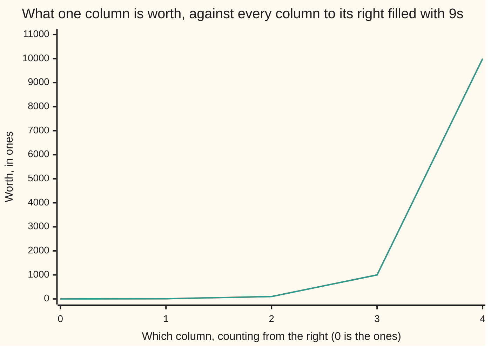

# Place value: why 523 means five hundreds, two tens and three ones

Foundations → Everyday Arithmetic → Whole numbers → Place value

---

## General Overview

You buy twelve apples at 75 cents each. You hand over a $10 bill and get $1.00 back. Four of you split the cost, so each owes $2.25. The board on the stall says it has sold **523** apples this week.

None of that was hard. But you read the 1 in $10 as ten dollars and the 1 in $1.00 as one dollar — same mark, two different jobs, no hesitation.

The job is decided by **where the mark sits**. That is why ten marks — 0 1 2 3 4 5 6 7 8 9 — are enough to write any number there has ever been. It is called **place value**.

**A digit's worth is the digit itself times the worth of the column it sits in, and each column is worth ten times the column on its right.**

### The picture: what a column is worth



Columns are counted from the right. The climbing line is what one column is worth; the flat line is the most everything to its right can hold, all 9s. It never catches up: 9999 still loses to 10000. So the leftmost digit tells you most of what you want to know.

---

## The formula

There is nothing to memorise. The numeral **is** the formula:

**523 = 5 × 100 + 2 × 10 + 3 × 1**

Each digit, times the worth of its column, added up. An empty column is still written, with a 0:

**900 = 9 × 100 + 0 × 10 + 0 × 1**

| Piece | Plain meaning | In 523 |
| --- | --- | --- |
| a digit | one of the ten marks, 0 to 9 | 5, 2, 3 |
| a column's worth | 1 at the right, then 10, then 100 | 100, 10, 1 |
| the number | each digit times its column's worth | 500 + 20 + 3 |

---

## Why it works

### Bundle by tens

Tip 523 apples onto a table. Bag them ten at a time: 52 bags, 3 loose. Crate the bags, ten to a crate: 5 crates, 2 bags over.

You are holding **5 crates, 2 bags, 3 loose**. Write that biggest bundle first and you have written `523`. The numeral is not a name for the pile; it is a stock list of it.

A column is worth ten times the one on its right because that is the size of the bundle: a crate is ten bags, a bag is ten apples. That is also why a column stops at 9: the tenth one gets bundled and moves left. That is carrying.

### An empty column still gets written

Twelve apples at 75 cents is 900 cents: 9 hundreds, no tens, no ones. Leave both zeros out and you have `9`; leave one out and you have `90`. The zeros report an empty column, and they hold the 9 out in the hundreds where it belongs.

### Writing a quantity down, and checking it

Bundling backwards is dividing by ten, keeping the remainder.

- 523 ÷ 10 = 52, remainder **3** — the loose apples
- 52 ÷ 10 = 5, remainder **2** — the bags over
- 5 ÷ 10 = 0, remainder **5** — the crates

Read the remainders bottom to top: 5, 2, 3. The first one is the *last* digit you write, which is what people get backwards. Check it the other way: 5 × 100 + 2 × 10 + 3 × 1 is 523 again.

<details>
<summary>If you did not have ten fingers</summary>

Swap the bundle size and it still runs. Bundle by twos and the marks are just 0 and 1, which is how a computer counts: a wire is on or off.

</details>

---

## Worked numbers, by hand

The apple stall, in cents throughout.

| Step | Arithmetic | Value |
| --- | --- | --- |
| twelve apples | 12 × 75 | 900 |
| that total, as columns | 9 × 100 + 0 × 10 + 0 × 1 | 900 |
| the $10 bill, in cents | 10 × 100 | 1000 |
| change | 1000 − 900 | 100 |
| each friend's share | 900 ÷ 4 | 225 |
| the check, four shares back | 225 × 4 | 900 |
| that share, as columns | 2 × 100 + 2 × 10 + 5 × 1 | **225** |
| the stall's week | 5 × 100 + 2 × 10 + 3 × 1 | **523** |

Each friend owes 225 cents — $2.25.

### What breaks if you drop a piece

| Mistake | Comes out at | What went wrong |
| --- | --- | --- |
| Writing 900 with one zero, as `90` | 90 | Ninety cents for twelve apples |
| Reading 523 right to left, as `325` | 325 | Numerals run biggest first |
| Adding the digits, ignoring the columns | 10 | 5 + 2 + 3 is not the number |

The code below prints all three, and every other number here.

---

## Code, from first principles, and it actually runs

Nothing is imported. The apple story is worked the obvious way, then checked backwards by putting the four shares together again. Then three numerals, a column at a time.

### Python

```python
# Place value -- the check behind the card.  Nothing is imported.  The apple
# stall in cents: twelve apples at 75 cents, a $10 bill, four friends.  Then
# three numerals, each one read a column at a time.
PLACES = [100, 10, 1]

def worth(digits):              # [5, 2, 3] -> 5 x 100 + 2 x 10 + 3 x 1 -> 523
    return sum(d * p for d, p in zip(digits, PLACES))

def row(name, value):
    print(f"{name:<32}{value:>6}")

apples, price, bill, friends = 12, 75, 1000, 4
total = apples * price
change = bill - total
share = total // friends
row("twelve apples at 75 cents each", total)
row("paid with a $10 bill", bill)
row("change, a $1.00 note", change)
row("each of four friends pays $2.25", share)
row("four shares back together", share * friends)     # the check, going backwards
for digits in ([5, 2, 3], [9, 0, 0], [2, 2, 5]):
    row(" + ".join(f"{d} x {p}" for d, p in zip(digits, PLACES)), worth(digits))
print(f"{'what one column is worth':<26}" + "".join(f"{v:>7}" for v in [1, 10, 100, 1000, 10000]))
print(f"{'all 9s to its right':<26}" + "".join(f"{v:>7}" for v in [0, 9, 99, 999, 9999]))
print(f"the three mistakes come out at {worth([0, 9, 0])}, {worth([3, 2, 5])} and {5 + 2 + 3}")

assert total == 900 and change == 100 and total + change == bill
assert share == 225 and share * friends == total
assert worth([5, 2, 3]) == 523 and worth([9, 0, 0]) == total
print("ALL CHECKS PASS")
```

**Ran 2026-09-06 on macOS, Python 3.14.6, standard library only. All checks passed. Output, pasted from the run:**

```
twelve apples at 75 cents each     900
paid with a $10 bill              1000
change, a $1.00 note               100
each of four friends pays $2.25    225
four shares back together          900
5 x 100 + 2 x 10 + 3 x 1           523
9 x 100 + 0 x 10 + 0 x 1           900
2 x 100 + 2 x 10 + 5 x 1           225
what one column is worth        1     10    100   1000  10000
all 9s to its right             0      9     99    999   9999
the three mistakes come out at 90, 325 and 10
ALL CHECKS PASS
```

### Rust

Same numbers, same labels, built with `rustc --edition 2021 -O`.

```rust
// Place value -- the same check as place_value_check.py, in Rust.  No crates.
// The apple stall in cents: twelve apples at 75 cents, a $10 bill, four
// friends.  Then three numerals, each one read a column at a time.
const PLACES: [i64; 3] = [100, 10, 1];

fn worth(digits: [i64; 3]) -> i64 {   // [5, 2, 3] -> 5 x 100 + 2 x 10 + 3 x 1 -> 523
    (0..3).map(|i| digits[i] * PLACES[i]).sum()
}

fn row(name: &str, value: i64) { println!("{:<32}{:>6}", name, value); }

fn main() {
    let (apples, price, bill, friends) = (12i64, 75i64, 1000i64, 4i64);
    let total = apples * price;
    let change = bill - total;
    let share = total / friends;
    row("twelve apples at 75 cents each", total);
    row("paid with a $10 bill", bill);
    row("change, a $1.00 note", change);
    row("each of four friends pays $2.25", share);
    row("four shares back together", share * friends);   // the check, going backwards
    for digits in [[5, 2, 3], [9, 0, 0], [2, 2, 5]] {
        let mut parts: Vec<String> = Vec::new();
        for i in 0..3 { parts.push(format!("{} x {}", digits[i], PLACES[i])); }
        row(&parts.join(" + "), worth(digits));
    }
    let mut worths = format!("{:<26}", "what one column is worth");
    for v in [1, 10, 100, 1000, 10000] { worths.push_str(&format!("{:>7}", v)); }
    println!("{}", worths);
    let mut nines = format!("{:<26}", "all 9s to its right");
    for v in [0, 9, 99, 999, 9999] { nines.push_str(&format!("{:>7}", v)); }
    println!("{}", nines);
    println!("the three mistakes come out at {}, {} and {}",
             worth([0, 9, 0]), worth([3, 2, 5]), 5 + 2 + 3);
    assert!(total == 900 && change == 100 && total + change == bill);
    assert!(share == 225 && share * friends == total);
    assert!(worth([5, 2, 3]) == 523 && worth([9, 0, 0]) == total);
    println!("ALL CHECKS PASS");
}
```

**Ran 2026-09-06 on macOS, rustc 1.98.1, no crates. All checks passed. Output, pasted from the run:**

```
twelve apples at 75 cents each     900
paid with a $10 bill              1000
change, a $1.00 note               100
each of four friends pays $2.25    225
four shares back together          900
5 x 100 + 2 x 10 + 3 x 1           523
9 x 100 + 0 x 10 + 0 x 1           900
2 x 100 + 2 x 10 + 5 x 1           225
what one column is worth        1     10    100   1000  10000
all 9s to its right             0      9     99    999   9999
the three mistakes come out at 90, 325 and 10
ALL CHECKS PASS
```

The two outputs match line for line: whole cents throughout, nothing to round.

> [!TIP]
> **Try changing**
> Guess first, then run it. The asserts are pinned to the house numbers, so expect one to fire.
> - **Swap two digits.** Read `[5, 3, 2]`, not `[5, 2, 3]`: the week comes out at 532, up 9, not up 1.
> - **Flatten the columns.** Set `PLACES` to `[1, 1, 1]`. Every column is worth 1, so 523 reads as 10 and the last assert fires.

---

## The usual mistake

> [!warning]
> **Reading the digits instead of the columns.** `523` is not "a five, a two and a three". It is five hundreds, two tens and three ones. Everyone knows this and stops believing it once the numbers get long or the columns get quiet — exactly when it matters.
>
> The version that costs money is treating 0 as nothing to write: drop a zero from 900 and you have 90.

---

## Where you meet it in real life

- **Money.** Every till, every price tag. Cents are two more columns right of the ones: [decimals](08-decimals.md).
- **Carrying.** A column fills at ten and rolls into its neighbour: [adding-and-subtracting](02-adding-and-subtracting.md).
- **Odometers.** Place value in gears: the right wheel turns ten times to move its neighbour a notch.

> **Say it back**
> Ten marks, and that is all. Each column is worth ten times the one on its right, so `523` means five hundreds, two tens and three ones. A zero is not nothing: it says a column is empty and holds the other digits in place. To read a numeral, add up each digit times its column's worth. To write a quantity, divide by ten over and over and read the remainders bottom to top.

---

## What this builds on

Nothing yet: this is the first card in the Foundations wing. It assumes only that you can count and know the marks 0 to 9 by sight.

## Where this goes next

- [adding-and-subtracting](02-adding-and-subtracting.md): when a column fills past 9 and rolls over, or runs out and has to borrow.
- [decimals](08-decimals.md): the same columns continued right of a dot — a tenth, a hundredth — where these cents become dollars.

---

## Sources

Verified 6 Sep 2026; every link resolves.

- Knuth, Donald E. *The Art of Computer Programming, Volume 2*, 3rd ed. Addison-Wesley, 1997. [Publisher page](https://www.informit.com/store/art-of-computer-programming-volume-2-seminumerical-9780201896848). Section 4.1, the careful version of this card.
- Sigler, Laurence E., trans. *Fibonacci's Liber Abaci*. Springer, 2002. [doi:10.1007/978-1-4613-0079-3](https://doi.org/10.1007/978-1-4613-0079-3). The 1202 book that argued the ten marks into Europe.
- Plofker, Kim. *Mathematics in India*. Princeton University Press, 2009. [Publisher page](https://press.princeton.edu/books/hardcover/9780691120676/mathematics-in-india). Where it started.
