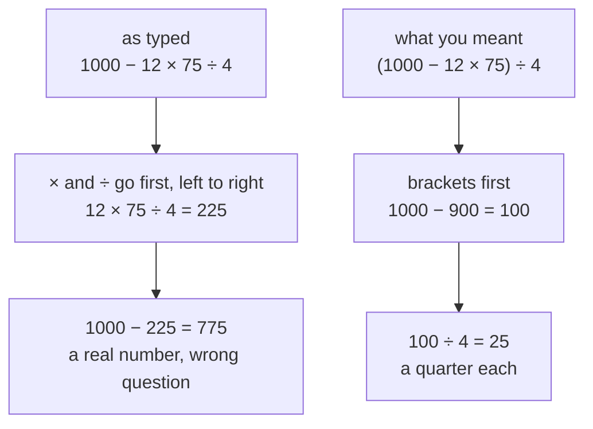

# Order of operations: which step goes first, and why brackets exist

[Syllabus](../../../SYLLABUS.md) → [Foundations](../../../SYLLABUS.md#w01) → [Everyday Arithmetic](../../../SYLLABUS.md#w01-s01) → Order of operations

---

## General Overview

Twelve apples. Seventy-five cents each. You hand over a ten-dollar note and the four of you split whatever comes back. Everything here is counted in whole cents, so the note is 1000.

Write it on one line and it looks like this:

`1000 − 12 × 75 ÷ 4`

Type those keystrokes into a spreadsheet and it answers 775. The right answer is 25. The spreadsheet is not broken. The line says something you did not mean.

A line of arithmetic is not a to-do list worked through in reading order. It is a shape flattened onto one line, and the rules for folding it back up are the **order of operations** — the same in every calculator, spreadsheet and programming language.

**In one sentence: multiplying and dividing are packages that get unwrapped before any adding or subtracting can touch them, and brackets exist so you can say "this part first" when that default is wrong.**



---

## The formula

$$(1000 - 12 \times 75) \div 4 = 25$$

**Read it aloud: take the cash, subtract what the apples cost, split what is left between the friends.**

Which part happens first is settled by a four-rung ladder, in words:

**brackets → powers → multiply and divide → add and subtract**

Higher rung first, and left to right inside a rung.

| Symbol | Plain meaning | In our example |
| --- | --- | --- |
| $\times$ | **multiply**, third rung | twelve apples at 75 cents is 900 |
| $\div$ | **divide**, third rung as well | 100 cents four ways is 25 |
| $-$ | **subtract**, fourth rung, so it waits | 1000 less 900 is 100 |
| $(\;\;)$ | **brackets**, top rung: finish what is inside first | they stop the divide reaching the apples |

---

## Why it works

Multiplying is shorthand for adding. `12 × 75` is short for seventy-five written out twelve times and added up, and those twelve were never separate items. The × sign is a wrapper around a sum that already exists, so a subtraction standing outside cannot reach in and grab the first one. That is the whole of "multiply beats add": you unwrap the package before you take anything off it. Powers sit a rung higher for the same reason, being shorthand for multiplying.

Multiply and divide share a rung because dividing by 2 is the same as multiplying by a half — one job, not two. So `8 ÷ 2 × 4` is **16**, left to right. Do the multiply first because a mnemonic put it earlier and you get **1**, a completely different number. Subtracting sits with adding one rung down for the same reason: taking 4 away is adding minus four.

Brackets are the override: this is one quantity, finish it before anything outside touches it. In `(1000 − 12 × 75) ÷ 4` they stop the ÷ 4 from reaching the apples. Without them the ÷ 4 shares the third rung with the ×, takes its turn left to right, and you split the bill instead of the change.

---

## Worked numbers, by hand

Twelve apples at 75 cents, a note worth 1000 cents, four friends.

| Step | Arithmetic | Value in cents |
| --- | --- | --- |
| top rung first, so go inside the brackets | 1000 − 12 × 75 | |
| inside, multiply before subtract | 12 × 75 | 900 |
| inside, now the subtract | 1000 − 900 | 100 |
| brackets closed, now the divide | 100 ÷ 4 | **25** |

A quarter each. Cross-check the other way round: each friend's share of the bill is 12 × 75 ÷ 4 = 225, and 225 plus the quarter is 250 — exactly 1000 ÷ 4. The money lands twice, and the code checks it.

### What breaks if you drop a piece

| Mistake | Comes out at | What went wrong |
| --- | --- | --- |
| Drop the brackets: `1000 − 12 × 75 ÷ 4` | 775 | The ÷ 4 shares a rung with the ×, so it grabs the apples: you split the bill, not the change. |
| Forget to split: `1000 − 12 × 75` | 100 | Right arithmetic, wrong question: that is the whole change, not one share. |
| Multiply before divide: `8 ÷ 2 × 4` | 1 | They share a rung, so it goes left to right. The answer is 16. |

---

## Code, from first principles, and it actually runs

Nothing is imported. Each program works the apples out the obvious way, then checks it by a second route: split the bill and split the note, and see the two halves add back up.

### Python

```python
# Order of operations -- the check behind the card.  Nothing is imported.
# Everything is counted in whole cents: the note is 1000, one apple is 75.
cash, apples, price, friends = 1000, 12, 75, 4

bill = apples * price            # the multiply happens before the subtract
change = cash - bill             # what comes back over the counter
each = change // friends         # the brackets close, then the divide

cost_each = bill // friends      # second route: split the bill, split the note
note_each = cash // friends
no_brackets = cash - apples * price // friends   # the keystrokes, as typed

for label, value in (("twelve apples", bill),
                     ("change from the note", change),
                     ("each friend's change", each),
                     ("each friend's cost", cost_each),
                     ("cost each plus change each", cost_each + each),
                     ("the note split four ways", note_each),
                     ("brackets dropped", no_brackets),
                     ("8 / 2 * 4 by the rungs", 8 // 2 * 4),
                     ("8 / 2 * 4 multiply first", 8 // (2 * 4)),
                     ("five friends, not four", (cash - apples * price) // 5),
                     ("apples at 80 cents", (cash - apples * 80) // friends)):
    print(f"{label:<28}{value:>6}")

assert each == 25, "twelve apples from a 1000-cent note, four ways, is 25 cents each"
assert cost_each + each == note_each, "cost each plus change each is the note split four ways"
assert no_brackets == 775, "without the brackets the divide grabs the apples"
print("ALL CHECKS PASS")
```

**Ran 2026-09-06 on macOS, Python 3.14.6, standard library only. All checks passed. Output, pasted from the run:**

```
twelve apples                  900
change from the note           100
each friend's change            25
each friend's cost             225
cost each plus change each     250
the note split four ways       250
brackets dropped               775
8 / 2 * 4 by the rungs          16
8 / 2 * 4 multiply first         1
five friends, not four          20
apples at 80 cents              10
ALL CHECKS PASS
```

### Rust

Same numbers, same labels, no crates.

```rust
// Order of operations -- the same check as the Python above, in Rust.
// Standard library only, no crates.  Everything is counted in whole cents.
fn main() {
    let (cash, apples, price, friends) = (1000, 12, 75, 4);

    let bill = apples * price;       // the multiply happens before the subtract
    let change = cash - bill;        // what comes back over the counter
    let each = change / friends;     // the brackets close, then the divide

    let cost_each = bill / friends;  // second route: split the bill, split the note
    let note_each = cash / friends;
    let no_brackets = cash - apples * price / friends;   // the keystrokes, as typed

    for (label, value) in [("twelve apples", bill),
                           ("change from the note", change),
                           ("each friend's change", each),
                           ("each friend's cost", cost_each),
                           ("cost each plus change each", cost_each + each),
                           ("the note split four ways", note_each),
                           ("brackets dropped", no_brackets),
                           ("8 / 2 * 4 by the rungs", 8 / 2 * 4),
                           ("8 / 2 * 4 multiply first", 8 / (2 * 4)),
                           ("five friends, not four", (cash - apples * price) / 5),
                           ("apples at 80 cents", (cash - apples * 80) / friends)] {
        println!("{:<28}{:>6}", label, value);
    }

    assert!(each == 25, "twelve apples from a 1000-cent note, four ways, is 25 cents each");
    assert!(cost_each + each == note_each, "cost each plus change each is the note split four ways");
    assert!(no_brackets == 775, "without the brackets the divide grabs the apples");
    println!("ALL CHECKS PASS");
}
```

**Ran 2026-09-06 on macOS, rustc 1.98.1, no crates. All checks passed. Output, pasted from the run:**

```
twelve apples                  900
change from the note           100
each friend's change            25
each friend's cost             225
cost each plus change each     250
the note split four ways       250
brackets dropped               775
8 / 2 * 4 by the rungs          16
8 / 2 * 4 multiply first         1
five friends, not four          20
apples at 80 cents              10
ALL CHECKS PASS
```

Two languages, different code, identical output line for line: the rungs are not a school rule, they are what machines actually run on.

> [!TIP]
> **Try changing**
> - **One more friend.** Change the 4 to a 5 and 25 cents each becomes **20 cents**. Same change, more ways to cut it.
> - **Apples at 80 cents.** Each friend's change drops to **10 cents**. Twelve apples multiply a nickel on the sticker; four friends only divide it.

---

## The usual mistake

> [!warning]
> **PEMDAS is four rungs, not six steps.** Parentheses, Exponents, Multiplication, Division, Addition, Subtraction reads like six things in a queue. Multiply and divide share one rung; add and subtract share one rung. Take the mnemonic literally, do the multiplication before the division, and `8 ÷ 2 × 4` comes out at **1**. It is **16**.

---

## Where you meet it in real life

- **Every spreadsheet.** Type `=1000-12*75/4` into Excel or Google Sheets and you get 775. Spreadsheets run these exact rungs, which is why a wrong bracket in a budget is so quiet and so expensive.
- **Two kinds of calculator.** A cheap four-function calculator works strictly left to right; a scientific one uses the rungs. Type `2 + 3 × 4` into both and they disagree. Neither is broken.
- **Any formula you are handed.** A tax rule, a dosage, an interest calculation: the moment it becomes one line of typing, the brackets are yours to keep.

> **Say it back**
> A line of arithmetic is a shape flattened onto one line, not a list of instructions in reading order. Four rungs decide the shape: brackets, then powers, then multiply and divide together, then add and subtract together, left to right inside a rung. Multiplying is shorthand for adding, so it must be unwrapped before the rung below can touch it, and brackets are the override. Twelve apples at 75 cents from a 1000-cent note, four ways, is 25 cents each, and it needs a bracket to say so on one line.

---

## What this builds on

- [Multiplying and dividing](03-multiplying-and-dividing.md): multiplying as repeated adding. That is the whole reason multiply outranks add, so if the "package" idea felt thin tonight, that card is where it is built.
- [Adding and subtracting](02-adding-and-subtracting.md): carrying and borrowing. Every rung eventually bottoms out in those.

## Where this goes next

- [The three rearranging laws](05-arithmetic-laws.md): swapping, regrouping, and spreading multiplication over addition. This card says which operation goes first; that one says which rearrangements are safe inside a rung.

---

## Sources

Verified 6 Sep 2026: every link below resolves to the publisher's page.

- Cajori, Florian. *A History of Mathematical Notations*. Dover. [Publisher page](https://store.doverpublications.com/products/9780486677668). Where ×, ÷ and the bracket came from, and how the habit settled into print.
- Python Software Foundation. "Expressions," *The Python Language Reference*. [docs.python.org](https://docs.python.org/3/reference/expressions.html). One language's full precedence table, with these four rungs inside it.
- Microsoft. "Calculation operators and precedence in Excel." [support.microsoft.com](https://support.microsoft.com/en-us/office/calculation-operators-and-precedence-in-excel-48be406d-4975-4d31-b2b8-7af9e0e2878a). What a spreadsheet does with your keystrokes.
