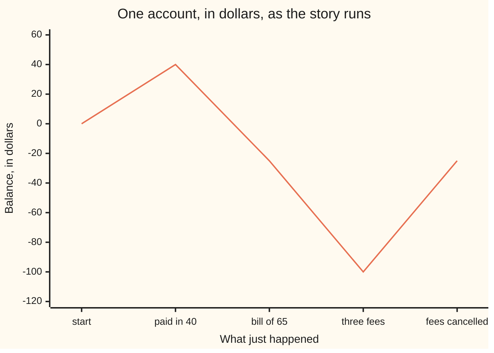

# Negative numbers: the number line runs both ways

[Syllabus](../../../SYLLABUS.md) → [Foundations](../README.md) → [Everyday Arithmetic](../README.md#s01) → Numbers below zero

---

## General Overview

The account is empty. You pay in $40. A bill for $65 goes out. The app shows **−$25**.

Nothing broke. The counting numbers cannot answer 40 take away 65, so the numbers keep going past zero.

Picture a road with zero in the middle. Walk right and count 1, 2, 3. Walk left and count the same distances the other way, each wearing a minus sign: −1, −2, −3. The road is **the number line**; everything left of zero is a **negative number**. −25 is not a damaged 25. It is a place, twenty-five steps the far side of zero. Whole numbers of either sign, zero included, are the **integers**, written ℤ.

A thermometer reads the same road: 3 below zero is −3, and after a 5-degree drop it reads −8.

**A minus sign names the opposite: the same distance from zero, the other way. Once opposites exist, subtracting is adding an opposite.**

### The picture: the account as the story runs



Below zero is more map, not the edge of it.

---

## The formula

First, taking away more than you have:

**40 − 65 = 40 + (−65) = −25**

Then multiplying: three $25 fees charged, then all three cancelled.

**3 × (−25) = −75  and  (−3) × (−25) = 75**

Read it aloud: **to subtract, add the opposite; and when multiplying, same signs give a plus, different signs a minus.**

| Piece | Plain meaning | In our example |
| --- | --- | --- |
| a minus sign in front | the opposite: as far from zero, other side | −25, $25 in the red |
| zero | the middle of the line, neither side | the empty account |
| subtracting | adding the opposite | 40 − 65 is 40 + (−65) |
| the size | how far from zero, sign ignored | −25 sits 25 from zero |
| two signs multiplied | same signs a plus, different signs a minus | 3 × (−25) = −75 |

---

## Why it works

### Step 0: every number gets an opposite

The opposite of 65 is −65: the number that cancels it. 65 + (−65) = 0. That is the whole definition.

### Step 1: subtracting is adding the opposite

Taking $65 out of an account and adding a $65 debt to it leave the same balance, so 40 − 65 and 40 + (−65) are one sum: −25. The thermometer agrees: −3 − 5 is −3 + (−5) = −8.

Subtraction is now a kind of adding, so the laws on [The three rearranging laws](05-arithmetic-laws.md) cover it.

### Step 2: a plus times a minus is a minus

Two facts do the rest. Three lots of nothing is nothing: 3 × 0 = 0. And spreading, from [The three rearranging laws](05-arithmetic-laws.md), sends a multiplier outside a bracket into everything inside. Aim it at a bracket worth zero.

- 25 + (−25) = 0, so 3 × (25 + (−25)) = 3 × 0 = 0.
- Spread it: 3 × 25 + 3 × (−25) = 0, that is 75 + 3 × (−25) = 0.
- Only −75 cancels 75. So **3 × (−25) = −75**: three fees, $75 further down.

### Step 3: a minus times a minus is a plus

The same move, minus three lots.

- (−3) × (25 + (−25)) = (−3) × 0 = 0.
- Spread it: (−3) × 25 + (−3) × (−25) = 0.
- (−3) × 25 is −75, by step 2 and the swapping law.
- Only 75 cancels −75. So **(−3) × (−25) = 75**.

Nobody chose it. Once spreading holds, plus is the only answer that fits: cancel three $25 charges and you are $75 better off.

Dividing undoes multiplying, so the rule holds there: −75 ÷ 3 = −25 and −75 ÷ (−25) = 3.

---

## Worked numbers, by hand

| Step | Arithmetic | Value |
| --- | --- | --- |
| paid in, then the bill | 40 − 65 | −25 |
| the same, adding the opposite | 40 + (−65) | −25 |
| three below, five colder | −3 − 5 | −8 |
| three fees of 25 | 3 × (−25) | −75 |
| all three cancelled | (−3) × (−25) | **75** |
| that debt over three months | −75 ÷ 3 | −25 |
| how many fees make that debt | −75 ÷ (−25) | 3 |

The running balance printed below is the chart: 0, 40, −25, −100, −25.

### What breaks if you drop a piece

| Mistake | Comes out at | What went wrong |
| --- | --- | --- |
| Cancelling the fees as −3 × 25 | −175, not −25 | Two minus signs give a plus |
| Reading 40 − 65 as 65 − 40 | 25 | Order matters here |
| Reading "5 colder" as −3 + 5 | 2, above zero | Colder moves left: −3 + (−5) |

All three are printed below.

---

## Code, from first principles, and it actually runs

Nothing is imported. The bill is worked twice, 40 − 65 then 40 + (−65), and the sign rules are checked against spreading.

### Python

```python
# Negative numbers -- the check behind the card.  Nothing is imported.
# One bank account, in whole dollars: $40 paid in, a $65 bill out, then three
# $25 fees, then the bank cancels all three.  Plus a thermometer, in degrees.
def row(name, value):
    print(f"{name:<37}{value:>5}")

paid_in, bill, fee, months = 40, 65, 25, 3
balance = paid_in - bill                     # take the bill away: 40 - 65
opposite = paid_in + (-bill)                 # second route: add the opposite of 65
cold = -3 - 5                                # 3 below zero, 5 degrees colder
charged = months * (-fee)                    # three fees of 25 in the red
cancelled = (-months) * (-fee)               # those same three fees taken back off
run = [0, paid_in, balance, balance + charged, balance + charged + cancelled]
row("paid in 40, then a bill of 65", balance)
row("the same, as 40 + (-65)", opposite)
row("3 below zero, 5 degrees colder", cold)
row("three fees, 3 x (-25)", charged)
row("the bank cancels them, (-3) x (-25)", cancelled)
row("that debt over 3 months, -75 / 3", charged // months)
row("how many -25 fees make -75", charged // (-fee))
print("running balance " + " ".join(str(v) for v in run))
print(f"the three mistakes come out at {balance + charged + (-months * fee)}, "
      f"{bill - paid_in} and {-3 + 5}")
assert months * fee + months * (-fee) == 0 and charged == -75    # spreading fixes the sign
assert (-months) * fee + cancelled == 0 and cancelled == 75      # spreading again
assert balance == -25 and opposite == balance and cold == -8
print("ALL CHECKS PASS")
```

**Ran 2026-09-06 on macOS, Python 3.14.6, standard library only. All checks passed. Output, pasted from the run:**

```
paid in 40, then a bill of 65          -25
the same, as 40 + (-65)                -25
3 below zero, 5 degrees colder          -8
three fees, 3 x (-25)                  -75
the bank cancels them, (-3) x (-25)     75
that debt over 3 months, -75 / 3       -25
how many -25 fees make -75               3
running balance 0 40 -25 -100 -25
the three mistakes come out at -175, 25 and 2
ALL CHECKS PASS
```

### Rust

Same labels, built with `rustc --edition 2021 -O`.

```rust
// Negative numbers -- the same check as negative_numbers_check.py, in Rust.
// Standard library only, no crates.  Same numbers, same labels, same output.
// One bank account, in whole dollars: $40 paid in, a $65 bill out, then three
// $25 fees, then the bank cancels all three.  Plus a thermometer, in degrees.
// Compile: rustc --edition 2021 -O negative_numbers_check.rs -o negative_numbers_check
fn row(name: &str, value: i64) {
    println!("{:<37}{:>5}", name, value);
}

fn main() {
    let (paid_in, bill, fee, months) = (40i64, 65i64, 25i64, 3i64);
    let balance = paid_in - bill;               // take the bill away: 40 - 65
    let opposite = paid_in + (-bill);           // second route: add the opposite of 65
    let cold: i64 = -3 - 5;                     // 3 below zero, 5 degrees colder
    let charged = months * (-fee);              // three fees of 25 in the red
    let cancelled = (-months) * (-fee);         // those same three fees taken back off
    let run = [0, paid_in, balance, balance + charged, balance + charged + cancelled];
    row("paid in 40, then a bill of 65", balance);
    row("the same, as 40 + (-65)", opposite);
    row("3 below zero, 5 degrees colder", cold);
    row("three fees, 3 x (-25)", charged);
    row("the bank cancels them, (-3) x (-25)", cancelled);
    row("that debt over 3 months, -75 / 3", charged / months);
    row("how many -25 fees make -75", charged / (-fee));
    let parts: Vec<String> = run.iter().map(|v| v.to_string()).collect();
    println!("running balance {}", parts.join(" "));
    println!("the three mistakes come out at {}, {} and {}",
             balance + charged + (-months * fee), bill - paid_in, -3 + 5);
    assert!(months * fee + months * (-fee) == 0 && charged == -75); // spreading fixes the sign
    assert!((-months) * fee + cancelled == 0 && cancelled == 75);   // spreading again
    assert!(balance == -25 && opposite == balance && cold == -8);
    println!("ALL CHECKS PASS");
}
```

**Ran 2026-09-06 on macOS, rustc 1.98.1, no crates. All checks passed. Output, pasted from the run:**

```
paid in 40, then a bill of 65          -25
the same, as 40 + (-65)                -25
3 below zero, 5 degrees colder          -8
three fees, 3 x (-25)                  -75
the bank cancels them, (-3) x (-25)     75
that debt over 3 months, -75 / 3       -25
how many -25 fees make -75               3
running balance 0 40 -25 -100 -25
the three mistakes come out at -175, 25 and 2
ALL CHECKS PASS
```

Identical, line for line.

> [!TIP]
> **Try changing**
> Guess first, then run it.
> - **Make the bill smaller.** Set `bill` to 30. The balance is 10, above zero, the first two rows still agree, and the last assert fires: it is pinned to −25.
> - **Break the sign rule.** Change `cancelled` to `months * (-fee)`. It prints −75 and the second assert fires: the bank is charging you again, not paying you back.

---

## The usual mistake

> [!warning]
> **Reading a minus sign as damage instead of a direction.** A bigger debt is a smaller number: −100 sits left of −25 on the line, though further from zero.
>
> - **Subtracting a negative and keeping the minus.** Taking the fees back off is −100 − (−75) = −100 + 75 = −25, same as adding (−3) × (−25) above. As −100 − 75 it gives −175.
> - **Two minuses made into a minus.** Cancelling as −3 × 25 gives −75, and the account ends at −175.
> - **Facing the wrong way.** Five colder than −3 is −3 + (−5) = −8. Written −3 + 5 it gives 2, above zero.

---

## Where you meet it in real life

- **Bank accounts.** A balance is a position on the line, not a pile of cash, so it can sit below zero.
- **Temperature.** −3 dropping 5 is −8, and a 5-degree drop is the same size either side of zero.
- **Lifts.** The ground floor is zero, so the button under it says −1; two floors up from −1 is 1.

> **Say it back**
> Counting numbers stop at zero; life does not. A minus sign names the opposite: as far from zero, the other way. So subtracting is adding the opposite, and 40 − 65 is 40 + (−65) = −25. Same signs multiply to a plus, different signs to a minus, forced by spreading over a bracket worth zero — which is why cancelling three $25 charges hands you $75 back.

---

## What this builds on

- [The three rearranging laws](05-arithmetic-laws.md): the spreading law, which at a bracket worth zero is the whole argument for the sign rules here.

## Where this goes next

- [The number families](../02-The%20Number%20Line/01-number-families.md): each family of numbers named by the sum the one before could not do.
- [Absolute value](../02-The%20Number%20Line/05-absolute-value-and-distance.md): the "size, sign ignored" row above, made into its own tool.
- [Exponents](../03-Powers%2C%20Roots%20and%20Logarithms/01-exponents-and-powers.md): a minus sign moved up into the count of the multiplications.

---

## Sources

Verified 6 Sep 2026: every link resolves.

- Euler, Leonhard. *Elements of Algebra*, trans. John Hewlett, 1822. [Internet Archive](https://archive.org/details/elementsofalgebr00eule). Euler's own argument that a minus times a minus must be a plus.
- O'Connor, J. J., and E. F. Robertson. "Brahmagupta." *MacTutor History of Mathematics Archive*, University of St Andrews. [MacTutor](https://mathshistory.st-andrews.ac.uk/Biographies/Brahmagupta/). Brahmagupta wrote the sign rules in 628 AD, as fortunes and debts.
- Lang, Serge. *Basic Mathematics*. Springer New York, 1988. [Publisher page](https://link.springer.com/book/9780387967875). The same rules from the same laws.
