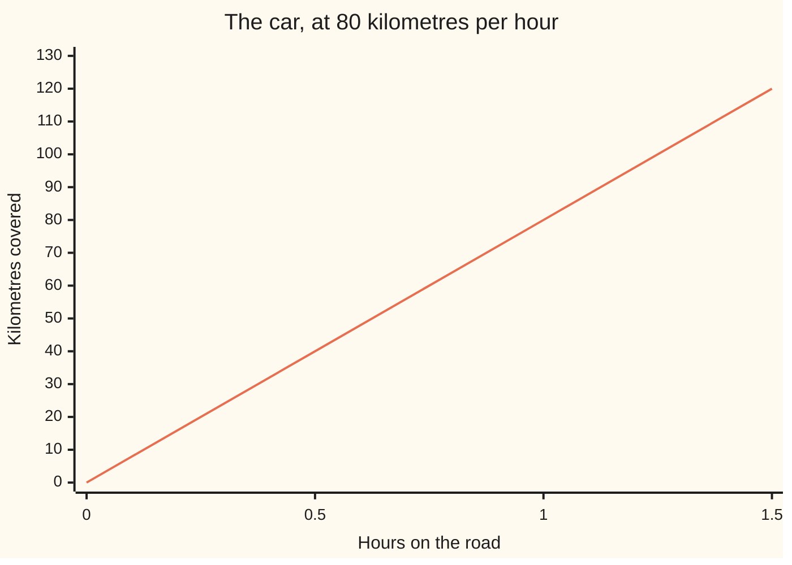

# Ratios and rates: comparing two quantities and scaling them together

[Syllabus](../../../SYLLABUS.md) → [Foundations](../README.md) → [Everyday Arithmetic](../README.md#s01) → Ratios and rates

---

## General Overview

A tin of paint. The label says **3 parts blue to 2 parts white** — not 3 litres and 2 litres, parts.

A part is any scoop, so long as every scoop is the same size — teaspoon or bucket, three of blue to two of white comes out the same colour. That is a **ratio**: two amounts of the same kind, side by side, where only their relative size matters. Written **3 : 2**, said "three to two".

A car covers 120 kilometres in 1.5 hours. Different kinds of amount: distance and time. Divide distance by time: 120 ÷ 1.5 = 80 kilometres per hour. That is a **rate**, how much of the first per one of the second.

**A ratio says how a whole splits up; a rate says how much per one. Both survive scaling: do the same to both sides and nothing changes.**

### The picture: a straight climb



The car's distance, straight because the rate never changes: 40 kilometres by the half hour, 80 by the hour, 120 by the end. A rate is the steepness of that climb.

---

## The formula

Nothing to memorise. Two moves, on the numbers.

Splitting a total by a ratio:

**3 + 2 = 5 parts, and 15 litres ÷ 5 parts = 3 litres in one part, so blue = 3 × 3 = 9 litres and white = 2 × 3 = 6 litres**

Making a rate:

**120 kilometres ÷ 1.5 hours = 80 kilometres per hour**

| Piece | Plain meaning | In our example | Push it up and… |
| --- | --- | --- | --- |
| a part | one equal scoop | 3 litres | bigger tin, same colour |
| the ratio 3 : 2 | parts to each side | 3 blue, 2 white | raise the 3 alone: bluer paint |
| a rate | top ÷ bottom of a fraction | 80 km per hour | further per hour |
| a unit price | dollars per one | $2.25 ÷ 3 litres = $0.75 | the order costs more |

---

## Why it works

### Step 0: a ratio only cares about relative size

9 litres of blue with 6 of white is the same colour as 3 with 2: both sides were multiplied by 3, so nothing shifted between them. **Both sides, same number** — the whole engine, and the cancelling move from [Fractions](07-fractions.md).

### Step 1: find what one part is worth

3 : 2 cuts the tin into 3 + 2 = 5 equal parts. The tin holds 15 litres, so one part is 15 ÷ 5 = 3 litres, and the mix is real: blue 9 litres, white 6. Two checks: 9 + 6 = 15, and 9 : 6 divided by 3 on both sides is 3 : 2 again.

### Step 2: a rate is the same move across different units

120 kilometres in 1.5 hours — as a fraction, 120 on top, 1.5 on the bottom. Divide until the bottom is 1: 120 ÷ 1.5 = 80 kilometres in one hour. The name carries the units, so you cannot lose them: kilometres **per** hour. Check it backwards, 80 × 1.5 = 120.

### Step 3: with a per-one figure, scaling is multiplying

Blue paint sells at 3 litres for $2.25. Per litre, 2.25 ÷ 3 = $0.75, so twelve litres cost 12 × 0.75 = **$9.00**. Second road, no unit price: twelve litres is four lots of three, and 4 × $2.25 = **$9.00**.

School calls two equal fractions a proportion; same move. A ratio with its bottom amount pinned at 100 is a percentage: [Percentages](10-percentages.md).

---

## Worked numbers, by hand

| Step | Arithmetic | Value |
| --- | --- | --- |
| parts in the mix | 3 + 2 | 5 |
| litres in one part | 15 ÷ 5 | 3 |
| blue, then white | 3 × 3, then 2 × 3 | **9**, **6** |
| the check, back to the tin | 9 + 6 | 15 |
| the car's rate, and the check | 120 ÷ 1.5, then 80 × 1.5 | **80**, 120 |
| unit price | 2.25 ÷ 3 | **0.75** |
| twelve litres, and the other road | 12 × 0.75, then 4 × 2.25 | **9.00**, 9.00 |

Nine litres of blue, six of white. The car is doing 80 kilometres per hour, and twelve litres costs $9.00.

### What breaks if you drop a piece

| Mistake | Comes out at | What went wrong |
| --- | --- | --- |
| Dividing 15 by the 3 blue parts | 25 litres | Parts of 5 litres overflow the tin |
| Dividing 1.5 by 120 | 0.0125 hours per km | Upside down: time per kilometre |
| Multiplying the shelf price by 12 | $27.00 | $2.25 already buys 3 litres |

---

## Code, from first principles, and it actually runs

Nothing is imported. The tin is split by parts, then checked by adding the sides back. The rate is divided out, then checked by multiplying back. Twelve litres are priced by two roads that must agree.

### Python

```python
# Ratios and rates -- the check behind the card.  Nothing is imported.  Paint
# mixed 3 parts blue to 2 parts white, scaled up to a 15 litre tin.  A car that
# covers 120 km in 1.5 hours.  Blue paint sold at 3 litres for $2.25.
def row(name, value):
    print(f"{name:<34}{value:>11}")

blue_parts, white_parts, tin = 3, 2, 15
parts = blue_parts + white_parts
per_part = tin // parts                       # what one part is worth, in litres
blue, white = blue_parts * per_part, white_parts * per_part
row("parts in the mix, 3 blue + 2 white", parts)
row("litres in one part, 15 / 5", per_part)
row("blue litres and white litres", f"{blue} and {white}")
row("blue + white, back to the tin", blue + white)

km, hours = 120.0, 1.5
speed = km / hours                            # a rate: kilometres per one hour
row("car speed, 120 km / 1.5 hours", f"{speed:.0f}")
row("distance check, speed x 1.5 hours", f"{speed * hours:.0f}")
row("km by 0.5 hours and by 1 hour", f"{speed * 0.5:.0f} and {speed:.0f}")
price, litres = 2.25, 3
unit = price / litres                         # the same move: dollars per litre
row("unit price, $2.25 / 3 litres", f"{unit:.2f}")
row("twelve litres, 12 x unit price", f"{12 * unit:.2f}")
row("twelve litres, 4 x $2.25", f"{(12 // litres) * price:.2f}")
print(f"the three mistakes: {(tin // blue_parts) * parts} litres, {hours / km:.4f} hours per km, ${12 * price:.2f}")
assert parts == 5 and per_part == 3 and blue == 9 and white == 6 and blue + white == 15
assert speed == 80.0 and speed * hours == 120.0 and speed * 0.5 == 40.0
assert unit == 0.75 and 12 * unit == 9.0 and (12 // litres) * price == 9.0
print("ALL CHECKS PASS")
```

**Ran 2026-09-06 on macOS, Python 3.14.6, standard library only. All checks passed. Output, pasted from the run:**

```
parts in the mix, 3 blue + 2 white          5
litres in one part, 15 / 5                  3
blue litres and white litres          9 and 6
blue + white, back to the tin              15
car speed, 120 km / 1.5 hours              80
distance check, speed x 1.5 hours         120
km by 0.5 hours and by 1 hour       40 and 80
unit price, $2.25 / 3 litres             0.75
twelve litres, 12 x unit price           9.00
twelve litres, 4 x $2.25                 9.00
the three mistakes: 25 litres, 0.0125 hours per km, $27.00
ALL CHECKS PASS
```

### Rust

Same numbers and labels, built with `rustc --edition 2021 -O`.

```rust
// Ratios and rates -- the same check as ratios_and_rates_check.py, in Rust.  No
// crates.  Paint mixed 3 parts blue to 2 parts white, scaled up to a 15 litre
// tin.  A car covering 120 km in 1.5 hours.  Blue paint, 3 litres for $2.25.
fn row(name: &str, value: String) { println!("{:<34}{:>11}", name, value); }

fn main() {
    let (blue_parts, white_parts, tin) = (3i64, 2i64, 15i64);
    let parts = blue_parts + white_parts;
    let per_part = tin / parts;                   // what one part is worth, in litres
    let (blue, white) = (blue_parts * per_part, white_parts * per_part);
    row("parts in the mix, 3 blue + 2 white", parts.to_string());
    row("litres in one part, 15 / 5", per_part.to_string());
    row("blue litres and white litres", format!("{} and {}", blue, white));
    row("blue + white, back to the tin", (blue + white).to_string());

    let (km, hours) = (120.0f64, 1.5f64);
    let speed = km / hours;                       // a rate: kilometres per one hour
    row("car speed, 120 km / 1.5 hours", format!("{:.0}", speed));
    row("distance check, speed x 1.5 hours", format!("{:.0}", speed * hours));
    row("km by 0.5 hours and by 1 hour", format!("{:.0} and {:.0}", speed * 0.5, speed));

    let (price, litres) = (2.25f64, 3.0f64);
    let unit = price / litres;                    // the same move: dollars per litre
    row("unit price, $2.25 / 3 litres", format!("{:.2}", unit));
    row("twelve litres, 12 x unit price", format!("{:.2}", 12.0 * unit));
    row("twelve litres, 4 x $2.25", format!("{:.2}", (12.0 / litres) * price));
    println!("the three mistakes: {} litres, {:.4} hours per km, ${:.2}",
             (tin / blue_parts) * parts, hours / km, 12.0 * price);

    assert!(parts == 5 && per_part == 3 && blue == 9 && white == 6 && blue + white == 15);
    assert!(speed == 80.0 && speed * hours == 120.0 && speed * 0.5 == 40.0);
    assert!(unit == 0.75 && 12.0 * unit == 9.0 && (12.0 / litres) * price == 9.0);
    println!("ALL CHECKS PASS");
}
```

**Ran 2026-09-06 on macOS, rustc 1.98.1, no crates. All checks passed. Output, pasted from the run:**

```
parts in the mix, 3 blue + 2 white          5
litres in one part, 15 / 5                  3
blue litres and white litres          9 and 6
blue + white, back to the tin              15
car speed, 120 km / 1.5 hours              80
distance check, speed x 1.5 hours         120
km by 0.5 hours and by 1 hour       40 and 80
unit price, $2.25 / 3 litres             0.75
twelve litres, 12 x unit price           9.00
twelve litres, 4 x $2.25                 9.00
the three mistakes: 25 litres, 0.0125 hours per km, $27.00
ALL CHECKS PASS
```

The two outputs match line for line.

> [!TIP]
> **Try changing**
> Guess first, then run it. The asserts are pinned to the house numbers, so expect one to fire.
> - **Make it a 3 : 1 mix.** Change the 2 in the mix line to a 1. Four parts now: the code floors 15 ÷ 4 to 3 litres, and the tin check comes out 12.
> - **Slow the car.** Set `hours` to 2.0. The rate drops to 60 kilometres per hour; the distance check still says 120.

---

## The usual mistake

> [!warning]
> **A ratio compares part to part, not part to whole.** The tin has five parts, and 5 is the number you divide by. Divide 15 by the 3 instead and each part is 5 litres: 25 litres of paint for a 15 litre tin.
>
> - **Turning a rate upside down.** 1.5 ÷ 120 = 0.0125 is a real number, but in hours per kilometre.
> - **Scaling one side only.** Nine litres of blue with the original 2 of white is not the same colour.
> - **Multiplying a price that already covers several.** $2.25 × 12 = $27.00 buys 36 litres. Price one first.

---

## Where you meet it in real life

- **The unit price on a shelf tag.** Dollars per litre, cents per 100 grams: the same 2.25 ÷ 3, done for you.
- **Anything with "per" in it.** Kilometres per hour, pay per hour, rent per week. Divide until the bottom is 1.
- **Mixing and scaling.** Paint, concrete, cocktails, dough. Hold the ratio, change the batch.

> **Say it back**
> A ratio compares two amounts of the same kind: 3 parts blue to 2 parts white. Add the parts to get 5, divide the 15 litre tin by 5 for one part of 3 litres, so blue is 9 litres to white's 6. A rate compares different kinds: 120 kilometres in 1.5 hours is 80 per hour — divide until the bottom is 1. A ratio splits by the total parts. Both survive scaling done to both sides.

---

## What this builds on

- [Fractions](07-fractions.md): reducing 9 : 6 to 3 : 2 is the cancelling move, done to a ratio.
- [Decimals](08-decimals.md): the numbers rarely land whole — 1.5 hours in, $0.75 a litre out.

## Where this goes next

- [Percentages](10-percentages.md): a ratio with its bottom amount pinned at 100, which is what makes percentages comparable across everything.

---

## Sources

Verified 6 Sep 2026; every link resolves.

- Euclid. *The First Six Books of the Elements of Euclid*, ed. John Casey. Project Gutenberg. [Text](https://www.gutenberg.org/ebooks/21076). Book V, the careful ancient treatment.
- Bureau International des Poids et Mesures. *The International System of Units (SI Brochure)*, 9th ed. [Publisher page](https://www.bipm.org/en/publications/si-brochure). Defines the "per" units.
- Lamon, Susan J. *Teaching Fractions and Ratios for Understanding*, 4th ed. Routledge, 2020. [Publisher page](https://www.routledge.com/Teaching-Fractions-and-Ratios-for-Understanding-Essential-Content-Knowledge-and-Instructional-Strategies-for-Teachers/Lamon/p/book/9781138536258). Catalogues the part-to-part confusion.
