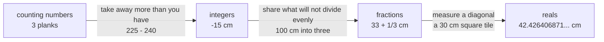

# The number families: counting numbers, integers, fractions, reals, and what forced each one

[Syllabus](../../../SYLLABUS.md) → [Foundations](../README.md) → [The Number Line](../README.md#s02) → The number families

---

## General Overview

A carpenter has three planks on the bench. Each was ordered at 240 cm; one came back at 225 cm, 15 cm short. From that plank she saws a 100 cm off-cut into three equal pieces. Then she lays the tape along the diagonal of a square floor tile, 30 cm a side.

Four numbers, four **kinds**. Counting the planks needs only 1, 2, 3. The shortfall needs a number below zero. The pieces need a number between whole numbers. The diagonal needs a number no tape mark ever lands on.

**The number families are a ladder: each rung was added so one more operation would always have an answer.**

### The picture



Each arrow is an operation the family on its left cannot do.

---

## The formula

**3 planks — the counting numbers, written N**

**225 − 240 = −15 — the integers, written Z**

**100 ÷ 3 = 33 + 1/3 — the fractions, written Q**

**the tile's diagonal = 42.426406871… — the reals, written R**

**Read it aloud:** each line after the first is a sum the family above it cannot do.

| Piece | Plain meaning | In the job |
| --- | --- | --- |
| N, the counting numbers | 0, 1, 2, 3, … — counting, zero for an empty bench | 3 planks |
| Z, the integers | those and their negatives; German *Zahlen*, "numbers" | −15 cm |
| Q, the fractions | one whole number over another, bottom not zero; Q for *quotient* | 33 + 1/3 cm |
| R, the reals | every point on the tape, marked or not | 42.426406871… cm |

The dots mean the digits go on without end. They also never repeat, which is what puts the number outside the fractions.

---

## Why it works

### Step 0: a family is a list of numbers you may write down

Pick a list. Ask whether the sums you need have answers inside it. If not, widen the list.

### Step 1: counting runs out at subtraction

The plank should be 240 cm. It is 225 cm. The shortfall is 225 − 240, which the counting numbers cannot answer. Add the negatives and they can: −15, and 240 + (−15) = 225 puts it back.

Counting numbers plus negatives are the **integers**. Subtraction now always works: [Negative numbers](../01-Everyday%20Arithmetic/06-negative-numbers.md).

### Step 2: whole numbers run out at division

The 100 cm off-cut, into three equal pieces. 100 ÷ 3 is three 33s with 1 cm over: no integer answer. Cut that centimetre in three and each piece is 33 + 1/3 cm, since 33 × 3 + 1 = 100.

Integers plus that splitting are the **fractions**. Division now always works, except by zero: [Fractions](../01-Everyday%20Arithmetic/07-fractions.md).

### Step 3: fractions run out at measuring

The tile is 30 cm a side. The square on its diagonal holds four half-tiles — two whole tiles — so the diagonal times itself is 900 + 900 = 1800. That is Pythagoras' rule. Reach for the diagonal with the tape and multiply each reading by itself: 42.42 × 42.42 = 1799.4564, under; 42.43 × 42.43 = 1800.3049, over. The diagonal sits between the 42.4 and 42.5 millimetre marks; zoom in and it sits between 42.42 and 42.43; finer marks repeat the miss forever. No fraction lands on it either — that proof is [Irrational numbers](03-irrational-numbers.md). The number is 42.426406871…, or 30 × root 2, root 2 being the number that gives 2 when multiplied by itself.

Fractions plus every spot they miss are the **reals**.

### Step 4: nothing is thrown away going up

3 is still a counting number once you learn it is also an integer, a fraction (3 over 1) and a real. The families nest; going up only adds.

A second route builds the same ladder without operations: refuse to leave any spot on the tape empty — [The real numbers have no gaps](04-real-numbers-no-gaps.md).

---

## Worked numbers, by hand

In centimetres throughout.

| Step | Arithmetic | Value |
| --- | --- | --- |
| planks counted | 1, 2, 3 | 3 |
| the short plank | 225 − 240 | **−15** |
| put back, as a check | 240 + (−15) | 225 |
| the off-cut, in three | 100 ÷ 3 | **33 + 1/3** |
| three of those, together | 33 × 3 + 1 | 100 |
| diagonal, times itself: two tiles | 900 + 900 | 1800 |
| the mark below it | 42.42 × 42.42 | 1799.4564 |
| the mark above it | 42.43 × 42.43 | 1800.3049 |
| the diagonal itself | squeezed between those | **42.426406871…** |

### What breaks if you drop a piece

| Mistake | Comes out at | What went wrong |
| --- | --- | --- |
| Doing 225 − 240 in counting numbers | no answer | They stop dead at zero |
| Calling 100 ÷ 3 "33 cm a piece" | 99 | A centimetre left on the floor |
| Calling the diagonal 42.43 cm | 1800.3049 | Times itself, it overshoots 1800 |

---

## Code, from first principles, and it actually runs

Nothing is imported. Each answer is put back as a check. The diagonal is found twice: squeezed between a low mark and a high mark, and again by guessing the side length and averaging that guess with 1800 divided by it. Both roads must land on the same number.

### Python

```python
# The number families -- the check behind the card.  Nothing is imported.
# A carpenter's job: 3 planks counted, a plank cut 15 cm short, a 100 cm
# off-cut sawn in three, and a 30 cm square tile whose diagonal lands
# between two marks on the tape and stays there.
def row(name, value): print(f"{name:<40}{value:>14}")
planks, want, got, offcut, side = 3, 240, 225, 100, 30
short = got - want                        # 225 - 240, off the bottom of counting
whole, rest = divmod(offcut, 3)           # 100 cm is three 33s and 1 cm over
dsq = side * side + side * side           # the diagonal, multiplied by itself
lo, hi = float(side), float(2 * side)     # longer than a side, shorter than two
for _ in range(60):                       # road 1: squeeze it between two marks
    mid = (lo + hi) / 2
    lo, hi = (mid, hi) if mid * mid < dsq else (lo, mid)
guess = float(side)
for _ in range(20): guess = (guess + dsq / guess) / 2   # road 2: guess, average, repeat
row("planks on the job", planks)
row("plank cut short, 225 - 240", short)
row("check, 240 + (-15) back to the cut", want + short)
row("off-cut of 100 cm sawn in three", f"{whole} + {rest}/3 cm")
row("check, three of those back together", whole * 3 + rest)
row("tile diagonal, times itself, 900 + 900", dsq)
row("tile diagonal, squeezed, in cm", f"{lo:.9f}")
row("tile diagonal, second road, in cm", f"{guess:.9f}")
row("rounding that third down to 33 loses", whole * 3)
row("tape mark below, 42.42 x 42.42", f"{4242 * 4242 / 10000:.4f}")
row("tape mark above, 42.43 x 42.43", f"{4243 * 4243 / 10000:.4f}")
assert short == -15 and want + short == got
assert whole == 33 and rest == 1 and whole * 3 + rest == offcut and whole * 3 == 99
assert dsq == 1800 and lo * lo < dsq < hi * hi and abs(lo - guess) < 1e-9
print("ALL CHECKS PASS")
```

**Ran 2026-09-06 on macOS, Python 3.14.6, standard library only. All checks passed. Output, pasted from the run:**

```
planks on the job                                    3
plank cut short, 225 - 240                         -15
check, 240 + (-15) back to the cut                 225
off-cut of 100 cm sawn in three            33 + 1/3 cm
check, three of those back together                100
tile diagonal, times itself, 900 + 900            1800
tile diagonal, squeezed, in cm            42.426406871
tile diagonal, second road, in cm         42.426406871
rounding that third down to 33 loses                99
tape mark below, 42.42 x 42.42               1799.4564
tape mark above, 42.43 x 42.43               1800.3049
ALL CHECKS PASS
```

### Rust

Same numbers, same labels, `rustc --edition 2021 -O`.

```rust
// The number families -- the same check as number_families_check.py, in Rust.
// No crates.  A carpenter's job: 3 planks counted, a plank cut 15 cm short,
// a 100 cm off-cut sawn in three, and a 30 cm square tile whose diagonal
// lands between two marks on the tape and stays there.
fn row(name: &str, value: &str) { println!("{:<40}{:>14}", name, value); }

fn main() {
    let (planks, want, got, offcut, side) = (3i64, 240i64, 225i64, 100i64, 30i64);
    let short = got - want;                       // 225 - 240, off the bottom of counting
    let (whole, rest) = (offcut / 3, offcut % 3); // 100 cm is three 33s and 1 cm over
    let dsq = side * side + side * side;          // the diagonal, multiplied by itself
    let (mut lo, mut hi) = (side as f64, (2 * side) as f64);  // longer than a side, shorter than two
    for _ in 0..60 {                              // road 1: squeeze it between two marks
        let mid = (lo + hi) / 2.0;
        if mid * mid < dsq as f64 { lo = mid; } else { hi = mid; }
    }
    let mut guess = side as f64;
    for _ in 0..20 { guess = (guess + dsq as f64 / guess) / 2.0; }  // road 2: guess, average, repeat
    row("planks on the job", &planks.to_string());
    row("plank cut short, 225 - 240", &short.to_string());
    row("check, 240 + (-15) back to the cut", &(want + short).to_string());
    row("off-cut of 100 cm sawn in three", &format!("{} + {}/3 cm", whole, rest));
    row("check, three of those back together", &(whole * 3 + rest).to_string());
    row("tile diagonal, times itself, 900 + 900", &dsq.to_string());
    row("tile diagonal, squeezed, in cm", &format!("{:.9}", lo));
    row("tile diagonal, second road, in cm", &format!("{:.9}", guess));
    row("rounding that third down to 33 loses", &(whole * 3).to_string());
    row("tape mark below, 42.42 x 42.42", &format!("{:.4}", 4242.0 * 4242.0 / 10000.0));
    row("tape mark above, 42.43 x 42.43", &format!("{:.4}", 4243.0 * 4243.0 / 10000.0));
    assert!(short == -15 && want + short == got);
    assert!(whole == 33 && rest == 1 && whole * 3 + rest == offcut && whole * 3 == 99);
    assert!(dsq == 1800 && lo * lo < dsq as f64 && (dsq as f64) < hi * hi && (lo - guess).abs() < 1e-9);
    println!("ALL CHECKS PASS");
}
```

**Ran 2026-09-06 on macOS, rustc 1.98.1, no crates. All checks passed. Output, pasted from the run:**

```
planks on the job                                    3
plank cut short, 225 - 240                         -15
check, 240 + (-15) back to the cut                 225
off-cut of 100 cm sawn in three            33 + 1/3 cm
check, three of those back together                100
tile diagonal, times itself, 900 + 900            1800
tile diagonal, squeezed, in cm            42.426406871
tile diagonal, second road, in cm         42.426406871
rounding that third down to 33 loses                99
tape mark below, 42.42 x 42.42               1799.4564
tape mark above, 42.43 x 42.43               1800.3049
ALL CHECKS PASS
```

The two outputs match line for line.

> [!TIP]
> **Try changing**
> Guess first, then run it. The asserts are pinned to the carpenter's numbers, so expect one to fire.
> - **Cut an off-cut that divides.** Set the off-cut to 99. Each piece is 33 cm; the job never needs a fraction.
> - **Shrink the tile to 1 cm a side.** The diagonal times itself is 2, and both roads land on 1.414213562 — root 2. The asserts pinned to 1800 fire.

---

## The usual mistake

> [!warning]
> **Thinking each new family replaces the one before it.** They nest. Read "3 is a real number" as a correction rather than an addition and you end up with four bins and every number sorted into one.
>
> - Believing 3 is not a fraction. It is: 3 over 1. Every whole number is a fraction with 1 underneath.
> - Believing a decimal that runs on forever must be outside the fractions. 1/3 is 0.3333… forever and is a fraction. What puts a number outside is never repeating: [Irrational numbers](03-irrational-numbers.md).
> - Reading N, Z, Q and R as ranks. They are names, not grades.

---

## Where you meet it in real life

- **Any tape measure.** The printed marks are fractions; the thing measured is a real: [The real numbers have no gaps](04-real-numbers-no-gaps.md).
- **Tills and spreadsheets.** A count of items is an integer; a price is not. A price in a whole-number cell loses the cents.
- **Programming.** Integer types and floating-point types are machine stand-ins for Z and R. Integer division returning 33 rather than 33 + 1/3 has broken real invoices.

> **Say it back**
> Counting gives you N. Ask for 225 − 240, get no answer, add negatives: Z, the integers. Ask for 100 ÷ 3, get no integer answer, add splitting: Q, the fractions. Measure a tile's diagonal, find no fraction on it, add every missed spot: R, the reals. Each family sits inside the next. Not four kinds of number — one number line, built in four goes.

---

## What this builds on

- [Negative numbers](../01-Everyday%20Arithmetic/06-negative-numbers.md): how the minus sign behaves below zero — the second rung's arithmetic.
- [Fractions](../01-Everyday%20Arithmetic/07-fractions.md): how a top and a bottom number add, multiply and reduce — the third rung's.

## Where this goes next

- [The number line and inequalities](02-number-line-and-inequalities.md): all four families on one line, left meaning smaller.
- [Peano's three rules](../06-Proof/07-peano-and-one-plus-one.md): the bottom rung built from "start at zero and take one more step".
- [Countable sets](../09-Sizes%20of%20Infinity/02-countable-sets.md): as many fractions as counting numbers, and strictly more reals.

---

## Sources

Verified 6 Sep 2026; every link resolves.

- Stillwell, John. *The Real Numbers*. Springer, 2013. [doi:10.1007/978-3-319-01577-4](https://doi.org/10.1007/978-3-319-01577-4). Each family built from the problem that forced it.
- Dedekind, Richard. *Essays on the Theory of Numbers*, trans. W. W. Beman. Open Court, 1901. [Project Gutenberg](https://www.gutenberg.org/ebooks/21016). The essays that made the top rung rigorous.
- Abbott, Stephen. *Understanding Analysis*, 2nd ed. Springer, 2015. [doi:10.1007/978-1-4939-2712-8](https://doi.org/10.1007/978-1-4939-2712-8). Chapter 1: what fractions miss, what reals add.
