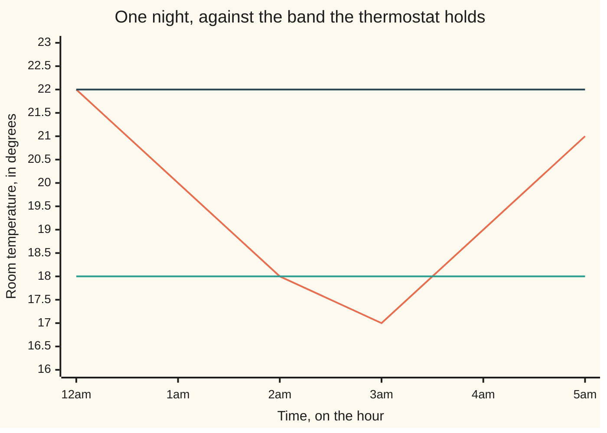

# The number line and inequalities: left is smaller, and what flips when you multiply by a negative

[Syllabus](../../../SYLLABUS.md) → [Foundations](../../../SYLLABUS.md#w01) → [The Number Line](../../../SYLLABUS.md#w01-s02) → The number line and inequalities

---

## General Overview

A thermostat holds a room between 18 and 22 degrees. Last night it logged a reading on the hour, six times from midnight: 22, 20, 18, 17, 19, 21. Outside at 3am it was -2.

Lay those on a straight tape with evenly spaced tick marks, one of them zero. Each lands on exactly one spot. Read left to right and the night comes out in order: -2, 17, 18, 19, 20, 21, 22. Nothing was compared pair by pair; the positions did it.

That tape is the **number line**. The rest of this card reads it: which spot is further left, and the one move that turns the tape around.

**One number is less than another exactly when it sits further left on the number line.**

### The picture: the night against the band



The swinging line is the room. The flat lines are the band's ends, 18 and 22. Only 3am, at 17, falls below.

---

## The formula

A few marks do the work.

**17 < 18, so at 3am the room was too cold.**

`<` is read "is less than", and points at the smaller number, the one further left. `>` points the other way.

The band the thermostat holds:

**18 <= the reading <= 22**

Read aloud: 18 or more, and 22 or less. `<=` lets both ends count as inside. `>=` is its mirror: the same spot, or further right. A stretch of line written that way is an **interval**.

And the move in the title:

**17 < 19, but multiply both by -1 and it becomes -17 > -19.**

| Piece | Plain meaning | In our example |
| --- | --- | --- |
| `<` | less than: further left | 17 < 18 |
| `>` | greater than: further right | 21 > 20 |
| `<=` | further left, or the same spot | 18 <= 18 |
| an interval | everything between two marks | 18 <= the reading <= 22 |

---

## Why it works

### Step 0: every number has one spot, and no two share it

Draw the tape. Label a spot 0. Step off equal steps right for 1, 2, 3, and the same left for -1, -2, -3. Fractions land in between: 18.50 sits midway between 18 and 19.

So "17 is less than 18" is not a rule to memorise; it is where those two sit.

### Step 1: sliding and stretching leave the order alone

Recalibrate the sensor so every reading comes back 3 higher: 17 becomes 20, 18 becomes 21. Every spot slid the same distance the same way, so nothing overtook anything.

Or double every reading: 17 becomes 34, 18 becomes 36. The tape stretches away from zero, gaps widen, nothing crosses.

Adding the same number to both, or multiplying both by the same positive number, doubling or halving, leaves the mark as it was.

### Step 2: multiplying by -1 turns the line around

Multiply by -1. 17 lands on -17, 18 on -18: each spot swaps to the same distance on the other side of zero. The tape is turned end for end, so what read left to right now reads right to left:

- the readings in order: 17, 18, 19, 20, 21, 22
- each one times -1: -17, -18, -19, -20, -21, -22

The first climbs, the second falls.

Every negative is -1 times a positive, so multiplying by a negative is a turn then a stretch: the turn flips the mark, the stretch leaves it. One flip, never two.

On the thermostat: the shortfall from 20 is 20 minus the reading, that is the reading times -1, then 20 added. The turn flips 17 < 19 to -17 > -19; adding 20 keeps it: 3 > 1, so the colder room has the bigger shortfall.

### Step 3: between any two readings there is another

Add two different numbers and halve. The answer sits strictly between them: the midpoint.

Halfway between 18 and 22 is 20. Between 18 and 20, 19. Between 18 and 19, 37/2, or 18.50. Between 18 and 37/2, 73/4, or 18.25. This never stops.

It never leaves the fractions either. Adding two fractions gives a fraction; halving one doubles its bottom number. So between any two fractions, however close, sits another fraction.

Crowding every gap is still not filling the line: no fraction lands on the number whose square is 2, written root 2. That is [Irrational numbers](03-irrational-numbers.md).

---

## Worked numbers, by hand

| Step | Arithmetic | Value |
| --- | --- | --- |
| the whole night | -2 and the six, left to right | -2, 17, 18, 19, 20, 21, 22 |
| readings inside the band | count where 18 <= reading <= 22 | **5** |
| the two shortfalls | 20 − 17, then 20 − 19 | 3, 1 |
| halfway between 18 and 19 | 18 + 19, halved | **37/2 = 18.50** |

Five of the six held the band; 17 at 3am sits left of 18.

### What breaks if you drop a piece

| Mistake | Comes out at | What went wrong |
| --- | --- | --- |
| Multiplying by -1, keeping the mark | -17 < -18 | The turn reverses each pair |
| Using `<` at the ends, not `<=` | 3 inside, not 5 | 18 and 22 are allowed |

---

## Code, from first principles, and it actually runs

Nothing is imported. The night is sorted; the six readings are counted with `<=`. Then the same list is multiplied by -1: if the turn really reverses the order, the flipped list must run downhill, and the code checks that directly. Halfway numbers stay fractions until printed.

### Python

```python
# The number line and inequalities -- the check behind the card.  Nothing is imported.
# A thermostat holds a room between 18 and 22 degrees: six readings through one
# night, and -2 outside.
LOW, HIGH, OUTSIDE = 18, 22, -2
READINGS = [22, 20, 18, 17, 19, 21]

def row(name, value): print(f"{name:<34}{value}")
def halfway(a, b, c, d):             # halfway between a/b and c/d, as a fraction
    top, bot = a * d + c * b, 2 * b * d
    x, y = top, bot
    while y: x, y = y, x % y         # x ends as the biggest common divisor
    return top // x, bot // x

night = sorted(READINGS + [OUTSIDE])
inside = [t for t in READINGS if LOW <= t <= HIGH]
ends_out = [t for t in READINGS if LOW < t < HIGH]
flipped = [-t for t in sorted(READINGS)]
row("the night, left to right", ", ".join(str(t) for t in night))
row("17 and 18, each doubled", f"{2 * 17}, {2 * 18}")
row("readings inside 18 to 22", len(inside))
row("if the ends were left out", len(ends_out))
row("17 and 19 as shortfalls from 20", f"{20 - 17}, {20 - 19}")
row("the same list, each times -1", ", ".join(str(t) for t in flipped))
for a, b, c, d in [(18, 1, 22, 1), (18, 1, 20, 1), (18, 1, 19, 1), (18, 1, 37, 2)]:
    t, u = halfway(a, b, c, d)
    row(f"halfway between {a}/{b} and {c}/{d}", f"{t}/{u} = {t / u:.2f}")
assert len(inside) == 5 and len(ends_out) == 3 and night[0] < 17 < LOW
assert flipped == sorted(flipped, reverse=True)
assert halfway(18, 1, 19, 1) == (37, 2) and 18 < 37 / 2 < 19
print("ALL CHECKS PASS")
```

**Ran 2026-09-06 on macOS, Python 3.14.6, standard library only. All checks passed. Output, pasted from the run:**

```
the night, left to right          -2, 17, 18, 19, 20, 21, 22
17 and 18, each doubled           34, 36
readings inside 18 to 22          5
if the ends were left out         3
17 and 19 as shortfalls from 20   3, 1
the same list, each times -1      -17, -18, -19, -20, -21, -22
halfway between 18/1 and 22/1     20/1 = 20.00
halfway between 18/1 and 20/1     19/1 = 19.00
halfway between 18/1 and 19/1     37/2 = 18.50
halfway between 18/1 and 37/2     73/4 = 18.25
ALL CHECKS PASS
```

### Rust

Same numbers, same labels.

```rust
// The number line and inequalities -- the same check as
// number_line_and_inequalities_check.py, in Rust.  No crates.  A thermostat holds
// a room between 18 and 22 degrees: six readings, and -2 outside.
const LOW: i64 = 18;
const HIGH: i64 = 22;
const READINGS: [i64; 6] = [22, 20, 18, 17, 19, 21];

fn row(name: &str, value: String) { println!("{:<34}{}", name, value); }
fn list(v: &[i64]) -> String { v.iter().map(|n| n.to_string()).collect::<Vec<_>>().join(", ") }

fn halfway(a: i64, b: i64, c: i64, d: i64) -> (i64, i64) {   // halfway between a/b and c/d
    let (top, bot) = (a * d + c * b, 2 * b * d);
    let (mut x, mut y) = (top, bot);
    while y != 0 { let t = x % y; x = y; y = t; }             // x ends as the biggest common divisor
    (top / x, bot / x)
}

fn main() {
    let mut sorted = READINGS.to_vec(); sorted.sort();
    let inside = READINGS.iter().filter(|&&t| LOW <= t && t <= HIGH).count();
    let ends_out = READINGS.iter().filter(|&&t| LOW < t && t < HIGH).count();
    let mut night = vec![-2i64]; night.extend(&sorted);
    let flipped: Vec<i64> = sorted.iter().map(|t| -t).collect();
    row("the night, left to right", list(&night));
    row("17 and 18, each doubled", format!("{}, {}", 2 * 17, 2 * 18));
    row("readings inside 18 to 22", inside.to_string());
    row("if the ends were left out", ends_out.to_string());
    row("17 and 19 as shortfalls from 20", format!("{}, {}", 20 - 17, 20 - 19));
    row("the same list, each times -1", list(&flipped));
    for (a, b, c, d) in [(18, 1, 22, 1), (18, 1, 20, 1), (18, 1, 19, 1), (18, 1, 37, 2)] {
        let (t, u) = halfway(a, b, c, d);
        row(&format!("halfway between {}/{} and {}/{}", a, b, c, d),
            format!("{}/{} = {:.2}", t, u, t as f64 / u as f64));
    }
    let mut down = flipped.clone(); down.sort(); down.reverse();
    assert!(inside == 5 && ends_out == 3 && night[0] < 17 && 17 < LOW);
    assert!(flipped == down);
    assert!(halfway(18, 1, 19, 1) == (37, 2) && 18.0 < 37.0 / 2.0 && 37.0 / 2.0 < 19.0);
    println!("ALL CHECKS PASS");
}
```

**Ran 2026-09-06 on macOS, rustc 1.98.1, no crates. All checks passed. Output, pasted from the run:**

```
the night, left to right          -2, 17, 18, 19, 20, 21, 22
17 and 18, each doubled           34, 36
readings inside 18 to 22          5
if the ends were left out         3
17 and 19 as shortfalls from 20   3, 1
the same list, each times -1      -17, -18, -19, -20, -21, -22
halfway between 18/1 and 22/1     20/1 = 20.00
halfway between 18/1 and 20/1     19/1 = 19.00
halfway between 18/1 and 19/1     37/2 = 18.50
halfway between 18/1 and 37/2     73/4 = 18.25
ALL CHECKS PASS
```

The two outputs match line for line.

> [!TIP]
> **Try changing**
> Guess first, then run it.
> - **Put the floor above the ceiling.** Set the low end to 23, the high end still 22. Nothing is both 23 or more and 22 or less, so the count inside comes out at 0 and the first assert fires.
> - **Keep halving.** Add `(18, 1, 73, 4)` to the pairs: halfway between 18 and 73/4 is 145/8, another number between the last two.

---

## The usual mistake

> [!warning]
> **Multiplying both numbers by a negative and leaving the mark pointing the same way.** 17 < 19, so times -1 it is -17 > -19. Keep the mark and you have claimed a shortfall of 3 is smaller than one of 1.
>
> - Ranking negatives by size, ignoring the sign. -2 is coldest because it sits furthest left.
> - Using `<` where the rule says `<=`. The band loses both ends: the count drops from 5 to 3.
> - Believing two numbers can be next door. 18 and 19 have 37/2 between them.

---

## Where you meet it in real life

- **Thermostats and cruise control.** A controller acts the moment a reading falls out of its band: an interval, one mark at each end.
- **Filters.** "Under $500", "on or after 1 March", "4 stars and up": each is a `<`, `<=`, or `>=` on one line of numbers or dates.
- **Sorting.** A spreadsheet column, a leaderboard, a queue by time: things laid on the line, read left to right.

> **Say it back**
> Every number sits at one spot on one line, and less than means further left. `<=` allows the same spot, so a band keeps its ends. Sliding and stretching leave the order alone; multiplying by a negative turns the line around, so the mark flips once. No two numbers are ever next door.

---

## What this builds on

- [The number families](01-number-families.md): where the negatives and fractions on this line came from, and what each one fixed.

## Where this goes next

- [Irrational numbers](03-irrational-numbers.md): spots on the line no fraction lands on, however far you halve.
- [Absolute value](05-absolute-value-and-distance.md): how far apart two spots are, rather than which is left.
- [Orders](../08-Relations%20and%20Functions/07-partial-and-total-orders.md): when things cannot all be laid on one line, and some pairs do not compare.

---

## Sources

Verified 6 Sep 2026; every link resolves.

- Tao, Terence. *Analysis I*, 4th ed. Springer, 2022. [doi:10.1007/978-981-19-7261-4](https://doi.org/10.1007/978-981-19-7261-4). The order rules, built from scratch.
- Stillwell, John. *The Real Numbers*. Springer, 2013. [doi:10.1007/978-3-319-01577-4](https://doi.org/10.1007/978-3-319-01577-4). Why fractions crowd the line and still leave holes.
