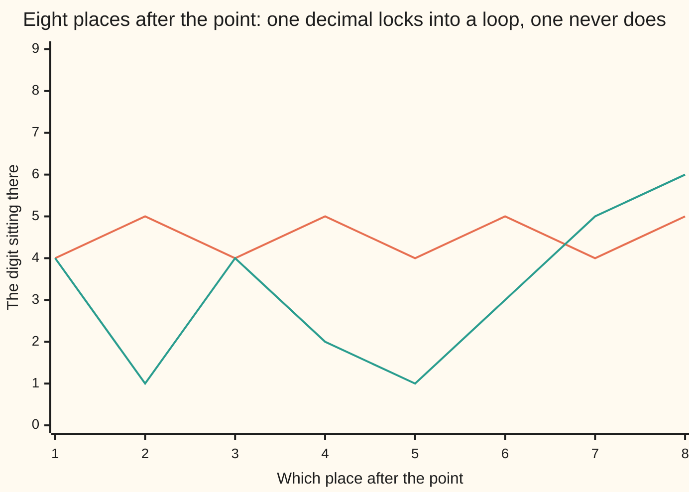

# Irrational numbers: decimals that never repeat, and why root 2 is not a fraction

[Syllabus](../../../SYLLABUS.md) → [Foundations](../README.md) → [The Number Line](../README.md#s02) → Irrational numbers

---

## General Overview

A square floor tile, one metre on a side. Lay a tape across it corner to corner. The diagonal lands between two millimetre marks: 1414 is short, 1415 is over. A finer tape does the same.

Not the tape's fault. Cut the tile corner to corner: two triangles, each half a tile. Four of those halves, long edges out, right angles meeting in the middle, fill the square built on that diagonal. Four halves, two whole tiles — that square covers exactly 2 square metres.

So the diagonal is the number that gives 2 when multiplied by itself: **root 2**. It is not a fraction — not an awkward one, not one with a monstrous bottom number. A number like that is **irrational**: not a ratio of two whole numbers.

Decimals give them away. **A fraction's decimal always stops or falls into a repeating block, so a decimal that does neither belongs to no fraction.**

### The picture: two decimals, eight places



Saw-tooth: five elevenths, 0.45454545…, two digits over and over. Ragged: root 2, 1.41421356…, no block coming back. Eight digits cannot show that no block ever comes — a block could be fifty digits long. Only the proof below can.

---

## The formula

**The test.** 5 divided by 11 is 0.45454545…, the block 45 forever, so it is a fraction. Root 2 is 1.41421356…, no block ever comes (proved below), so it is not.

**The way back.** Shift 0.45454545… two places and it reads 45.45454545… — 100 copies of the original. Subtract one copy: the tails cancel, 99 copies left, equal to 45. So it is 45/99, which cuts down to 5/11.

| Piece | Plain meaning | In our example |
| --- | --- | --- |
| a fraction | one whole number over another | 5/11 |
| the repeating block | digits that come back forever | 45 |
| the shift | move along as many places as the block is long | two places |
| irrational | no fraction gives it; the decimal never repeats | root 2 |
| root 2 | gives 2 when multiplied by itself | 1.41421356… |

---

## Why it works

### Why a fraction's decimal must repeat

Divide 5 by 11 the long way. Each step leaves a remainder — what did not divide out — always smaller than 11: one of eleven values, 0 up to 10. Run enough steps and one has to come back. The checks print them: 6 5 6 5 6 5 6 5.

Once a remainder repeats, everything after repeats too: same leftover, same next digit, same next leftover. If one hits 0 the decimal stops. Stops or repeats, no third move.

### Why the shift-and-subtract works

The block is two digits long, so shifting two places moves it by exactly one block and the tails line up digit for digit. Subtract, and the endless part cancels itself. Long division of 5 by 11 gives the digits back: the cross-check.

### Why root 2 is not a fraction

Suppose it were: some whole number over another, in **lowest terms** — nothing left that divides both. Multiplied by itself it gives 2, so the top times the top equals 2 times the bottom times the bottom.

Two times anything is even, so the top times the top is even. An odd number times itself is odd, so the top is even. Even means the top is twice something. Then the top times the top is four times that something times itself, and that equals 2 times the bottom times the bottom. Halve each side: the bottom times the bottom is 2 times that something times itself. Even again, so the bottom is even too. Both even — but everything shared was cancelled. The assumption breaks itself: no such fraction exists. Walking an assumption into a wall is [Proof by contradiction](../06-Proof/03-proof-by-contradiction.md).

The near misses agree. 7/5: 7 × 7 is 49, 2 × 5 × 5 is 50, off by one. 99/70: 9801 against 9800, off by one again, and the gap never closes.

---

## Worked numbers, by hand

The tile in millimetres, so everything stays whole.

| Step | Arithmetic | Value |
| --- | --- | --- |
| the tile's side, in mm | 1 metre | 1000 |
| the square on the diagonal | 2 × 1000 × 1000 | 2000000 |
| a mark at 1414 mm, 604 short | 1414 × 1414 | 1999396 |
| the next mark, 1415 mm, 2225 over | 1415 × 1415 | 2002225 |
| the diagonal, eight places | dug out one at a time | **1.41421356** |
| five elevenths | 5 divided by 11 | **0.45454545** |
| that decimal turned back | 45/99, cut by 9 | **5/11** |

Pinned between 1414 and 1415 millimetres, landing on neither.

### What breaks if you drop a piece

| Mistake | Comes out at | What went wrong |
| --- | --- | --- |
| Trusting the tape | 1999396 | a 1414 mm diagonal is 604 square mm short |
| Calling 0.45454545 irrational | “no fraction gives it” | it repeats in twos: it is 5/11 |

---

## Code, from first principles, and it actually runs

Nothing is imported. The tile is worked in whole millimetres. Root 2's decimal is dug out a place at a time by squaring whole numbers — no square-root button. The repeating decimal goes both ways: long division forwards, shift-and-subtract back onto 45/99.

### Python

```python
# Irrational numbers -- the check behind the card.  Nothing is imported.  A floor tile
# 1000 mm on a side: the square on its diagonal is 2000000 square mm, and no whole number
# of millimetres squares to that.  Then two decimals, dug out a place at a time.
def row(name, value):
    print(f"{name:<44}{value:>16}")
area = 2 * 1000 * 1000
row("tile side, then the square on the diagonal", f"{1000}  {area}")
row("1414 x 1414, then 1415 x 1415", f"{1414 * 1414}  {1415 * 1415}")
row("short by, then over by, in sq mm", f"{area - 1414 * 1414}  {1415 * 1415 - area}")
row("99 x 99, then 2 x 70 x 70", f"{99 * 99}  {2 * 70 * 70}")
whole, power, dug = 1, 1, []
for _ in range(8):        # biggest whole number whose square, in these units, stays under 2
    whole, power = whole * 10, power * 10
    while (whole + 1) * (whole + 1) <= 2 * power * power: whole += 1
    dug.append(whole % 10)
row("root 2, dug out one digit at a time", "1." + "".join(str(d) for d in dug))
left, digits, rests = 5, [], []
for _ in range(8):        # long division: 5 divided by 11, one place at a time
    d, left = divmod(left * 10, 11)
    digits.append(d); rests.append(left)
row("five elevenths, by long division", "0." + "".join(str(d) for d in digits))
row("that decimal shifted two places", "45." + "".join(str(d) for d in digits))
row("its remainders, step by step", " ".join(str(r) for r in rests))
a, b = 45, 99
while b: a, b = b, a % b  # a ends up the biggest whole number dividing both, which is 9
row("45/99 from the shift-and-subtract, cut down", f"{45 // a}/{99 // a}")
assert 1414 * 1414 < area < 1415 * 1415 and 99 * 99 - 2 * 70 * 70 == 1
assert dug == [4, 1, 4, 2, 1, 3, 5, 6] and digits == [4, 5, 4, 5, 4, 5, 4, 5]
assert (45 // a, 99 // a) == (5, 11) and rests[0] == rests[2] == 6
print("ALL CHECKS PASS")
```

**Ran 2026-09-06 on macOS, Python 3.14.6, standard library only. All checks passed. Output, pasted from the run:**

```
tile side, then the square on the diagonal     1000  2000000
1414 x 1414, then 1415 x 1415               1999396  2002225
short by, then over by, in sq mm                   604  2225
99 x 99, then 2 x 70 x 70                         9801  9800
root 2, dug out one digit at a time               1.41421356
five elevenths, by long division                  0.45454545
that decimal shifted two places                  45.45454545
its remainders, step by step                 6 5 6 5 6 5 6 5
45/99 from the shift-and-subtract, cut down             5/11
ALL CHECKS PASS
```

### Rust

Same numbers and labels, built with `rustc --edition 2021 -O`.

```rust
// Irrational numbers -- the same check as the Python one, in Rust.  No crates.  A floor
// tile 1000 mm on a side: the square on its diagonal is 2000000 square mm, and no whole
// number of millimetres squares to that.  Then two decimals, dug out a place at a time.
fn row(name: &str, value: String) { println!("{:<44}{:>16}", name, value); }

fn joined(v: &[i64], sep: &str) -> String {
    v.iter().map(|d| d.to_string()).collect::<Vec<String>>().join(sep)
}

fn main() {
    let area: i64 = 2 * 1000 * 1000;
    row("tile side, then the square on the diagonal", format!("{}  {}", 1000, area));
    row("1414 x 1414, then 1415 x 1415", format!("{}  {}", 1414 * 1414, 1415 * 1415));
    row("short by, then over by, in sq mm", format!("{}  {}", area - 1414 * 1414, 1415 * 1415 - area));
    row("99 x 99, then 2 x 70 x 70", format!("{}  {}", 99 * 99, 2 * 70 * 70));
    let (mut whole, mut power, mut dug) = (1i64, 1i64, Vec::new());
    for _ in 0..8 {       // biggest whole number whose square, in these units, stays under 2
        whole *= 10; power *= 10;
        while (whole + 1) * (whole + 1) <= 2 * power * power { whole += 1; }
        dug.push(whole % 10);
    }
    row("root 2, dug out one digit at a time", format!("1.{}", joined(&dug, "")));
    let (mut left, mut digits, mut rests) = (5i64, Vec::new(), Vec::new());
    for _ in 0..8 {       // long division: 5 divided by 11, one place at a time
        digits.push(left * 10 / 11);
        left = left * 10 % 11;
        rests.push(left);
    }
    row("five elevenths, by long division", format!("0.{}", joined(&digits, "")));
    row("that decimal shifted two places", format!("45.{}", joined(&digits, "")));
    row("its remainders, step by step", joined(&rests, " "));
    let (mut a, mut b) = (45i64, 99i64);
    while b != 0 { let t = b; b = a % b; a = t; }   // a ends up 9, the biggest common divisor
    row("45/99 from the shift-and-subtract, cut down", format!("{}/{}", 45 / a, 99 / a));
    assert!(1414 * 1414 < area && area < 1415 * 1415 && 99 * 99 - 2 * 70 * 70 == 1);
    assert!(dug == [4, 1, 4, 2, 1, 3, 5, 6] && digits == [4, 5, 4, 5, 4, 5, 4, 5]);
    assert!(45 / a == 5 && 99 / a == 11 && rests[0] == 6 && rests[2] == 6);
    println!("ALL CHECKS PASS");
}
```

**Ran 2026-09-06 on macOS, rustc 1.98.1, no crates. All checks passed. Output, pasted from the run:**

```
tile side, then the square on the diagonal     1000  2000000
1414 x 1414, then 1415 x 1415               1999396  2002225
short by, then over by, in sq mm                   604  2225
99 x 99, then 2 x 70 x 70                         9801  9800
root 2, dug out one digit at a time               1.41421356
five elevenths, by long division                  0.45454545
that decimal shifted two places                  45.45454545
its remainders, step by step                 6 5 6 5 6 5 6 5
45/99 from the shift-and-subtract, cut down             5/11
ALL CHECKS PASS
```

The outputs match line for line: whole numbers and digit strings, nothing to round.

> [!TIP]
> **Try changing**
> Guess first, then run it. The asserts are pinned to the house numbers, so expect one to fire.
> - **A tape ten times finer.** Change both 1000s to 10000, the area line and the row that prints it. New marks: 14142 short, 14143 over, still no whole number. The assert fires because 1414 and 1415 are pinned.
> - **Divide by 8, not 11.** Change the 11 in the long division. The block? There is none: a remainder hits zero, the division stops, the assert fires.

---

## The usual mistake

> [!warning]
> **Thinking "irrational" means "the decimal goes on forever".** Five elevenths goes on forever — 0.45454545… — and it is a plain fraction. Forever is not the test; a block that comes back is.
>
> - Shifting by the wrong number of places. The block 45 is two digits, so the shift is two places; shift by one and the tails do not line up.
> - Treating irrationals as rare. Nearly every point on the tape is one, in a sense the next cards make exact: [The real numbers have no gaps](04-real-numbers-no-gaps.md).

---

## Where you meet it in real life

- **Marking a diagonal.** Squaring a frame or a deck: the diagonal of a one-metre square is 1414 millimetres and a bit that never runs out.
- **A4 paper.** 210 by 297 mm is 99/70, the near miss above: fold it in half and the shape comes back almost, not exactly, the same. Only root 2 gives back exactly the same shape, and no whole-millimetre pair reaches it.
- **Calculators.** Any root 2 on a screen is a fraction standing in for it: the display has to stop, so it misses 2.

> **Say it back**
> The square on a one-metre tile's diagonal covers 2 square metres, so the diagonal is root 2: the number that gives 2 when multiplied by itself. No fraction does that. Fractions give themselves away in their decimals: long division has only so many remainders, so it stops or repeats. Root 2's does neither. Any repeating decimal turns back: shift by one block, subtract, the tail cancels.

---

## What this builds on

- [The number line and inequalities](02-number-line-and-inequalities.md): the tape, and which point sits further left.
- [Decimals](../01-Everyday%20Arithmetic/08-decimals.md): the columns right of the dot.

## Where this goes next

- [The real numbers have no gaps](04-real-numbers-no-gaps.md): fractions and irrationals together, no holes.
- [Roots](../03-Powers%2C%20Roots%20and%20Logarithms/03-roots-and-fractional-exponents.md): root 2 as one of a family.
- [Proof by contradiction](../06-Proof/03-proof-by-contradiction.md): the move used here, properly.
- [Cantor's diagonal](../09-Sizes%20of%20Infinity/03-cantors-diagonal-argument.md): irrationals outnumber fractions.

---

## Sources

Verified 6 Sep 2026; every link resolves.

- Euclid. *Elements*, Book X, Joyce's edition. [Clark University](https://mathcs.clarku.edu/~djoyce/elements/bookX/bookX.html). Proposition 9, this card's fact about lengths.
- Niven, Ivan. *Numbers: Rational and Irrational*. MAA, 1961. [AMS catalogue](https://www.ams.org/bookstore-getitem/item=NML-1). The decimal test and the proof.
- Dedekind, Richard. *Essays on the Theory of Numbers*, trans. Beman, 1901. [Project Gutenberg](https://www.gutenberg.org/ebooks/21016). The book that filled these holes.
