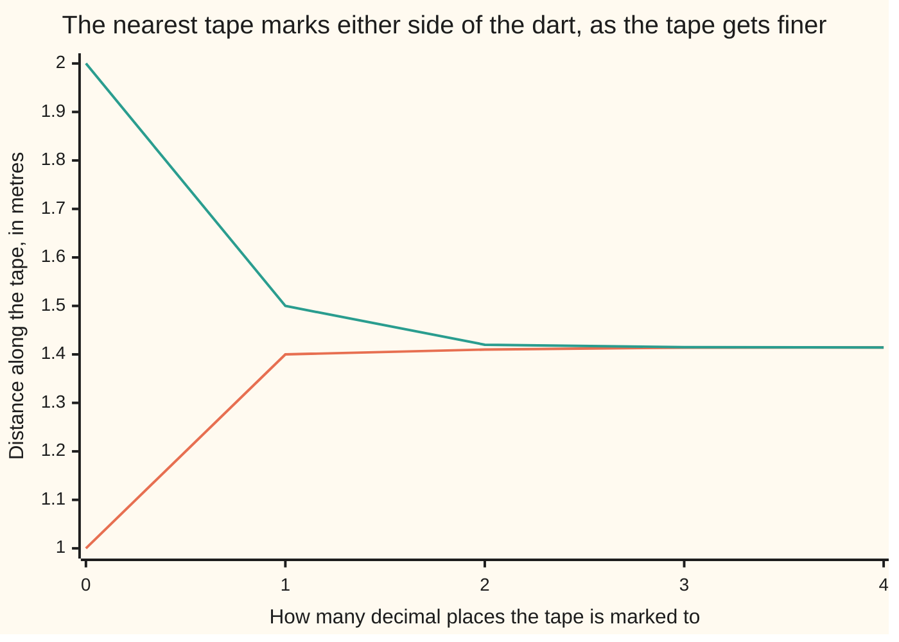

# The real numbers have no gaps: every point on the tape is a number

[Syllabus](../../../SYLLABUS.md) → [Foundations](../../../SYLLABUS.md#w01) → [The Number Line](../../../SYLLABUS.md#w01-s02) → The real numbers have no gaps

---

## General Overview

Throw a dart at a one-metre tape measure. It sticks somewhere. Not on a millimetre mark — between two of them.

Buy a finer tape, marked every tenth of a millimetre. Same hole, still between marks. No tape ever marks the spot.

So is the landing place a number?

Every mark on every tape is a fraction: so many pieces out of so many. Fractions are packed absurdly tight — between any two sits another, halfway. They still miss things. [Irrational numbers](03-irrational-numbers.md) showed one: root 2, the number that gives 2 when multiplied by itself — about 1.414 metres, the diagonal of a one-metre square tile. No fraction lands there. A dart can.

The **real numbers** are the fractions plus every landing place they miss.

**Every point on the tape is a real number, and every real number is a point on the tape.**

### The picture: the marks closing in on the dart



Rising line: the nearest mark below the dart. Falling line: the nearest above. They close in but never meet.

---

## The formula

One promise carries the card:

**If a collection of numbers has a member, and some one number sits above everything in it, then there is a lowest such number — and it is a real number too.**

Drop either condition and the promise says nothing: the counting numbers 1, 2, 3, ... have no ceiling.

On the dart, in metres:

**Collection: every number whose square (the number times itself) is under 2. Nothing in it reaches 1.5, because 1.5 × 1.5 = 2.25. Its lowest ceiling is root 2, 1.41421356..., and that is a real number.**

| Piece | Plain meaning | In the dart example |
| --- | --- | --- |
| a collection | any bunch of numbers you can describe | every number whose square is under 2 |
| has a member | at least one number is in it | 1 is: 1 × 1 = 1, under 2 |
| a ceiling (upper bound) | nothing in the collection passes it | 1.5, 1.42, 2 |
| the lowest ceiling (least upper bound) | the smallest ceiling there is | 1.41421356..., where the dart hit |
| completeness | that lowest ceiling is always a real number | the reals keep it, fractions break it |

---

## Why it works

### Step 0: packed tight is not gapless

Between any two fractions sits another. Do that forever and they look like a solid line. They are not: root 2 is missing, and so is every decimal that never settles into a repeating block.

### Step 1: squeeze the dart between two marks

Mark the tape to one decimal place. 1.4 × 1.4 = 1.96, under 2, so 1.4 is below the dart; 1.5 × 1.5 = 2.25, over 2, so 1.5 is above it. Two places: 1.41 and 1.42. Four places: 1.4142 and 1.4143.

Every one of those marks is a fraction, and the gap shrinks toward nothing.

### Step 2: the fractions cannot name the lowest ceiling

Name any fraction that is a ceiling. Say 1.415: its square, 2.002225, is over 2, so nothing in the collection passes it. But 1.4143 is smaller and still a ceiling — its square is 2.00024449, still over 2. Any fraction whose square is over 2 can be trimmed a hair and stay over 2, so it was never the lowest.

Stopping would need a fraction whose square is exactly 2, and there is none. Bounded, yet no lowest ceiling among the fractions: the promise breaks.

### Step 3: put a number at the meeting point

The reals close that hole: wherever a squeeze like this happens, a number sits at the meeting point. Here that is 1.41421356..., root 2 — the lowest ceiling.

That is **completeness**: what makes the reals the reals instead of the fractions, which obey every other rule of arithmetic and fail this one.

Richard Dedekind, in 1872, took another route: split all the fractions into a left pile and a right pile so the left pile has no largest member, and call the split itself a number.

---

## Worked numbers, by hand

In metres.

| Step | Arithmetic | Value |
| --- | --- | --- |
| one place, below | 1.4 × 1.4 | 1.96 |
| one place, above | 1.5 × 1.5 | 2.25 |
| two places, below | 1.41 × 1.41 | 1.9881 |
| two places, above | 1.42 × 1.42 | 2.0164 |
| four places, below | 1.4142 × 1.4142 | 1.99996164 |
| four places, above | 1.4143 × 1.4143 | 2.00024449 |
| the lowest ceiling | both ends agree to eight places | **1.41421356** |

The dart landed at 1.41421356... metres. No fraction sits there; the tape does.

### What breaks if you drop a piece

| Mistake | Comes out at | What went wrong |
| --- | --- | --- |
| Stopping at 1.4142 | 1.99996164 | Under 2, so it is in the collection |
| Stopping at 1.415 | 2.002225 | A ceiling, but 1.4143 is a smaller one |
| Asking the fractions | no answer | Every fraction ceiling has a smaller one under it |

---

## Code, from first principles, and it actually runs

No decimal enters the machine: every step is whole-number arithmetic, so nothing rounds. Road one walks the decimal places. Road two halves the bracket from 1 to 2, forty times, until both ends read the same to eight places. Three asserts, one that the roads agree.

### Python

```python
# The real numbers have no gaps -- the check behind the card.  Nothing is
# imported.  The collection is every number whose square is under 2 -- the
# spot the dart hit on the tape.  Two roads to its least ceiling: decimal
# places, then halving a bracket.  Whole numbers only, so nothing rounds.
def dec(n, places):                 # dec(14142, 4) -> "1.4142"
    s = str(n).rjust(places + 1, "0")
    return s if places == 0 else s[:len(s) - places] + "." + s[len(s) - places:]

print("places   below       its square    above       its square")
for k, low, high in [(0, 1, 2), (1, 14, 15), (2, 141, 142), (3, 1414, 1415), (4, 14142, 14143)]:
    unit = 10 ** k
    assert low * low < 2 * unit * unit < high * high     # low is inside, high is a ceiling
    print(f"  {k}      {dec(low * 10 ** (4 - k), 4):<12}{dec(low * low, 2 * k):<14}{dec(high * 10 ** (4 - k), 4):<12}{dec(high * high, 2 * k)}")

lo, hi, den = 1, 2, 1                                    # the second road: halve the gap
for _ in range(40):
    lo, hi, den = 2 * lo, 2 * hi, 2 * den
    mid = (lo + hi) // 2
    if mid * mid < 2 * den * den: lo = mid
    else: hi = mid
print(f"halving from 1 to 2, forty times: the least ceiling is caught between {dec(lo * 10 ** 8 // den, 8)} and {dec(hi * 10 ** 8 // den, 8)}")
assert 14142 * den <= lo * 10000 and hi * 10000 <= 14143 * den
print("the two roads agree: the halving bracket sits inside 1.4142 and 1.4143")
print(f"a ceiling, but not the least: 1.415 squares to {dec(1415 * 1415, 6)}, and 1.4143 squares to {dec(14143 * 14143, 8)}")
print(f"not a ceiling at all: 1.4142 squares to {dec(14142 * 14142, 8)}, which is under 2")
assert 14142 * 14142 < 2 * 10000 * 10000 < 14143 * 14143 and 14143 < 1415 * 10
print("ALL CHECKS PASS")
```

**Ran 2026-09-06 on macOS, Python 3.14.6, standard library only. All checks passed. Output, pasted from the run:**

```
places   below       its square    above       its square
  0      1.0000      1             2.0000      4
  1      1.4000      1.96          1.5000      2.25
  2      1.4100      1.9881        1.4200      2.0164
  3      1.4140      1.999396      1.4150      2.002225
  4      1.4142      1.99996164    1.4143      2.00024449
halving from 1 to 2, forty times: the least ceiling is caught between 1.41421356 and 1.41421356
the two roads agree: the halving bracket sits inside 1.4142 and 1.4143
a ceiling, but not the least: 1.415 squares to 2.002225, and 1.4143 squares to 2.00024449
not a ceiling at all: 1.4142 squares to 1.99996164, which is under 2
ALL CHECKS PASS
```

### Rust

Same numbers, same labels, built with `rustc --edition 2021 -O`.

```rust
// The real numbers have no gaps -- the same check as the Python file, in
// Rust.  No crates.  The collection is every number whose square is under
// 2 -- the spot the dart hit on the tape.  Two roads to its least ceiling:
// decimal places, then halving a bracket.  i128 keeps every step exact.
fn dec(n: i128, places: usize) -> String {   // dec(14142, 4) -> "1.4142"
    let mut s = n.to_string();
    while s.len() < places + 1 { s.insert(0, '0'); }
    if places == 0 { s } else { let c = s.len() - places; format!("{}.{}", &s[..c], &s[c..]) }
}

fn ten(k: u32) -> i128 { 10i128.pow(k) }

fn main() {
    println!("places   below       its square    above       its square");
    for (k, low, high) in [(0u32, 1i128, 2i128), (1, 14, 15), (2, 141, 142), (3, 1414, 1415), (4, 14142, 14143)] {
        let unit = ten(k);
        assert!(low * low < 2 * unit * unit && 2 * unit * unit < high * high);   // low is inside, high is a ceiling
        println!("  {}      {:<12}{:<14}{:<12}{}", k, dec(low * ten(4 - k), 4), dec(low * low, 2 * k as usize),
                 dec(high * ten(4 - k), 4), dec(high * high, 2 * k as usize));
    }
    let (mut lo, mut hi, mut den) = (1i128, 2i128, 1i128);                       // the second road: halve the gap
    for _ in 0..40 {
        lo *= 2; hi *= 2; den *= 2;
        let mid = (lo + hi) / 2;
        if mid * mid < 2 * den * den { lo = mid; } else { hi = mid; }
    }
    println!("halving from 1 to 2, forty times: the least ceiling is caught between {} and {}",
             dec(lo * ten(8) / den, 8), dec(hi * ten(8) / den, 8));
    assert!(14142 * den <= lo * 10000 && hi * 10000 <= 14143 * den);
    println!("the two roads agree: the halving bracket sits inside 1.4142 and 1.4143");
    println!("a ceiling, but not the least: 1.415 squares to {}, and 1.4143 squares to {}",
             dec(1415 * 1415, 6), dec(14143 * 14143, 8));
    println!("not a ceiling at all: 1.4142 squares to {}, which is under 2", dec(14142 * 14142, 8));
    assert!(14142 * 14142 < 2 * 10000 * 10000 && 2 * 10000 * 10000 < 14143 * 14143 && 14143 < 1415 * 10);
    println!("ALL CHECKS PASS");
}
```

**Ran 2026-09-06 on macOS, rustc 1.98.1, no crates. All checks passed. Output, pasted from the run:**

```
places   below       its square    above       its square
  0      1.0000      1             2.0000      4
  1      1.4000      1.96          1.5000      2.25
  2      1.4100      1.9881        1.4200      2.0164
  3      1.4140      1.999396      1.4150      2.002225
  4      1.4142      1.99996164    1.4143      2.00024449
halving from 1 to 2, forty times: the least ceiling is caught between 1.41421356 and 1.41421356
the two roads agree: the halving bracket sits inside 1.4142 and 1.4143
a ceiling, but not the least: 1.415 squares to 2.002225, and 1.4143 squares to 2.00024449
not a ceiling at all: 1.4142 squares to 1.99996164, which is under 2
ALL CHECKS PASS
```

The two outputs match line for line.

> [!TIP]
> **Try changing**
> Guess first, then run it.
> - **Halve fewer times.** Change the forty to a ten. The bracket is still a thousandth wide, 1.4140 to 1.4150, so it no longer fits inside 1.4142 and 1.4143 and the assert fires.
> - **Start with a false ceiling.** Bracket 1 to 1: 1 squares to 1, under 2, so it is inside the collection, not above it. The bracket never moves off 1.00000000, and the same assert fires.

---

## The usual mistake

> [!warning]
> **Hunting for the biggest member instead of the lowest ceiling.** There is none: every number whose square is under 2 has a bigger one also under 2. The lowest ceiling stands just outside: 1.41421356... is not in the collection, because that square is exactly 2.
>
> - Treating "packed tight" as "no gaps". Fractions are packed tight and still miss root 2.
> - Treating completeness as one more fact about the reals. It is the one rule that separates them from the fractions: assumed if you take the reals as given, proved if you build them from cuts.

---

## Where you meet it in real life

- **Any measurement.** A length, a temperature, a time. The reading is a real number whether or not the marks reach it: [The number line and inequalities](02-number-line-and-inequalities.md).
- **Solvers that close in.** A calculator's root key, a spreadsheet goal seek — each halves a bracket. They work because the squeeze lands somewhere.
- **A graph crossing a line.** A cost curve meets a revenue line at a point: the line has no gap to jump.

> **Say it back**
> A dart on a tape lands between marks, however fine the marks get. Every mark is a fraction, and fractions miss places — root 2 is one. The reals are the fractions plus all those places. That is completeness: any collection with a member and a ceiling has a lowest ceiling, and it is a real number. Here, 1.41421356..., which no fraction supplies. That is why the reals are the line.

---

## What this builds on

- [Irrational numbers](03-irrational-numbers.md): that root 2 is not a fraction — the missing place this card points at.
- [The number families](01-number-families.md): which numbers are fractions and which are not.

## Where this goes next

Nothing on this shelf needs this card. It finishes with [Absolute value](05-absolute-value-and-distance.md), which does not need completeness.

---

## Sources

Verified 6 Sep 2026; every link resolves.

- Dedekind, Richard. *Essays on the Theory of Numbers*, trans. W. W. Beman. Open Court, 1901. [Project Gutenberg](https://www.gutenberg.org/ebooks/21016). The 1872 essay that first said the line has no gaps.
- Abbott, Stephen. *Understanding Analysis*, 2nd ed. Springer, 2015. [doi:10.1007/978-1-4939-2712-8](https://doi.org/10.1007/978-1-4939-2712-8). Section 1.3 states the promise, on this collection.
- Rudin, Walter. *Principles of Mathematical Analysis*, 3rd ed. McGraw-Hill, 1976. [Publisher page](https://www.mheducation.com/highered/product/principles-mathematical-analysis-rudin/M9780070542358.html). Chapter 1 builds the reals from cuts.
