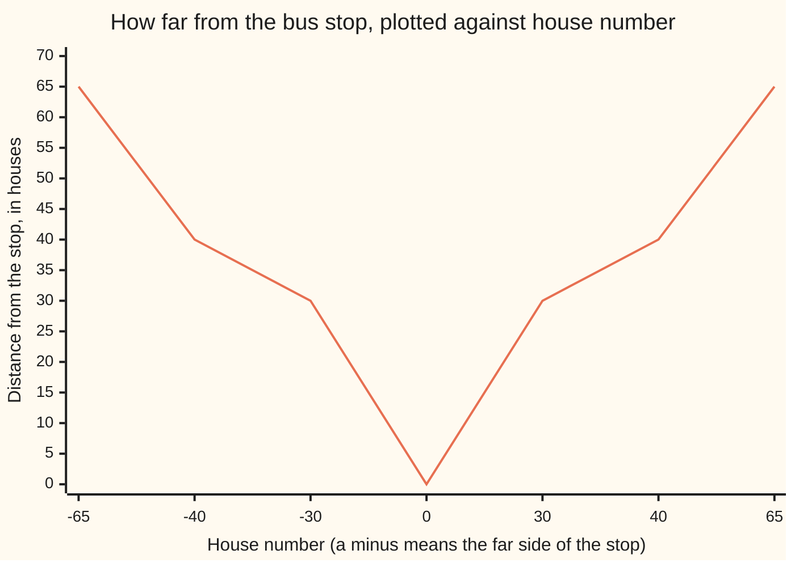

# Absolute value: distance from zero, and the triangle rule

Foundations → The Number Line → Distance → Absolute value

---

## General Overview

One street, numbered house by house. The bus stop is number 0, the bakery 40, the chemist 65. Past the stop the street carries on, those houses taking a minus: the laundrette is −30.

How far is the bakery from the chemist? Twenty-five houses — you subtracted. But 40 − 65 is −25, and no walk is minus twenty-five houses.

Throw the sign away, keep the size. Two upright bars mean exactly that: **|−25| is 25**. The bars are called **absolute value**. The sign says which way; the bars say how far.

**Absolute value is how far a number sits from zero, and the distance between any two numbers is the absolute value of their difference.**

### The picture: how far from the stop



A V: down to 0 at the stop, up again on the far side. The laundrette at −30 is 30 out, same as a house at +30. Even slots here, so not to scale.

---

## The formula

The gap between the shops:

**|40 − 65| = |−25| = 25**

**Read it aloud:** subtract one house number from the other, drop the sign, and that is how far apart they are. Name the two numbers x and y, either way round:

**the distance from x to y is |x − y|**

Start at the stop. Name two walks a and b: plus heads the bakery's way, minus the other way. Do a, then b:

**|a + b| is at most |a| + |b|**

**Read it aloud:** where you end up is never further from the stop than the ground you walked. That is the **triangle rule**, full name the triangle inequality.

| Piece | Plain meaning | In our street |
| --- | --- | --- |
| the two bars, \|40\| | a number's size: how far from 0 | \|40\| = 40, \|−30\| = 30 |
| x and y | two house numbers | 40, 65 |
| \|x − y\| | the gap between them | \|40 − 65\| = 25 |
| a and b | two walks from the stop, plus the bakery's way, minus the other way | +40, −70 |
| \|a + b\| at most \|a\| + \|b\| | ending against ground walked | 30, 110 |

---

## Why it works

### Step 0: a sign is a direction, not a size

A house number does two jobs: the digits say how far out, the minus says which side of the stop. Absolute value keeps the first and drops the second.

A number 0 or more is already a size: |40| is 40. A number below 0 gets a minus in front, cancelling the one there: |−30| is −(−30), or 30. The bars never hand back a negative, and |0| is 0.

### Step 1: a difference becomes a distance

Subtracting glues gap and direction together: 40 − 65 is −25 — 25 houses, chemist further along. The bars strip the direction and leave 25. From the other end you get +25, which the bars leave alone. Same walk either way — which is what distance means.

Bakery to laundrette is where people slip: |40 − (−30)|. Subtracting a negative adds, so 40 + 30 = 70 — you pass the stop, and the legs add.

### Step 2: the triangle rule

Start at the stop. Walk 40 to the bakery, then 25 on to the chemist. Walked 65, ended 65 out: equal, because you never turned around.

Now walk 40, then 70 back to the laundrette. Walked 110, ended 30 out: the second walk undid part of the first.

Only two cases. Same direction, equal; opposite, some cancels and the ending is smaller. Never the other way: walking cannot put you further out than the ground covered. The name comes from off the line, where three points make a triangle and any one side is at most the other two added together.

---

## Worked numbers, by hand

| Step | Arithmetic | Value |
| --- | --- | --- |
| stop to bakery, then chemist | \|40\|, \|65\| | 40 and 65 |
| stop to laundrette | \|−30\| = −(−30) | 30 |
| bakery to chemist, and back | \|40 − 65\|, \|65 − 40\| | **25 and 25** |
| bakery to laundrette, past the stop | \|40 − (−30)\| | **70** |
| out 40, on 25: end, ground walked | \|40 + 25\|, \|40\| + \|25\| | 65 and 65 |
| out 40, back 70: end, ground walked | \|40 + (−70)\|, \|40\| + \|−70\| | **30 and 110** |

The shops are 25 houses apart either way round; the out-and-back trip walks 110 to end 30 out.

### What breaks if you drop a piece

| Mistake | Comes out at | What went wrong |
| --- | --- | --- |
| Subtracting, then stopping: 40 − 65 | −25 | No walk is minus 25 houses |
| Ignoring the laundrette's minus: \|40 − 30\| | 10 | The minus is a side of the stop |
| Reading the triangle rule as equal | 110 | That is the walking; you end 30 out |

The code prints all three.

---

## Code, from first principles, and it actually runs

Nothing is imported. Python's built-in abs is not used: the code writes its own. Each gap is worked the plain way — subtract, drop the sign — then checked by a road that never subtracts.

### Python

```python
# Absolute value -- the check behind the card.  Nothing is imported.  One
# street: the bus stop is house number 0, the bakery is 40, the chemist is 65,
# and the laundrette is -30, on the far side of the stop.
def size(n):                          # |n|: how far n is from 0, sign dropped
    return n if n >= 0 else -n

def gap(x, y): return size(x - y)     # |x - y|: the distance from x to y

def paced(x, y): return sum(1 for _ in range(min(x, y), max(x, y)))   # counted house by house

def row(name, value): print(f"{name:<38}{value:>5}")

stop, bakery, chemist, laundrette = 0, 40, 65, -30
row("|40|   bus stop to the bakery", size(bakery))
row("|65|   bus stop to the chemist", size(chemist))
row("|-30|  bus stop to the laundrette", size(laundrette))
row("|40 - 65|   bakery to chemist", gap(bakery, chemist))
row("|65 - 40|   chemist to bakery", gap(chemist, bakery))
row("|40 - (-30)|  bakery to laundrette", gap(bakery, laundrette))
counted = [paced(bakery, chemist), paced(chemist, bakery), paced(bakery, laundrette)]
print("the same three gaps, counted a step at a time  " + " ".join(str(c) for c in counted))
print("distance from the stop at -30, 0, 40, 65:   " + " ".join(str(size(n)) for n in (laundrette, stop, bakery, chemist)))
out, back, there = 40, 25, -70
print(f"one trip out: |40 + 25| = {size(out + back)} and |40| + |25| = {size(out) + size(back)}")
print(f"doubling back: |40 + (-70)| = {size(out + there)} but |40| + |-70| = {size(out) + size(there)}")
print(f"the three mistakes come out at {bakery - chemist}, {size(bakery - 30)} and {size(out) + size(there)}")
assert size(bakery) == 40 and size(laundrette) == 30 and size(stop) == 0
assert counted == [25, 25, 70] and gap(bakery, chemist) == 25 and gap(bakery, laundrette) == 70
assert size(out + there) == 30 and size(out) + size(there) == 110
print("ALL CHECKS PASS")
```

**Ran 2026-09-06 on macOS, Python 3.14.6, standard library only. All checks passed. Output, pasted from the run:**

```
|40|   bus stop to the bakery            40
|65|   bus stop to the chemist           65
|-30|  bus stop to the laundrette        30
|40 - 65|   bakery to chemist            25
|65 - 40|   chemist to bakery            25
|40 - (-30)|  bakery to laundrette       70
the same three gaps, counted a step at a time  25 25 70
distance from the stop at -30, 0, 40, 65:   30 0 40 65
one trip out: |40 + 25| = 65 and |40| + |25| = 65
doubling back: |40 + (-70)| = 30 but |40| + |-70| = 110
the three mistakes come out at -25, 10 and 110
ALL CHECKS PASS
```

### Rust

Same numbers, same labels; `rustc --edition 2021 -O`.

```rust
// Absolute value -- the same check as absolute_value_and_distance_check.py, in
// Rust.  No crates.  One street: the bus stop is house number 0, the bakery is
// 40, the chemist is 65, and the laundrette is -30, on the far side of the stop.
fn size(n: i64) -> i64 {              // |n|: how far n is from 0, sign dropped
    if n >= 0 { n } else { -n }
}

fn gap(x: i64, y: i64) -> i64 { size(x - y) }   // |x - y|: the distance from x to y

fn paced(x: i64, y: i64) -> i64 { (x.min(y)..x.max(y)).count() as i64 }  // counted house by house

fn row(name: &str, value: i64) { println!("{:<38}{:>5}", name, value); }

fn main() {
    let (stop, bakery, chemist, laundrette) = (0i64, 40i64, 65i64, -30i64);
    row("|40|   bus stop to the bakery", size(bakery));
    row("|65|   bus stop to the chemist", size(chemist));
    row("|-30|  bus stop to the laundrette", size(laundrette));
    row("|40 - 65|   bakery to chemist", gap(bakery, chemist));
    row("|65 - 40|   chemist to bakery", gap(chemist, bakery));
    row("|40 - (-30)|  bakery to laundrette", gap(bakery, laundrette));
    let counted = [paced(bakery, chemist), paced(chemist, bakery), paced(bakery, laundrette)];
    let mut c: Vec<String> = Vec::new();
    for v in counted { c.push(format!("{}", v)); }
    println!("the same three gaps, counted a step at a time  {}", c.join(" "));
    let mut d: Vec<String> = Vec::new();
    for n in [laundrette, stop, bakery, chemist] { d.push(format!("{}", size(n))); }
    println!("distance from the stop at -30, 0, 40, 65:   {}", d.join(" "));
    let (out, back, there) = (40i64, 25i64, -70i64);
    println!("one trip out: |40 + 25| = {} and |40| + |25| = {}", size(out + back), size(out) + size(back));
    println!("doubling back: |40 + (-70)| = {} but |40| + |-70| = {}", size(out + there), size(out) + size(there));
    println!("the three mistakes come out at {}, {} and {}", bakery - chemist, size(bakery - 30), size(out) + size(there));
    assert!(size(bakery) == 40 && size(laundrette) == 30 && size(stop) == 0);
    assert!(counted == [25, 25, 70] && gap(bakery, chemist) == 25 && gap(bakery, laundrette) == 70);
    assert!(size(out + there) == 30 && size(out) + size(there) == 110);
    println!("ALL CHECKS PASS");
}
```

**Ran 2026-09-06 on macOS, rustc 1.98.1, no crates. All checks passed. Output, pasted from the run:**

```
|40|   bus stop to the bakery            40
|65|   bus stop to the chemist           65
|-30|  bus stop to the laundrette        30
|40 - 65|   bakery to chemist            25
|65 - 40|   chemist to bakery            25
|40 - (-30)|  bakery to laundrette       70
the same three gaps, counted a step at a time  25 25 70
distance from the stop at -30, 0, 40, 65:   30 0 40 65
one trip out: |40 + 25| = 65 and |40| + |25| = 65
doubling back: |40 + (-70)| = 30 but |40| + |-70| = 110
the three mistakes come out at -25, 10 and 110
ALL CHECKS PASS
```

> [!TIP]
> **Try changing**
> Guess first, then run it. The asserts are pinned to the street's numbers, so expect one to fire.
> - **Take the bars off.** Change `gap` to `return x - y`. Bakery to chemist comes out at −25, the counted road disagrees, the second assert fires.
> - **Move the laundrette to 30,** the near side. Bakery to laundrette drops from 70 to 10; the walks are untouched, so the third assert lives.

---

## The usual mistake

> [!warning]
> **Believing the bars just make a number positive.** They make it a *size*, measured from zero. The bars act on the whole inside, after the subtraction. Turning the minus in the middle into a plus gives 40 + 65 = 105. Do the inside first: 40 − 65 = −25, then |−25| = 25.
>
> - **Writing |x| = x.** True only when x is 0 or more. Below zero the bars flip it: |−30| is 30.
> - **Losing an inner minus.** Bakery to laundrette is |40 − (−30)| = 70. Read it as decoration and you get 10.
> - **Reading the triangle rule as equals.** It says "at most": out and back walks 110, ends 30 out.

---

## Where you meet it in real life

- **Tolerances.** A part must land within 0.2 mm of 50 mm. As a distance that is one condition, not two: its gap from 50 is at most 0.2.
- **How wrong something was.** A forecast's error is its distance from what happened. The sign says only which way it missed, so the bars go on first.
- **Detours.** Going via somewhere else covers at least as much ground as going straight: the triangle rule again, and why no detour beats the straight road.

> **Say it back**
> Two bars mean size: how far from zero, sign thrown away, so |−30| is 30. The distance between two numbers is the size of their difference, |x − y| — the same whichever you subtract first, so |40 − 65| is 25 either way. Walk a then b, and |a + b|, where you end up, is never more than |a| + |b|, the ground covered. Equal going one way, less when you double back: the triangle rule.

---

## What this builds on

- [number-line-and-inequalities](02-number-line-and-inequalities.md): the line itself, and "at most" — the triangle rule is an inequality, not an equation.
- [negative-numbers](../01-Everyday%20Arithmetic/06-negative-numbers.md): the minus in front of a house number, and why subtracting one adds.

## Where this goes next

- [distance-and-midpoint](../../05-Geometry%20and%20trig/04-Coordinates%20and%20Curves/01-distance-and-midpoint.md): the same size of a difference, measured between two points on a grid.
- [limits](../../06-Calculus%20and%20analysis/01-Limits%20and%20Continuity/01-limits.md): 'within 0.001 of' is an absolute value, and every limit is built on it.
Wherever something later measures how far apart two things sit, it is this size of a difference.

---

## Sources

Verified 6 Sep 2026; every link resolves.

- Abbott, Stephen. *Understanding Analysis*, 2nd ed. Springer, 2015. [doi:10.1007/978-1-4939-2712-8](https://doi.org/10.1007/978-1-4939-2712-8). Chapter 1: both tools, set up carefully.
- Hammack, Richard. *Book of Proof*, 3rd ed. 2018. [Author's site, free full text](https://richardhammack.github.io/BookOfProof/). The sign-by-sign argument in full.
