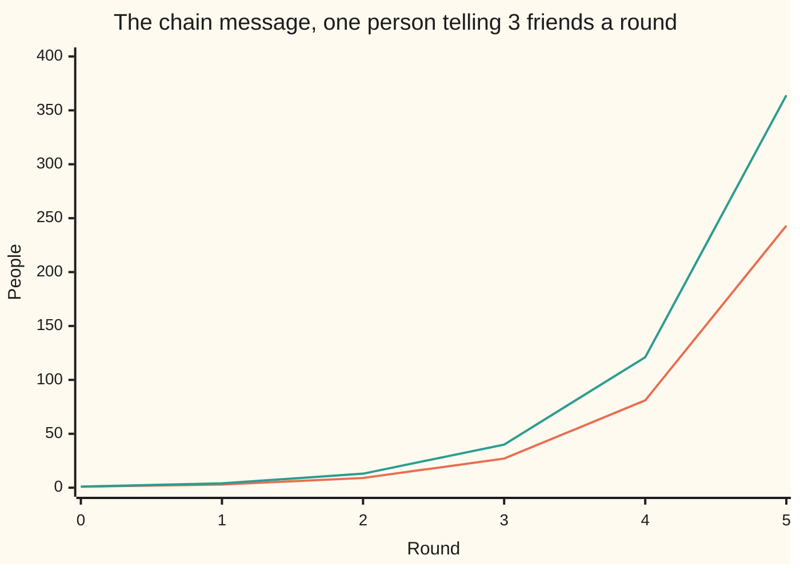

# Exponents: repeated multiplication, and why zero and negative powers make sense

Foundations → Powers, Roots and Logarithms → Powers → Exponents

---

## General Overview

A chain message starts with one person. She sends it to 3 friends. Each of those sends it to 3 more. Nobody gets it twice.

Round 1 reaches 3 people, round 2 reaches 9, round 5 reaches **243**. With the woman who started it: 1 + 3 + 9 + 27 + 81 + 243 = **364** people hold the message.

Writing 3 × 3 × 3 × 3 × 3 gets old fast, so it has a shorthand: **3^5**, said "three to the fifth" — the ^ means the 5 sits raised. The 3 is the **base**, the number doing the multiplying. The 5 is the **exponent**, how many copies of the base are multiplied. The answer, 243, is the **power**.

**An exponent counts copies of the base. Once counts can be added and taken away, an exponent of zero and a negative exponent each have only one possible meaning.**

### The picture: five rounds



Lower line: new people that round, ending at 243. Upper line: everyone holding it, ending at 364. Both crawl along the bottom for three rounds, then shoot up.

---

## The formula

The written-out multiplication **is** the definition:

**3^5 = 3 × 3 × 3 × 3 × 3 = 243**

Three moves do the rest, on our numbers:

- **3^2 × 3^3 = 3^5.** Multiplying powers of the same base adds the exponents.
- **3^5 ÷ 3^2 = 3^3.** Dividing subtracts them.
- **(3^2)^3 = 3^6.** A power of a power multiplies them.

| Piece | Plain meaning | In our example |
| --- | --- | --- |
| the base | the number being multiplied | 3, the friends each tells |
| the exponent | how many copies of the base are multiplied | 5, the rounds |
| the power | the answer | 243, reached in round 5 |
| an exponent of 0 | no copies at all, which is 1 | round 0, the woman who started it |
| a negative exponent | 1 divided by the power | 3^-3 is 1 ÷ 27 |

---

## Why it works

### The exponent is a count, so it behaves like one

3^2 × 3^3 is two 3s times three 3s. Push them into one line: 3 × 3 × 3 × 3 × 3. Five 3s, so it is 3^5. The 2 + 3 = 5 is not a rule you learned; it is a count you just did.

In the chain: round 2 has reached 9 people. Let each of those 9 run 3 more rounds and each grows to 27. 9 × 27 = 243, which is round 5.

Dividing takes copies away. 3^5 ÷ 3^2 is five 3s over two 3s; cancel two pairs and three 3s are left, which is 27. Round 5 is 27 times round 2, three rounds apart.

Stacking is that count again. (3^2)^3 is three copies of 3 × 3: six 3s, so 3^6, which is 729.

### Zero copies has to be 1

Compare round 5 with itself: 243 ÷ 243 = 1. The subtraction rule says that division is 3 to the (5 − 5), which is 3^0. Two answers to one question, so **3^0 = 1**.

The ladder says it too. Read the rounds backwards: 243, 81, 27, 9, 3. Every step divides by 3. One more step and 3 ÷ 3 = 1 — round 0, the woman who started it. Zero is where the ladder was already going.

### Going below zero flips the number over

The other way. Round 2 against round 5: 9 ÷ 243 = 1/27. The subtraction rule says it is 3 to the (2 − 5), which is 3^-3. So **3^-3 = 1 ÷ 27**: a negative exponent means 1 divided by the matching power.

It does not make the answer negative; it flips the number into a fraction.

<details>
<summary>Why 0 is the one base left out here</summary>

0^3 is fine: it is 0. The other end is the problem. 3^0 was forced by dividing 3 by 3, and with a base of 0 you can never divide — dividing by 0 has no answer. Nothing forces an answer, so 0^0 is left undefined.

</details>

---

## Worked numbers, by hand

| Step | Arithmetic | Value |
| --- | --- | --- |
| round 1 | 3 | 3 |
| round 2 | 3 × 3 | 9 |
| round 5, written 3^5 | 3 × 3 × 3 × 3 × 3 | **243** |
| everyone holding it | 1 + 3 + 9 + 27 + 81 + 243 | **364** |
| round 5, the other road | 3^2 × 3^3, or 9 × 27 | 243 |
| a power of a power, (3^2)^3 | 9 × 9 × 9, or 3^6 | 729 |
| round 5 ÷ round 2 | 243 ÷ 9, or 3^3 | 27 |
| round 5 ÷ round 5 | 243 ÷ 243, or 3^0 | 1 |
| round 2 ÷ round 5 | 9 ÷ 243, or 3^-3 | 1/27 |

One person, five rounds: 364 people hold the message.

### What breaks if you drop a piece

| Mistake | Comes out at | What went wrong |
| --- | --- | --- |
| Multiplying the exponents in 3^2 × 3^3, not adding | 729 | That is (3^2)^3, a different question |
| Reading 3^5 as 3 × 5 | 15 | The 5 counts copies of the 3 |
| Reading 3^-3 as a negative number | −27 | It flips instead: 1/27 |

The code below prints all three, and every number on this card.

---

## Code, from first principles, and it actually runs

Nothing is imported. Round 5 is built one multiplication at a time, then reached again by 3^2 × 3^3 and by (3^2)^3. Then the ratios, including 3^0 and 3^-3.

### Python

```python
# Exponents -- the check behind the card.  Nothing imported.  A chain message:
# 3 friends each, five rounds; then 243 by a second road, and the ladder of ratios.
def power(base, rounds):            # 3, 5 -> 3 x 3 x 3 x 3 x 3 -> 243
    result = 1
    for _ in range(rounds):
        result = result * base
    return result

def line(name, value):
    print(f"{name:<44}{value:>6}")

new = [power(3, r) for r in range(6)]
running = [sum(new[:r + 1]) for r in range(6)]
flip = new[5] // new[2]             # 9 x 27 = 243, so 9 / 243 is 1/27
print(f"{'round':<22}" + "".join(f"{v:>5}" for v in range(6)))
print(f"{'new people this round':<22}" + "".join(f"{v:>5}" for v in new))
print(f"{'everyone who has it':<22}" + "".join(f"{v:>5}" for v in running))
line("3 x 3 x 3 x 3 x 3 = 3^5", new[5])
line("3^2 x 3^3, the two halves multiplied", power(3, 2) * power(3, 3))
line("(3^2)^3 = 3^6, a power of a power", power(power(3, 2), 3))
line("3^5 / 3^2 = 3^3, five rounds against two", new[5] // new[2])
line("3^5 / 3^5 = 3^0, five rounds against five", new[5] // new[5])
line("3^2 / 3^5 = 3^-3, two rounds against five", f"1/{flip}")
print(f"the three mistakes come out at {power(3, 6)}, {3 * 5} and {-power(3, 3)}")

assert new[5] == 243 and power(3, 2) * power(3, 3) == new[5]
assert running[5] == 1 + 3 + 9 + 27 + 81 + 243 and new[0] == 1
assert new[2] == 9 and flip == 27 and new[2] * flip == new[5] and new[5] // new[5] == 1
assert power(power(3, 2), 3) == power(3, 6) == 729
print("ALL CHECKS PASS")
```

**Ran 2026-09-06 on macOS, Python 3.14.6, standard library only. All checks passed. Output, pasted from the run:**

```
round                     0    1    2    3    4    5
new people this round     1    3    9   27   81  243
everyone who has it       1    4   13   40  121  364
3 x 3 x 3 x 3 x 3 = 3^5                        243
3^2 x 3^3, the two halves multiplied           243
(3^2)^3 = 3^6, a power of a power              729
3^5 / 3^2 = 3^3, five rounds against two        27
3^5 / 3^5 = 3^0, five rounds against five        1
3^2 / 3^5 = 3^-3, two rounds against five     1/27
the three mistakes come out at 729, 15 and -27
ALL CHECKS PASS
```

### Rust

Same numbers, built with `rustc --edition 2021 -O`.

```rust
// Exponents -- the same check as the Python, in Rust.  No crates.  A chain
// message: 3 friends each, five rounds; then 243 by a second road, and the ratios.
fn power(base: i64, rounds: u32) -> i64 {   // 3, 5 -> 3 x 3 x 3 x 3 x 3 -> 243
    let mut result = 1i64;
    for _ in 0..rounds { result = result * base; }
    result
}

fn line(name: &str, value: &str) { println!("{:<44}{:>6}", name, value); }

fn main() {
    let new: Vec<i64> = (0..6).map(|r| power(3, r)).collect();
    let mut running: Vec<i64> = Vec::new();
    let mut total = 0i64;
    for n in &new { total += n; running.push(total); }
    let flip = new[5] / new[2];             // 9 x 27 = 243, so 9 / 243 is 1/27
    let mut head = format!("{:<22}", "round");
    for v in 0..6 { head.push_str(&format!("{:>5}", v)); }
    println!("{}", head);
    let mut fresh = format!("{:<22}", "new people this round");
    for v in &new { fresh.push_str(&format!("{:>5}", v)); }
    println!("{}", fresh);
    let mut all = format!("{:<22}", "everyone who has it");
    for v in &running { all.push_str(&format!("{:>5}", v)); }
    println!("{}", all);
    line("3 x 3 x 3 x 3 x 3 = 3^5", &new[5].to_string());
    line("3^2 x 3^3, the two halves multiplied", &(power(3, 2) * power(3, 3)).to_string());
    line("(3^2)^3 = 3^6, a power of a power", &power(power(3, 2), 3).to_string());
    line("3^5 / 3^2 = 3^3, five rounds against two", &(new[5] / new[2]).to_string());
    line("3^5 / 3^5 = 3^0, five rounds against five", &(new[5] / new[5]).to_string());
    line("3^2 / 3^5 = 3^-3, two rounds against five", &format!("1/{}", flip));
    println!("the three mistakes come out at {}, {} and {}", power(3, 6), 3 * 5, -power(3, 3));

    assert!(new[5] == 243 && power(3, 2) * power(3, 3) == new[5]);
    assert!(running[5] == 1 + 3 + 9 + 27 + 81 + 243 && new[0] == 1);
    assert!(new[2] == 9 && flip == 27 && new[2] * flip == new[5] && new[5] / new[5] == 1);
    assert!(power(power(3, 2), 3) == power(3, 6) && power(3, 6) == 729);
    println!("ALL CHECKS PASS");
}
```

**Ran 2026-09-06 on macOS, rustc 1.98.1, no crates. All checks passed. Output, pasted from the run:**

```
round                     0    1    2    3    4    5
new people this round     1    3    9   27   81  243
everyone who has it       1    4   13   40  121  364
3 x 3 x 3 x 3 x 3 = 3^5                        243
3^2 x 3^3, the two halves multiplied           243
(3^2)^3 = 3^6, a power of a power              729
3^5 / 3^2 = 3^3, five rounds against two        27
3^5 / 3^5 = 3^0, five rounds against five        1
3^2 / 3^5 = 3^-3, two rounds against five     1/27
the three mistakes come out at 729, 15 and -27
ALL CHECKS PASS
```

The two outputs match line for line.

> [!TIP]
> **Try changing**
> Guess first, then run it.
> - **Add a sixth round.** Change all three `range(6)` to `range(7)` — in the Rust, both `0..6`. Leave `power(3, 6)` and the `:>6` widths alone. Round 6 adds 729, not another 243.
> - **Make the base 1.** Everyone tells one friend. Every round reaches 1 person, the chain never grows, and the first assert fires.

---

## The usual mistake

> [!warning]
> **Reading 3^5 as 3 × 5, which is 15.** The raised number does not multiply the base; it counts copies of it. 3^5 is 243, and 15 is not close.
>
> - **Thinking 3^0 is 0.** It is 1.
> - **Expecting a negative exponent to give a negative answer.** 3^-3 is 1/27, not −27.
> - **Multiplying the exponents instead of adding them.** 3^2 × 3^3 is 3^5, which is 243, not 729.
> - **Different bases.** 3^2 × 5^2 is not 15^4; the adding rule needs the same base both sides.

---

## Where you meet it in real life

- **Anything that spreads.** Rumours, viruses, forwarded posts: each step multiplies instead of adding, which is why they look flat and then do not: [linear-vs-exponential-growth](02-linear-vs-exponential-growth.md).
- **Compound interest.** A balance growing a fixed percentage a year is a chain message with a small base.
- **Huge and tiny numbers.** Star distances and virus sizes are a number times a power of ten: [scientific-notation](04-scientific-notation.md).

> **Say it back**
> An exponent counts copies. 3^5 means five 3s multiplied together, which is 243; the 3 is the base, the 5 is the exponent. Multiplying powers of the same base adds those counts, dividing subtracts them. Stacking, (3^2)^3, multiplies them. That settles the odd cases: 243 ÷ 243 is 1 and is also 3^0; 9 ÷ 243 is 1/27 and is also 3^-3.

---

## What this builds on

- [multiplying-and-dividing](../01-Everyday%20Arithmetic/03-multiplying-and-dividing.md): repeated multiplication, and cancelling factors.
- [negative-numbers](../01-Everyday%20Arithmetic/06-negative-numbers.md): what a minus sign on the exponent means.
- [fractions](../01-Everyday%20Arithmetic/07-fractions.md): where 3^-3 lands, one twenty-seventh.

## Where this goes next

- [linear-vs-exponential-growth](02-linear-vs-exponential-growth.md): this chain against one that adds 3 people a round.
- [roots-and-fractional-exponents](03-roots-and-fractional-exponents.md): what half a round would mean, and why it is a root.
- [scientific-notation](04-scientific-notation.md): powers of ten, for very big and very small numbers.
- [logarithms](05-logarithms.md): this card backwards — given 243 and base 3, what power got me here?

---

## Sources

Verified 6 Sep 2026; every link resolves.

- Euler, Leonhard. *Elements of Algebra*, trans. John Hewlett, 1822. [Internet Archive](https://archive.org/details/elementsofalgebr00eule). Powers from the pattern, zero and negative exponents included.
- Cajori, Florian. *A History of Mathematical Notations*. Dover. [Publisher page](https://store.doverpublications.com/products/9780486677668). Where the raised number came from.
- Weisstein, Eric W. "Power." *MathWorld*. [mathworld.wolfram.com](https://mathworld.wolfram.com/Power.html). The modern statement of the three rules.
