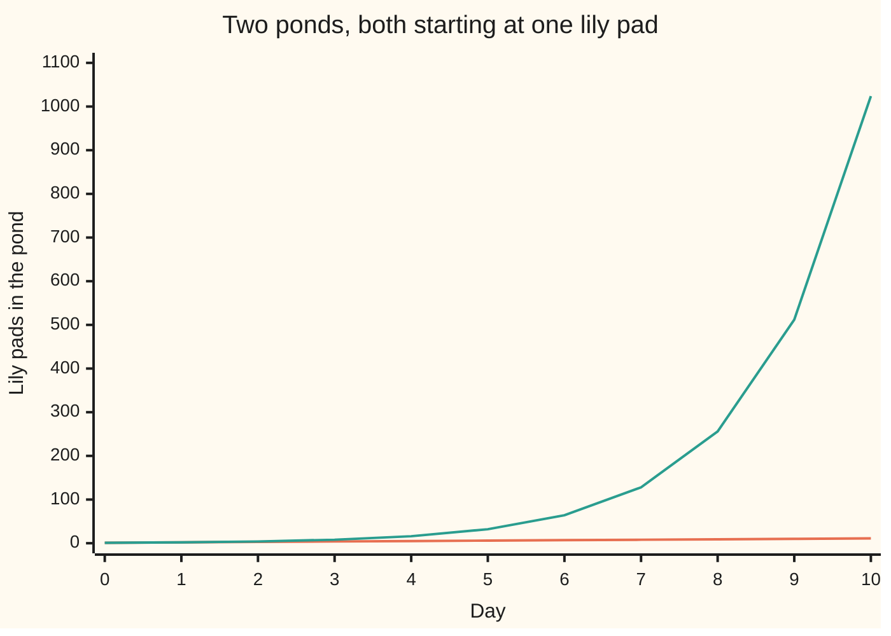

# Linear versus exponential growth: adding a fixed amount against multiplying by a fixed factor

[Syllabus](../../../SYLLABUS.md) → [Foundations](../../../SYLLABUS.md#w01) → [Powers, Roots and Logarithms](../../../SYLLABUS.md#w01-s03) → Linear versus exponential growth

---

## General Overview

Two ponds, side by side. Each starts with one lily pad. A gardener tends the first: every morning he drops in one more pad. The second is left alone, and its pads double overnight — one becomes two, two become four.

For the first few days the ponds look much the same. Day 2: three pads against four. Nothing to make you nervous.

A million pads covers a pond. The doubling pond is covered on day 20. The gardener's pond needs 999,999 days: 2,739 years.

Growth that **adds** a fixed amount every step is **linear** — it draws a straight line. Growth that **multiplies** by a fixed factor every step is **exponential**.

**Adding always loses to multiplying, and not by a little.**

### The picture: the first ten days



The line crawling along the bottom is the gardener's pond, one pad a day. The line climbing off the top is the doubling pond. On day 10 he has 11 pads, the other pond 1,024 — and the chart stops ten days short of day 20.

---

## The formula

Start with the pads on day 0. Then do the day's move, twenty times:

**gardener's pond on day 20 = 1 + 20 × 1 = 21 pads**

**doubling pond on day 20 = 1 × 2 × 2 × 2 … twenty 2s in all … = 1,048,576 pads**

Twenty 2s multiplied together is written 2^20 — the shorthand from [Exponents](01-exponents-and-powers.md).

In general: linear = starting amount + step × days; exponential = starting amount, multiplied by the factor once per day, for as many days as have passed.

**Read it aloud:** linear adds its step twenty times over; exponential multiplies by its factor twenty times over.

| Piece | Plain meaning | In our ponds | Push it up and… |
| --- | --- | --- | --- |
| the starting amount | pads on day 0 | 1 pad in each pond | both begin bigger; neither shape changes |
| the step | the fixed amount added each day | 1 pad | the line tilts steeper, still straight |
| the factor | the fixed number multiplied in each day, bigger than 1 | 2 | the curve leaves the ground sooner |
| the days | how many days have passed | 20 | the gap widens without limit |

---

## Why it works

### Adding drops the same lump every day

The gardener's pond gains one pad on day 1, one pad on day 20, one pad on day 20,000. The gain never looks at the pond. Twenty days of the same lump is 20 × 1 — the same rise every day, and that is what a straight line is.

### Multiplying pays the pond a share of itself

The doubling pond gains as many pads as it already holds. On day 4 it holds 16 and gains 16 overnight. On day 19 it holds 524,288 and gains 524,288 overnight. The step grows with the thing. Linear growth is deaf to its own size; exponential growth listens to it.

### Small numbers hide it

The doubling pond obeys the same rule on day 2 as on day 20, but doubling a small number gives a small gain. So the last doubling adds more than all the ones before it put together: day 19 holds 524,288 pads, day 20 adds another 524,288. The pond is barely half covered the day before it is full.

### Which one wins, always

Any straight line loses to any curve that multiplies by a factor bigger than 1, if you wait. Hand the gardener a thousand pads a day and the doubling pond still passes him, a few days later.

---

## Worked numbers, by hand

| Step | Arithmetic | Value |
| --- | --- | --- |
| day 10, gardener | 1 + 10 × 1 | 11 |
| day 10, doubling | ten 2s multiplied together | 1,024 |
| day 19, doubling | day 10 doubled nine more times | 524,288 |
| day 20, doubling | 524,288 × 2 | **1,048,576** |
| day 20, gardener | 1 + 20 × 1 | **21** |
| the gap on day 20 | 1,048,576 − 21 | **1,048,555** |

A million pads covers a pond. The doubling pond is covered on day 20; the gardener's on day 999,999 — 2,739 years of mornings.

### What breaks if you drop a piece

| Mistake | Comes out at | What went wrong |
| --- | --- | --- |
| Reading "doubling" as "two more a day" | 41 | 1 + 20 × 2: the factor added, not multiplied in |
| Reading "doubles for 20 days" as 2 × 20 | 40 | Days count the multiplications; a day is not one of the numbers |
| Guessing day 10 is half of day 20 | 524,288 (that is half of day 20); day 10 actually holds 1,024 | Halfway in time is nowhere near halfway in size |

The code prints the two mistake numbers, and every other number here.

---

## Code, from first principles, and it actually runs

Nothing is imported. Both ponds are stepped forward a day at a time, the plain way: add one, or multiply by two. A second route confirms twenty doublings equal ten doublings squared: 1,024 × 1,024.

### Python

```python
# Linear against exponential -- the check behind the card.  Nothing is imported.
# Two ponds, each starting at one lily pad.  In the first the gardener adds one
# pad a day.  In the second the pads double.  Covered means a million pads.
COVER = 1000000
plus, times = [1], [1]                       # day 0: one pad in each pond
for _ in range(20):                          # one road: step a day at a time
    plus.append(plus[-1] + 1)
    times.append(times[-1] * 2)

def grid(name, values): print(f"{name:<16}" + "".join(f"{v:>6}" for v in values))
def one(name, value): print(f"{name:<44}{value:>10}")

grid("day", range(11))
grid("one pad a day", plus[:11])
grid("doubling", times[:11])
one("day 19, doubling pond", times[19])
one("day 20, doubling pond", times[20])
one("day 20, one-pad pond", plus[20])
one("day 20, the gap", times[20] - plus[20])
one("days for the one-pad pond to reach 1000000", COVER - 1)
one("that, in whole years", (COVER - 1) // 365)
print(f"the two mistakes come out at {1 + 2 * 20} and {2 * 20}")

assert plus[20] == 21 and times[20] == 1048576 and times[20] - plus[20] == 1048555
assert times[20] == times[10] * times[10]    # a second road: 1024 x 1024
assert times[19] * 2 == times[20] and times[19] < COVER <= times[20]
assert COVER - 1 == 999999 and (COVER - 1) // 365 == 2739  # the headline numbers
assert 1 + 2 * 20 == 41 and 2 * 20 == 40     # the two mistake numbers, as printed
print("ALL CHECKS PASS")
```

**Ran 2026-09-06 on macOS, Python 3.14.6, standard library only. All checks passed. Output, pasted from the run:**

```
day                  0     1     2     3     4     5     6     7     8     9    10
one pad a day        1     2     3     4     5     6     7     8     9    10    11
doubling             1     2     4     8    16    32    64   128   256   512  1024
day 19, doubling pond                           524288
day 20, doubling pond                          1048576
day 20, one-pad pond                                21
day 20, the gap                                1048555
days for the one-pad pond to reach 1000000      999999
that, in whole years                              2739
the two mistakes come out at 41 and 40
ALL CHECKS PASS
```

### Rust

Same numbers, same labels, built with `rustc --edition 2021 -O`.

```rust
// Linear against exponential -- the same check as the Python, in Rust.  No
// crates.  Two ponds, each starting at one lily pad.  In the first the gardener
// adds one pad a day.  In the second the pads double.  Covered is a million.
const COVER: i64 = 1000000;

fn grid(name: &str, values: &[i64]) {
    let mut line = format!("{:<16}", name);
    for v in values { line.push_str(&format!("{:>6}", v)); }
    println!("{}", line);
}

fn one(name: &str, value: i64) { println!("{:<44}{:>10}", name, value); }

fn main() {
    let (mut plus, mut times) = (vec![1i64], vec![1i64]);
    for _ in 0..20 {                         // one road: step a day at a time
        plus.push(plus[plus.len() - 1] + 1);
        times.push(times[times.len() - 1] * 2);
    }
    let days: Vec<i64> = (0..11).collect();
    grid("day", &days);
    grid("one pad a day", &plus[..11]);
    grid("doubling", &times[..11]);
    one("day 19, doubling pond", times[19]);
    one("day 20, doubling pond", times[20]);
    one("day 20, one-pad pond", plus[20]);
    one("day 20, the gap", times[20] - plus[20]);
    one("days for the one-pad pond to reach 1000000", COVER - 1);
    one("that, in whole years", (COVER - 1) / 365);
    println!("the two mistakes come out at {} and {}", 1 + 2 * 20, 2 * 20);

    assert!(plus[20] == 21 && times[20] == 1048576 && times[20] - plus[20] == 1048555);
    assert!(times[20] == times[10] * times[10]);   // a second road: 1024 x 1024
    assert!(times[19] * 2 == times[20] && times[19] < COVER && COVER <= times[20]);
    assert!(COVER - 1 == 999999 && (COVER - 1) / 365 == 2739);  // headline numbers
    assert!(1 + 2 * 20 == 41 && 2 * 20 == 40);   // the two mistakes, as printed
    println!("ALL CHECKS PASS");
}
```

**Ran 2026-09-06 on macOS, rustc 1.98.1, no crates. All checks passed. Output, pasted from the run:**

```
day                  0     1     2     3     4     5     6     7     8     9    10
one pad a day        1     2     3     4     5     6     7     8     9    10    11
doubling             1     2     4     8    16    32    64   128   256   512  1024
day 19, doubling pond                           524288
day 20, doubling pond                          1048576
day 20, one-pad pond                                21
day 20, the gap                                1048555
days for the one-pad pond to reach 1000000      999999
that, in whole years                              2739
the two mistakes come out at 41 and 40
ALL CHECKS PASS
```

The two outputs match line for line: whole pads throughout, nothing to round.

> [!TIP]
> **Try changing**
> Guess first, then run it. The asserts are pinned to the pond numbers, so expect one to fire.
> - **Give the gardener a bigger lump.** Change the `+ 1` to `+ 1000`. Guess which pond leads on day 20. His pond is still far behind, and the first assert fires.
> - **Take the doubling away.** Change the `* 2` to `* 1`. The second pond never leaves its one pad, and the first assert fires again.

---

## The usual mistake

> [!warning]
> **Judging the shape from the first few days.** On day 2 the ponds differ by a single pad. Nothing on the first screen of a table tells you which growth this is. Ask what happens between two rows: is the same amount added, or the same factor multiplied in?
>
> - Calling growth exponential because it is fast. Fast and straight is still linear.
> - Reading "doubles for 20 days" as 2 × 20, which gives 40 instead of 1,048,576.
> - Assuming halfway in time is halfway in size. Day 10 holds 1,024 pads, not half of 1,048,576.

---

## Where you meet it in real life

- **Money left in an account.** Interest paid on the balance is a factor, not a lump: last year's interest earns too. The flat version is [Simple interest](../04-Compound%20Growth%20and%20Discounting/02-simple-interest.md).
- **Anything that spreads.** A rumour, a virus, a video: each carrier makes more carriers, so the step grows with the size. The jump that looks sudden is only the last doubling.
- **Charts that look flat, then explode.** Squash exponential numbers onto an ordinary axis and everything before the last few steps reads as zero. A log scale fixes that: [Log laws and log scales](06-log-laws-and-log-scales.md).

> **Say it back**
> Linear growth adds the same fixed amount every step: a straight line. Exponential growth multiplies by the same fixed factor every step. Double, and each step is as big as everything before it. Two ponds from one lily pad: one pad a day reaches 21 by day 20, doubling reaches 1,048,576. A million pads covers a pond, so one is covered on day 20 and the other on day 999,999 — 2,739 years. The early days look alike. That is the trap.

---

## What this builds on

- [Exponents](01-exponents-and-powers.md): what it means to multiply a number by itself twenty times, and the shorthand for it.

## Where this goes next

- [Simple interest](../04-Compound%20Growth%20and%20Discounting/02-simple-interest.md): the gardener's pond in money — a fixed amount added each period, never earning on itself.

---

## Sources

Verified 6 Sep 2026; every source link below resolves.

- Malthus, T. R. *An Essay on the Principle of Population*. 1798. [Project Gutenberg edition](https://www.gutenberg.org/ebooks/4239). Chapter 1 sets population "increasing in a geometrical ratio" against food "in an arithmetical ratio" — these ponds, argued about bread.
- Meadows, Donella H. *Thinking in Systems: A Primer*. Chelsea Green, 2008. [Publisher page](https://www.chelseagreen.com/product/thinking-in-systems/). Reinforcing loops: why a quantity that feeds on itself surprises everyone watching.
- Brauer, Fred, and Carlos Castillo-Chavez. *Mathematical Models in Population Biology and Epidemiology*, 2nd ed. Springer, 2012. [doi:10.1007/978-1-4614-1686-9](https://doi.org/10.1007/978-1-4614-1686-9). Doubling populations, done carefully.
