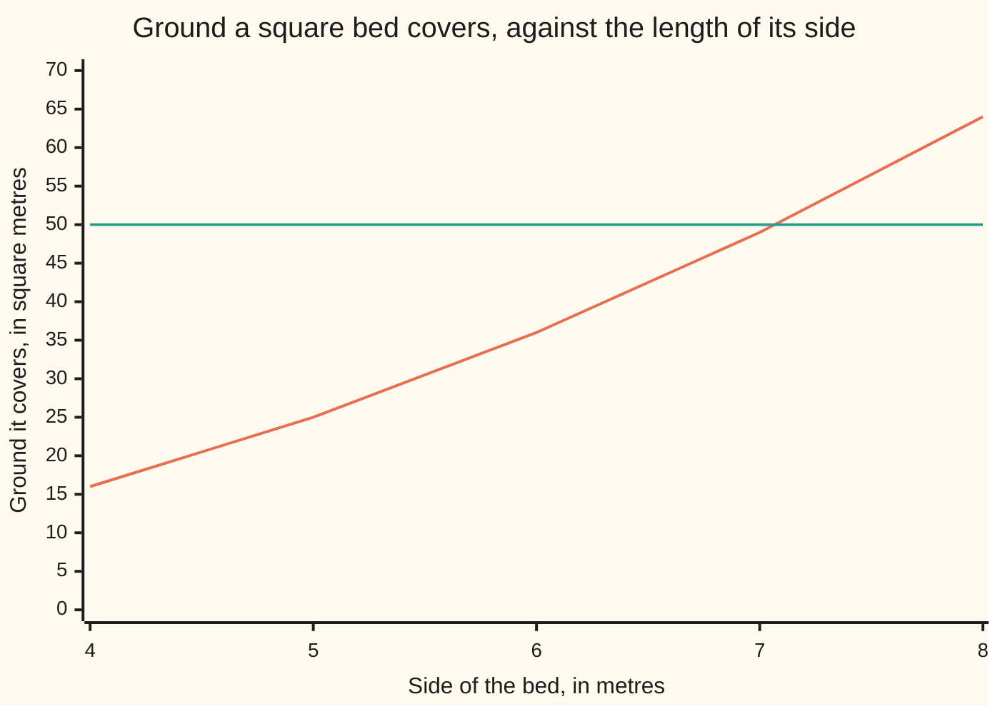

# Roots: the fractional exponents that undo powers

[Syllabus](../../../SYLLABUS.md) → [Foundations](../../../SYLLABUS.md#w01) → [Powers, Roots and Logarithms](../../../SYLLABUS.md#w01-s03) → Square and cube roots

---

## General Overview

You are building a square raised bed for vegetables that must cover 50 square metres. Beside it goes a cube-shaped water tank holding 8,000 litres. One question covers both: how long is a side?

Multiplying is the easy direction: 7 metres a side covers 49 square metres, nearly enough. Here you are handed the 50 and asked for the 7-and-a-bit — the backwards move, a **root**.

The bed's side is the **square root** of 50: the number that, times itself, gives 50. The tank's side is the **cube root** of 8, since 8,000 litres is 8 cubic metres: the number that, in three copies, gives 8. As powers, in the notation from [Exponents](01-exponents-and-powers.md), they are 50^(1/2) and 8^(1/3); the old sign for the first is √50. The bottom of the fraction says how many copies: 2 for the bed, 3 for the tank.

**A root is a power run backwards, and written as the exponent 1/2 or 1/3 it obeys every law powers already obey.**

### The picture: where the curve crosses 50



The climbing line is the ground the bed covers; the flat line is the 50 needed. They cross between 7 metres and 8.

---

## The formula

The question, written down, defines the answer:

**side × side = 50, so side = 50^(1/2) ≈ 7.071067811865**

**side × side × side = 8, so side = 8^(1/3) = 2**

| Piece | Plain meaning | In our example |
| --- | --- | --- |
| the base | what the root is taken of | 50 the bed, 8 the tank |
| the exponent 1/2 | square root: what, times itself, is the base | 50^(1/2) ≈ 7.071067811865 |
| the exponent 1/3 | cube root: what, in three copies, is the base | 8^(1/3) = 2 |
| the exponent 2/3 | cube root, then times itself | 8^(2/3) = 4, a tank face |
| the minus twin | the other number squaring to the base | ≈ −7.071067811865 |

---

## Why it works

### Step 0: a root is not a new operation

The same multiplication read from the other end. "Seven times seven is forty-nine" and "the square root of forty-nine is seven" are one fact, two ways.

### Step 1: why the exponent is one half

[Exponents](01-exponents-and-powers.md) gives the law: multiplying two powers of one base adds their exponents. Multiply 50^(1/2) by 50^(1/2) and the exponents add to 1 — and 50 to the power 1 is 50. So 50^(1/2) is a number that, times itself, gives 50: the square root, word for word. Which of the two, Step 3 settles.

Thirds work the same: one third, three times, adds to 1, so three copies of 8^(1/3) multiply to 8. And 8^(2/3) means cube root, then times itself: 2 times 2 is 4, a tank face.

### Step 2: finding it by hand

Guess 7. Divide 50 by the guess. A right guess hands back itself; this one does not, so one is too small, the other too big, and the side sits between. Average them: 7.071428571429.

Again, with that as the guess: 7.071067821068. Once more: 7.071067811865, and a fourth round does not move it. Each round roughly doubles the digits you can trust; the value it lands on sits on a Babylonian clay tablet 3,800 years old, for the square root of 2. Cube roots weight the guess two to one against 8 ÷ (guess × guess) — same idea, three copies.

### Step 3: the minus twin, and a second road

Two minus signs multiplied make a plus, so −7.071067811865 times itself is also 50. The equation "side × side = 50" has two answers; the bed has one, since a length cannot be negative. The equation owes you both; the situation throws one away. Nothing times itself lands on a minus, so a negative number has no square root here. Three minus signs stay minus, so a cube keeps the sign of its side, and every ordinary number has exactly one cube root.

The tank needs no cube root at all. A litre is a cube one decimetre on a side, a tenth of a metre. Stack 8,000 into one big cube: each edge takes 20, since 20 times 20 times 20 is 8,000. Twenty decimetres is 2 metres — the code's second road, no root in it.

---

## Worked numbers, by hand

| Step | Arithmetic | Value |
| --- | --- | --- |
| the bed, first guess | 7 × 7 | 49 |
| divide and average | (7 + 50 ÷ 7) ÷ 2 | 7.071428571429 |
| round two | same again | 7.071067821068 |
| round three, settled | same again | **7.071067811865** |
| the check | that side, times itself | 50.000000000000 |
| the tank, litre way | 20 litre cubes to an edge | 2.000000000000 |
| the tank, root way | 8^(1/3) | **2.000000000000** |
| one face | 8^(2/3) | 4.000000000000 |

The bed is a shade over 7 metres a side; the tank 2 metres, its faces 4 square metres.

### What breaks if you drop a piece

| Mistake | Comes out at | What went wrong |
| --- | --- | --- |
| Halving 50 instead of rooting it | 25 | A 25-metre bed covers 625 square metres |
| Reading 8,000 litres as cubic metres | 20 | The volume is 8 cubic metres, not 8,000; 20 metres is ten times too big |
| Keeping the minus answer | −7.071067811865 | Both squares are 50; only one is a length |

---

## Code, from first principles, and it actually runs

Nothing is imported, no square-root routine called. The bed's side comes from dividing and averaging, then squared to check it lands back on 50. The tank's side comes twice over: by cube root, and by counting litre cubes.

### Python

```python
# Roots -- the check behind the card.  Nothing is imported.  A square bed that
# must cover 50 square metres, and a cube tank that must hold 8,000 litres.
# Each root is found by dividing and averaging, then multiplied back.
def sqroot(a, guess):            # divide and average: guess, a/guess, meet in the middle
    out = []
    for _ in range(4):          # a fourth round, to show it no longer moves
        guess = (guess + a / guess) / 2
        out.append(guess)
    return out
def cuberoot(a):                 # same idea, weighted: two parts old guess, one part a/(guess x guess)
    x = a
    for _ in range(60):
        x = (2 * x + a / (x * x)) / 3
    return x
steps = sqroot(50.0, 7.0)
bed, tank = steps[2], cuberoot(8.0)
litre = 20.0 / 10                # no root: 20 litre cubes to an edge, a tenth of a metre each
face = tank * tank               # 8 to the 2/3: cube root first, then multiplied by itself
print(f"{'squares of sides 4 to 8 metres':<36}" + "".join(f"{s * s:>5.0f}" for s in [4, 5, 6, 7, 8]))
for name, v in [("guess 7, divide and average", steps[0]), ("round two, closer", steps[1]),
                ("round three, and it settles", bed), ("that side squared, back to 50", bed * bed),
                ("the minus twin", -bed), ("the minus twin squared", (-bed) * (-bed)),
                ("tank side, cube root of 8", tank), ("tank side the litre way, 20 dm", litre),
                ("one face of the tank, 8 to the 2/3", face)]:
    print(f"{name:<36}{v:>18.12f}")
print(f"mistakes: 25 metres a side covers {25 * 25}; 8,000 cubic metres gives a side of {cuberoot(8000.0):.0f}")
assert abs(bed * bed - 50.0) < 1e-9 and abs((-bed) * (-bed) - 50.0) < 1e-9 and steps[3] == bed
assert abs(tank - litre) < 1e-9 and abs(tank * tank * tank - 8.0) < 1e-9 and 20 * 20 * 20 == 8000
assert abs(face - 4.0) < 1e-9 and abs(steps[0] - 7.071428571428571) < 1e-15
print("ALL CHECKS PASS")
```

**Ran 2026-09-06 on macOS, Python 3.14.6, standard library only. All checks passed. Output, pasted from the run:**

```
squares of sides 4 to 8 metres         16   25   36   49   64
guess 7, divide and average             7.071428571429
round two, closer                       7.071067821068
round three, and it settles             7.071067811865
that side squared, back to 50          50.000000000000
the minus twin                         -7.071067811865
the minus twin squared                 50.000000000000
tank side, cube root of 8               2.000000000000
tank side the litre way, 20 dm          2.000000000000
one face of the tank, 8 to the 2/3      4.000000000000
mistakes: 25 metres a side covers 625; 8,000 cubic metres gives a side of 20
ALL CHECKS PASS
```

### Rust

Built with `rustc --edition 2021 -O`.

```rust
// Roots -- the same check as the Python, in Rust.  No crates.  A square bed
// that must cover 50 square metres, and a cube tank that must hold 8,000
// litres.  Each root is found by dividing and averaging, then squared or
// cubed back to see whether it lands on what was asked for.
fn sqroot(a: f64, mut guess: f64) -> [f64; 4] {   // divide and average, four rounds
    let mut out = [0.0f64; 4];
    for i in 0..4 { guess = (guess + a / guess) / 2.0; out[i] = guess; }
    out
}
fn cuberoot(a: f64) -> f64 {     // same idea, weighted: two parts old guess, one part a/(guess x guess)
    let mut x = a;
    for _ in 0..60 { x = (2.0 * x + a / (x * x)) / 3.0; }
    x
}
fn main() {
    let steps = sqroot(50.0, 7.0);
    let (bed, tank) = (steps[2], cuberoot(8.0));
    let litre = 20.0 / 10.0;               // no root: 20 litre cubes to an edge, a tenth of a metre each
    let face = tank * tank;                // 8 to the 2/3: cube root, then multiplied by itself
    let mut head = format!("{:<36}", "squares of sides 4 to 8 metres");
    for s in [4.0f64, 5.0, 6.0, 7.0, 8.0] { head.push_str(&format!("{:>5.0}", s * s)); }
    println!("{}", head);
    for (name, v) in [("guess 7, divide and average", steps[0]), ("round two, closer", steps[1]),
                      ("round three, and it settles", bed), ("that side squared, back to 50", bed * bed),
                      ("the minus twin", -bed), ("the minus twin squared", (-bed) * (-bed)),
                      ("tank side, cube root of 8", tank), ("tank side the litre way, 20 dm", litre),
                      ("one face of the tank, 8 to the 2/3", face)] {
        println!("{:<36}{:>18.12}", name, v);
    }
    println!("mistakes: 25 metres a side covers {}; 8,000 cubic metres gives a side of {:.0}",
             25 * 25, cuberoot(8000.0));
    assert!((bed * bed - 50.0).abs() < 1e-9 && ((-bed) * (-bed) - 50.0).abs() < 1e-9 && steps[3] == bed);
    assert!((tank - litre).abs() < 1e-9 && (tank * tank * tank - 8.0).abs() < 1e-9 && 20 * 20 * 20 == 8000);
    assert!((face - 4.0).abs() < 1e-9 && (steps[0] - 7.071428571428571).abs() < 1e-15);
    println!("ALL CHECKS PASS");
}
```

**Ran 2026-09-06 on macOS, rustc 1.98.1, no crates. All checks passed. Output, pasted from the run:**

```
squares of sides 4 to 8 metres         16   25   36   49   64
guess 7, divide and average             7.071428571429
round two, closer                       7.071067821068
round three, and it settles             7.071067811865
that side squared, back to 50          50.000000000000
the minus twin                         -7.071067811865
the minus twin squared                 50.000000000000
tank side, cube root of 8               2.000000000000
tank side the litre way, 20 dm          2.000000000000
one face of the tank, 8 to the 2/3      4.000000000000
mistakes: 25 metres a side covers 625; 8,000 cubic metres gives a side of 20
ALL CHECKS PASS
```

The two outputs match line for line.

> [!TIP]
> **Try changing**
> Guess first, then run it. The asserts are pinned to bed and tank, so expect one to fire.
> - **A hopeless starting guess.** Set it to 1 instead of 7: four rounds still fall short, and the asserts fire.
> - **A bed of 49.** Round one lands exact, and the first assert fires against 50.

---

## The usual mistake

> [!warning]
> **Treating a root as a division.** The square root of 50 is not 50 halved. Halving asks what you *add* to itself to get 50; rooting asks what you *multiply*. Halving gives 25, and a 25-metre bed covers 625 square metres.
>
> - **Losing the minus twin.** Both 7.071067811865 and −7.071067811865 square to 50. The situation picks the length.
> - **Rooting the number, not the unit.** The cube root of 8,000 litres is 20 decimetres — 2 metres, not 20.
> - **Expecting a tidy answer.** The tank's side is exactly 2; the bed's never finishes: [Irrational numbers](../02-The%20Number%20Line/03-irrational-numbers.md).

---

## Where you meet it in real life

- **Sizing anything square or cubic.** Tanks, floors, crates, beds: you have the capacity and need the edge.
- **A sheet of A4 paper.** Long side divided by short side is the square root of 2 — which is why folding it in half keeps the shape: [Irrational numbers](../02-The%20Number%20Line/03-irrational-numbers.md).
- **The square-root key.** No calculator looks the answer up. It runs a few rounds of divide-and-average and stops when the digits settle.

> **Say it back**
> A root runs a power backwards: you have the result and want the number multiplied. The bed covering 50 square metres is about 7.071067811865 metres a side; the tank holding 8,000 litres is exactly 2. As the exponents 1/2 and 1/3 they obey the power laws. By hand: guess, divide, average, repeat. Two numbers square to 50; only the plus one is a length.

---

## What this builds on

- [Exponents](01-exponents-and-powers.md): exponent notation, and the law that multiplying powers of one base adds their exponents — what forces 1/2 to mean a square root.
- [Irrational numbers](../02-The%20Number%20Line/03-irrational-numbers.md): why the bed's side never stops in digits, and the tank's is exactly 2.

## Where this goes next

- [Logarithms](05-logarithms.md): a root runs a power backwards for the base; a logarithm runs it backwards for the exponent — "what power got me here?"

---

## Sources

Verified 6 Sep 2026; every link resolves.

- Fowler, David, and Eleanor Robson. "Square Root Approximations in Old Babylonian Mathematics: YBC 7289 in Context." *Historia Mathematica* 25, no. 4 (1998): 366–378. [doi:10.1006/hmat.1998.2209](https://doi.org/10.1006/hmat.1998.2209). The clay tablet, and what it does not show.
- Kline, Morris. *Mathematics for the Nonmathematician*. Dover, 1985. [Publisher page](https://store.doverpublications.com/products/9780486248233). Roots for a reader who never planned to be one.
- Stillwell, John. *Mathematics and Its History*, 3rd ed. Springer, 2010. [doi:10.1007/978-1-4419-6053-5](https://doi.org/10.1007/978-1-4419-6053-5). Where roots came from.
