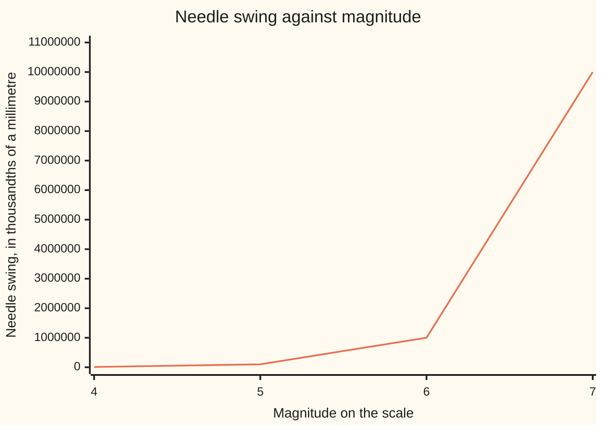

# Logarithms: the question 'what power got me here?'

[Syllabus](../../../SYLLABUS.md) → [Foundations](../../../SYLLABUS.md#w01) → [Powers, Roots and Logarithms](../../../SYLLABUS.md#w01-s03) → What a logarithm is

---

## General Overview

A magnitude 5 earthquake rattles windows. A magnitude 7 brings buildings down. On paper they sit two apart. The ground moves a hundred times as far.

The magnitude is not a measurement of the shaking. It is a count. A seismograph — the machine with the needle — measures the swing in thousandths of a millimetre, 100 km from the quake so every quake is scored the same way: 100,000 for a magnitude 5, 1,000,000 for a 6, 10,000,000 for a 7. Every step up the scale is another multiply by ten.

That count has a name: the **logarithm** of the swing — log, for short — to base 10, the base being the number doing the multiplying. Magnitude 7 says seven tens, multiplied together, got me to this swing.

**A logarithm is the answer to one question: how many of the base, multiplied together, got me to this number?**

### The picture: what the magnitude scale is hiding



The line is the swing. The steps along the bottom are all the same size; the line is flat, flat, then a cliff. The magnitude counts the tens instead of measuring the height.

---

## The formula

One fact, written two ways. Multiplying forwards, as [Exponents](01-exponents-and-powers.md) writes it:

**10 × 10 × 10 × 10 × 10 × 10 × 10 = 10,000,000**, which that card shortens to **10^7 = 10,000,000**

Asking the same thing backwards:

**the log base 10 of 10,000,000 is 7**, written down as **log10(10,000,000) = 7**

The 10 straight after "log" is the base, 10,000,000 is what you are reaching, 7 is the count. The power statement hands you the result; the log statement hands you the count.

| Piece | Plain meaning | In our earthquake | Push it up and the answer… |
| --- | --- | --- | --- |
| the base | the number multiplied over and over | 10, one step of magnitude | a bigger base gets there in fewer multiplies, so the log is smaller |
| the number inside | the number you are trying to reach | 10,000,000, the needle swing | in base 10, ten times bigger inside is one more on the log |
| the log | how many of the base it took | 7, the magnitude | this is the answer itself |

---

## Why it works

### Step 0: a multiplication repeated has a count buried in it

Ten thousand, a hundred thousand, ten million: each is a 1 with a run of zeros. Those zeros are the tens. Digging that count out is the whole job — a log is a counting question, not a new operation.

### Step 1: count the divisions down to 1

Undo the multiplying: divide by the base over and over, counting the divisions until you reach 1.

Ten million, divided by ten each time: 1,000,000 then 100,000 then 10,000 then 1,000 then 100 then 10 then 1.

Seven divisions. The log base 10 of 10,000,000 is 7: the magnitude of the quake that made that swing.

### Step 2: the road back has to agree

Multiply seven tens together and you land on 10,000,000 again. Powering and logging undo each other, the way halving undoes doubling.

### Step 3: the base does not have to be ten

Nothing above cared that the base was ten. Halve 32 until you reach 1: five halvings, so the log base 2 of 32 is 5. And 1 needs no multiplying at all, so the log of 1 is 0 whatever the base. Multiply the base by itself however you like and the answer stays positive — never 0, never negative. So 0 and negative numbers have no log.

Real quakes come with a decimal point: the swing is rarely a clean power of ten, so the count lands between two whole numbers. Reading those is [Log laws and log scales](06-log-laws-and-log-scales.md).

---

## Worked numbers, by hand

In thousandths of a millimetre throughout.

| Step | Arithmetic | Value |
| --- | --- | --- |
| the swing at magnitude 5 | 10 × 10 × 10 × 10 × 10 | 100,000 |
| one step up, magnitude 6 | 100,000 × 10 | 1,000,000 |
| one more, magnitude 7 | 1,000,000 × 10 | 10,000,000 |
| a 7 against a 6 | 10,000,000 ÷ 1,000,000 | 10 |
| a 7 against a 5 | 10,000,000 ÷ 100,000 | 100 |
| back to a magnitude | count the tens in 10,000,000 | **7** |
| a different base | halvings from 32 down to 1 | **5** |
| the empty case | 1 needed no multiplying | **0** |

A magnitude 7 swings the needle ten times as far as a 6, a hundred times as far as a 5.

### What breaks if you drop a piece

| Mistake | Comes out at | What went wrong |
| --- | --- | --- |
| Subtracting the magnitudes to compare them | 2 | the gap counts tens: the real ratio is 100 |
| Counting the digits of 10,000,000, not the tens | 8 | the leading 1 is a digit, not a multiply |
| Reading "log base 2 of 32" as 32 divided by 2 | 16 | a log counts divisions; it is not one division |

---

## Code, from first principles, and it actually runs

Nothing is imported. The swings become magnitudes the plain way: divide by ten, count the divisions. A second road multiplies that many tens back together, and three asserts hold the roads against each other.

### Python

```python
# Logarithms -- the check behind the card.  Nothing is imported.  A logarithm
# answers "what power got me here?".  Road one counts the divisions down to 1;
# road two multiplies back up and has to land on the same number.
QUAKES = [(4, 10000), (5, 100000), (6, 1000000), (7, 10000000)]
def log_by_dividing(base, x):        # divide by the base until 1, counting steps
    steps = 0
    while x > 1:
        assert x % base == 0, "not a whole power of that base"
        x //= base
        steps += 1
    return steps
def power(base, steps):              # the road back, the base multiplied by itself
    out = 1
    for _ in range(steps): out *= base
    return out
def row(name, value): print(f"{name:<37}{value:>9}")

for mag, swing in QUAKES:
    print(f"magnitude {mag}  needle swing {swing:>9}  log base 10 of it {log_by_dividing(10, swing)}")
print("dividing ten million by ten:", *(10000000 // power(10, s) for s in range(1, 8)))
row("a 7 against a 6", 10000000 // 1000000)
row("a 7 against a 5", 10000000 // 100000)
row("log base 10 of 1", log_by_dividing(10, 1))
row("log base 2 of 32", log_by_dividing(2, 32))
row("the road back, seven tens multiplied", power(10, 7))
print(f"the three mistakes come out at {7 - 5}, {log_by_dividing(10, 10000000) + 1} and {32 // 2}")
assert log_by_dividing(10, 10000000) == 7 and power(10, 7) == 10000000
assert power(10, log_by_dividing(10, 1000000)) == 1000000
assert log_by_dividing(2, 32) == 5 and log_by_dividing(10, 1) == 0
print("ALL CHECKS PASS")
```

**Ran 2026-09-06 on macOS, Python 3.14.6, standard library only. All checks passed. Output, pasted from the run:**

```
magnitude 4  needle swing     10000  log base 10 of it 4
magnitude 5  needle swing    100000  log base 10 of it 5
magnitude 6  needle swing   1000000  log base 10 of it 6
magnitude 7  needle swing  10000000  log base 10 of it 7
dividing ten million by ten: 1000000 100000 10000 1000 100 10 1
a 7 against a 6                             10
a 7 against a 5                            100
log base 10 of 1                             0
log base 2 of 32                             5
the road back, seven tens multiplied  10000000
the three mistakes come out at 2, 8 and 16
ALL CHECKS PASS
```

### Rust

Same numbers, same labels, built with `rustc --edition 2021 -O`.

```rust
// Logarithms -- the same check as the Python one, in Rust.  No crates.  A
// logarithm answers "what power got me here?".  Road one counts the divisions
// down to 1; road two multiplies back up to the same number.
const QUAKES: [(i64, i64); 4] = [(4, 10000), (5, 100000), (6, 1000000), (7, 10000000)];
fn log_by_dividing(base: i64, x: i64) -> i64 {   // divide by the base until 1
    let (mut x, mut steps) = (x, 0i64);
    while x > 1 {
        assert!(x % base == 0, "not a whole power of that base");
        x /= base;
        steps += 1;
    }
    steps
}
fn power(base: i64, steps: i64) -> i64 {         // the road back
    let mut out = 1i64;
    for _ in 0..steps { out *= base; }
    out
}
fn row(name: &str, value: i64) { println!("{:<37}{:>9}", name, value); }

fn main() {
    for (mag, swing) in QUAKES {
        println!("magnitude {}  needle swing {:>9}  log base 10 of it {}",
                 mag, swing, log_by_dividing(10, swing));
    }
    let mut chain = String::from("dividing ten million by ten:");
    for s in 1..8 { chain.push_str(&format!(" {}", 10000000 / power(10, s))); }
    println!("{}", chain);
    row("a 7 against a 6", 10000000 / 1000000);
    row("a 7 against a 5", 10000000 / 100000);
    row("log base 10 of 1", log_by_dividing(10, 1));
    row("log base 2 of 32", log_by_dividing(2, 32));
    row("the road back, seven tens multiplied", power(10, 7));
    println!("the three mistakes come out at {}, {} and {}",
             7 - 5, log_by_dividing(10, 10000000) + 1, 32 / 2);
    assert!(log_by_dividing(10, 10000000) == 7 && power(10, 7) == 10000000);
    assert!(power(10, log_by_dividing(10, 1000000)) == 1000000);
    assert!(log_by_dividing(2, 32) == 5 && log_by_dividing(10, 1) == 0);
    println!("ALL CHECKS PASS");
}
```

**Ran 2026-09-06 on macOS, rustc 1.98.1, no crates. All checks passed. Output, pasted from the run:**

```
magnitude 4  needle swing     10000  log base 10 of it 4
magnitude 5  needle swing    100000  log base 10 of it 5
magnitude 6  needle swing   1000000  log base 10 of it 6
magnitude 7  needle swing  10000000  log base 10 of it 7
dividing ten million by ten: 1000000 100000 10000 1000 100 10 1
a 7 against a 6                             10
a 7 against a 5                            100
log base 10 of 1                             0
log base 2 of 32                             5
the road back, seven tens multiplied  10000000
the three mistakes come out at 2, 8 and 16
ALL CHECKS PASS
```

The two outputs match line for line: whole numbers throughout, nothing to round.

> [!TIP]
> **Try changing**
> Guess first, then run it.
> - **Add a magnitude 8.** Put a swing of 100,000,000 in the list: one more zero, one more step on the scale, and the log comes out at 8.
> - **Ask for a swing that is not a whole power of ten.** Change one swing to 5,000,000. It divides cleanly down to 5 and stops there: 5 will not divide by ten, so the assert fires.

---

## The usual mistake

> [!warning]
> **Reading the magnitude as the amount of shaking.** A 7 is not "a bit worse" than a 5; it is a hundred times the swing. A log scale's number counts multiplies, not the size itself.
>
> - Mixing up which number gets multiplied. In "the log base 10 of 10,000,000 is 7", the ten is multiplied over and over and 7 is how many times. Swap those roles and every log is wrong.
> - Thinking a log shrinks a number. It renames it: ten million becomes 7 because 7 is how many tens it took.
> - Counting digits instead of multiplies. 10,000,000 has eight digits and a log of 7.

---

## Where you meet it in real life

- **Earthquake magnitude.** The Richter scale, and the moment magnitude scale that replaced it, are logs of a physical size — which is why the news numbers stay in single digits.
- **pH.** Acidity, in tens: each point is one ten, three points a thousand.
- **Decibels.** Loudness, in tens too, but ten decibels to a ten: 30 decibels is a thousandfold.
- **Writing a big number as a power of ten.** [Scientific notation](04-scientific-notation.md) splits a number into a small one times a power of ten; that power is this card's count.

> **Say it back**
> A logarithm answers one question: how many of the base, multiplied together, reach this number? Find it by dividing by the base until you hit 1 and counting the divisions. Check it by multiplying that many back up. On the earthquake scale the base is ten: magnitude 7 means seven tens multiplied, 10,000,000 units of swing, and a magnitude 5 is a hundred times weaker, not two units weaker.

---

## What this builds on

- [Exponents](01-exponents-and-powers.md): repeated multiplying, and the short way of writing it. A log is that count, asked for instead of given.
- [Roots](03-roots-and-fractional-exponents.md): the other way of undoing a power — a root hunts the base, a log hunts the count.

## Where this goes next

- [Log laws and log scales](06-log-laws-and-log-scales.md): what happens when you multiply two numbers and log the result, and how an axis marked 1, 10, 100 reads.

---

## Sources

Verified 6 Sep 2026; every link resolves.

- Richter, Charles F. "An Instrumental Earthquake Magnitude Scale." *Bulletin of the Seismological Society of America* 25, no. 1 (1935): 1–32. [doi:10.1785/BSSA0250010001](https://doi.org/10.1785/BSSA0250010001). Defined magnitude as the log of the needle swing.
- U.S. Geological Survey. [Magnitude Types](https://www.usgs.gov/programs/earthquake-hazards/magnitude-types). What each modern magnitude scale measures.
- Napier, John. *Mirifici Logarithmorum Canonis Descriptio*. Edinburgh, 1614. [Scanned copy, Internet Archive](https://archive.org/details/mirificilogarit00napi). The book that invented logs.
