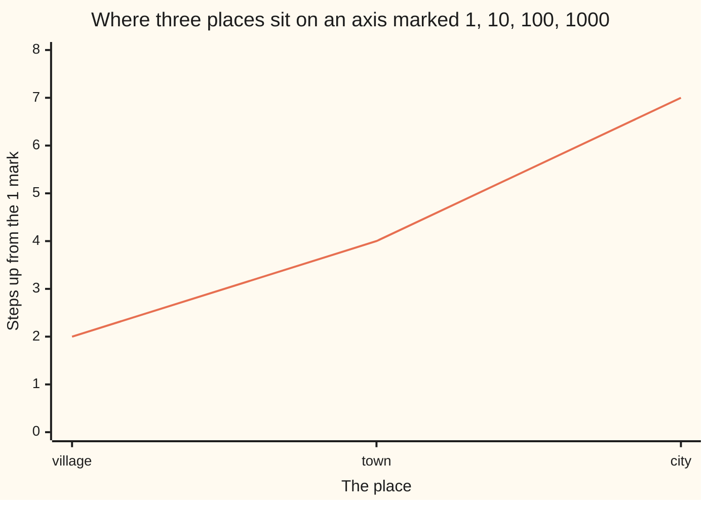

# Log laws and log scales: multiplication becomes addition, and how a 1-10-100 axis reads

[Syllabus](../../../SYLLABUS.md) → [Foundations](../README.md) → [Powers, Roots and Logarithms](../README.md#s03) → Log laws and log scales

---

## General Overview

Three places on one chart. A village of 100 people, a town of 10,000, a city of 10,000,000.

On an ordinary axis — every centimetre worth the same number of people — the city eats the page and the other two flatten onto the floor, reading as zero.

So mark it differently: 1 at the bottom, then 10, 100, 1,000, each mark ten times the one below. That is a **log scale** — an axis where a fixed distance means a fixed multiply, not a fixed amount. Steps up from the 1: village two, town four, city seven — the logarithms from [Logarithms](05-logarithms.md), turned into distances.

**On a log scale, distance is a count of tens — so multiplying two numbers only adds their distances.**

### The picture: where each place lands



The line is the step count: village to town two steps, town to city three. On an ordinary axis the first gap would vanish.

---

## The formula

**log10(x)** is the count: how many tens multiplied make x. The log law, for multiplying:

**log10(100 × 10,000) = log10(100) + log10(10,000)**, that is **2 + 4 = 6**

The plain way agrees: 100 × 10,000 = 1,000,000, six tens.

**Read it aloud: the count of a product is the sum of the counts.** Dividing subtracts: **log10(10,000,000 ÷ 100) = 7 − 2 = 5**, and 10,000,000 ÷ 100 = 100,000. A number times itself repeats the addition: **log10(10,000 × 10,000) = 4 + 4 = 8**; three of them, 3 × 4 = 12. That is the power law.

Change of base, for counting in bigger steps:

**log100(1,000,000) = log10(1,000,000) ÷ log10(100) = 6 ÷ 2 = 3**

Said aloud: divide by how many tens one step is worth.

| Piece | Plain meaning | In our chart | Push it up and the answer… |
| --- | --- | --- | --- |
| the base | the number multiplied over and over | 10, one mark to the next | fewer steps, smaller counts |
| the count, or log | how many of the base reach a number | 2, 4 and 7 | one more is ten times the people |
| a mark on the axis | one step, a multiply by ten | 1, 10, 100, 1,000 | — spacing only, the multiply stays ten |

---

## Why it works

### Step 0: a count of tens is a length

The village is 10 × 10, the town 10 × 10 × 10 × 10. Every number on this axis is a run of tens, and its position is the length of that run.

### Step 1: multiplying joins two runs end to end

Village times town: (10 × 10) × (10 × 10 × 10 × 10). Six tens in a row, so 1,000,000, count 6. Counts 2 and 4, end to end, make 6.

### Step 2: dividing takes a run back out

City over village strikes two tens off a run of seven. Five are left: 100,000, so 7 − 2 = 5.

### Step 3: changing the base is changing the ruler

Count in villages — steps of 100. A village is two tens, so every village-step swallows two ten-steps and a count in tens halves. That 1,000,000 was 6 tens; in villages, 6 ÷ 2 = 3, and 100 × 100 × 100 = 1,000,000.

### Step 4: the count need not be whole

The city is 7 tens, so in villages it is 7 ÷ 2 = 3.5 — a real position, halfway between two marks. What sits halfway between the 100 and 10,000 marks? Counts 2 and 4, middle count 3: the **1,000** mark, not 5,050. A number that is no power of ten reads the same way: 3,000 sits just past the 1,000 mark, count about 3.5.

<details>
<summary>Why anyone printed tables of these</summary>

Henry Briggs printed the count for tens of thousands of numbers: look up two, add them, look the answer back up. A slide rule is that table on sticks.

</details>

---

## Worked numbers, by hand

In people.

| Step | Arithmetic | Value |
| --- | --- | --- |
| the village's count | tens in 100 | 2 |
| the town's count | tens in 10,000 | 4 |
| the city's count | tens in 10,000,000 | 7 |
| village times town | 100 × 10,000 = 1,000,000, counted | 6 |
| the same by adding | 2 + 4 | **6** |
| city over village | 10,000,000 ÷ 100 = 100,000, counted | 5 |
| the same by subtracting | 7 − 2 | **5** |
| the town squared | 10,000 × 10,000, counted, or 4 + 4 | **8** |
| that product, in villages | 6 ÷ 2 | **3** |
| the city, in villages | 7 ÷ 2 | **3.5** |
| halfway from 100 to 10,000 | count (2 + 4) ÷ 2 | **1,000** |

Two populations multiplied by landing 6 steps along the axis, and nothing bigger than a single ten got multiplied.

### What breaks if you drop a piece

| Mistake | Comes out at | What went wrong |
| --- | --- | --- |
| Adding the populations, not the counts | 10,100 | the law adds counts, not sizes |
| Reading the axis middle as an average | 5,050 | halfway is the 1,000 mark |
| Multiplying the counts, not adding | 8 | eight tens, not six — that is the town squared |

---

## Code, from first principles, and it actually runs

Nothing is imported. Road one multiplies the populations and counts the tens. Road two only adds and subtracts counts. Four asserts hold them together.

### Python

```python
# Log laws and log scales -- the check behind the card.  Nothing is imported.  A
# village of 100, a town of 10,000, a city of 10,000,000, on a 1-10-100 axis.
VILLAGE, TOWN, CITY = 100, 10000, 10000000
def count_of_tens(x):                 # divide by ten until 1, counting the steps
    steps = 0
    while x > 1:
        assert x % 10 == 0, "not a whole power of ten"; x //= 10; steps += 1
    return steps
def tens_back(steps):                 # the road back: that many tens multiplied
    out = 1
    for _ in range(steps): out *= 10
    return out
for name, size in (("village", VILLAGE), ("town", TOWN), ("city", CITY)):
    print(f"{name:<9}{size:>9}   its count {count_of_tens(size)}")
v, t, c = count_of_tens(VILLAGE), count_of_tens(TOWN), count_of_tens(CITY)
product, quotient, square = VILLAGE * TOWN, CITY // VILLAGE, TOWN * TOWN   # the plain way
half = count_of_tens(product) // v                        # 6 / 2, the count in hundreds
mid, rem = divmod(v + t, 2); assert rem == 0, "halfway is not a whole count"  # the halfway mark
print(f"village x town     {VILLAGE} x {TOWN} = {product:<9}count {count_of_tens(product)}")
print(f"the counts added instead     {v} + {t} = {v + t}")
print(f"city / village     {CITY} / {VILLAGE} = {quotient:<7}count {count_of_tens(quotient)}")
print(f"the counts subtracted        {c} - {v} = {c - v}")
print(f"town squared       {TOWN} x {TOWN} = {square:<10}count {count_of_tens(square)} = {t} + {t}")
print(f"in villages   the product {count_of_tens(product)} / {v} = {half}, the city {c} / {v} = {c / v}")
print(f"halfway from {VILLAGE} to {TOWN}    count {mid}, the {tens_back(mid)} mark")
print(f"the three mistakes come out at {VILLAGE + TOWN}, {(VILLAGE + TOWN) // 2} and {v * t}")
assert product == 1000000 and count_of_tens(product) == v + t and count_of_tens(square) == 2 * t
assert quotient == 100000 and count_of_tens(quotient) == c - v and square == 100000000
assert half == 3 and VILLAGE * VILLAGE * VILLAGE == product and tens_back(mid) == 1000
print("ALL CHECKS PASS")
```

**Ran 2026-09-06 on macOS, Python 3.14.6, standard library only. All checks passed. Output, pasted from the run:**

```
village        100   its count 2
town         10000   its count 4
city      10000000   its count 7
village x town     100 x 10000 = 1000000  count 6
the counts added instead     2 + 4 = 6
city / village     10000000 / 100 = 100000 count 5
the counts subtracted        7 - 2 = 5
town squared       10000 x 10000 = 100000000 count 8 = 4 + 4
in villages   the product 6 / 2 = 3, the city 7 / 2 = 3.5
halfway from 100 to 10000    count 3, the 1000 mark
the three mistakes come out at 10100, 5050 and 8
ALL CHECKS PASS
```

### Rust

Same numbers, built with `rustc --edition 2021 -O`.

```rust
// Log laws and log scales -- the same check as the Python one, in Rust.  No crates.
// A village of 100, a town of 10,000, a city of 10,000,000, on a 1-10-100 axis.
const VILLAGE: i64 = 100;
const TOWN: i64 = 10000;
const CITY: i64 = 10000000;
fn count_of_tens(x: i64) -> i64 {          // divide by ten until 1, counting the steps
    let (mut x, mut steps) = (x, 0i64);
    while x > 1 {
        assert!(x % 10 == 0, "not a whole power of ten"); x /= 10; steps += 1;
    }
    steps
}
fn tens_back(steps: i64) -> i64 {          // the road back: that many tens multiplied
    let mut out = 1i64;
    for _ in 0..steps { out *= 10; }
    out
}
fn main() {
    for (name, size) in [("village", VILLAGE), ("town", TOWN), ("city", CITY)] {
        println!("{:<9}{:>9}   its count {}", name, size, count_of_tens(size));
    }
    let (v, t, c) = (count_of_tens(VILLAGE), count_of_tens(TOWN), count_of_tens(CITY));
    let (product, quotient, square) = (VILLAGE * TOWN, CITY / VILLAGE, TOWN * TOWN); // the plain way
    let half = count_of_tens(product) / v;                       // 6 / 2, the count in hundreds
    let (mid, rem) = ((v + t) / 2, (v + t) % 2); assert!(rem == 0, "halfway is not a whole count");
    println!("village x town     {} x {} = {:<9}count {}", VILLAGE, TOWN, product, count_of_tens(product));
    println!("the counts added instead     {} + {} = {}", v, t, v + t);
    println!("city / village     {} / {} = {:<7}count {}", CITY, VILLAGE, quotient, count_of_tens(quotient));
    println!("the counts subtracted        {} - {} = {}", c, v, c - v);
    println!("town squared       {} x {} = {:<10}count {} = {} + {}", TOWN, TOWN, square, count_of_tens(square), t, t);
    println!("in villages   the product {} / {} = {}, the city {} / {} = {}", count_of_tens(product), v, half, c, v, c as f64 / v as f64);
    println!("halfway from {} to {}    count {}, the {} mark", VILLAGE, TOWN, mid, tens_back(mid));
    println!("the three mistakes come out at {}, {} and {}", VILLAGE + TOWN, (VILLAGE + TOWN) / 2, v * t);
    assert!(product == 1000000 && count_of_tens(product) == v + t && count_of_tens(square) == 2 * t);
    assert!(quotient == 100000 && count_of_tens(quotient) == c - v && square == 100000000);
    assert!(half == 3 && VILLAGE * VILLAGE * VILLAGE == product && tens_back(mid) == 1000);
    println!("ALL CHECKS PASS");
}
```

**Ran 2026-09-06 on macOS, rustc 1.98.1, no crates. All checks passed. Output, pasted from the run:**

```
village        100   its count 2
town         10000   its count 4
city      10000000   its count 7
village x town     100 x 10000 = 1000000  count 6
the counts added instead     2 + 4 = 6
city / village     10000000 / 100 = 100000 count 5
the counts subtracted        7 - 2 = 5
town squared       10000 x 10000 = 100000000 count 8 = 4 + 4
in villages   the product 6 / 2 = 3, the city 7 / 2 = 3.5
halfway from 100 to 10000    count 3, the 1000 mark
the three mistakes come out at 10100, 5050 and 8
ALL CHECKS PASS
```

The two outputs match line for line; the fraction 3.5 is exact.

> [!TIP]
> **Try changing**
> Guess first, then run it.
> - **Grow the town tenfold, to 100000.** Its count prints as 5, then the run stops: 2 and 5 make 7, and half of 7 is no mark on the axis.
> - **Give the village 500 people.** Not a whole run of tens, so the counting routine trips its own assert.

---

## The usual mistake

> [!warning]
> **Reading a log axis as if the gaps were amounts.** Village to town is two marks, and 1 to 100 is the same two marks — but one gap is 9,900 people and the other 99. Equal distances mean equal multiplies.
>
> - Averaging the ends: the middle of the 100 and 10,000 marks is 1,000, not 5,050.
> - Splitting the log of a sum. The law covers products only, and 100 + 10,000 is 10,100.
> - Missing that a chart is on a log axis. A straight rising line there is a steady multiply, not steady growth.

---

## Where you meet it in real life

- **Any chart with 1, 10, 100, 1,000 up the side.** Case counts, incomes, file sizes: the data spans several multiplies.
- **Slide rules and log tables.** Two lengths added is two numbers multiplied; they built bridges until the 1970s.
- **Scales you already read this way.** Earthquake magnitude, decibels and pH, met in [Logarithms](05-logarithms.md) — each a count of multiplies in plain clothes.

> **Say it back**
> A village of 100, a town of 10,000 and a city of 10,000,000 have counts of 2, 4 and 7 tens. Multiply two populations and the counts add: 2 + 4 = 6, and 100 × 10,000 really is 1,000,000. Divide and they subtract: 7 − 2 = 5. Square and the count doubles: 4 + 4 = 8. To count in bigger steps, divide by how many tens one step is worth: 1,000,000 is three village-steps, 100 × 100 × 100. Equal distances on the axis are equal multiplies, so halfway from 100 to 10,000 is 1,000, not 5,050.

---

## What this builds on

- [Logarithms](05-logarithms.md): the count itself — how many of the base, multiplied together, reach a number. Here two of them are multiplied and their counts add.

## Where this goes next

- [Natural log and doubling time](../04-Compound%20Growth%20and%20Discounting/05-natural-log-and-doubling-time.md): the base growth picks for itself, and the log law turned into a time.

---

## Sources

Verified 6 Sep 2026; every link resolves.

- Briggs, Henry. *Arithmetica Logarithmica*. London, 1624. [Internet Archive](https://archive.org/details/arithmeticalogar00brig). The base-10 tables that turned multiplying into adding.
- Dehaene, Stanislas, Véronique Izard, Elizabeth Spelke, and Pierre Pica. "Log or Linear?" *Science* 320 (2008): 1217–1220. [PubMed Central](https://pmc.ncbi.nlm.nih.gov/articles/PMC2610411/). Spacing by multiplies is the older instinct.
- Tufte, Edward R. *The Visual Display of Quantitative Information*. 2nd ed. Graphics Press, 2001. [Publisher page](https://www.edwardtufte.com/book/the-visual-display-of-quantitative-information/). What an axis promises its reader.
