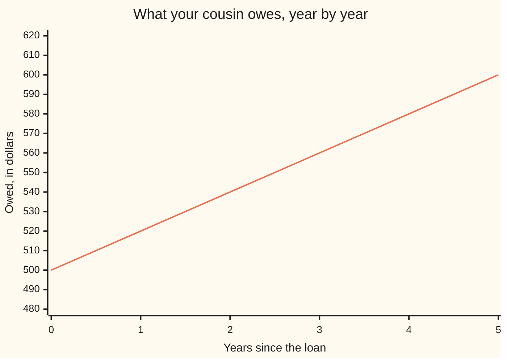

# Simple interest: the same $20 every year, a straight line

[Syllabus](../../../SYLLABUS.md) → [Foundations](../README.md) → [Compound Growth and Discounting](../README.md#s04) → Simple interest

---

## General Overview

Your cousin asks to borrow $500. You say yes, at 4% a year, on **simple interest**: the charge is worked out on the $500 you handed over, and on nothing else, ever.

4% of $500 is $20.00. So the debt grows by $20.00 in the first year, $20.00 in the second, $20.00 in the fifth. The $500 never changes, so the $20.00 never changes either. After five years the interest adds up to $100.00 and your cousin owes you $600.00.

The $500 has a name: the **principal**, the money actually handed over, as opposed to the interest stacked on top of it. Simple interest is the deal where the percent is only ever taken of the principal.

**The same amount is added every year, so the balance climbs in equal steps — a straight line.**

### The picture: what your cousin owes



The line is the balance owed; the axis starts at $480 so the steps show. Each year adds the same $20.00, so the points land on a straight line. Interest that earned interest would bend upward — [Compound interest](03-compound-interest.md).

---

## The formula

The deal, written as numbers:

**one year's interest = 500.00 × 0.04 = 20.00**

**five years' interest = 500.00 × 0.04 × 5 = 100.00**

**to repay = 500.00 + 100.00 = 600.00**

**Read it aloud:** the money lent, times the rate as a decimal, times the years, is the interest — add the money lent back on and that is the bill.

The standard form, the one you will meet elsewhere: interest = principal × rate × years.

| Piece | Plain meaning | In our example | Push it up and the answer… |
| --- | --- | --- | --- |
| the principal | the money actually handed over, once | $500.00 | lend twice as much, earn twice the interest |
| the rate | the percent charged per year, as a decimal | 0.04 | double it and every year's charge doubles |
| the years | how long the money stays out | 5 | each extra year adds one more $20.00 |
| the interest | the charge for use of the money, added up | $100.00 | rises in step with all three above |
| the total to repay | principal plus interest | $600.00 | rises with all three above too |

4% means four per hundred, which as a decimal is 0.04 — the move made on [Growth factors](01-growth-factors.md).

---

## Why it works

### The percent never leaves the $500

Interest is rent on money. Simple interest sets the rent on the thing that was lent — the $500 — and leaves it there. Year three ignores the interest on the books, because that interest was never handed over. So the yearly charge is 500.00 × 0.04 = 20.00, every single year.

### Adding the same thing five times is multiplying by five

Five years of the deal is $20.00 owed, five times over. Adding one fixed amount over and over is what multiplying is, so the total is 20.00 × 5 = 100.00. Swap the $20.00 back for 500.00 × 0.04 and it is 500.00 × 0.04 × 5 = 100.00 in one move. Two roads, one $100.00; the code drives both.

### That is exactly what makes it a straight line

A straight line is the shape of equal steps: the same rise for every step sideways. The step here is $20.00 a year, unchanging, so the balance walks 500.00, 520.00, 540.00, 560.00, 580.00, 600.00 — a line. Equal-step growth has a name: [Linear versus exponential growth](../03-Powers%2C%20Roots%20and%20Logarithms/02-linear-vs-exponential-growth.md).

Let each year's interest join the principal and start earning, and the step stops being equal, so the shape stops being a line. That is [Compound interest](03-compound-interest.md).

---

## Worked numbers, by hand

The cousin loan, in dollars to 2 decimal places. Nothing in this table needs rounding; every figure lands on the cent.

| Step | Arithmetic | Value |
| --- | --- | --- |
| the rate, as a decimal | 4 ÷ 100 | 0.04 |
| one year's interest | 500.00 × 0.04 | 20.00 |
| after year 1 | 500.00 + 20.00 | 520.00 |
| after year 2 | 520.00 + 20.00 | 540.00 |
| after year 3 | 540.00 + 20.00 | 560.00 |
| after year 4 | 560.00 + 20.00 | 580.00 |
| after year 5 | 580.00 + 20.00 | 600.00 |
| the same, in one move | 500.00 + 500.00 × 0.04 × 5 | **600.00** |

Your cousin hands back $600.00: the $500.00 you lent, plus $100.00 for five years of having it.

### What breaks if you drop a piece

| Mistake | Comes out at | What went wrong |
| --- | --- | --- |
| Charging on the balance, not the principal | $608.33 | The interest started earning interest: a different deal. |
| Using 4 where the rate belongs | $10500.00 | The percent was never turned into a decimal. |
| Asking only for the interest | $100.00 | The principal comes home too. |

Both scripts print all three.

---

## Code, from first principles, and it actually runs

Nothing is imported. The loan is worked twice — once by walking the five years and adding $20.00 each time, once by the one-move formula — and the two answers have to agree. The wrong answers above are printed too, so the card cannot quietly disagree with itself.

### Python

```python
# Simple interest -- the check behind the card.  Nothing is imported.  $500
# lent to a cousin at 4% a year, simple interest, for five years.  Two roads:
# the one-line formula, and adding the same $20.00 on five times.
principal, rate, years = 500.00, 0.04, 5

def row(name, value):
    print(f"{name:<38}{'$' + format(value, '.2f'):>10}")

per_year = principal * rate                      # the same $20.00 every year
balance, steps = principal, [principal]
for _ in range(years):                           # road 1: add it on, year by year
    balance = balance + per_year
    steps.append(balance)
by_formula = principal * rate * years            # road 2: straight to the total
compound, wrong_rate = principal, principal + principal * 4 * years
for _ in range(years):
    compound = compound * (1 + rate)             # the mistake: interest on interest
row("principal lent to the cousin", principal)
row("interest each year, 500.00 x 0.04", per_year)
print(f"{'balance, years 0 to 5':<38}" + " ".join(f"${b:.2f}" for b in steps))
row("interest after five years, added up", balance - principal)
row("the same by principal x rate x years", by_formula)
row("step from each year to the next", steps[1] - steps[0])
row("to repay after five years", balance)
row("if the interest earned interest", compound)
row("if 4% were read as 4", wrong_rate)
assert abs(per_year - 20.00) < 1e-9 and abs(balance - 600.00) < 1e-9
assert abs(by_formula - 100.00) < 1e-9 and abs(balance - principal - by_formula) < 1e-9
assert all(abs(b - (500.00 + 20.00 * i)) < 1e-9 for i, b in enumerate(steps))
print("ALL CHECKS PASS")
```

**Ran 2026-09-06 on macOS, Python 3.14.6, standard library only. All checks passed. Output, pasted from the run:**

```
principal lent to the cousin             $500.00
interest each year, 500.00 x 0.04         $20.00
balance, years 0 to 5                 $500.00 $520.00 $540.00 $560.00 $580.00 $600.00
interest after five years, added up      $100.00
the same by principal x rate x years     $100.00
step from each year to the next           $20.00
to repay after five years                $600.00
if the interest earned interest          $608.33
if 4% were read as 4                   $10500.00
ALL CHECKS PASS
```

### Rust

Same numbers, same labels, built with `rustc --edition 2021 -O`.

```rust
// Simple interest -- the same check as simple_interest_check.py, in Rust.  No
// crates.  $500 lent to a cousin at 4% a year, simple interest, five years.
// Two roads: the one-line formula, and adding the same $20.00 on five times.
fn row(name: &str, value: f64) {
    println!("{:<38}{:>10}", name, format!("${:.2}", value));
}

fn main() {
    let (principal, rate, years) = (500.00f64, 0.04f64, 5);
    let per_year = principal * rate;                 // the same $20.00 every year
    let mut balance = principal;
    let mut steps = vec![principal];
    for _ in 0..years {                              // road 1: add it on, year by year
        balance = balance + per_year;
        steps.push(balance);
    }
    let by_formula = principal * rate * years as f64;   // road 2: straight to the total
    let wrong_rate = principal + principal * 4.0 * years as f64;
    let mut compound = principal;
    for _ in 0..years {
        compound = compound * (1.0 + rate);          // the mistake: interest on interest
    }
    row("principal lent to the cousin", principal);
    row("interest each year, 500.00 x 0.04", per_year);
    let cells: Vec<String> = steps.iter().map(|b| format!("${:.2}", b)).collect();
    println!("{:<38}{}", "balance, years 0 to 5", cells.join(" "));
    row("interest after five years, added up", balance - principal);
    row("the same by principal x rate x years", by_formula);
    row("step from each year to the next", steps[1] - steps[0]);
    row("to repay after five years", balance);
    row("if the interest earned interest", compound);
    row("if 4% were read as 4", wrong_rate);
    assert!((per_year - 20.00).abs() < 1e-9 && (balance - 600.00).abs() < 1e-9);
    assert!((by_formula - 100.00).abs() < 1e-9 && (balance - principal - by_formula).abs() < 1e-9);
    for (i, b) in steps.iter().enumerate() {
        assert!((b - (500.00 + 20.00 * i as f64)).abs() < 1e-9);
    }
    println!("ALL CHECKS PASS");
}
```

**Ran 2026-09-06 on macOS, rustc 1.98.1, no crates. All checks passed. Output, pasted from the run:**

```
principal lent to the cousin             $500.00
interest each year, 500.00 x 0.04         $20.00
balance, years 0 to 5                 $500.00 $520.00 $540.00 $560.00 $580.00 $600.00
interest after five years, added up      $100.00
the same by principal x rate x years     $100.00
step from each year to the next           $20.00
to repay after five years                $600.00
if the interest earned interest          $608.33
if 4% were read as 4                   $10500.00
ALL CHECKS PASS
```

The two outputs match line for line.

> [!TIP]
> **Try changing**
> Guess first, then run it. The asserts are pinned to the cousin's numbers, so expect one to fire.
> - **Let the interest earn interest.** In the year-by-year loop, multiply the balance by 1 plus the rate instead of adding the fixed charge. The steps stop being equal, the bill climbs to the $608.33 row, and the first assert fires: the balance is no longer $600.00.
> - **Take the percent sign literally.** Set the rate to 4, not 0.04. Every charge is a hundred times too big, the bill becomes the $10500.00 row, and the first assert fires.

---

## The usual mistake

> [!warning]
> **Assuming that interest, once charged, starts earning.** It does on a savings account and a credit card. Not here. Simple interest pins the charge to the money actually lent, so the fifth year costs the same $20.00 as the first. Run the loan the other way and the bill is $608.33, not $600.00 — small over five years, enormous over thirty.
>
>
> - Leaving the percent as 4 instead of 0.04. The loan comes back at $10500.00.
> - Quoting the interest as the bill. $100.00 is what the loan cost; $600.00 is what gets handed over.
> - Mixing units: a rate per year, a term in months. Both must be on the same clock before they multiply.

---

## Where you meet it in real life

- **Car loans.** Mostly simple interest: the charge never earns interest, and the same rule is applied to the part of the loan still unpaid, which is why paying early saves money.
- **A late invoice.** A flat percent per month, charged on the overdue bill itself and not on the penalties already added.
- **Money lent between people.** The cousin deal. Unless somebody says compound, this is what both of you have in mind — and it is the wrong model for a bank account: [Compound interest](03-compound-interest.md).

> **Say it back**
> Simple interest charges the percent on the money actually lent, never on the interest. $500 at 4% earns $20.00 a year, the same $20.00 each time. Five years of that is $100.00, so your cousin repays $600.00. The same amount added each year means equal steps, which plot as a straight line. Let the interest earn interest and it becomes $608.33, and a curve.

---

## What this builds on

- [Growth factors](01-growth-factors.md): turning 4% into the decimal 0.04 you multiply by.
- [Linear versus exponential growth](../03-Powers%2C%20Roots%20and%20Logarithms/02-linear-vs-exponential-growth.md): the shape of equal steps, which is what this balance is.

## Where this goes next

- [Compound interest](03-compound-interest.md): what happens when each year's interest joins the principal and earns too. It runs its own example, a savings account.

---

## Sources

Verified 6 Sep 2026 in a browser: every link below resolves to the publisher's page.

- Consumer Financial Protection Bureau. *Auto loans*. [consumerfinance.gov](https://www.consumerfinance.gov/consumer-tools/auto-loans/). The US regulator on loans priced against the outstanding principal.
- U.S. Securities and Exchange Commission. *Interest*, Investor.gov glossary. [investor.gov](https://www.investor.gov/introduction-investing/investing-basics/glossary/interest). The regulator's definition of interest.
- U.S. Securities and Exchange Commission. *Compound Interest Calculator*. [investor.gov](https://www.investor.gov/financial-tools-calculators/calculators/compound-interest-calculator). The contrast: what happens once the interest earns.
