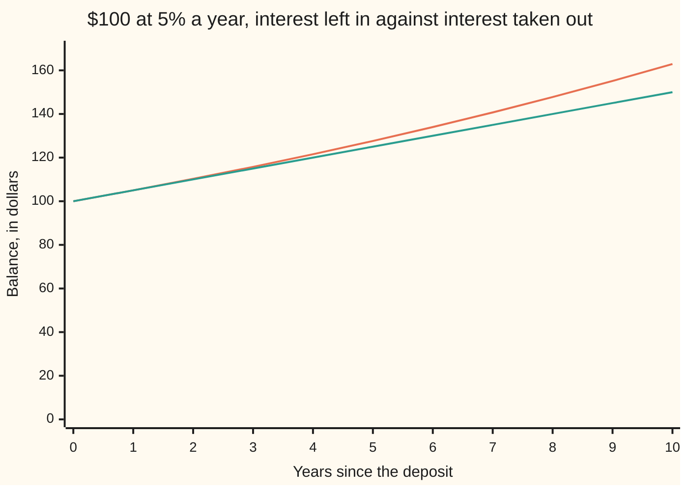

# Compound interest: interest that earns interest

Foundations → Compound Growth and Discounting → Interest → Compound interest

---

## General Overview

You put $100 into a savings account on 1 January. The bank pays 5% a year. You then do nothing: no deposits, no withdrawals, and every payment of interest left in.

End of year one, the balance is $105.00. End of year two, $110.25 — not $110.00. Those extra 25 cents are 5% of the $5 the account earned last year. The interest earned interest.

Ten years in, the balance is $162.89. Had you taken each $5 out and spent it, you would hold $150.00.

**Leave the interest in and each year's 5% is paid on a bigger balance, so the money does not climb by a fixed step — it multiplies.**

### The picture: ten years, two accounts



The bending line is the interest left in. The straight line is the same 5% taken out each year — simple interest, [simple-interest](02-simple-interest.md). They agree for one year, then separate.

---

## The formula

There is one multiply per year, and that is the whole rule:

**$100.00 × 1.05 × 1.05 × 1.05 … ten 1.05s in all … = $162.89**

1.05 is the growth factor for a 5% rise: keep the whole amount, add 5% of it, and you have multiplied by 1.05 ([growth-factors](01-growth-factors.md)). One year is one multiply, so ten years is ten of them.

Ten 1.05s in a row is written 1.05^10, the raised number counting the multiplies ([exponents-and-powers](../03-Powers%2C%20Roots%20and%20Logarithms/01-exponents-and-powers.md)):

**$100.00 × 1.05^10 = $162.89**

Put letters where the numbers are and you have the compound interest formula, the shape you meet everywhere else:

**A = P × (1 + r)^n**

**Read it aloud:** the money you started with, multiplied by the growth factor once for every year it sat there.

| Symbol | Piece | Plain meaning | In our account | Push it up and the answer… |
| --- | --- | --- | --- | --- |
| P | the starting amount | the money you put in and left | $100.00 | every later balance scales with it |
| r | the yearly rate | the percent, written as a decimal | 0.05 | the curve climbs faster and bends harder |
| 1 + r | the growth factor | the multiplier for one year | 1.05 | — |
| n | the years | how many times the factor is multiplied in | 10 | the gap over the straight line widens |
| A | the balance | what is in the account at the end | $162.89 | — |

---

## Why it works

### The interest joins the balance

In year one the bank works out 5% of $100.00 and pays $5.00. In year two it works out 5% of what is actually there: $105.00, so it pays $5.25. Last year's $5 is no longer a payment you received. It is money in the account, and money in the account earns.

That is the only difference from simple interest ([simple-interest](02-simple-interest.md)): there the $5 leaves and the bank keeps returning to the original $100.00. Here the base grows.

### The gain grows because the balance grew

Year one pays $5.00. Year two, $5.25. Year three, $5.51. Year ten, $7.76. The rate never moved: 5% every year. The payment rose because the balance it is taken from rose.

A fixed step against time draws a straight line. A step that grows with the balance tilts up a little more each year. That is the bend.

### Ten years is ten multiplies, not one

The gap after ten years is $12.89: $162.89 against $150.00. Small, on purpose. At ordinary rates over ordinary spans compounding is not dramatic — it is quietly relentless, and it never stops widening.

<details>
<summary>Why you can chop the ten years anywhere</summary>

Multiplication does not care about grouping. Five years reaches $127.63; apply that same growth twice and you have the ten-year growth, which is the third thing the code checks.

</details>

---

## Worked numbers, by hand

The account, to the cent.

| Step | Arithmetic | Value |
| --- | --- | --- |
| year 1 | 100.00 × 1.05 | 105.00 |
| year 2 | 105.00 × 1.05 | 110.25 |
| year 3 | 110.25 × 1.05 | 115.76 |
| year 5 | two more of the same | 127.63 |
| year 9 | four more years again | 155.13 |
| year 10 | 155.13 × 1.05 | **162.89** |
| the same ten years, simple | 100.00 + 10 × 5.00 | **150.00** |
| the gap | 162.89 − 150.00 | **12.89** |

Ten years of doing nothing turned $100.00 into $162.89; $12.89 of it is interest on interest.

### What breaks if you drop a piece

| Mistake | Comes out at | What went wrong |
| --- | --- | --- |
| Taking the interest out every year | 150.00 | The bank keeps returning to the first $100.00 |
| Multiplying by 1.05 once for the whole decade | 105.00 | That is one year of interest, not ten |
| Reading a 5% rise then a 5% fall as break-even | 99.75 | The fall is taken on the larger balance |

The code prints all three.

---

## Code, from first principles, and it actually runs

Nothing is imported. The account is stepped forward a year at a time: multiply by 1.05. A second road reaches the same balance with whole numbers only — 105 multiplied by itself ten times, then divided down — so no rounding can hide in it. A third check squares the five-year growth.

### Python

```python
# Compound interest -- the check behind the card.  Nothing is imported.  $100
# in a savings account paying 5% a year, the interest left in.  Dollars are
# rounded to the cent for printing only; the running balance is kept in full.
YEARS, START, RATE = 10, 100.0, 0.05

comp, simp = [START], [START]                 # year 0: $100 in each account
for _ in range(YEARS):                        # one road: a year at a time
    comp.append(comp[-1] * (1 + RATE))        # 5% of the balance, left in
    simp.append(simp[-1] + START * RATE)      # 5% of the first $100, taken out

def grid(name, values): print(f"{name:<32}" + "".join(f"{v:>7}" for v in values))
def one(name, value): print(f"{name:<44}{value:>10}")

grid("year", list(range(YEARS + 1)))
grid("compound, interest left in", [f"{v:.2f}" for v in comp])
grid("simple, interest taken out", [f"{v:.2f}" for v in simp])
print(f"interest earned in years 1, 2, 3 and 10: {comp[1] - comp[0]:.2f}, "
      f"{comp[2] - comp[1]:.2f}, {comp[3] - comp[2]:.2f} and {comp[10] - comp[9]:.2f}")
one("after ten years, interest left in", f"{comp[10]:.2f}")
one("after ten years, interest taken out", f"{simp[10]:.2f}")
one("the gap", f"{comp[10] - simp[10]:.2f}")
exact = 105 ** YEARS                          # second road: whole numbers only
cents = (exact + 5 * 10 ** 15) // 10 ** 16    # $100 x 105^10 / 100^10, to the cent
one("the same balance, from whole numbers", f"{cents // 100}.{cents % 100:02d}")
print(f"the three mistakes come out at {simp[10]:.2f}, "
      f"{START * (1 + RATE):.2f} and {START * (1 + RATE) * 0.95:.2f}")
assert cents == 16289 and round(comp[10] * 100) == cents and len(comp) == len(simp) == YEARS + 1
assert abs(comp[5] * comp[5] / START - comp[10]) < 1e-9   # five years, then squared
assert simp[10] == 150.0 and round((comp[10] - simp[10]) * 100) == 1289
print("ALL CHECKS PASS")
```

**Ran 2026-09-06 on macOS, Python 3.14.6, standard library only. All checks passed. Output, pasted from the run:**

```
year                                  0      1      2      3      4      5      6      7      8      9     10
compound, interest left in       100.00 105.00 110.25 115.76 121.55 127.63 134.01 140.71 147.75 155.13 162.89
simple, interest taken out       100.00 105.00 110.00 115.00 120.00 125.00 130.00 135.00 140.00 145.00 150.00
interest earned in years 1, 2, 3 and 10: 5.00, 5.25, 5.51 and 7.76
after ten years, interest left in               162.89
after ten years, interest taken out             150.00
the gap                                          12.89
the same balance, from whole numbers            162.89
the three mistakes come out at 150.00, 105.00 and 99.75
ALL CHECKS PASS
```

### Rust

Same numbers, same labels, built with `rustc --edition 2021 -O`.

```rust
// Compound interest -- the same check as the Python, in Rust.  No crates.  $100
// in a savings account paying 5% a year, the interest left in.  Dollars are
// rounded to the cent for printing only; the running balance is kept in full.
const YEARS: usize = 10;
const START: f64 = 100.0;
const RATE: f64 = 0.05;
fn grid(name: &str, values: &[String]) {
    let mut line = format!("{:<32}", name);
    for v in values { line.push_str(&format!("{:>7}", v)); }
    println!("{}", line);
}
fn one(name: &str, value: String) { println!("{:<44}{:>10}", name, value); }
fn main() {
    let (mut comp, mut simp) = (vec![START], vec![START]);   // year 0: $100 each
    for _ in 0..YEARS {                                      // one road: a year at a time
        comp.push(comp[comp.len() - 1] * (1.0 + RATE));      // 5% of the balance, left in
        simp.push(simp[simp.len() - 1] + START * RATE);      // 5% of the first $100
    }
    let years: Vec<String> = (0..=YEARS).map(|y| y.to_string()).collect();
    let cs: Vec<String> = comp.iter().map(|v| format!("{:.2}", v)).collect();
    let ss: Vec<String> = simp.iter().map(|v| format!("{:.2}", v)).collect();
    grid("year", &years);
    grid("compound, interest left in", &cs);
    grid("simple, interest taken out", &ss);
    println!("interest earned in years 1, 2, 3 and 10: {:.2}, {:.2}, {:.2} and {:.2}",
             comp[1] - comp[0], comp[2] - comp[1], comp[3] - comp[2], comp[10] - comp[9]);
    one("after ten years, interest left in", format!("{:.2}", comp[10]));
    one("after ten years, interest taken out", format!("{:.2}", simp[10]));
    one("the gap", format!("{:.2}", comp[10] - simp[10]));
    let mut exact: i128 = 1;                      // second road: whole numbers only
    for _ in 0..YEARS { exact *= 105; }
    let cents = (exact + 5 * 10i128.pow(15)) / 10i128.pow(16);   // to the cent
    one("the same balance, from whole numbers", format!("{}.{:02}", cents / 100, cents % 100));
    println!("the three mistakes come out at {:.2}, {:.2} and {:.2}",
             simp[10], START * (1.0 + RATE), START * (1.0 + RATE) * 0.95);
    assert!(cents == 16289 && (comp[10] * 100.0).round() as i128 == cents && comp.len() == simp.len() && simp.len() == YEARS + 1);
    assert!((comp[5] * comp[5] / START - comp[10]).abs() < 1e-9);  // five years, squared
    assert!(simp[10] == 150.0 && ((comp[10] - simp[10]) * 100.0).round() as i64 == 1289);
    println!("ALL CHECKS PASS");
}
```

**Ran 2026-09-06 on macOS, rustc 1.98.1, no crates. All checks passed. Output, pasted from the run:**

```
year                                  0      1      2      3      4      5      6      7      8      9     10
compound, interest left in       100.00 105.00 110.25 115.76 121.55 127.63 134.01 140.71 147.75 155.13 162.89
simple, interest taken out       100.00 105.00 110.00 115.00 120.00 125.00 130.00 135.00 140.00 145.00 150.00
interest earned in years 1, 2, 3 and 10: 5.00, 5.25, 5.51 and 7.76
after ten years, interest left in               162.89
after ten years, interest taken out             150.00
the gap                                          12.89
the same balance, from whole numbers            162.89
the three mistakes come out at 150.00, 105.00 and 99.75
ALL CHECKS PASS
```

The two outputs match line for line.

> [!TIP]
> **Try changing**
> Guess first, then run it. An assert is a line that stops the program if a number comes out wrong, and these are pinned to the account's numbers, so expect one to stop it.
> - **Take the interest out.** In the compound line, add `START * RATE` instead of multiplying by `1 + RATE`. Both rows become the same straight line ending at $150.00, and the first assert stops it.
> - **Pay 6% instead.** Set `RATE` to `0.06`. The balance reaches $179.08, but the whole-number road is still pinned to 5%, so the first assert stops it.

---

## The usual mistake

> [!warning]
> **Adding the percents up.** 5% a year for ten years is not 50%, and $100.00 does not become $150.00. That is the answer when the interest is taken out. Left in, it is $162.89, because the tenth year's 5% is paid on $155.13, not on $100.00.
>
> - One multiply is one year. Doing it once for the whole decade gives $105.00.
> - A 5% rise then a 5% fall is not break-even. It leaves $99.75.
> - Year one pays $5.00 under both rules. Nothing separates them yet.

---

## Where you meet it in real life

- **Savings and pensions.** Any account that pays interest into itself does this.
- **Debt.** A card balance left unpaid compounds the same way, against you. The bend on the chart above is why a small balance becomes a large one.
- **Any price that moves by a percent a year.** Rent, wages, a subscription: ten years of "5% a year" is a multiply, not an addition.

> **Say it back**
> Interest left in the account becomes part of the balance, so next year's 5% is taken on a bigger balance. The money is multiplied by the same growth factor once a year, not raised by the same lump. $100.00 reaches $162.89 after ten years, against $150.00 with the interest taken out. The rate never changes; the payment grows because the balance grew. That is why the curve bends upward.

---

## What this builds on

- [growth-factors](01-growth-factors.md): why a 5% rise is a multiply by 1.05.
- [simple-interest](02-simple-interest.md): interest charged only on the money first handed over — the straight line this card bends away from.
- [exponents-and-powers](../03-Powers%2C%20Roots%20and%20Logarithms/01-exponents-and-powers.md): the shorthand for multiplying the same number in ten times.

## Where this goes next

- [compounding-frequency-and-e](04-compounding-frequency-and-e.md): what happens when the bank pays monthly or daily, and the ceiling 5% runs into.
- [natural-log-and-doubling-time](05-natural-log-and-doubling-time.md): how long the same 5% takes to double the money.

---

## Sources

Verified 6 Sep 2026; every link below resolves to the publisher's page.

- Lewin, C. G. "An Early Book on Compound Interest: Richard Witt's *Arithmeticall Questions*." *Journal of the Institute of Actuaries* 96, no. 1 (1970). [doi:10.1017/S002026810001636X](https://doi.org/10.1017/S002026810001636X). The 1613 book that first set compound interest out for ordinary use.
- "Early Tables of Compound Interest." *The Assurance Magazine* 1, no. 1 (1851). [doi:10.1017/S2046164X00055034](https://doi.org/10.1017/S2046164X00055034). How it was done before calculators.
- *Contemporary Mathematics*, section 6.4, "Compound Interest." OpenStax, Rice University. [Textbook page](https://openstax.org/books/contemporary-mathematics/pages/6-4-compound-interest). A current free treatment, in the standard notation.
