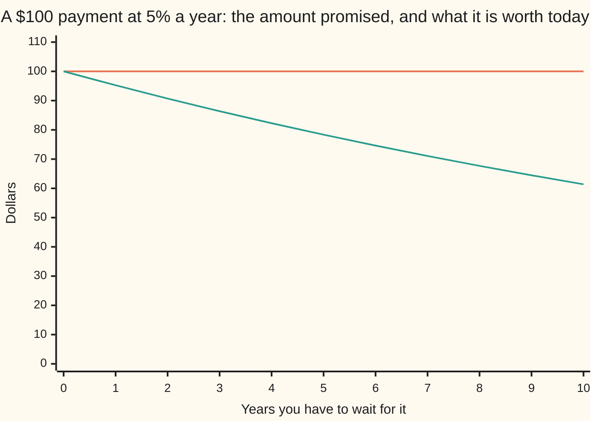

# Discounting: why $100 next year is worth about $95.24 today

[Syllabus](../../../SYLLABUS.md) → [Foundations](../../../SYLLABUS.md#w01) → [Compound Growth and Discounting](../../../SYLLABUS.md#w01-s04) → Discounting

---

## General Overview

Someone owes you $100, due a year from today. Your bank pays 5%.

That promise is not worth $100 now. Ask what amount, banked today, turns into exactly $100 in a year. $95.24 does it: $95.24 plus a year's 5% lands on $100.00, to the cent. So the promise is worth $95.24 today.

The same $100 due in ten years is worth $61.39. The payment never changed; the waiting did it.

This is compounding run backwards: forward you multiply, back you divide. What it lands on is the **present value** — a future payment in today's money.

**To move money back in time, divide it by the growth factor once for every year you have to wait.**

### The picture: one payment, priced at every date



The flat line is the payment: $100 whenever it lands. The falling line is what it is worth today, down to $61.39 at ten years.

---

## The formula

A year forward is a multiply by 1.05, so a year back is a divide by it:

**$100.00 ÷ 1.05 = $95.24**

Ten years is ten divides:

**$100.00 ÷ 1.05 ÷ 1.05 … ten divides in all … = $61.39**

1.05 is the growth factor for 5% ([Growth factors](01-growth-factors.md)); multiplying by it is a year forward ([Compound interest](03-compound-interest.md)).

**Read it aloud:** a payment due later is worth what you would have to bank today to hold that amount on the day.

Run the divides on one dollar instead and you get the **discount factor**: today's price of $1.00 due then. One year, 1.00 ÷ 1.05 = 0.952381; ten years, 0.613913. Multiply the payment by it and the divides are done: 100.00 × 0.952381 = 95.24. Read it as cents on the dollar.

If the rate compounds continuously ([Compounding more often, and the number e](04-compounding-frequency-and-e.md)), a year's growth factor is 1.051271 rather than 1.05, and nothing else moves:

**$100.00 ÷ 1.051271 = $95.12, a discount factor of 0.951229**

Finance writes that factor as e^-rT, said aloud as "e to the minus r T": r the rate, T the years waited. It is the 0.951229 on [Black–Scholes call](../../12-Financial%20mathematics/08-The%20Black-Scholes%20call%20and%20put/01-black-scholes-call.md).

| Piece | Plain meaning | In our example | Push it up… |
| --- | --- | --- | --- |
| the payment | money promised, and its date | $100.00, in a year | today's value rises |
| the rate | what money earns while you wait | 0.05, that is 5% | today's value drops |
| the growth factor | a year forward, as a multiplier | 1.05 | today's value drops |
| the wait | years waited, so how many divides | 1, then 10 | today's value drops |
| the discount factor | today's price of $1.00 due then | 0.952381, then 0.613913 | today's value rises |
| the present value | the payment in today's money | $95.24, then $61.39 | — |

---

## Why it works

### The bank sets the price

You can always put money in at 5%. So a future payment has one break-even price today: the deposit that ends at the same amount on the same day. Buy the promise for more than that, and the bank would have served you better. Sell it for less, and the buyer pockets your interest.

### Dividing undoes multiplying

Forward, 95.24 grown a year at 5% is 100.00. Backwards, 100.00 ÷ 1.05 is 95.24. One statement, two directions. Ten years forward is ten multiplies, so ten back is ten divides — and 61.39 grown ten years returns to 100.00.

### The drop is not a straight line

Each year of waiting takes about a twentieth off what is left, not off the original $100. What is left keeps shrinking, so the cuts shrink: one year to two, 95.24 to 90.70; nine to ten, 64.46 to 61.39.

A continuously compounded rate changes none of this. Only the growth factor moves: a year multiplies by 1.051271, so a year back divides by it.

---

## Worked numbers, by hand

The $100 promise at 5%, dollars to the cent and factors to six decimals.

| Step | Arithmetic | Value |
| --- | --- | --- |
| one year back | 100.00 ÷ 1.05 | **95.24** |
| the factor behind it | 1.00 ÷ 1.05 | 0.952381 |
| ten years back | 100.00 ÷ 1.05, ten times over | **61.39** |
| the ten-year factor | 1.00 ÷ 1.05, ten times over | 0.613913 |
| one year, continuously | 100.00 ÷ 1.051271 | **95.12** |
| its factor | 1.00 ÷ 1.051271 | 0.951229 |

At 5%, a dollar you wait ten years for is worth about three fifths of one now.

### What breaks if you drop a piece

| Mistake | Comes out at | What went wrong |
| --- | --- | --- |
| Taking 5% off the payment | 95.00 | Interest is earned on the deposit, not the payment |
| Dividing by 1.05 once for the decade | 95.24 | One divide is one year |
| Multiplying by 0.95 ten times | 59.87 | A 5% fall does not undo a 5% rise |

---

## Code, from first principles, and it actually runs

Nothing is imported. The payment is walked back a year at a time, one divide per year. The ten-year answer is checked twice more. First in whole numbers: 10,000 cents cut by twenty over twenty-one, ten times. 20 ÷ 21 is exactly 1 ÷ 1.05, so it is the same sum. Then by growing it forward again to $100.00. The continuous factor is built from a shrinking list, checked against that list run with a minus sign.

### Python

```python
# Discounting -- the check behind the card.  Nothing is imported.  A $100 payment
# due later, priced today at 5%: divide by 1.05 once a year, then continuously.
FACE, RATE, YEARS = 100.0, 0.05, 10
def series(x):                      # 1 + x + x times x / 2 + ... , 20 terms
    total, term = 0.0, 1.0
    for k in range(1, 21): total, term = total + term, term * x / k
    return total
def back(n):                        # the payment divided by 1.05, n times over
    value = FACE
    for _ in range(n): value = value / (1.0 + RATE)
    return value
def row(name, value, places): print(f"{name:<38}{value:>12.{places}f}")
def grid(name, values): print(f"{name:<30}" + "".join(f"{v:>7}" for v in values))
grid("years until the payment", [str(y) for y in range(YEARS + 1)])
grid("the payment itself, always", [f"{FACE:.2f}" for _ in range(YEARS + 1)])
grid("what it is worth today", [f"{back(y):.2f}" for y in range(YEARS + 1)])
one, ten, grow = back(1), back(YEARS), series(RATE)
row("discount factor, one year", one / FACE, 6)
row("$100 due in one year, worth today", one, 2)
row("discount factor, ten years", ten / FACE, 6)
row("$100 due in ten years, worth today", ten, 2)
row("continuous growth factor, one year", grow, 6)
row("continuous discount factor, one year", 1.0 / grow, 6)
row("$100 due in one year, continuously", FACE / grow, 2)
print(f"the three mistakes come out at {FACE * 0.95:.2f}, {one:.2f} and {FACE * 0.95 ** YEARS:.2f}")
exact = (2 * 10000 * 20 ** YEARS + 21 ** YEARS) // (2 * 21 ** YEARS)   # whole numbers only
assert exact == 6139 and round(ten * 100) == exact and round(one * 100) == 9524
assert abs(ten * (1.0 + RATE) ** YEARS - FACE) < 1e-9        # discounted, then grown back
assert abs(1.0 / grow - series(-RATE)) < 1e-12 and round(FACE / grow * 100) == 9512
print("ALL CHECKS PASS")
```

**Ran 2026-09-06 on macOS, Python 3.14.6, standard library only. All checks passed. Output, pasted from the run:**

```
years until the payment             0      1      2      3      4      5      6      7      8      9     10
the payment itself, always     100.00 100.00 100.00 100.00 100.00 100.00 100.00 100.00 100.00 100.00 100.00
what it is worth today         100.00  95.24  90.70  86.38  82.27  78.35  74.62  71.07  67.68  64.46  61.39
discount factor, one year                 0.952381
$100 due in one year, worth today            95.24
discount factor, ten years                0.613913
$100 due in ten years, worth today           61.39
continuous growth factor, one year        1.051271
continuous discount factor, one year      0.951229
$100 due in one year, continuously           95.12
the three mistakes come out at 95.00, 95.24 and 59.87
ALL CHECKS PASS
```

### Rust

Same numbers and labels, built with `rustc --edition 2021 -O`.

```rust
// Discounting -- the same check as the Python one, in Rust.  No crates.  A $100
// payment due later, priced today at 5%: divide by 1.05 once a year, then the
// continuous version, its factor from the series 1 + x + x times x / 2 + ...
const FACE: f64 = 100.0;  const RATE: f64 = 0.05;  const YEARS: usize = 10;
fn series(x: f64) -> f64 {                 // 1 + x + x times x / 2 + ... , 20 terms
    let (mut total, mut term) = (0.0, 1.0);
    for k in 1..21 { total += term; term = term * x / k as f64; }
    total
}
fn back(n: usize) -> f64 {                 // the payment divided by 1.05, n times over
    let mut value = FACE;
    for _ in 0..n { value = value / (1.0 + RATE); }
    value
}
fn row(name: &str, value: f64, p: usize) { println!("{:<38}{:>12.p$}", name, value, p = p); }
fn grid(name: &str, values: Vec<String>) {
    println!("{:<30}{}", name, values.iter().map(|v| format!("{:>7}", v)).collect::<Vec<_>>().join(""));
}
fn main() {
    grid("years until the payment", (0..=YEARS).map(|y| y.to_string()).collect());
    grid("the payment itself, always", (0..=YEARS).map(|_| format!("{:.2}", FACE)).collect());
    grid("what it is worth today", (0..=YEARS).map(|y| format!("{:.2}", back(y))).collect());
    let (one, ten, grow) = (back(1), back(YEARS), series(RATE));
    row("discount factor, one year", one / FACE, 6);
    row("$100 due in one year, worth today", one, 2);
    row("discount factor, ten years", ten / FACE, 6);
    row("$100 due in ten years, worth today", ten, 2);
    row("continuous growth factor, one year", grow, 6);
    row("continuous discount factor, one year", 1.0 / grow, 6);
    row("$100 due in one year, continuously", FACE / grow, 2);
    println!("the three mistakes come out at {:.2}, {:.2} and {:.2}",
             FACE * 0.95, one, FACE * 0.95f64.powi(YEARS as i32));
    let (mut num, mut den): (i128, i128) = (2 * 10000, 1);       // whole numbers only
    for _ in 0..YEARS { num *= 20; den *= 21; }
    let cents = (num + den) / (2 * den);
    assert!(cents == 6139 && (ten * 100.0).round() as i128 == cents && (one * 100.0).round() as i64 == 9524);
    assert!((ten * (1.0 + RATE).powi(YEARS as i32) - FACE).abs() < 1e-9);  // discounted, grown back
    assert!((1.0 / grow - series(-RATE)).abs() < 1e-12 && (FACE / grow * 100.0).round() as i64 == 9512);
    println!("ALL CHECKS PASS");
}
```

**Ran 2026-09-06 on macOS, rustc 1.98.1, no crates. All checks passed. Output, pasted from the run:**

```
years until the payment             0      1      2      3      4      5      6      7      8      9     10
the payment itself, always     100.00 100.00 100.00 100.00 100.00 100.00 100.00 100.00 100.00 100.00 100.00
what it is worth today         100.00  95.24  90.70  86.38  82.27  78.35  74.62  71.07  67.68  64.46  61.39
discount factor, one year                 0.952381
$100 due in one year, worth today            95.24
discount factor, ten years                0.613913
$100 due in ten years, worth today           61.39
continuous growth factor, one year        1.051271
continuous discount factor, one year      0.951229
$100 due in one year, continuously           95.12
the three mistakes come out at 95.00, 95.24 and 59.87
ALL CHECKS PASS
```

The two outputs match line for line.

> [!TIP]
> **Try changing**
> Guess first, then run it. The asserts are pinned to the $100 promise, so expect one to fire.
> - **Set the rate to zero.** `RATE` to `0.0`. The whole "worth today" row prints 100.00: nothing to earn while waiting, so waiting costs nothing.
> - **Do the ten years in one divide.** In `back`, divide once instead of looping: the ten-year value prints 95.24, the second mistake above.

---

## The usual mistake

> [!warning]
> **Taking the rate off the payment instead of dividing by the growth factor.** 5% off $100 is $95.00, and $95.00 in the bank for a year does not reach the $100 promised. Interest is earned on the deposit, which is smaller than the payment, so the answer is higher: $95.24.
>
> - Using one year's factor for a ten-year wait: 95.24, where the answer is 61.39.
> - Multiplying by 0.95 ten times instead of dividing by 1.05: 59.87, not 61.39.
> - Mixing conventions: a yearly rate discounted as though continuous gives 95.12.
> - Rounding the factor early. Keep it long; round the dollars at the end.

---

## Where you meet it in real life

- **Cash now for money later.** A lottery lump sum, a settlement, an invoice sold early: the buyer quotes a present value, and their rate is the negotiation.
- **Bond prices.** A bond is a set of dated payments, each discounted back and added up. Bigger rate, smaller factors — so bond prices fall as rates rise.
- **Option prices.** A strike price is cash due at expiry, so it enters discounted: [Black–Scholes call](../../12-Financial%20mathematics/08-The%20Black-Scholes%20call%20and%20put/01-black-scholes-call.md), same 5% and year, 0.951229 unchanged.

> **Say it back**
> Money later is worth less than money now, because money now could be in the bank earning. To price a promise, ask what deposit would grow into it: divide the payment by the growth factor once per year of waiting. At 5%, $100 due in a year is worth $95.24; in ten years, $61.39. The one-step multiplier is the discount factor: 0.952381, 0.613913, or 0.951229 continuously.

---

## What this builds on

- [Compound interest](03-compound-interest.md): multiplying by 1.05 once a year to carry money forward. This card divides to come back.
- [Compounding more often, and the number e](04-compounding-frequency-and-e.md): where 1.051271 comes from, and what "compounded continuously" means.

## Where this goes next

- [Black–Scholes call](../../12-Financial%20mathematics/08-The%20Black-Scholes%20call%20and%20put/01-black-scholes-call.md): an option price, where cash due at expiry is discounted by this same 0.951229.

---

## Sources

Verified 6 Sep 2026; every link resolves.

- *Principles of Finance*, section 7.2, "Time Value of Money (TVM) Basics." OpenStax. [Textbook page](https://openstax.org/books/principles-finance/pages/7-2-time-value-of-money-tvm-basics). Present value in the usual notation.
- Lewin, C. G. "An Early Book on Compound Interest: Richard Witt's *Arithmeticall Questions*." *Journal of the Institute of Actuaries* 96 (1970). [doi:10.1017/S002026810001636X](https://doi.org/10.1017/S002026810001636X). Witt's 1613 tables of "present worth".
- Fisher, Irving. *The Theory of Interest*. Macmillan, 1930. [Full text, Econlib](https://www.econlib.org/library/YPDBooks/Fisher/fshToI.html). Discounted income as the root of value.
