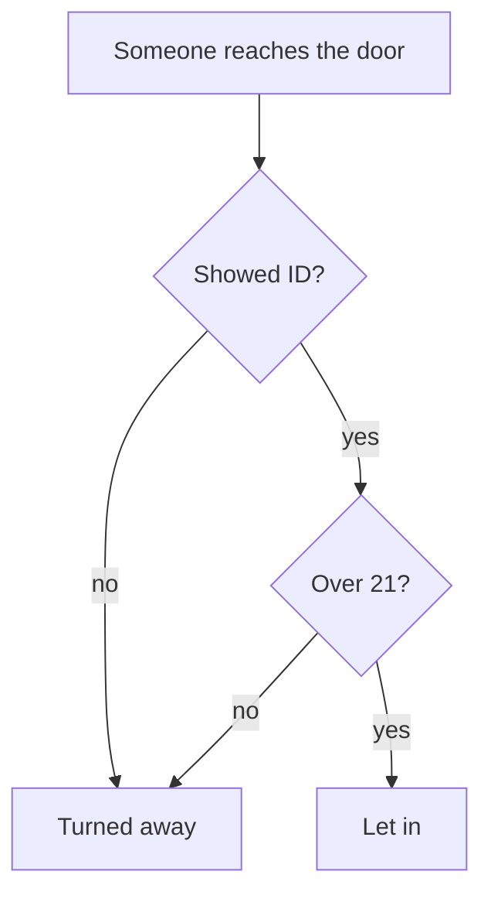

# Statements and connectives: and, or, not, and the truth table that settles them

[Syllabus](../../../SYLLABUS.md) → [Foundations](../../../SYLLABUS.md#w01) → [Logic](../../../SYLLABUS.md#w01-s05) → Statements and connectives

---

## General Overview

A sign is taped to the door of a club:

> After 9 pm, everyone must show ID and be over 21.

Four people walk up. Nia has her ID and is 24. Sam has his ID and is 19. Ray is 30 with no wallet. Jo is 19 with no wallet.

The doorman lets in exactly one of them. He checks two facts about each person and joins them with **and**. Change that word to **or** and three of four get in. The word is doing the work.

**A sentence settled true or false is a statement. The joining words — and, or, not — each have a fixed rule you can write out in full, because the parts can land only so many ways.**

### The picture: what the doorman does



Two gates in a row, both must open. That is **and**, drawn.

---

## The formula

Nothing to memorise. Each joining word's rule is the sentence written out:

**"Showed ID and over 21" is true only when both halves are true.**

| Piece | Plain meaning | At this door |
| --- | --- | --- |
| a statement | a sentence settled true or false, nothing between | "Sam is over 21" — false |
| a connective | a joining word with a fixed rule | the **and** on the sign |
| and | true only when both halves are true | the doorman's rule |
| or | true when at least one half is true, both included | the sign with "or" |
| not | flips a statement, true to false and back | "not over 21" |
| a truth table | every way the halves can land, one line each, with the answer beside it | the table below |

Books use formal names. **And** is *conjunction*, written ∧. **Or** is *disjunction*, ∨. **Not** is *negation*, ¬. What a statement lands on, true or false, is its **truth value**. Logic's or, which keeps the both case, is *inclusive or*; the speech one, one-but-not-both, is *exclusive or*. The names let you read anyone else's book.

The sign itself is not a statement. It is an order: you obey it or not, you cannot mark it true or false. The doorman turns it into a statement about each person — "Sam showed ID and Sam is over 21" — and that is what the connective acts on. Questions and unsettled opinions never get a truth value either.

---

## Why it works

### There are only four ways it can land

Each person brings two facts: showed ID, and over 21. Each is true or false. Two choices for the first, two for the second: four combinations. Not four hundred. Four. So a joining word's rule can be written out in full, once and for all. That list, with the answer beside each line, is a **truth table**. Our four people are those four combinations, one each.

### And is the strict one

"Showed ID and over 21" is one claim with two parts. Break either part and the claim is false. Only Nia keeps both, so **and** is true on one line of four.

### Or is the generous one

"Showed ID or over 21" asks for less. One part is enough, both parts is still fine — logic's **or** keeps the both case. It fails only when both fail, which is Jo, so **or** is true on three lines of four.

### Not just flips

"Not over 21" is true for Sam and Jo, false for Nia and Ray. Flip twice and you are back: "not (not over 21)" is "over 21" again.

Once the table is written, the door is a lookup: two facts in, one answer out.

---

## Worked numbers, by hand

| Person | showed ID | over 21 | not over 21 | ID and over 21 | ID or over 21 |
| --- | --- | --- | --- | --- | --- |
| Nia | yes | yes | no | **yes** | yes |
| Sam | yes | no | yes | no | yes |
| Ray | no | yes | no | no | yes |
| Jo | no | no | yes | no | no |

**And lets in 1 of 4. Or would let in 3 of 4. "Not over 21" is true for 2 of 4.**

Only Nia gets in: Sam and Ray each fail one half, and one failed half is enough.

### What breaks if you drop a piece

| Mistake | Comes out at | What went wrong |
| --- | --- | --- |
| Reading the sign's "and" as "or" | 3 of 4 in | Sam is 19; Ray showed nothing |
| Reading "or" as one-but-not-both | 2 of 4 in | Nia, who does both, is refused |
| Checking only the ID | 2 of 4 in | Sam is 19, holding a valid ID |

The code prints all three.

---

## Code, from first principles, and it actually runs

Nothing is imported. Each person is worked twice: straight from the words, then by counting how many of the two facts came out true — 2 for **and**, at least 1 for **or**. The routes must agree on all four lines.

### Python

```python
# Statements and connectives -- the check behind the card.  Nothing is imported.
# The club door after 9 pm: show ID and be over 21.  Two facts per person, so
# four rows.  Every row is worked twice: straight from the words, then by
# counting how many of the two facts came out true.
DOOR = [("Nia", True, True), ("Sam", True, False), ("Ray", False, True), ("Jo", False, False)]
YN = {True: "yes", False: "no"}
ands, ors, nots, ones, agree = [], [], [], [], 0

print("the door after 9 pm: show ID and be over 21")
print(f"{'name':<6}{'showed ID':>11}{'over 21':>9}{'not over 21':>13}"
      f"{'ID and over 21':>16}{'ID or over 21':>15}")
for name, shown, older in DOOR:
    both = shown and older                       # straight from the words
    either = shown or older
    trues = [shown, older].count(True)           # the second road: count the trues
    agree += int(both == (trues == 2) and either == (trues >= 1))
    ands.append(both); ors.append(either); nots.append(not older); ones.append(trues == 1)
    print(f"{name:<6}{YN[shown]:>11}{YN[older]:>9}{YN[not older]:>13}"
          f"{YN[both]:>16}{YN[either]:>15}")
print(f"and lets in {ands.count(True)} of 4, or lets in {ors.count(True)} of 4, "
      f"not over 21 is true for {nots.count(True)} of 4")
print(f"the counting road agrees on {agree} of 4 rows")
print(f"the three mistakes let in {ors.count(True)}, {ones.count(True)} and "
      f"{[d[1] for d in DOOR].count(True)} of 4")

assert ands == [True, False, False, False]
assert ors == [True, True, True, False] and nots == [False, True, False, True]
assert ands.count(True) == 1 and ors.count(True) == 3 and agree == 4
assert ones.count(True) == 2 and [d[1] for d in DOOR].count(True) == 2
print("ALL CHECKS PASS")
```

**Ran 2026-09-06 on macOS, Python 3.14.6, standard library only. All checks passed. Output, pasted from the run:**

```
the door after 9 pm: show ID and be over 21
name    showed ID  over 21  not over 21  ID and over 21  ID or over 21
Nia           yes      yes           no             yes            yes
Sam           yes       no          yes              no            yes
Ray            no      yes           no              no            yes
Jo             no       no          yes              no             no
and lets in 1 of 4, or lets in 3 of 4, not over 21 is true for 2 of 4
the counting road agrees on 4 of 4 rows
the three mistakes let in 3, 2 and 2 of 4
ALL CHECKS PASS
```

### Rust

Same rows, same labels, built with `rustc --edition 2021 -O`.

```rust
// Statements and connectives -- the same check as statements_and_connectives_check.py,
// in Rust.  No crates.  The club door after 9 pm: show ID and be over 21.  Two
// facts per person, so four rows.  Every row is worked twice: straight from the
// words, then by counting how many of the two facts came out true.
fn yn(b: bool) -> &'static str { if b { "yes" } else { "no" } }

fn count(col: &[bool]) -> usize { col.iter().filter(|b| **b).count() }

fn main() {
    let door = [("Nia", true, true), ("Sam", true, false),
                ("Ray", false, true), ("Jo", false, false)];
    let (mut ands, mut ors, mut nots, mut ones) = (vec![], vec![], vec![], vec![]);
    let mut agree = 0;

    println!("the door after 9 pm: show ID and be over 21");
    println!("{:<6}{:>11}{:>9}{:>13}{:>16}{:>15}",
             "name", "showed ID", "over 21", "not over 21", "ID and over 21", "ID or over 21");
    for (name, shown, older) in door {
        let both = shown && older;                       // straight from the words
        let either = shown || older;
        let trues = count(&[shown, older]);              // the second road: count the trues
        if both == (trues == 2) && either == (trues >= 1) { agree += 1; }
        ands.push(both); ors.push(either); nots.push(!older); ones.push(trues == 1);
        println!("{:<6}{:>11}{:>9}{:>13}{:>16}{:>15}",
                 name, yn(shown), yn(older), yn(!older), yn(both), yn(either));
    }
    println!("and lets in {} of 4, or lets in {} of 4, not over 21 is true for {} of 4",
             count(&ands), count(&ors), count(&nots));
    println!("the counting road agrees on {} of 4 rows", agree);
    println!("the three mistakes let in {}, {} and {} of 4",
             count(&ors), count(&ones), door.iter().filter(|d| d.1).count());

    assert!(ands == vec![true, false, false, false]);
    assert!(ors == vec![true, true, true, false] && nots == vec![false, true, false, true]);
    assert!(count(&ands) == 1 && count(&ors) == 3 && agree == 4);
    assert!(count(&ones) == 2 && door.iter().filter(|d| d.1).count() == 2);
    println!("ALL CHECKS PASS");
}
```

**Ran 2026-09-06 on macOS, rustc 1.98.1, no crates. All checks passed. Output, pasted from the run:**

```
the door after 9 pm: show ID and be over 21
name    showed ID  over 21  not over 21  ID and over 21  ID or over 21
Nia           yes      yes           no             yes            yes
Sam           yes       no          yes              no            yes
Ray            no      yes           no              no            yes
Jo             no       no          yes              no             no
and lets in 1 of 4, or lets in 3 of 4, not over 21 is true for 2 of 4
the counting road agrees on 4 of 4 rows
the three mistakes let in 3, 2 and 2 of 4
ALL CHECKS PASS
```

The two outputs match line for line.

> [!TIP]
> **Try changing**
> Guess first, then run it. The asserts are pinned to the sign as written, so expect one to fire.
> - **Swap the sign's word.** Test `either` where `both` is used. Three of four get in, and the first assert fires.
> - **Give Ray his wallet.** Change his row to `("Ray", True, True)`. And lets in 2 of 4, or still lets in 3 of 4, and the first assert fires. Ray now copies Nia's row, so the four no longer cover all four combinations.

---

## The usual mistake

> [!warning]
> **Hearing "or" as "one or the other, but not both" — that is *exclusive or*.** Speech uses it that way: "soup or salad" means pick one. Logic's **or** keeps the both case, so if the sign said "show ID or be over 21", Nia is still in.
>
> - Marking an order or a question true or false. "Show me your ID" is neither.
> - Treating "and" as loose. One failed half kills the claim: Sam is refused with a good ID.
> - Treating "not over 21" as new information. **Not** adds nothing; it only flips the answer to "over 21".

---

## Where you meet it in real life

- **Any door, form or filter.** Search filters, discount rules and entry conditions are and, or and not wired together.
- **Rules with a condition in front.** "After 9 pm" is an if-then, which behaves oddly and gets its own card: [If-then](02-if-then.md).
- **Rewriting a rule without changing it.** Moving a **not** through an and or an or has a rule of its own: [Logical equivalence and De Morgan](03-logical-equivalence-and-de-morgan.md).

> **Say it back**
> A statement is a sentence settled true or false; orders, questions and pure opinions are not. Two statements can land only four ways, so each joining word's rule fits a small table. **And** (∧) is true only when both halves are: 1 of our 4 people. **Or** (∨) is true when at least one is, both included: 3 of 4. **Not** (¬) flips one statement.

---

## What this builds on

Nothing before it on this shelf. You need only read a sentence and say whether it claims something.

## Where this goes next

- [If-then](02-if-then.md): the connective on the front of the sign — after 9 pm, *then* this rule applies — and the one row where it breaks.
- Then the shelf: [Logical equivalence and De Morgan](03-logical-equivalence-and-de-morgan.md), [Quantifiers](04-quantifiers.md) on the sign's "everyone", [Negating a quantifier](05-negating-quantifiers-and-counterexamples.md), and [Valid arguments](06-valid-arguments.md).

---

## Sources

Verified 6 Sep 2026; every link resolves.

- Hammack, Richard. *Book of Proof*, 3rd ed. [Author page, free PDF](https://richardhammack.github.io/BookOfProof/). Chapter 2, statements and the and/or/not tables.
- Velleman, Daniel J. *How to Prove It*, 3rd ed. Cambridge University Press, 2019. [doi:10.1017/9781108539890](https://doi.org/10.1017/9781108539890). Chapter 1, turning English into connectives (paid).
- Franks, Curtis. "Propositional Logic." *Stanford Encyclopedia of Philosophy*, 2023. [plato.stanford.edu](https://plato.stanford.edu/entries/logic-propositional/). The careful version of "statement".
