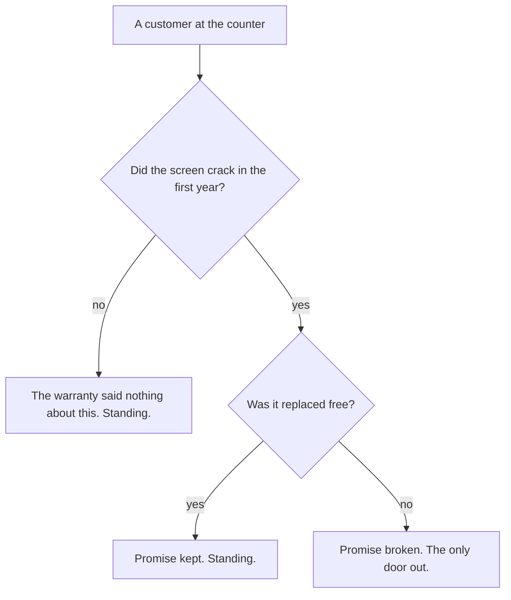

# If-then: a promise that breaks only one way, with its converse and contrapositive

Foundations → Logic → Statements → If-then

---

## General Overview

The warranty card in the phone box says: **"If the screen cracks in the first year, we replace it free."**

Four people bring one back.

- **Ana.** Cracked in month three, replaced free.
- **Ben.** Cracked in month three, they refused.
- **Cal.** Screen fine, replaced free anyway for a stuck button.
- **Dee.** Screen fine, nothing replaced.

Only Ben can say the warranty was broken. Cal's free phone does not break it: the line never promised free phones *only* after cracks.

**A sentence shaped "if this, then that" makes one claim: you will never see the first part happen and the second fail to follow. One case breaks it. Everything else leaves it standing.**

### The picture: the only way to break it



---

## The formula

Nothing to memorise: the warranty line **is** the formula:

**"If the screen cracks in the first year, we replace it free" is false when the screen cracked and was not replaced free — true in every other case.**

**Read it aloud:** one unhonoured crack sinks it; nothing else touches it.

Write 1 for yes and 0 for no. The sentence is four verdicts, in the order Ana, Ben, Cal, Dee: 1, 0, 1, 1.

| Piece | Plain meaning | In our warranty |
| --- | --- | --- |
| the if part | what happens first | the screen cracks in the first year |
| the then part | what is owed then | we replace it free |
| broken | the case that sinks it | cracked, not replaced |
| the converse | the parts swapped | if we replace it free, the screen cracked |
| the contrapositive | both flipped (a *not* in front), then swapped | if we did not replace it free, it did not crack |

Books call this an **implication**, written P → Q, where → is read "if… then". P is the **hypothesis** (the if part), Q the **conclusion** (the then part). The or-form is ¬P ∨ Q: ¬ is *not*, ∨ is *or*. Cal's and Dee's rows are **vacuously true** — true because nothing was owed.

---

## Why it works

### One failing case, nowhere else to hide

The if part is yes or no; so is the then part. That is 4 combinations. Ana, Ben, Cal and Dee are not a sample: they are every customer this sentence can have.

Ben is the only one owed something who did not get it.

The verdict uses those two answers alone, not any link between the halves. "If 2 is odd, then 1 = 0" is a Dee row: the if part never happens, so its verdict is 1.

### The same promise, said with "or"

Read it again: **"either the screen did not crack, or it was replaced free."** Same four verdicts, customer by customer. Moving between the forms: [logical-equivalence-and-de-morgan](03-logical-equivalence-and-de-morgan.md).

### The converse: a different promise

Swap the halves: the **converse** is "if we replace it free, then the screen cracked."

Cal kills it: free phone, no crack, so the converse is false for him while the warranty stays true. They disagree on 2 of the 4 rows, so proving one says nothing about the other.

### The contrapositive: the same promise

Flip both halves and swap them: the **contrapositive** is "if we did not replace it free, then the screen did not crack."

What would break it? A customer not replaced free whose screen did crack. Ben again. Same broken row, same promise: 0 rows disagree. The flip is often easier to check: [proof-by-contrapositive](../06-Proof/02-proof-by-contrapositive.md).

### Enough on its own, and cannot be missing

The crack is **sufficient** for the free replacement: enough on its own. The free replacement is **necessary**: a covered crack cannot happen without one.

"Only if" marks the necessary half: "the screen cracked only if we replaced it free" is the warranty again, not the converse.

---

## Worked numbers, by hand

The four customers, 1 for yes and 0 for no.

| Step | Reason | Value |
| --- | --- | --- |
| Ana: cracked 1, replaced 1 | owed, got it | 1 |
| Ben: cracked 1, replaced 0 | owed, refused | **0** |
| Cal: cracked 0, replaced 1 | nothing owed | 1 |
| Dee: cracked 0, replaced 0 | nothing owed | 1 |
| the column, top to bottom | four verdicts | **1, 0, 1, 1** |
| the second route | same verdicts | 1, 0, 1, 1 |
| Cal on the converse | replaced 1, cracked 0 | **0** |
| converse disagrees on | Ben and Cal | 2 |
| contrapositive disagrees on | nobody | 0 |

Only Ben has a claim.

### What breaks if you drop a piece

| Mistake | Comes out at | What went wrong |
| --- | --- | --- |
| Using the converse as the warranty | 2 rows disagree | Ben and Cal swap verdicts |
| Marking Cal broken | Cal reads 0, not 1 | It never spoke about uncracked screens |
| Treating the contrapositive as a different promise | 0 rows disagree | It is the same promise |

---

## Code, from first principles, and it actually runs

Nothing is imported. Each customer is judged the plain way, then by the "no crack, or replaced free" route; converse and contrapositive use the same function.

### Python

```python
# If-then -- the check behind the card.  Nothing is imported.  The phone
# warranty: "if the screen cracks in the first year, we replace it free."
# Four customers, 1 for yes and 0 for no.  Two routes to the same column.
CASES = [("Ana", 1, 1), ("Ben", 1, 0), ("Cal", 0, 1), ("Dee", 0, 0)]

def kept(crack, free):        # broken only when it cracked and was not replaced
    return 0 if crack == 1 and free == 0 else 1

def or_route(crack, free):    # second route: no crack, or a free replacement
    return 1 if crack == 0 or free == 1 else 0

print(f"{'name':<5}{'crack':>7}{'free':>6}{'if-then':>9}{'not-crack-or-free':>19}{'converse':>10}{'contra':>8}")
promise, second, converse, contra = [], [], [], []
for name, crack, free in CASES:
    promise.append(kept(crack, free))
    second.append(or_route(crack, free))
    converse.append(kept(free, crack))            # if replaced free, then it cracked
    contra.append(kept(1 - free, 1 - crack))      # if not replaced free, then no crack
    print(f"{name:<5}{crack:>7}{free:>6}{promise[-1]:>9}{second[-1]:>19}{converse[-1]:>10}{contra[-1]:>8}")
broken = sum(1 for v in promise if v == 0)
conv_gap = sum(1 for a, b in zip(promise, converse) if a != b)
con_gap = sum(1 for a, b in zip(promise, contra) if a != b)
print(f"customers checked {len(CASES)}")
print(f"rows where the warranty is broken {broken}")
print(f"converse disagrees on rows {conv_gap}")
print(f"contrapositive disagrees on rows {con_gap}")
assert len(promise) == 4 and promise == [1, 0, 1, 1] and second == promise
assert converse == [1, 1, 0, 1] and conv_gap == 2
assert contra == [1, 0, 1, 1] and con_gap == 0 and broken == 1
print("ALL CHECKS PASS")
```

**Ran 2026-09-06 on macOS, Python 3.14.6, standard library only. All checks passed. Output, pasted from the run:**

```
name   crack  free  if-then  not-crack-or-free  converse  contra
Ana        1     1        1                  1         1       1
Ben        1     0        0                  0         1       0
Cal        0     1        1                  1         0       1
Dee        0     0        1                  1         1       1
customers checked 4
rows where the warranty is broken 1
converse disagrees on rows 2
contrapositive disagrees on rows 0
ALL CHECKS PASS
```

### Rust

Same numbers, same labels, built with `rustc --edition 2021 -O`.

```rust
// If-then -- the same check as if_then_check.py, in Rust.  No crates.  The
// phone warranty: "if the screen cracks in the first year, we replace it
// free."  Four customers, 1 for yes and 0 for no.  Two routes, one column.
const CASES: [(&str, i64, i64); 4] =
    [("Ana", 1, 1), ("Ben", 1, 0), ("Cal", 0, 1), ("Dee", 0, 0)];

fn kept(crack: i64, free: i64) -> i64 {       // broken only when it cracked and was not replaced
    if crack == 1 && free == 0 { 0 } else { 1 }
}

fn or_route(crack: i64, free: i64) -> i64 {   // second route: no crack, or a free replacement
    if crack == 0 || free == 1 { 1 } else { 0 }
}

fn main() {
    println!("{:<5}{:>7}{:>6}{:>9}{:>19}{:>10}{:>8}",
             "name", "crack", "free", "if-then", "not-crack-or-free", "converse", "contra");
    let (mut promise, mut second) = (Vec::new(), Vec::new());
    let (mut converse, mut contra) = (Vec::new(), Vec::new());
    for (name, crack, free) in CASES {
        promise.push(kept(crack, free));
        second.push(or_route(crack, free));
        converse.push(kept(free, crack));             // if replaced free, then it cracked
        contra.push(kept(1 - free, 1 - crack));       // if not replaced free, then no crack
        println!("{:<5}{:>7}{:>6}{:>9}{:>19}{:>10}{:>8}", name, crack, free,
                 promise[promise.len() - 1], second[second.len() - 1],
                 converse[converse.len() - 1], contra[contra.len() - 1]);
    }
    let broken = promise.iter().filter(|&&v| v == 0).count();
    let conv_gap = (0..4).filter(|&i| promise[i] != converse[i]).count();
    let con_gap = (0..4).filter(|&i| promise[i] != contra[i]).count();
    println!("customers checked {}", CASES.len());
    println!("rows where the warranty is broken {}", broken);
    println!("converse disagrees on rows {}", conv_gap);
    println!("contrapositive disagrees on rows {}", con_gap);
    assert!(promise.len() == 4 && promise == vec![1, 0, 1, 1] && second == promise);
    assert!(converse == vec![1, 1, 0, 1] && conv_gap == 2);
    assert!(contra == vec![1, 0, 1, 1] && con_gap == 0 && broken == 1);
    println!("ALL CHECKS PASS");
}
```

**Ran 2026-09-06 on macOS, rustc 1.98.1, no crates. All checks passed. Output, pasted from the run:**

```
name   crack  free  if-then  not-crack-or-free  converse  contra
Ana        1     1        1                  1         1       1
Ben        1     0        0                  0         1       0
Cal        0     1        1                  1         0       1
Dee        0     0        1                  1         1       1
customers checked 4
rows where the warranty is broken 1
converse disagrees on rows 2
contrapositive disagrees on rows 0
ALL CHECKS PASS
```

The two outputs match line for line.

> [!TIP]
> **Try changing**
> Guess first, then run it.
> - **Make Ben whole.** Change his row to `("Ben", 1, 1)`. Broken rows print 0, not 1.
> - **Promote the converse.** Put `kept(free, crack)` in the if-then column. Ben rises to 1, Cal falls to 0.
>
> Either edit ends in an AssertionError instead of ALL CHECKS PASS. That is the check catching the change.

---

## The usual mistake

> [!warning]
> **Hearing "if" as "if and only if".** *If and only if* means both directions at once: a crack gives a free phone, and a free phone means a crack. The warranty owes only the first direction. Cal left with a free phone and no crack, and his row still reads 1.
>
> - Cal's row is the one people mark wrong. Under the converse it reads 0.
> - Ben's is the only real break: broken rows come to 1, never more.
> - "If it did not crack, we do not replace it free" is the converse in a coat: 2 rows disagree.

---

## Where you meet it in real life

- **Warranties and refunds.** The row argued about at the counter is Cal's.
- **Signs.** "No entry without a ticket" says: if no ticket, then not inside. Flip both and swap: if you are inside, you have a ticket. Same promise. Chains of these build arguments: [valid-arguments](06-valid-arguments.md).
- **Test results.** "If you have the illness, the test is positive." A negative means no illness: contrapositive, sound. A positive meaning illness is the converse: a different claim.

> **Say it back**
> "If this, then that" promises one thing: never the first part without the second. One case breaks it; a first part that never happened breaks nothing. The converse swaps the halves — a different promise, 2 rows disagree. The contrapositive flips both and swaps them — the same promise, 0 rows disagree. The first part is enough for the second; the first cannot happen without the second.

---

## What this builds on

- [statements-and-connectives](01-statements-and-connectives.md): what "not" and "or" do, and how a small table settles a sentence.

## Where this goes next

- [logical-equivalence-and-de-morgan](03-logical-equivalence-and-de-morgan.md): why the two readings count as one sentence.
- [valid-arguments](06-valid-arguments.md): what you may conclude from an if-then and one half.
- [proof-by-contrapositive](../06-Proof/02-proof-by-contrapositive.md): proving the flipped sentence on purpose.

---

## Sources

Verified 6 Sep 2026; every link resolves.

- Hammack, Richard. *Book of Proof*, 3rd ed. [Book home](https://richardhammack.github.io/BookOfProof/) · [free PDF](https://richardhammack.github.io/BookOfProof/Main.pdf). Section 2.3.
- Velleman, Daniel J. *How to Prove It*, 3rd ed. Cambridge University Press, 2019. [doi:10.1017/9781108539890](https://doi.org/10.1017/9781108539890). Converse and contrapositive side by side (paid).
- Edgington, Dorothy. "Indicative Conditionals." *Stanford Encyclopedia of Philosophy*, revised 2025. [plato.stanford.edu/entries/conditionals](https://plato.stanford.edu/entries/conditionals/). Free; where everyday "if" leaves the table.
