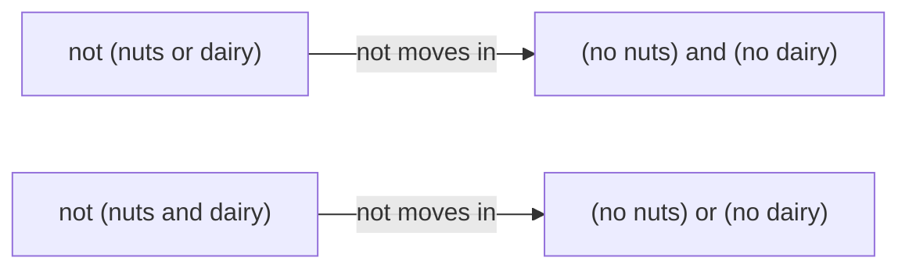

# Logical equivalence and De Morgan: when two sentences say the same thing, and how 'not' moves through and/or

[Syllabus](../../../SYLLABUS.md) → [Foundations](../../../SYLLABUS.md#w01) → [Logic](../../../SYLLABUS.md#w01-s05) → Logical equivalence and De Morgan

---

## General Overview

A cafe menu note sits under one dish: **contains no nuts and no dairy**.

A customer with a nut allergy says it back her own way: "so it's not (nuts or dairy)". Different words. Same claim, or not?

The menu will not settle that. A list will. A dish can be four ways — nuts and dairy, nuts only, dairy only, neither. Check both sentences against all four. Agree every time and they are **logically equivalent**: one claim, two wordings. Hers agrees, and the swap has a name.

**Two sentences are equivalent when they agree in every case, and moving a "not" inside brackets flips "and" to "or" and "or" to "and".**

A sentence that comes out yes in every case is a **tautology**; equivalence is "these two agree" being one.

### The picture: the "not" walks in



Top row: her swap. Bottom row: the same move on an "and".

---

## The formula

Nothing to memorise. Two swaps, in the cafe's words. **Nuts** means "contains nuts", **dairy** means "contains dairy".

**Law 1: not (nuts or dairy)   is the same claim as   (no nuts) and (no dairy)**

**Law 2: not (nuts and dairy)   is the same claim as   (no nuts) or (no dairy)**

**Read them aloud:** if neither is in the dish, both are absent; if they are not both in it, at least one is absent.

Those swaps are **De Morgan's laws**, written down in 1847.

| Piece | Plain meaning | In the cafe |
| --- | --- | --- |
| not | flips true and false | "contains no nuts" |
| and | true only when both halves are | "no nuts and no dairy" |
| or | true when at least one is, both counted | "nuts or dairy" |
| brackets | how much the "not" covers | "not (nuts or dairy)" |
| equivalent | same answer in every case | the note and her version |

---

## Why it works

### Step 0: there are only four dishes

A dish has nuts or it does not. Same for dairy. Two yes-or-no questions, so four dishes and no fifth. Checking all four is not a sample; it is everything.

### Step 1: one table, both laws

The last two columns are a second note: **not both nuts and dairy**, then its flip.

| dish | nuts | dairy | no nuts and no dairy | not (nuts or dairy) | not (nuts and dairy) | (no nuts) or (no dairy) |
| --- | --- | --- | --- | --- | --- | --- |
| 1 | yes | yes | no | no | no | no |
| 2 | yes | no | no | no | yes | yes |
| 3 | no | yes | no | no | yes | yes |
| 4 | no | no | yes | yes | yes | yes |

Columns four and five match on all 4 rows: law 1, so she read the note right. Columns six and seven match too: law 2. The note lets 1 dish through — says yes to 1 dish.

### Step 2: where it goes wrong

Columns six and seven sound like the same promise. They say yes on dishes 2 and 3, where the note says no. "Not both" is not "neither": it lets 3 dishes through, the note 1.

### Step 3: why the join has to flip

"And" is demanding: it wants both. Break it by losing at least one — and "at least one" is an "or".

"Or" is easy-going: it wants at least one. Break it by losing them all — and "all of them" is an "and".

Breaking a demanding claim is easy, so its "not" is loose; breaking an easy-going one is hard, so its "not" is demanding. The code checks both laws on every row, in words then in numbers.

---

## Worked numbers, by hand

Dish 2: nuts yes, dairy no. Where the trap bites.

| Step | Working | Value |
| --- | --- | --- |
| nuts or dairy | at least one is in it | yes |
| not (nuts or dairy) | flip that | **no** |
| no nuts and no dairy | "no nuts" is false already | **no** |
| nuts and dairy | both in it? dairy is not | no |
| not (nuts and dairy) | flip that | **yes** |
| (no nuts) or (no dairy) | "no dairy" holds | **yes** |

Both readings refuse dish 2, rightly: it has nuts. The second note lets it through.

Over the four dishes the note lets 1 through, "not both" 3, and they disagree on 2 of them (dishes 2 and 3).

### What breaks if you drop a piece

| Mistake | Comes out at | What went wrong |
| --- | --- | --- |
| Reading "not both" as "neither" | lets 3 dishes through, not 1 | The "and" must flip to "or" |
| Checking one dish and stopping | 1 case out of 4 | Equivalence is every case |

---

## Code, from first principles, and it actually runs

Nothing is imported. All four sentences are printed. Each is worked twice: with "and", "or" and "not", then with 1s and 0s ("and" is the smaller number, "or" the larger, "not" is 1 minus it). Both roads must agree on every row, and so must the two sides of each law.

### Python

```python
# Logical equivalence and De Morgan -- the check behind the card.  Nothing is imported.
# Four dishes, one per way nuts and dairy can fall.  Each sentence is worked twice: with
# and/or/not, then with 1s and 0s (and = the smaller, or = the larger, not = 1 minus it).
DISHES = [(1, 1), (1, 0), (0, 1), (0, 0)]        # (nuts, dairy); 1 means yes

def word(v): return "yes" if v else "no"
def line(cells): return "".join(f"{c:<{w}}" for c, w in zip(cells, (6, 6, 7, 23, 22, 23, 0)))
def same(x, y): return sum(1 for p, q in zip(x, y) if p == q)

note, customer, notboth, either = [], [], [], []
print(line(("dish", "nuts", "dairy", "no nuts and no dairy", "not (nuts or dairy)", "not (nuts and dairy)", "(no nuts) or (no dairy)")))
for i, (n, d) in enumerate(DISHES, 1):
    a = (not n) and (not d)                      # the menu note, read straight
    b = not (n or d)                             # her reading -- law 1's other side
    c = not (n and d)                            # "not both nuts and dairy"
    e = (not n) or (not d)                       # law 2's other side
    assert int(a) == min(1 - n, 1 - d) and int(b) == 1 - max(n, d) and a == b        # law 1
    assert int(c) == 1 - min(n, d) and int(e) == max(1 - n, 1 - d) and c == e        # law 2
    note.append(int(a)); customer.append(int(b)); notboth.append(int(c)); either.append(int(e))
    print(line((i, word(n), word(d), word(a), word(b), word(c), word(e))))
print(f"{'rows checked':<44}{len(DISHES)}")
print(f"{'rows where law 1 holds':<44}{same(note, customer)}")
print(f"{'rows where law 2 holds':<44}{same(notboth, either)}")
print(f"{'dishes the menu note lets through':<44}{sum(note)}")
print(f"{'dishes not-both lets through':<44}{sum(notboth)}")
print(f"{'rows where not-both and the note disagree':<44}{len(DISHES) - same(note, notboth)}")
assert note == [0, 0, 0, 1] and customer == [0, 0, 0, 1] and notboth == [0, 1, 1, 1] and either == [0, 1, 1, 1]
assert same(note, customer) == 4 and same(notboth, either) == 4 and same(note, notboth) == 2
assert sum(note) == 1 and sum(notboth) == 3
print("ALL CHECKS PASS")
```

**Ran 2026-09-06 on macOS, Python 3.14.6, standard library only. All checks passed. Output, pasted from the run:**

```
dish  nuts  dairy  no nuts and no dairy   not (nuts or dairy)   not (nuts and dairy)   (no nuts) or (no dairy)
1     yes   yes    no                     no                    no                     no
2     yes   no     no                     no                    yes                    yes
3     no    yes    no                     no                    yes                    yes
4     no    no     yes                    yes                   yes                    yes
rows checked                                4
rows where law 1 holds                      4
rows where law 2 holds                      4
dishes the menu note lets through           1
dishes not-both lets through                3
rows where not-both and the note disagree   2
ALL CHECKS PASS
```

### Rust

Same numbers, same labels, built with `rustc --edition 2021 -O`.

```rust
// Logical equivalence and De Morgan -- the same check as
// logical_equivalence_and_de_morgan_check.py, in Rust.  No crates.  Four dishes, one per
// way nuts and dairy can fall.  Each sentence is worked twice: with and/or/not, then with
// 1s and 0s (and = the smaller, or = the larger, not = 1 minus it).
const DISHES: [(i64, i64); 4] = [(1, 1), (1, 0), (0, 1), (0, 0)];   // (nuts, dairy); 1 means yes

fn word(v: bool) -> &'static str { if v { "yes" } else { "no" } }
fn same(x: &Vec<i64>, y: &Vec<i64>) -> usize { (0..x.len()).filter(|&i| x[i] == y[i]).count() }

fn main() {
    let mut note: Vec<i64> = Vec::new();
    let mut customer: Vec<i64> = Vec::new();
    let mut notboth: Vec<i64> = Vec::new();
    let mut either: Vec<i64> = Vec::new();
    println!("{:<6}{:<6}{:<7}{:<23}{:<22}{:<23}{}", "dish", "nuts", "dairy",
             "no nuts and no dairy", "not (nuts or dairy)", "not (nuts and dairy)", "(no nuts) or (no dairy)");
    for (i, (n, d)) in DISHES.iter().copied().enumerate() {
        let a = (n == 0) && (d == 0);                // the menu note, read straight
        let b = !(n == 1 || d == 1);                 // her reading -- law 1's other side
        let c = !(n == 1 && d == 1);                 // "not both nuts and dairy"
        let e = (n == 0) || (d == 0);                // law 2's other side
        assert!(a as i64 == (1 - n).min(1 - d) && b as i64 == 1 - n.max(d) && a == b);    // law 1
        assert!(c as i64 == 1 - n.min(d) && e as i64 == (1 - n).max(1 - d) && c == e);    // law 2
        note.push(a as i64); customer.push(b as i64); notboth.push(c as i64); either.push(e as i64);
        println!("{:<6}{:<6}{:<7}{:<23}{:<22}{:<23}{}", i + 1, word(n == 1), word(d == 1),
                 word(a), word(b), word(c), word(e));
    }
    let total = |v: &Vec<i64>| -> i64 { v.iter().sum() };
    println!("{:<44}{}", "rows checked", DISHES.len());
    println!("{:<44}{}", "rows where law 1 holds", same(&note, &customer));
    println!("{:<44}{}", "rows where law 2 holds", same(&notboth, &either));
    println!("{:<44}{}", "dishes the menu note lets through", total(&note));
    println!("{:<44}{}", "dishes not-both lets through", total(&notboth));
    println!("{:<44}{}", "rows where not-both and the note disagree", DISHES.len() - same(&note, &notboth));
    assert!(note == vec![0, 0, 0, 1] && customer == vec![0, 0, 0, 1]);
    assert!(notboth == vec![0, 1, 1, 1] && either == vec![0, 1, 1, 1]);
    assert!(same(&note, &customer) == 4 && same(&notboth, &either) == 4 && same(&note, &notboth) == 2);
    assert!(total(&note) == 1 && total(&notboth) == 3);
    println!("ALL CHECKS PASS");
}
```

**Ran 2026-09-06 on macOS, rustc 1.98.1, no crates. All checks passed. Output, pasted from the run:**

```
dish  nuts  dairy  no nuts and no dairy   not (nuts or dairy)   not (nuts and dairy)   (no nuts) or (no dairy)
1     yes   yes    no                     no                    no                     no
2     yes   no     no                     no                    yes                    yes
3     no    yes    no                     no                    yes                    yes
4     no    no     yes                    yes                   yes                    yes
rows checked                                4
rows where law 1 holds                      4
rows where law 2 holds                      4
dishes the menu note lets through           1
dishes not-both lets through                3
rows where not-both and the note disagree   2
ALL CHECKS PASS
```

The two outputs match line for line.

> [!TIP]
> **Try changing**
> Guess first, then run. The asserts are pinned to the four dishes, so expect one to fire.
> - **Forget the flip.** Change `b` to `(not n) or (not d)`. True on 3 dishes, not 1; the law 1 assert fires.
> - **Lose a dish.** Delete `(0, 1)` from `DISHES`. Only 3 rows get checked; "every case" is no longer true.

---

## The usual mistake

> [!warning]
> **Reading "not both" as "neither".** "Not both nuts and dairy" lets 3 of the 4 dishes through; the note lets 1. Read the loose note as the strict one and you eat dish 2.
>
> - Moving the "not" in and leaving the joining word alone. Through an "and" it becomes an "or".
> - Reading "or" as one-but-not-both. "Nuts or dairy" is true of dish 1 as well.
> - Dropping the brackets. "Not nuts or dairy" reads as "(no nuts) or dairy", letting any dairy dish through.

---

## Where you meet it in real life

- **Allergen labels.** "Free from nuts and dairy" and "contains neither" are one promise. "Not both" is far weaker — that gap is where people get hurt.
- **Filters and code.** Skipping items when `ready and allowed` fails skips exactly those not ready or not allowed.
- **Rules.** "You may not smoke or vape here" bans both. "Not both" would allow one.

> **Say it back**
> Two sentences are logically equivalent when they answer the same in every case. Two yes-or-no facts make four cases, so check them all. When a "not" moves inside brackets the joining word flips: "not (this or that)" is "no this and no that". Those are De Morgan's laws. The trap: "not both" lets 3 of the four dishes through, "neither" lets 1.

---

## What this builds on

- [If-then](02-if-then.md): the truth table that settles an argument, and the habit of testing every case.

## Where this goes next

- [Quantifiers](04-quantifiers.md): "everyone" and "someone" are an "and" and an "or" stretched over a crowd; this flip waits there.
- [Set operations](../07-Sets/03-set-operations.md): the same laws, with groups of things instead of sentences.

---

## Sources

Verified 6 Sep 2026; every link resolves.

- De Morgan, Augustus. *Formal Logic*. Taylor and Walton, 1847. [Internet Archive](https://archive.org/details/formallogicorthe00demouoft). The book they are named after, page 118.
- Hammack, Richard. *Book of Proof*, 3rd ed. [Author's page](https://richardhammack.github.io/BookOfProof/). Chapter 2, equivalence by truth table.
- Shapiro, Stewart, and Teresa Kouri Kissel. "Classical Logic." *Stanford Encyclopedia of Philosophy*. [plato.stanford.edu/entries/logic-classical](https://plato.stanford.edu/entries/logic-classical/). Why each sentence gets two answers.
