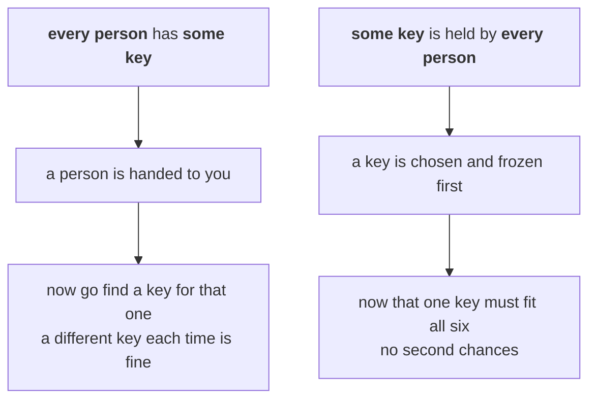

# Quantifiers: 'everyone' and 'someone', and why their order matters

[Syllabus](../../../SYLLABUS.md) → [Foundations](../README.md) → [Logic](../README.md#s05) → Everyone and someone

---

## General Overview

Six people share an office: Ana, Ben, Cara, Dev, Eve and Finn. Three keys hang by the door: front, store, server. Ana carries front and store. Ben and Dev carry front. Cara and Eve carry front and server. Finn carries store alone.

The manager says: **everyone has a key.** Walk the six people. Each is holding at least one. True.

The auditor asks something else: **is there one key that everyone has?** Now walk the keys. Front reaches five of six, missing Finn. Store reaches two, server two. No key reaches all six. False.

All that changed is which came first, "everyone" or "one key". Words like every, all and some are **quantifiers**: they say how much of a named group a claim covers.

**"Every person has some key" and "some key is held by every person" are different claims, and what separates them is which of the two you pick first.**

### The picture: which one you pick first



Left, the key is picked after the person, so it may change. Right, it is picked first and must cover the room.

---

## The formula

Nothing to memorise. Two symbols and an order.

- **∀** means "for all", "for every". A capital A upside down, for All.
- **∃** means "there exists", "at least one". A capital E backwards, for Exists.

The two claims:

**∀ person ∃ key: that person carries that key**

**∃ key ∀ person: that person carries that key**

Read left to right: each symbol is a choice made in that order.

| Symbol | Plain meaning | In our office |
| --- | --- | --- |
| ∀ | for all, for every — no exceptions | the six people |
| ∃ | there exists, at least one is enough | the three keys |
| the domain | the group a quantifier ranges over | six people; three keys |
| the property | what gets checked about each one | "carries that key" |

---

## Why it works

### Step 0: name the group, or the claim says nothing

Everyone in what? These six, in this office. That named group is the **domain**: what the claim ranges over. Change the domain and the claim changes, without a word of it moving.

### Step 1: "every" is a long and, "some" is a long or

The office is small, so the outer word writes out as a chain.

Everyone has a key: Ana has one **and** Ben **and** Cara **and** Dev **and** Eve **and** Finn. Six ands, one failure sinks the lot.

There is one key everyone has: front works **or** store **or** server. Three ors, one success carries it.

Each piece hides the other word: "Ana has one" is an or over three keys, "front works" an and over six.

Same and and or as [Statements and connectives](01-statements-and-connectives.md), stretched over a group.

### Step 2: the order decides whether the key may change

∀ person ∃ key. The person arrives first, then you go looking. Ana gets front, Finn gets store. Different people, different answers, because the search came after the person.

∃ key ∀ person. The key is named first and frozen. Everyone must fit it.

**Whatever is written second may depend on whatever is written first.**

### Step 3: one direction always carries, the other never does

Hand out a master key and everyone has a key, so ∃ then ∀ gives ∀ then ∃ for free. The reverse fails, and this office is the proof: everyone has a key, no master key.

To knock down a "for every" claim, hunt the one case that breaks it: [Negating a quantifier](05-negating-quantifiers-and-counterexamples.md).

---

## Worked numbers, by hand

The office, counted twice.

| Step | Counting | Value |
| --- | --- | --- |
| keys carried, person by person | 2 + 1 + 2 + 1 + 2 + 1 | 9 |
| the same carryings, key by key | 5 + 2 + 2 | 9 |
| people the front key reaches, of 6 | Ana, Ben, Cara, Dev, Eve | 5 |
| everyone has a key | nobody carries fewer than 1 | **True** |
| there is one key everyone has | best reach 5, not 6 | **False** |

Both are right: different questions.

### What breaks if you drop a piece

| Mistake | Comes out at | What went wrong |
| --- | --- | --- |
| Hearing the first claim as the second | 5 of 6 | You measured the master key: front reaches 5, Finn is the sixth. You call "everyone has a key" False. It is True |
| Shrinking the group to the five with front | 5 of 5, **True** | The claim never moved. The group did |
| Reading "some key" in the first claim as "exactly one key" | Ana fails, 5 of 6 | At least one is enough. Ana carries 2 and still counts |

The "one" in "there is one key everyone has" also means at least one.

---

## Code, from first principles, and it actually runs

Nothing is imported. The office is walked person by person: is some key on this ring? Then again key by key: does every person hold this one? The nine carryings, added across the people and again down the keys, are the cross-check. Then the room shrinks to the five who carry front, and the second claim flips.

### Python

```python
# Quantifiers -- the check behind the card.  Nothing is imported.  An office of
# six people and the three keys they carry.  Each claim is scanned twice: once
# across the people, once down the keys.
KEYS = ["front", "store", "server"]
OFFICE = ["Ana", "Ben", "Cara", "Dev", "Eve", "Finn"]
CARRIES = {"Ana": ["front", "store"], "Ben": ["front"], "Cara": ["front", "server"],
           "Dev": ["front"], "Eve": ["front", "server"], "Finn": ["store"]}
def keys_of(person): return len(CARRIES[person])                 # keys this one carries
def holders_of(key, people): return sum(1 for p in people if key in CARRIES[p])
def row(name, value): print(f"{name:<46}{str(value):>5}")
def verdicts(people, pad):              # the two claims, on whichever room we hand it
    reach = max(holders_of(k, people) for k in KEYS)
    has_key, master = min(keys_of(p) for p in people) >= 1, reach == len(people)
    row(pad + "everyone has a key", has_key)
    row(pad + "there is one key everyone has", master)
    row(pad + "largest reach of any one key", reach)
    return has_key, master, reach

across = sum(keys_of(p) for p in OFFICE)           # carryings, added across the people
down = sum(holders_of(k, OFFICE) for k in KEYS)    # the same carryings, added down keys
row(f"people {len(OFFICE)}, keys {len(KEYS)}, carryings added across", across)
print("keys carried, person by person   " + "  ".join(f"{p} {keys_of(p)}" for p in OFFICE))
print("people reached, key by key       " + "  ".join(f"{k} {holders_of(k, OFFICE)}" for k in KEYS))
row("the same carryings added down the keys", down)
full = verdicts(OFFICE, "")
print("shrink the office to the five who carry front")
small = verdicts(OFFICE[:5], "  ")
assert across == 9 and down == across
assert full == (True, False, 5) and small == (True, True, 5)
print("ALL CHECKS PASS")
```

**Ran 2026-09-06 on macOS, Python 3.14.6, standard library only. All checks passed. Output, pasted from the run:**

```
people 6, keys 3, carryings added across          9
keys carried, person by person   Ana 2  Ben 1  Cara 2  Dev 1  Eve 2  Finn 1
people reached, key by key       front 5  store 2  server 2
the same carryings added down the keys            9
everyone has a key                             True
there is one key everyone has                 False
largest reach of any one key                      5
shrink the office to the five who carry front
  everyone has a key                           True
  there is one key everyone has                True
  largest reach of any one key                    5
ALL CHECKS PASS
```

### Rust

Same numbers, same labels, built with `rustc --edition 2021 -O`.

```rust
// Quantifiers -- the same check as the Python one, in Rust.  No crates.  An
// office of six people and the three keys they carry.  Each claim is scanned
// twice: once across the people, once down the keys.
const KEYS: [&str; 3] = ["front", "store", "server"];
const OFFICE: [&str; 6] = ["Ana", "Ben", "Cara", "Dev", "Eve", "Finn"];
const CARRIES: [(&str, &[&str]); 6] = [("Ana", &["front", "store"]), ("Ben", &["front"]),
    ("Cara", &["front", "server"]), ("Dev", &["front"]), ("Eve", &["front", "server"]),
    ("Finn", &["store"])];
// held(person) is the keys on that person's ring; the rest counts them two ways.
fn held(p0: &str) -> &'static [&'static str] { CARRIES.iter().find(|(p, _)| *p == p0).unwrap().1 }
fn keys_of(person: &str) -> usize { held(person).len() }
fn holders_of(key: &str, people: &[&str]) -> usize { people.iter().filter(|p| held(p).contains(&key)).count() }
fn least(people: &[&str]) -> usize { people.iter().map(|p| keys_of(p)).min().unwrap() }
fn reach(people: &[&str]) -> usize { KEYS.iter().map(|k| holders_of(k, people)).max().unwrap() }
fn row(name: &str, value: &str) { println!("{:<46}{:>5}", name, value); }
fn yes(b: bool) -> &'static str { if b { "True" } else { "False" } }
fn verdicts(people: &[&str], pad: &str) -> (bool, bool, usize) {   // the two claims, any room
    let (has_key, r) = (least(people) >= 1, reach(people));
    row(&format!("{}everyone has a key", pad), yes(has_key));
    row(&format!("{}there is one key everyone has", pad), yes(r == people.len()));
    row(&format!("{}largest reach of any one key", pad), &r.to_string());
    (has_key, r == people.len(), r)
}

fn main() {
    let across: usize = OFFICE.iter().map(|p| keys_of(p)).sum();          // across the people
    let down: usize = KEYS.iter().map(|k| holders_of(k, &OFFICE)).sum();  // down the keys
    row(&format!("people {}, keys {}, carryings added across", OFFICE.len(), KEYS.len()), &across.to_string());
    let per_person: Vec<String> = OFFICE.iter().map(|p| format!("{} {}", p, keys_of(p))).collect();
    let per_key: Vec<String> = KEYS.iter().map(|k| format!("{} {}", k, holders_of(k, &OFFICE))).collect();
    println!("keys carried, person by person   {}", per_person.join("  "));
    println!("people reached, key by key       {}", per_key.join("  "));
    row("the same carryings added down the keys", &down.to_string());
    let full = verdicts(&OFFICE, "");
    println!("shrink the office to the five who carry front");
    let small = verdicts(&OFFICE[..5], "  ");
    assert!(across == 9 && down == across);
    assert!(full == (true, false, 5) && small == (true, true, 5));
    println!("ALL CHECKS PASS");
}
```

**Ran 2026-09-06 on macOS, rustc 1.98.1, no crates. All checks passed. Output, pasted from the run:**

```
people 6, keys 3, carryings added across          9
keys carried, person by person   Ana 2  Ben 1  Cara 2  Dev 1  Eve 2  Finn 1
people reached, key by key       front 5  store 2  server 2
the same carryings added down the keys            9
everyone has a key                             True
there is one key everyone has                 False
largest reach of any one key                      5
shrink the office to the five who carry front
  everyone has a key                           True
  there is one key everyone has                True
  largest reach of any one key                    5
ALL CHECKS PASS
```

The two outputs match line for line: counts, nothing to round.

> [!TIP]
> **Try changing**
> Guess first, then run it. The asserts are pinned to this office, so an assert fires the moment the carryings change.
> - **Give Finn the front key.** Front then reaches all six, so "there is one key everyone has" turns True on the full office.
> - **Leave Finn's ring empty.** "Everyone has a key" turns False; the fewest keys anyone carries drops to nothing.

---

## The usual mistake

> [!warning]
> **Swapping the two words and assuming nothing happened.** "Everyone has a key" and "there is one key everyone has" are not the same claim. The first is an ordinary office. The second is a master key. Aloud they sound almost identical.
>
> - **Leaving the group unnamed.** Shrink this office to the five who carry front and the second claim turns True.
> - **Reading "there is" as "exactly one".** It means at least one.
> - **Thinking "every" is the easy one.** It is the strict one: one failure kills it. "Some" needs one success.

---

## Where you meet it in real life

- **Account security.** Every user reaches some server is normal. One account reaching every server is an administrator, and a target.
- **Warranties.** Every fault is covered by some clause is a good warranty. Hearing that as one clause covering every fault leaves people uncovered.
- **Promises.** Everyone has a lift home is easy. One car taking everyone home needs a bigger car.

> **Say it back**
> ∀ means for every, no exceptions. ∃ means at least one. Neither means anything without a named group. Read left to right: whatever comes second may depend on whatever came first. "Every person has some key" lets the key change. "Some key is held by every person" freezes one key first. Here the first is true, the second false.

---

## What this builds on

- [Logical equivalence and De Morgan](03-logical-equivalence-and-de-morgan.md): how a "not" moves through an and or an or — the two words a quantifier stretches over a group.

## Where this goes next

- [Negating a quantifier](05-negating-quantifiers-and-counterexamples.md): disproving each claim, and why one counterexample settles "every".
- [Induction](../06-Proof/04-proof-by-induction.md): proving a "for every" claim about an endless list, one rung at a time.
- [Sets](../07-Sets/01-sets-and-membership.md): writing the domain down as a set, so it never goes unsaid.

---

## Sources

Verified 6 Sep 2026; every link resolves.

- Velleman, Daniel J. *How to Prove It*, 3rd ed. Cambridge University Press, 2019. [doi:10.1017/9781108539890](https://doi.org/10.1017/9781108539890). Chapter 2 is this card done carefully.
- Westerståhl, Dag. "Generalized Quantifiers." *Stanford Encyclopedia of Philosophy*, revised 2024. [Entry page](https://plato.stanford.edu/entries/generalized-quantifiers/). Every and some among the counting words.
- Magnus, P. D., Tim Button and others. *forall x: Calgary*. Open Logic Project. [Book site](https://forallx.openlogicproject.org/). A free textbook named after the symbol.
