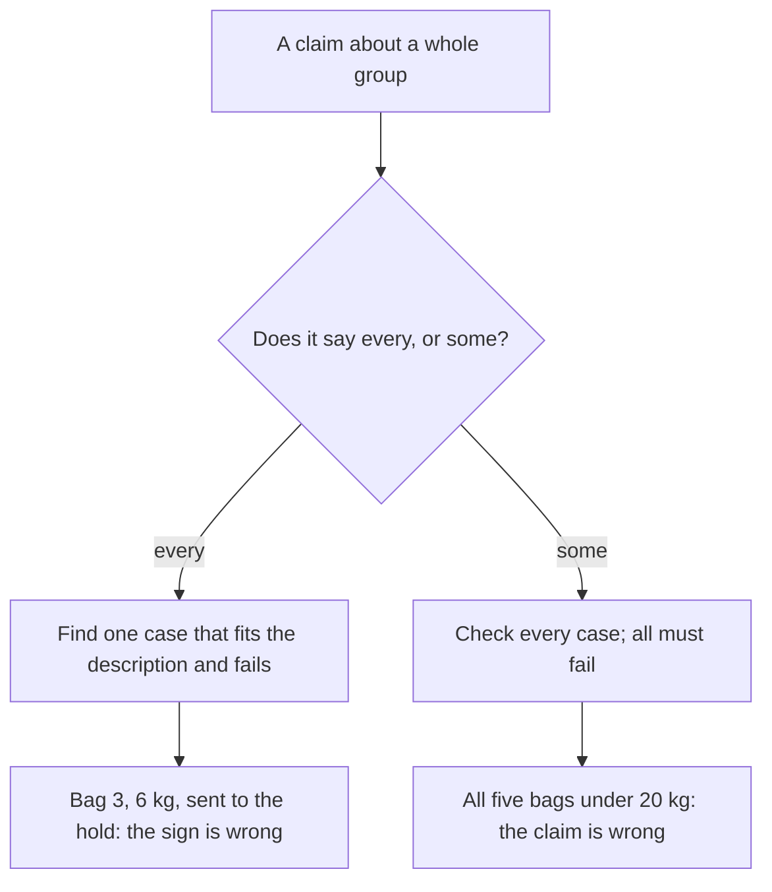

# Negating a quantifier: to disprove 'every', find one; to disprove 'some', check them all

[Syllabus](../../../SYLLABUS.md) → [Foundations](../README.md) → [Logic](../README.md#s05) → Negating a quantifier

---

## General Overview

A sign at the boarding gate says: **every bag under 7 kg goes in the cabin.**

Five bags come through, bags 1 to 5: 4, 5, 6, 9 and 11 kg. The 4 and the 5 go in the cabin. The 9 and the 11 are over the limit, so the sign never promised them anything. Bag 3, at 6 kg, is refused: it goes to the hold under the plane.

That one bag settles it. The sign is wrong, and stays wrong however many light bags pass tomorrow. A **counterexample** is a bag the sign covers that breaks it.

Now flip it. A passenger says: **some bag here is over 20 kg.** One bag under 20 kg proves nothing. Four prove nothing. Only when all five are under 20 kg is that claim dead.

**A claim about "every" dies to one case; a claim about "some" only dies when you have checked all of them.**

### The picture: what evidence kills a claim



The two sides cost different work.

---

## The formula

The two statements, written out:

**not (every bag under 7 kg goes in the cabin) = some bag under 7 kg does not go in the cabin**

**not (some bag here is over 20 kg) = every bag here is 20 kg or under**

**Read it aloud:** not-every is some-not; not-some is every-not. When "not" walks in, "every" and "some" trade places.

| Piece | Plain meaning | In our example |
| --- | --- | --- |
| the group | what the claim is about | the five bags at this gate |
| every | true of all of them | all three light bags went in |
| some | true of at least one | at least one bag is over 20 kg |
| not | flips true to false, and back | the sign is wrong |
| the description | which things are covered | "under 7 kg" |
| a counterexample | one case it covers that fails | bag 3: 6 kg, refused |

The description survives the flip: the negation is "some bag **under 7 kg** was refused".

---

## Why it works

### Every is a long "and", some is a long "or"

Three bags are under 7 kg: bags 1, 2 and 3. Spell the sign out with no quantifier words:

*bag 1 went in the cabin **and** bag 2 went in **and** bag 3 went in*

That is what "every" means on a group you can list. "Some bag under 7 kg was refused" is the same thing with "or":

*bag 1 was refused **or** bag 2 was refused **or** bag 3 was refused*

### Move the "not" through

De Morgan, from [Logical equivalence and De Morgan](03-logical-equivalence-and-de-morgan.md), turns a "not" outside an "and" into an "or":

not (A and B and C) = (not A) or (not B) or (not C)

The left side is "the sign is wrong". The right side reads back as *some* bag under 7 kg was refused. The "and" became an "or", so "every" became "some". The mirror law, not (A or B or C) = (not A) and (not B) and (not C), takes "no bag is over 20 kg" to "bag 1 is 20 kg or under **and** bag 2 is **and**…": "some" became "every".

### Why one side is cheap

An "and" chain dies the moment one part dies, so one counterexample finishes an "every" claim. An "or" chain lives as long as one part lives, so a "some" needs every part knocked out: four bags under 20 kg tell you nothing while the fifth is unweighed.

---

## Worked numbers, by hand

The gate, in kilograms throughout.

| Step | Arithmetic | Value |
| --- | --- | --- |
| bags at the gate | 4, 5, 6, 9, 11 | 5 |
| the ones the sign covers | bags 1, 2, 3 | 3 |
| of those, in the cabin | bags 1 and 2 | 2 |
| of those, refused | bag 3, at 6 kg | 1 |
| every bag under 7 kg in the cabin? | 1 refused, not 0 | **F** |
| some bag under 7 kg refused? | 1 refused, at least 1 | **T** |
| some bag over 20 kg? | biggest is 11 | **F** |
| every bag 20 kg or under? | all 5 under | **T** |

The sign is wrong, and proving it cost one bag. The passenger is wrong too, and that cost all five.

### What breaks if you drop a piece

| Mistake | What you get | What went wrong |
| --- | --- | --- |
| Reading "not every light bag got in" as "every light bag was refused" | F, where the truth is T | Two of the three light bags did get in. |
| Killing "some bag is over 20 kg" with one bag | nothing settled after 1 bag; it takes all 5 | A "some" outlives every case but the last. |
| Counting the 9 and 11 kg bags against the sign | the sign covered 3 bags | Heavy bags sit outside the description. |

---

## Code, from first principles, and it actually runs

Nothing is imported. The gate is worked twice: "every" and "some" read straight off the list of five bags, then checked by counting the bags that broke the sign. Both swaps then run over all eight ways the three light bags could have gone.

### Python

```python
# Negating a quantifier -- the check behind the card.  Nothing is imported.
# Five bags at the gate: weight in kg, and whether each one went in the cabin.
# Road 1 reads every/some straight off the list; road 2 counts.  They agree.
KG = [4, 5, 6, 9, 11]
CABIN = [True, True, False, False, False]
LIGHT = [i for i in range(len(KG)) if KG[i] < 7]     # the bags the sign is about
BROKE = [i for i in LIGHT if not CABIN[i]]           # the ones that break the sign
tf = lambda b: "T" if b else "F"
def row(name, b): print(f"{name:<37}{tf(b):>2}")
every_in, some_out = all(CABIN[i] for i in LIGHT), any(not CABIN[i] for i in LIGHT)
some_big, every_small = any(w > 20 for w in KG), all(w <= 20 for w in KG)
every_out = all(not CABIN[i] for i in LIGHT)         # the wreck: not-every read as every-not
print(f"{'bags at the gate, in kg':<24}" + "".join(f"{w:>3}" for w in KG))
print(f"{'did it go in the cabin?':<24}" + "".join(f"{'Y' if c else 'N':>3}" for c in CABIN))
print(f"bags under 7 kg {len(LIGHT)}: in the cabin {len(LIGHT) - len(BROKE)}, refused {len(BROKE)}")
row("every bag under 7 kg in the cabin?", every_in)
row("some bag under 7 kg refused?", some_out)
row("some bag over 20 kg?", some_big)
row("every bag 20 kg or under?", every_small)
row("the wreck, every under-7 bag refused", every_out)
print(f"counterexample: bag {BROKE[0]+1} at {KG[BROKE[0]]} kg; 1 bag kills 'every', {len(KG)} to kill 'some'" if BROKE else "no counterexample: the sign stands")
n = 0
for p in [(a, b, c) for a in (0, 1) for b in (0, 1) for c in (0, 1)]:
    assert (not all(p)) == any(not q for q in p) and (not any(p)) == all(not q for q in p)
    n += 1
print(f"all {n} yes/no patterns for the light bags: both swaps hold")
assert len(LIGHT) == 3 and len(BROKE) == 1 and KG[BROKE[0]] == 6
assert every_in == (len(BROKE) == 0) and some_out == (len(BROKE) >= 1)   # road 2: counts
assert every_in is False and some_out is True and every_out is False and some_big is False
print("ALL CHECKS PASS")
```

**Ran 2026-09-06 on macOS, Python 3.14.6, standard library only. All checks passed. Output, pasted from the run:**

```
bags at the gate, in kg   4  5  6  9 11
did it go in the cabin?   Y  Y  N  N  N
bags under 7 kg 3: in the cabin 2, refused 1
every bag under 7 kg in the cabin?    F
some bag under 7 kg refused?          T
some bag over 20 kg?                  F
every bag 20 kg or under?             T
the wreck, every under-7 bag refused  F
counterexample: bag 3 at 6 kg; 1 bag kills 'every', 5 to kill 'some'
all 8 yes/no patterns for the light bags: both swaps hold
ALL CHECKS PASS
```

### Rust

Same numbers, same labels, built with `rustc --edition 2021 -O`.

```rust
// Negating a quantifier -- the same check as the Python one, in Rust.  No crates.
// Five bags at the gate: weight in kg, and whether each one went in the cabin.
// Road 1 reads every/some straight off the list; road 2 counts.  They agree.
const KG: [i64; 5] = [4, 5, 6, 9, 11];
const CABIN: [bool; 5] = [true, true, false, false, false];
fn tf(b: bool) -> &'static str { if b { "T" } else { "F" } }
fn row(name: &str, b: bool) { println!("{:<37}{:>2}", name, tf(b)); }
fn main() {
    let light: Vec<usize> = (0..KG.len()).filter(|&i| KG[i] < 7).collect();  // the bags the sign is about
    let broke: Vec<usize> = light.iter().cloned().filter(|&i| !CABIN[i]).collect();
    let (every_in, some_out) = (light.iter().all(|&i| CABIN[i]), light.iter().any(|&i| !CABIN[i]));
    let (some_big, every_small) = (KG.iter().any(|&w| w > 20), KG.iter().all(|&w| w <= 20));
    let every_out = light.iter().all(|&i| !CABIN[i]);                  // the wreck
    let mut kgs = format!("{:<24}", "bags at the gate, in kg");
    for w in KG { kgs.push_str(&format!("{:>3}", w)); }
    println!("{}", kgs);
    let mut yn = format!("{:<24}", "did it go in the cabin?");
    for c in CABIN { yn.push_str(&format!("{:>3}", if c { "Y" } else { "N" })); }
    println!("{}", yn);
    println!("bags under 7 kg {}: in the cabin {}, refused {}", light.len(), light.len() - broke.len(), broke.len());
    row("every bag under 7 kg in the cabin?", every_in);
    row("some bag under 7 kg refused?", some_out);
    row("some bag over 20 kg?", some_big);
    row("every bag 20 kg or under?", every_small);
    row("the wreck, every under-7 bag refused", every_out);
    println!("{}", broke.first().map_or("no counterexample: the sign stands".to_string(),
        |&b| format!("counterexample: bag {} at {} kg; 1 bag kills 'every', {} to kill 'some'", b + 1, KG[b], KG.len())));
    let mut n = 0;
    for p in 0..8 {
        let q = [p & 1 == 1, p & 2 == 2, p & 4 == 4];
        assert!((!q.iter().all(|&v| v)) == q.iter().any(|&v| !v)
                && (!q.iter().any(|&v| v)) == q.iter().all(|&v| !v));
        n += 1;
    }
    println!("all {} yes/no patterns for the light bags: both swaps hold", n);
    assert!(light.len() == 3 && broke.len() == 1 && KG[broke[0]] == 6);
    assert!(every_in == broke.is_empty() && !broke.is_empty() == some_out);   // road 2: counts
    assert!(!every_in && some_out && !every_out && !some_big);
    println!("ALL CHECKS PASS");
}
```

**Ran 2026-09-06 on macOS, rustc 1.98.1, no crates. All checks passed. Output, pasted from the run:**

```
bags at the gate, in kg   4  5  6  9 11
did it go in the cabin?   Y  Y  N  N  N
bags under 7 kg 3: in the cabin 2, refused 1
every bag under 7 kg in the cabin?    F
some bag under 7 kg refused?          T
some bag over 20 kg?                  F
every bag 20 kg or under?             T
the wreck, every under-7 bag refused  F
counterexample: bag 3 at 6 kg; 1 bag kills 'every', 5 to kill 'some'
all 8 yes/no patterns for the light bags: both swaps hold
ALL CHECKS PASS
```

The two outputs match line for line.

> [!TIP]
> **Try changing**
> Guess first, then run it. The asserts are pinned to the gate above, so expect one to fire.
> - **Let bag 3 through.** Set the third entry of the cabin list to true. The sign survives, the "every" row turns T, and no counterexample is left.
> - **Add a 25 kg bag.** Put 25 on the weight list and false on the cabin list. "Some bag over 20 kg?" turns T — one bag did it, because that claim was a "some".

---

## The usual mistake

> [!warning]
> **Moving the "not" in and leaving "every" alone.** "Not every light bag got in" is not "every light bag was refused". The second is a far stronger claim, and here flatly false: bags 1 and 2 did get in. The check prints it as F on the wreck row, beside the true negation at T.
>
> - Dropping the description. Bags 4 and 5 were refused and prove nothing.
> - Killing a "some" claim with one case. One bag under 20 kg leaves it standing; it takes all 5.
> - *Proving* an "every" claim with one case. Bag 1 sailing through does not save the sign.

---

## Where you meet it in real life

- **Warranties.** "Every fault in the first year is covered" is beaten by one covered fault they refused.
- **Arguments.** "Everyone does it" needs one person who does not; "someone must have known" needs everyone cleared: [Valid arguments](06-valid-arguments.md).
- **Testing anything.** One failing case shows a rule is broken. No failing case shows only that you have not found one.

> **Say it back**
> "Every" is a long "and"; "some" is a long "or". Put a "not" in front and they trade places: not-every is some-not, not-some is every-not. Stacked claims: flip each one in turn, keep the order. One counterexample kills an "every"; only a full sweep kills a "some". One 6 kg bag in the hold beat the sign.

---

## What this builds on

- [Quantifiers](04-quantifiers.md): what "every" and "some" claim, and why their order matters once you stack them.

## Where this goes next

- [Valid arguments](06-valid-arguments.md): what follows from a claim once you know whether it is an "every" or a "some".

---

## Sources

Verified 6 Sep 2026; every link resolves.

- Hammack, Richard. *Book of Proof*, 3rd ed., 2018. [Book page](https://richardhammack.github.io/BookOfProof/). Section 2.10: both swaps and the counterexample rule.
- Shapiro, Stewart, and Teresa Kouri Kissel. "Classical Logic." *Stanford Encyclopedia of Philosophy*. [plato.stanford.edu/entries/logic-classical](https://plato.stanford.edu/entries/logic-classical/). Why the swaps are guaranteed.
- Velleman, Daniel J. *How to Prove It*, 3rd ed. Cambridge University Press, 2019. [doi:10.1017/9781108539890](https://doi.org/10.1017/9781108539890). Section 2.2, the negation rules for quantifiers (paid).
