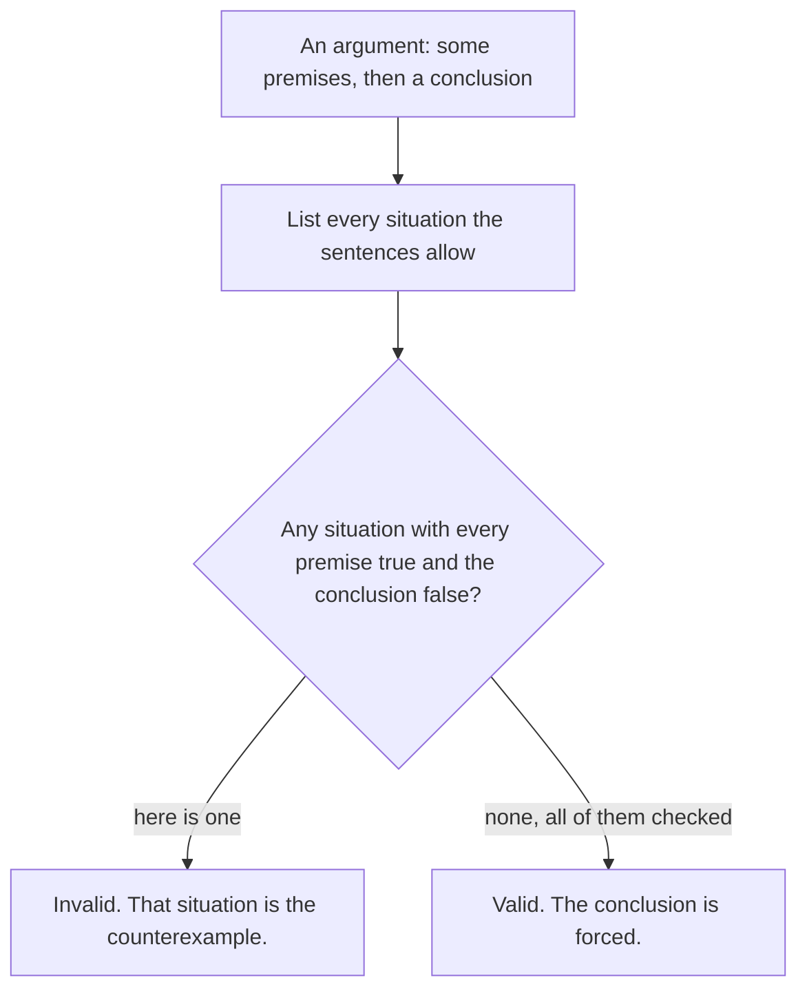

# Valid arguments: modus ponens, modus tollens, and the two look-alikes that fail

[Syllabus](../../../SYLLABUS.md) → [Foundations](../../../SYLLABUS.md#w01) → [Logic](../../../SYLLABUS.md#w01-s05) → Valid arguments

---

## General Overview

The lease says: **"If the rent is late, a $50 fee applies."** Four tenants write in.

- **Rosa.** "My rent was late. So the $50 fee applies."
- **Sam.** "There is no fee on my account. So my rent was not late."
- **Tess.** "There is a fee on my account. So my rent was late."
- **Vic.** "My rent was not late. So there is no fee."

Two are airtight. Two are not, and one situation sinks both: a tenant who paid on time, charged $50 for a lost mailbox key. The lease said a late rent brings a fee. It never said only a late rent does.

Each tenant takes something as given, a premise, and says something follows, a conclusion. That is an argument.

**An argument is valid when no situation makes every premise true and the conclusion false. Testing one means hunting for that situation, not asking whether the sentences are true.**

### The picture: the whole test



---

## The formula

Rosa's argument **is** the formula.

**The lease rule, plus "the rent was late", forces "the $50 fee applies": the one situation that would break it, a late rent with no fee, is the one the rule forbids.**

**Read it aloud:** if the promise holds and the first half happened, the second half cannot fail.

- **Modus ponens** (Latin, "the way that affirms"): the rule, plus the if part happened, gives the then part.
- **Modus tollens** ("the way that denies"): the rule, plus the then part missing, gives the if part missing too.

| Piece | Plain meaning | In the lease |
| --- | --- | --- |
| a premise | something taken as given | the rule; "my rent was late" |
| the conclusion | what is claimed to follow | "the $50 fee applies" |
| a situation | one way the facts could stand | four in all |
| valid | no situation has premises true, conclusion false | Rosa's and Sam's |
| a counterexample | one situation that does | on time, charged for a key |
| sound | valid, and the premises true too | Rosa's, if the lease says so |

---

## Why it works

### Four situations, and that is the whole world

The rent was late or it was not. The fee was charged or it was not: 4 situations. Write 1 for yes, 0 for no, in the order (late, fee).

The rule is false in exactly one, (1, 0): late rent, no fee. The other three leave it standing ([If-then](02-if-then.md)). Which one is real does not matter. Validity asks only whether any of the four has the premises holding and the conclusion failing.

### Rosa forward through the rule, Sam backwards

Rosa's premises are the rule and late = 1. Only (1, 1) satisfies both: (1, 0) makes the rule false. Her conclusion, fee = 1, is true in (1, 1). No counterexample. Valid.

Sam's premises are the rule and fee = 0. Of the two with no fee, (1, 0) breaks the rule, leaving (0, 0), where his conclusion holds. Valid. He walks the contrapositive: both halves flipped and swapped, no fee so not late ([If-then](02-if-then.md)).

### Tess and Vic, the look-alikes

Tess's premises are the rule and fee = 1. Two fit, (0, 1) and (1, 1). In (0, 1) both premises hold and her conclusion is false: the on-time tenant charged for the key. Invalid. The name is **affirming the consequent** (the then part), read as proof of the if part.

Vic's premises are the rule and late = 0. Two fit, (0, 0) and (0, 1). In (0, 1) his conclusion is false. Tess's situation again; the name is **denying the antecedent** (the if part). That hunt is the counterexample move from [Negating a quantifier](05-negating-quantifiers-and-counterexamples.md), aimed at an argument.

### Valid is not true

Valid means forced *if* the premises hold. Had the lease never carried that line, Rosa reasons faultlessly and owes nothing. Valid plus true premises is **sound**.

---

## Worked numbers, by hand

The four situations again.

| Step | Reason | Value |
| --- | --- | --- |
| situations to check | late or not, fee or not | 4 |
| ruled out by the lease rule | only (1, 0) | 1 |
| Rosa, modus ponens | holds in (1, 1) | 1 hold, **0** bad |
| Sam, modus tollens | holds in (0, 0) | 1 hold, **0** bad |
| Tess, affirming the consequent | holds in (0, 1), (1, 1) | 2 hold, **1** bad |
| Vic, denying the antecedent | holds in (0, 0), (0, 1) | 2 hold, **1** bad |

"Bad" means a counterexample. Rosa and Sam can hold the landlord to the lease; Tess and Vic cannot. Swap in any promise: the four situations and four verdicts do not change. Only the shape matters.

### What breaks if you drop a piece

| Mistake | Comes out at | What went wrong |
| --- | --- | --- |
| Reading the rule backwards (Tess) | 1 counterexample | a fee can arrive without a late rent: (0, 1) |
| Flipping both halves without swapping (Vic) | 1 counterexample | the same situation: (0, 1) |

---

## Code, from first principles, and it actually runs

Nothing is imported. Each argument walks all four situations: count where every premise holds, then how many leave the conclusion false. The second route rebuilds the rule as "not late, or a fee" and walks them again.

### Python

```python
# Valid arguments -- the check behind the card.  Nothing is imported.  The
# landlord's rule: "if the rent is late, a $50 fee applies."  Four tenants
# argue from it.  1 for yes, 0 for no, over every case of (late, fee).
CASES = [(0, 0), (0, 1), (1, 0), (1, 1)]

def rule(late, fee):        # the rule, broken only by a late rent and no fee
    return 0 if late == 1 and fee == 0 else 1
def or_rule(late, fee):     # the second route: the same rule as "not late, or a fee"
    return 1 if late == 0 or fee == 1 else 0
def bad_rows(arg, r):       # cases where every premise holds and the conclusion fails
    return [c for c in CASES if all(arg[1](r, *c)) and not arg[2](*c)]
ARGS = [("Rosa  (ponens)", lambda r, l, f: [r(l, f), l], lambda l, f: f),
        ("Sam   (tollens)", lambda r, l, f: [r(l, f), 1 - f], lambda l, f: 1 - l),
        ("Tess  (consequent)", lambda r, l, f: [r(l, f), f], lambda l, f: l),
        ("Vic   (antecedent)", lambda r, l, f: [r(l, f), 1 - l], lambda l, f: 1 - f)]
print(f"{'argument':<19}{'premises hold':>14}{'counterexamples':>16}{'verdict':>9}{'second route':>14}")
holds, bad, second = [], [], []
for arg in ARGS:
    holds.append(sum(1 for c in CASES if all(arg[1](rule, *c))))
    bad.append(len(bad_rows(arg, rule)))
    second.append(len(bad_rows(arg, or_rule)))
    print(f"{arg[0]:<19}{holds[-1]:>14}{bad[-1]:>16}{'VALID' if not bad[-1] else 'INVALID':>9}{second[-1]:>14}")
rule_false = sum(1 for c in CASES if not rule(*c))
print(f"cases checked {len(CASES)}")
print(f"the rule by itself is false on cases {rule_false}")
print(f"both look-alikes fail on the same case: late {bad_rows(ARGS[2], rule)[0][0]}, fee {bad_rows(ARGS[2], rule)[0][1]}")
assert holds == [1, 1, 2, 2] and bad == second
assert bad == [0, 0, 1, 1] and rule_false == 1
assert bad_rows(ARGS[2], rule) == [(0, 1)] and bad_rows(ARGS[3], rule) == [(0, 1)]
print("ALL CHECKS PASS")
```

**Ran 2026-09-06 on macOS, Python 3.14.6, standard library only. All checks passed. Output, pasted from the run:**

```
argument            premises hold counterexamples  verdict  second route
Rosa  (ponens)                  1               0    VALID             0
Sam   (tollens)                 1               0    VALID             0
Tess  (consequent)              2               1  INVALID             1
Vic   (antecedent)              2               1  INVALID             1
cases checked 4
the rule by itself is false on cases 1
both look-alikes fail on the same case: late 0, fee 1
ALL CHECKS PASS
```

### Rust

Same numbers and labels, built with `rustc --edition 2021 -O`.

```rust
// Valid arguments -- the same check as valid_arguments_check.py, in Rust.  No
// crates.  The landlord's rule: "if the rent is late, a $50 fee applies."
// Four tenants argue from it.  1 for yes, 0 for no, over every (late, fee).
const CASES: [(i64, i64); 4] = [(0, 0), (0, 1), (1, 0), (1, 1)];
type Rule = fn(i64, i64) -> i64;
type Arg = (&'static str, fn(Rule, i64, i64) -> [i64; 2], fn(i64, i64) -> i64);
fn rule(late: i64, fee: i64) -> i64 {      // the rule, broken only by a late rent and no fee
    if late == 1 && fee == 0 { 0 } else { 1 }
}
fn or_rule(late: i64, fee: i64) -> i64 {   // the second route: the same rule as "not late, or a fee"
    if late == 0 || fee == 1 { 1 } else { 0 }
}
fn holds(arg: &Arg, r: Rule, l: i64, f: i64) -> bool { (arg.1)(r, l, f).iter().all(|&p| p == 1) }
fn bad_rows(arg: &Arg, r: Rule) -> Vec<(i64, i64)> {   // premises all hold, conclusion fails
    CASES.iter().cloned().filter(|&(l, f)| holds(arg, r, l, f) && (arg.2)(l, f) == 0).collect()
}
fn main() {
    let args: [Arg; 4] = [("Rosa  (ponens)", |r, l, f| [r(l, f), l], |_l, f| f),
        ("Sam   (tollens)", |r, l, f| [r(l, f), 1 - f], |l, _f| 1 - l),
        ("Tess  (consequent)", |r, l, f| [r(l, f), f], |l, _f| l),
        ("Vic   (antecedent)", |r, l, f| [r(l, f), 1 - l], |_l, f| 1 - f)];
    println!("{:<19}{:>14}{:>16}{:>9}{:>14}", "argument", "premises hold", "counterexamples", "verdict", "second route");
    let (mut fits, mut bad, mut second) = (Vec::new(), Vec::new(), Vec::new());
    for arg in &args {
        fits.push(CASES.iter().filter(|&&(l, f)| holds(arg, rule, l, f)).count());
        bad.push(bad_rows(arg, rule).len());
        second.push(bad_rows(arg, or_rule).len());
        let verdict = if bad[bad.len() - 1] == 0 { "VALID" } else { "INVALID" };
        println!("{:<19}{:>14}{:>16}{:>9}{:>14}", arg.0, fits[fits.len() - 1], bad[bad.len() - 1], verdict, second[second.len() - 1]);
    }
    let rule_false = CASES.iter().filter(|&&(l, f)| rule(l, f) == 0).count();
    println!("cases checked {}", CASES.len());
    println!("the rule by itself is false on cases {}", rule_false);
    let killer = bad_rows(&args[2], rule)[0];
    println!("both look-alikes fail on the same case: late {}, fee {}", killer.0, killer.1);
    assert!(fits == vec![1, 1, 2, 2] && bad == second);
    assert!(bad == vec![0, 0, 1, 1] && rule_false == 1);
    assert!(bad_rows(&args[2], rule) == vec![(0, 1)] && bad_rows(&args[3], rule) == vec![(0, 1)]);
    println!("ALL CHECKS PASS");
}
```

**Ran 2026-09-06 on macOS, rustc 1.98.1, no crates. All checks passed. Output, pasted from the run:**

```
argument            premises hold counterexamples  verdict  second route
Rosa  (ponens)                  1               0    VALID             0
Sam   (tollens)                 1               0    VALID             0
Tess  (consequent)              2               1  INVALID             1
Vic   (antecedent)              2               1  INVALID             1
cases checked 4
the rule by itself is false on cases 1
both look-alikes fail on the same case: late 0, fee 1
ALL CHECKS PASS
```

> [!TIP]
> **Try changing**
> Guess first, then run it.
> - **Repair Tess.** In her row swap the second premise `f` for `l`. She becomes Rosa: counterexamples fall to 0.
> - **Delete the promise.** Make `rule` return 1 always. All four arguments turn INVALID, 1 counterexample each.
>
> Either edit ends in an error, not ALL CHECKS PASS: an IndexError for Tess, no bad case left for the last line to print; an AssertionError for the promise.

---

## The usual mistake

> [!warning]
> **Treating the conclusion's plausibility as the test.** Tess may well have paid late. Her argument is still invalid: a lost key produces the same $50, so her premises do not force it.
>
> - Affirming the consequent is the common one: fee present, so the rent was late. It dies on (0, 1).
> - Denying the antecedent dies on that same situation. Flipping both halves works only if you swap them too — the contrapositive, which is Sam.
> - Counting a situation where a premise is false, (1, 0) for Rosa, settles nothing.

---

## Where you meet it in real life

- **Test results.** "If you have the illness, the test reads positive." If that held exactly, a negative rules it out: modus tollens. A positive does not prove it — that is Tess, which is why it gets a second test.
- **Fixing things.** "If the fuse blew, the lamp is dead." Lamp working, so the fuse held. A dead lamp proves nothing; the bulb could be gone.
- **Small print.** Leases, warranties and tickets are if-then promises ([If-then](02-if-then.md)); most arguments about them are Tess in disguise.

> **Say it back**
> An argument is valid when no situation makes every premise true and the conclusion false. To test one, list the situations the premises allow and hunt for the bad one. The rule plus a late rent forces the fee: modus ponens. The rule plus no fee forces a rent that was not late: modus tollens. Both look-alikes read the rule backwards and die on the tenant charged for a key.

---

## What this builds on

- [If-then](02-if-then.md): the rule, the one situation that breaks it, and the contrapositive Sam walks.
- [Negating a quantifier](05-negating-quantifiers-and-counterexamples.md): one case kills a claim about all of them — the same hunt.

## Where this goes next

- [Direct proof](../06-Proof/01-direct-proof.md): stringing these forced steps together until the last is what you set out to show.

---

## Sources

Verified 6 Sep 2026; every link resolves.

- Hammack, Richard. *Book of Proof*, 3rd ed. [Book home](https://richardhammack.github.io/BookOfProof/) · [free PDF](https://richardhammack.github.io/BookOfProof/Main.pdf). Chapter 2.
- Magnus, P.D., et al. *forall x: Calgary*. Open Logic Project. [Book home](https://forallx.openlogicproject.org/) · [free PDF](https://forallx.openlogicproject.org/forallxyyc.pdf). Free; validity and both fallacies.
- Beall, Jc, Greg Restall and Gil Sagi. "Logical Consequence." *Stanford Encyclopedia of Philosophy*, revised 2024. [plato.stanford.edu/entries/logical-consequence](https://plato.stanford.edu/entries/logical-consequence/). Free; what "follows from" means.
