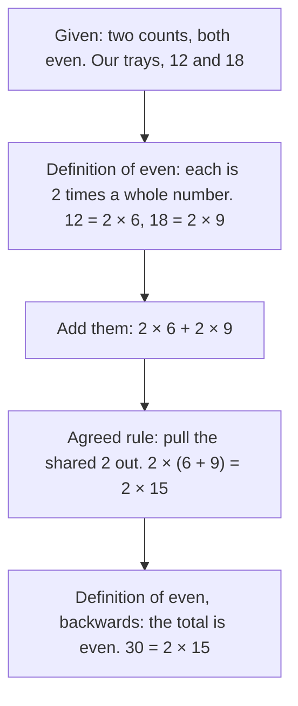

# Direct proof: what a proof is, and the straight-line kind

[Syllabus](../../../SYLLABUS.md) → [Foundations](../../../SYLLABUS.md#w01) → [Proof](../../../SYLLABUS.md#w01-s06) → What a proof is

---

## General Overview

An egg tray holds 12: two rows of six. A second holds 18: two rows of nine. Tip both into one bowl and you have 30 — two rows of fifteen. Any two trays that each split into two equal rows do the same.

A count that splits into two equal whole rows is **even**. The claim: two even counts add to an even count. Check trays all night and you still cannot know. Four lines settle it for every pair there will ever be. Those lines are a **proof**.

**A proof is a chain from agreed meanings to the claim, with no step anyone can object to. A direct proof is that chain walked forwards: given to wanted, no detours.**

### The picture: the chain



---

## The formula

The proof itself is the formula. On our trays:

**12 + 18 = 2 × 6 + 2 × 9 = 2 × (6 + 9) = 2 × 15 = 30**

Letters cover every pair at once. Let m and n be the counts, a and b their row lengths:

**m + n = 2 × a + 2 × b = 2 × (a + b)**

**Read it aloud:** each count is a doubling, so the total is a doubling too.

| Piece | Plain meaning | In our trays |
| --- | --- | --- |
| a definition | an agreed meaning | even: two equal rows |
| an axiom | a rule taken as given | a shared 2 pulls out |
| a theorem | a claim proved from those | two evens add to an even |
| m, n, a, b | the two counts, then their row lengths | 12, 18; 6, 9 |
| a proof | the chain, no gaps | the steps below |

---

## Why it works

### Step 0: what you may start from

**Definitions** fix what a word means. Even: splits into two equal whole rows. A decision made in advance, so nobody can wriggle.

**Axioms** are starting rules, taken as given, never proved. Two here: whole numbers added give a whole number, and a shared 2 pulls out of a sum ([The three rearranging laws](../01-Everyday%20Arithmetic/05-arithmetic-laws.md)).

**Theorems** are what you build. Once proved, a theorem is reused without being re-argued.

A **direct proof** takes the *if* part, unpacks it with a definition, pushes on with agreed rules, and stops once the *then* part is on the page.

### Step 1: unpack what you were given

Assume both counts are even. Call them m and n. Each is two equal whole rows, so m = 2 × a and n = 2 × b, with a and b whole numbers. Here a is 6, b is 9.

### Step 2: add, pull the 2 out, read the definition backwards

m + n = 2 × a + 2 × b = 2 × (a + b).

a + b is a whole number. So the total is 2 times a whole number: two equal whole rows. That is what even means. The claim is on the page.

The proof never named 12 or 18. The letters did every pair at once.

### Step 3: split into cases when one chain will not do

A chessboard is 8 rows of 8, coloured alternately. Claim: 32 squares black, 32 white. Every row starts on one colour or the other — two possibilities, no third.

- **Starts black.** Black, white, black, white, and on: 4 black, 4 white.
- **Starts white.** Same eight squares, colours swapped: 4 black, 4 white.

Either way 4 and 4. Each of the 8 rows gives 4 and 4: 8 × 4 = 32 black and 32 white.

That is the move: split the possibilities so nobody is left out, then prove the claim in each. A gap is fatal: take only the black-starting rows and you have proved half a board.

---

## Worked numbers, by hand

| Step | Arithmetic | Value |
| --- | --- | --- |
| the trays, split | 2 × 6, 2 × 9 | 12, 18 |
| tipped in one bowl | 12 + 18 | 30 |
| the proof's step | 2 × (6 + 9) | **30** |
| every row, 4 and 4 | 8 × 4 | **32 black, 32 white** |

Thirty eggs in two rows of fifteen; the board, 32 and 32.

### What breaks if you drop a piece

| Mistake | Comes out at | What went wrong |
| --- | --- | --- |
| One tray odd: 12 + 15 | 27 — 13 pairs, 1 over | 15 is not even; nothing starts |
| Only rows starting black | 16, not 32 | A row kind got no case |
| The 2 pulled from one part: 2 × 6 + 9 | 21, not 30 | Both parts carry the 2 |

---

## Code, from first principles, and it actually runs

Nothing is imported. The trays are added the plain way, then the proof's way, then by taking pairs off until none are left. The board is counted twice: by cases, and by walking all 64 squares.

### Python

```python
# Direct proof -- the check behind the card.  Nothing is imported.  Two egg trays,
# 12 and 18, added plainly and again the way the proof does it; then one chessboard
# row split into its two cases, and all 64 squares counted one at a time.
def strip_pairs(n):                 # take 2 away until you cannot: 30 -> (15, 0)
    c = 0
    while n >= 2:
        n, c = n - 2, c + 1
    return c, n
def row(name, value):
    print(f"{name:<39}{value}")
m, n = 12, 18
a, b, total = m // 2, n // 2, m + n
pairs, over = strip_pairs(total)
odd_pairs, odd_over = strip_pairs(m + 15)
black_row, white_row = [i % 2 == 0 for i in range(8)], [i % 2 == 1 for i in range(8)]  # two kinds of row
board = [(r + c) % 2 == 0 for r in range(8) for c in range(8)]
row("tray one, 12 eggs", f"{m} = 2 x {a}")
row("tray two, 18 eggs", f"{n} = 2 x {b}")
row("the two trays added", f"{m} + {n} = {total}")
row("the 2 pulled out, as the proof does it", f"2 x ({a} + {b}) = 2 x {a + b} = {2 * (a + b)}")
row("taking pairs away until none are left", f"{pairs} pairs, {over} left over")
row("a row that starts black", f"{black_row.count(True)} black, {black_row.count(False)} white")
row("a row that starts white", f"{white_row.count(True)} black, {white_row.count(False)} white")
row("8 rows of 8, by cases", f"{8 * black_row.count(True)} black, {8 * white_row.count(False)} white")
row("counting all 64 squares one by one", f"{board.count(True)} black, {board.count(False)} white")
print(f"the three mistakes come out at {m + 15} ({odd_pairs} pairs, {odd_over} over), {4 * black_row.count(True)} and {2 * a + b}")
assert total == 30 and total == 2 * (a + b) and (pairs, over) == (15, 0)
assert board.count(True) == 8 * black_row.count(True) == 32 and board.count(False) == 32
assert (odd_pairs, odd_over) == (13, 1) and 2 * a + b == 21 and len(board) == 64
print("ALL CHECKS PASS")
```

**Ran 2026-09-06 on macOS, Python 3.14.6, standard library only. All checks passed. Output, pasted from the run:**

```
tray one, 12 eggs                      12 = 2 x 6
tray two, 18 eggs                      18 = 2 x 9
the two trays added                    12 + 18 = 30
the 2 pulled out, as the proof does it 2 x (6 + 9) = 2 x 15 = 30
taking pairs away until none are left  15 pairs, 0 left over
a row that starts black                4 black, 4 white
a row that starts white                4 black, 4 white
8 rows of 8, by cases                  32 black, 32 white
counting all 64 squares one by one     32 black, 32 white
the three mistakes come out at 27 (13 pairs, 1 over), 16 and 21
ALL CHECKS PASS
```

### Rust

Same numbers and labels, built with `rustc --edition 2021 -O`.

```rust
// Direct proof -- the same check as direct_proof_check.py, in Rust.  No crates.
// Two egg trays, 12 and 18, added plainly and again the way the proof does it;
// then one chessboard row split into its two cases, and all 64 squares counted.
fn strip_pairs(mut n: i64) -> (i64, i64) {   // take 2 away until you cannot
    let mut c = 0;
    while n >= 2 { n -= 2; c += 1; }
    (c, n)
}
fn row(name: &str, value: String) { println!("{:<39}{}", name, value); }
fn main() {
    let (m, n) = (12i64, 18i64);
    let (a, b, total) = (m / 2, n / 2, m + n);
    let (pairs, over) = strip_pairs(total);
    let (odd_pairs, odd_over) = strip_pairs(m + 15);
    // a row that starts black, then the other kind of row, then the whole board
    let black_row: Vec<bool> = (0..8).map(|i| i % 2 == 0).collect();
    let white_row: Vec<bool> = (0..8).map(|i| i % 2 == 1).collect();
    let mut board: Vec<bool> = Vec::new();
    for r in 0..8 { for c in 0..8 { board.push((r + c) % 2 == 0); } }
    let tally = |v: &Vec<bool>, want: bool| v.iter().filter(|&&x| x == want).count() as i64;
    row("tray one, 12 eggs", format!("{} = 2 x {}", m, a));
    row("tray two, 18 eggs", format!("{} = 2 x {}", n, b));
    row("the two trays added", format!("{} + {} = {}", m, n, total));
    row("the 2 pulled out, as the proof does it", format!("2 x ({} + {}) = 2 x {} = {}", a, b, a + b, 2 * (a + b)));
    row("taking pairs away until none are left", format!("{} pairs, {} left over", pairs, over));
    row("a row that starts black", format!("{} black, {} white", tally(&black_row, true), tally(&black_row, false)));
    row("a row that starts white", format!("{} black, {} white", tally(&white_row, true), tally(&white_row, false)));
    row("8 rows of 8, by cases", format!("{} black, {} white", 8 * tally(&black_row, true), 8 * tally(&white_row, false)));
    row("counting all 64 squares one by one", format!("{} black, {} white", tally(&board, true), tally(&board, false)));
    println!("the three mistakes come out at {} ({} pairs, {} over), {} and {}",
             m + 15, odd_pairs, odd_over, 4 * tally(&black_row, true), 2 * a + b);
    assert!(total == 30 && total == 2 * (a + b) && (pairs, over) == (15, 0));
    assert!(tally(&board, true) == 8 * tally(&black_row, true) && tally(&board, true) == 32
            && tally(&board, false) == 32);
    assert!((odd_pairs, odd_over) == (13, 1) && 2 * a + b == 21 && board.len() == 64);
    println!("ALL CHECKS PASS");
}
```

**Ran 2026-09-06 on macOS, rustc 1.98.1, no crates. All checks passed. Output, pasted from the run:**

```
tray one, 12 eggs                      12 = 2 x 6
tray two, 18 eggs                      18 = 2 x 9
the two trays added                    12 + 18 = 30
the 2 pulled out, as the proof does it 2 x (6 + 9) = 2 x 15 = 30
taking pairs away until none are left  15 pairs, 0 left over
a row that starts black                4 black, 4 white
a row that starts white                4 black, 4 white
8 rows of 8, by cases                  32 black, 32 white
counting all 64 squares one by one     32 black, 32 white
the three mistakes come out at 27 (13 pairs, 1 over), 16 and 21
ALL CHECKS PASS
```

The two outputs match line for line: whole eggs, whole squares.

> [!TIP]
> **Try changing**
> Guess first, then run it.
> - **Make a tray odd.** Set the second tray to 15. The total is 27, pairs taken off leave 1 over, and the first assert fires.
> - **Drop a case.** Multiply by 4 rows, not 8: 16 black, not 32, and the assert tying cases to the 64 squares fires.

---

## The usual mistake

> [!warning]
> **Mistaking evidence for proof.** Twenty trays that worked is twenty trays that worked. There is no last pair. Four lines cover all of them at once. That gap — "no counterexample yet" against "no counterexample ever" — is why proof exists.
>
> - **Skipping the definition.** "12 and 18 are even, anyone can see it" is a feeling. Writing 12 = 2 × 6 and 18 = 2 × 9 is what unlocks the next step.
> - **Forgetting to assume the *if* part.** Drop it and you claim every total is even, which 12 + 15 = 27 kills.
> - **Stopping one step early.** 30 = 2 × 15 is not the end. The end is "so the total is even" — the claim, written down.

---

## Where you meet it in real life

- **Guarantees in software.** "This never returns a negative balance" is a theorem about the code, argued forwards through what each line does. Tests are trays.
- **Contracts.** Arguing from the definitions section to a conclusion is a direct proof — which is why definitions sit at the front.
- **Covering every option.** "Whatever the weather, the event is fine" holds only if the weathers listed leave no gap: proof by cases in a coat. Single steps: [Valid arguments](../05-Logic/06-valid-arguments.md).

> **Say it back**
> A definition fixes what a word means. An axiom is a starting rule taken as given. A theorem is proved from those, and a proof is the chain to it with no gap. A direct proof walks forwards: assume the *if* part, unpack it with a definition, push on with agreed rules, stop when the *then* part is on the page. Two evens are 2 × a and 2 × b, so the total is 2 × (a + b). When a claim changes shape case to case, cover every case.

---

## What this builds on

- [Valid arguments](../05-Logic/06-valid-arguments.md): what makes one step follow from the one before. A proof is those steps in a row, given a place to start and stop.

## Where this goes next

- [Proof by contrapositive](02-proof-by-contrapositive.md): when the forward chain stalls, flip the claim and walk that one.
- [Induction](04-proof-by-induction.md): the chain made endless — prove the first case, then that each hands on the next.
- [Subsets and the power set](../07-Sets/02-subsets-and-power-set.md): where these proofs earn their keep, on collections instead of counts.

---

## Sources

Verified 6 Sep 2026; every link resolves.

- Hammack, Richard. *Book of Proof*, 3rd ed. [Book home](https://richardhammack.github.io/BookOfProof/), free PDF. Chapter 4: direct proof, even and odd; §4.4: cases.
- Velleman, Daniel J. *How to Prove It*, 3rd ed. Cambridge, 2019. [doi:10.1017/9781108539890](https://doi.org/10.1017/9781108539890). §3.5: cases must be exhaustive, not necessarily exclusive.
- Pólya, George. *How to Solve It*. [Princeton University Press](https://press.princeton.edu/books/paperback/9780691164076/how-to-solve-it). Which shape of argument a claim wants.
