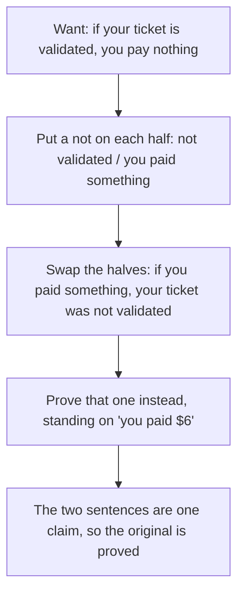

# Proof by contrapositive: prove the flipped version

Foundations → Proof → Indirect proofs → Proof by contrapositive

---

## General Overview

The sign at the car park barrier: **"If your ticket is validated, you pay nothing."**

You feed the machine your ticket. It takes $6.

You saw no stamp and asked no one, yet you know: your ticket was not validated. Had it been, the machine would have taken nothing.

A second sentence falls out of the sign: **"If you paid something, your ticket was not validated."** Both halves got a *not*, then swapped places. That is the **contrapositive**.

It *is* the sign, respelled.

**To prove "if A then B" — A the if part, B the then part — prove "if not B then not A" instead. Same claim, easier place to stand.**

### The picture: the move



---

## The formula

**"If your ticket is validated, you pay nothing" and "if you paid something, it was not validated" are one claim. Prove either; you have both.**

**Read it aloud:** put a *not* on both halves, swap them, prove that one.

| Piece | Plain meaning | In our car park |
| --- | --- | --- |
| the if part | what you may assume | your ticket is validated |
| the then part | what has to follow | you pay nothing |
| the contrapositive | both flipped, then swapped | if you paid, it was not validated |
| the converse | swapped, no flips | if you pay nothing, you were validated |
| the move | prove the contrapositive, get the original free | assume you paid, show no stamp |

---

## Why it works

### They break in the same case, so they are one claim

An if-then is false in one situation only: the if part happened, the then part did not.

The sign is false for a driver validated and charged anyway. The contrapositive is false for a driver who paid and *was* validated. Same driver. Nothing tells them apart: one claim, two spellings ([logical-equivalence-and-de-morgan](../05-Logic/03-logical-equivalence-and-de-morgan.md) tables it).

Then why flip? A proof needs somewhere to stand. "Validated" gives you a stamp and nothing to compute. "You paid $6" gives you a number.

### The twin claim, proved by the flip

**Claim: if a number times itself is odd, the number is odd.** Whole numbers. **Even** means two times a whole number: 6 is 2 × 3. **Odd** means not even.

Write n for the number. The if part is an awkward place to start: n is buried inside a multiplication.

Flip both halves and swap: **if the number is even, the number times itself is even.** "n is even" hands you something to write down.

Proof. n is even, so n = 2 × k for a whole number k. Then

**n × n = (2 × k) × n = 2 × (k × n)**

k × n is a whole number, so n × n is two times a whole number. Even. Done.

Only the claim was flipped. The proving was an ordinary straight-line proof, the kind on [direct-proof](01-direct-proof.md). The flipped claim is the original, so the original is proved.

Proving it straight, from "n × n is odd", means prying n back out — which needs a fact about factors nobody gave you. Direct, flipped, and a third move: [proof-by-contradiction](03-proof-by-contradiction.md).

---

## Worked numbers, by hand

Four drivers, paid in dollars. Value is the verdict: 1 means the sign survives that driver, 0 means it breaks. A driver the sign says nothing about cannot break it.

| Step | Reason | Value |
| --- | --- | --- |
| Vic: validated, paid 0 | promise kept | 1 |
| Wes: validated, paid 6 | validated, charged anyway | **0** |
| Yaz: not validated, paid 0 | not spoken about | 1 |
| Zed: not validated, paid 6 | not spoken about | 1 |
| the sign, top to bottom | four verdicts | **1, 0, 1, 1** |
| the contrapositive | flipped and swapped | 1, 0, 1, 1 |
| they disagree on | nobody | **0** |
| the converse | swapped, not flipped | 1, 1, 0, 1 |
| the converse disagrees on | Wes and Yaz | **2** |
| the twin claim at n = 6 | 6 × 6 = 2 × (3 × 6) = 2 × 18 | **36** |
| 1 to 20 with n × n odd | all of them odd | **10** |

Wes is the only driver who could tell the two sentences apart. He cannot: he breaks both.

The last row searches twenty numbers; a search is not a proof. The proof above covers every number.

### What breaks if you drop a piece

| Mistake | Comes out at | What went wrong |
| --- | --- | --- |
| Proving the converse | 2 rows disagree | Swapping without flipping is a different claim |
| Checking 7 × 7 and stopping | 49 | One example, not every number |

---

## Code, from first principles, and it actually runs

Nothing is imported. The four drivers are read three times — by the sign, by the contrapositive (the flip column), by the converse — so the columns compare. Then the twin claim and the numbers to 20.

### Python

```python
# Proof by contrapositive -- the check behind the card.  Nothing is imported.
# The car park sign: "if your ticket is validated, you pay nothing."  Four
# drivers, read by the sign, by its flip, and by its converse.  Then the twin
# claim: if a number times itself is odd, the number is odd.
DRIVERS = [("Vic", 1, 0), ("Wes", 1, 6), ("Yaz", 0, 0), ("Zed", 0, 6)]

def kept(if_part, then_part):   # an if-then breaks only when the if part holds and the then part fails
    return 0 if if_part == 1 and then_part == 0 else 1

print(f"{'name':<5}{'validated':>11}{'paid':>6}{'the sign':>10}{'the flip':>10}{'the converse':>14}")
sign, flip, converse = [], [], []
for name, val, paid in DRIVERS:
    sign.append(kept(val, 1 if paid == 0 else 0))            # validated -> pays nothing
    flip.append(kept(1 if paid > 0 else 0, 1 - val))         # paid something -> not validated
    converse.append(kept(1 if paid == 0 else 0, val))        # pays nothing -> validated
    print(f"{name:<5}{val:>11}{paid:>6}{sign[-1]:>10}{flip[-1]:>10}{converse[-1]:>14}")
print(f"the flip disagrees with the sign on rows {sum(1 for a, b in zip(sign, flip) if a != b)}")
print(f"the converse disagrees with the sign on rows {sum(1 for a, b in zip(sign, converse) if a != b)}")
n, k = 6, 3
print(f"{n} = 2 x {k}, so {n} x {n} = 2 x ({k} x {n}) = 2 x {k * n} = {n * n}, even")
print(f"7 x 7 = {7 * 7}, odd")
odd_ones = [m for m in range(1, 21) if (m * m) % 2 == 1]
print(f"whole numbers 1 to 20 with n x n odd {len(odd_ones)}, every one of them odd")
assert sign == [1, 0, 1, 1] and flip == sign and converse == [1, 1, 0, 1]
assert n * n == 2 * (k * n) and (n * n) % 2 == 0 and (7 * 7) % 2 == 1
assert odd_ones == list(range(1, 21, 2)) and len(odd_ones) == 10
print("ALL CHECKS PASS")
```

**Ran 2026-09-06 on macOS, Python 3.14.6, standard library only. All checks passed. Output, pasted from the run:**

```
name   validated  paid  the sign  the flip  the converse
Vic            1     0         1         1             1
Wes            1     6         0         0             1
Yaz            0     0         1         1             0
Zed            0     6         1         1             1
the flip disagrees with the sign on rows 0
the converse disagrees with the sign on rows 2
6 = 2 x 3, so 6 x 6 = 2 x (3 x 6) = 2 x 18 = 36, even
7 x 7 = 49, odd
whole numbers 1 to 20 with n x n odd 10, every one of them odd
ALL CHECKS PASS
```

### Rust

Same numbers, same labels, built with `rustc --edition 2021 -O`.

```rust
// Proof by contrapositive -- the same check as the Python one, in Rust.  No
// crates.  The car park sign: "if your ticket is validated, you pay nothing."
// Four drivers, read by the sign, by its flip, and by its converse.  Then the
// twin claim: if a number times itself is odd, the number is odd.
const DRIVERS: [(&str, i64, i64); 4] =
    [("Vic", 1, 0), ("Wes", 1, 6), ("Yaz", 0, 0), ("Zed", 0, 6)];

fn kept(if_part: i64, then_part: i64) -> i64 {   // breaks only when the if part holds and the then part fails
    if if_part == 1 && then_part == 0 { 0 } else { 1 }
}

fn main() {
    println!("{:<5}{:>11}{:>6}{:>10}{:>10}{:>14}",
             "name", "validated", "paid", "the sign", "the flip", "the converse");
    let (mut sign, mut flip, mut converse) = (Vec::new(), Vec::new(), Vec::new());
    for (name, val, paid) in DRIVERS {
        sign.push(kept(val, if paid == 0 { 1 } else { 0 }));        // validated -> pays nothing
        flip.push(kept(if paid > 0 { 1 } else { 0 }, 1 - val));     // paid something -> not validated
        converse.push(kept(if paid == 0 { 1 } else { 0 }, val));    // pays nothing -> validated
        println!("{:<5}{:>11}{:>6}{:>10}{:>10}{:>14}", name, val, paid,
                 sign[sign.len() - 1], flip[flip.len() - 1], converse[converse.len() - 1]);
    }
    println!("the flip disagrees with the sign on rows {}",
             (0..4).filter(|&i| sign[i] != flip[i]).count());
    println!("the converse disagrees with the sign on rows {}",
             (0..4).filter(|&i| sign[i] != converse[i]).count());
    let (n, k) = (6i64, 3i64);
    println!("{} = 2 x {}, so {} x {} = 2 x ({} x {}) = 2 x {} = {}, even",
             n, k, n, n, k, n, k * n, n * n);
    println!("7 x 7 = {}, odd", 7 * 7);
    let odd_ones: Vec<i64> = (1..=20i64).filter(|m| (m * m) % 2 == 1).collect();
    println!("whole numbers 1 to 20 with n x n odd {}, every one of them odd", odd_ones.len());
    assert!(sign == vec![1, 0, 1, 1] && flip == sign && converse == vec![1, 1, 0, 1]);
    assert!(n * n == 2 * (k * n) && (n * n) % 2 == 0 && (7 * 7) % 2 == 1);
    assert!(odd_ones == (1..=19i64).step_by(2).collect::<Vec<i64>>() && odd_ones.len() == 10);
    println!("ALL CHECKS PASS");
}
```

**Ran 2026-09-06 on macOS, rustc 1.98.1, no crates. All checks passed. Output, pasted from the run:**

```
name   validated  paid  the sign  the flip  the converse
Vic            1     0         1         1             1
Wes            1     6         0         0             1
Yaz            0     0         1         1             0
Zed            0     6         1         1             1
the flip disagrees with the sign on rows 0
the converse disagrees with the sign on rows 2
6 = 2 x 3, so 6 x 6 = 2 x (3 x 6) = 2 x 18 = 36, even
7 x 7 = 49, odd
whole numbers 1 to 20 with n x n odd 10, every one of them odd
ALL CHECKS PASS
```

The two outputs match line for line.

> [!TIP]
> **Try changing**
> Guess first, then run it.
> - **Validate Wes's ticket.** Set his row to `("Wes", 1, 0)`. The sign loses its only 0; so does the flip, same row. The first assert fires — it pins the original rows — but the columns still match, line for line.
> - **Flip one half only.** Use `val` where the flip line says `1 - val`. Wes and Zed swap verdicts; the first assert fires.

---

## The usual mistake

> [!warning]
> **Flipping without swapping, or swapping without flipping.** Only both give the contrapositive. Swapping alone gives the **converse** — "if you pay nothing, your ticket was validated" — which Yaz breaks while the sign stands: 2 rows disagree. Flipping alone gives the **inverse** — "if you were not validated, you paid something" — the converse in other words, and Yaz breaks it too.
>
> - **Nothing here is assumed false.** You prove a plain if-then, the ordinary way. The move that assumes the opposite is [proof-by-contradiction](03-proof-by-contradiction.md).
> - **Assumed the if part too, and never used it?** Then you did this card, not contradiction. Drop it.
> - The flipped proof must land on *not the if part*. Land elsewhere and you proved something else.
> - Only if-then sentences flip; a claim with no if part has nothing to flip.
> - 7 × 7 = 49 agrees with the claim and proves nothing.

---

## Where you meet it in real life

- **Car parks, cloakrooms, doors.** "No ticket, no entry" and "if you are inside, you have a ticket" are one rule, read from either end. Chaining rules: [valid-arguments](../05-Logic/06-valid-arguments.md).
- **Anything you diagnose backwards.** "If the deploy worked, the new version is live." The old version is live, so the deploy did not work. Contrapositive, without thinking.
- **Proof itself.** Claims about even, odd and factors flip well: "not even" is a fact you can write down. Which move fits which claim: [choosing-a-proof-strategy](06-choosing-a-proof-strategy.md).

> **Say it back**
> An if-then and its contrapositive — both halves flipped, then swapped — are one claim in two spellings, breaking in the same case. Prove whichever gives the better place to stand; the other comes free. "If n × n is odd, n is odd" becomes "if n is even, so is n × n": 6 × 6 = 2 × 18 = 36. Swapping without flipping is the converse, a different claim.

---

## What this builds on

- [direct-proof](01-direct-proof.md): what a proof is, and the straight-line kind used here.
- [if-then](../05-Logic/02-if-then.md): the one case that breaks an if-then, and where both names came from.

## Where this goes next

- [proof-by-contradiction](03-proof-by-contradiction.md): assume the claim is false and wait for it to break — the move confused with this one.

---

## Sources

Verified 6 Sep 2026; every link resolves.

- Hammack, Richard. *Book of Proof*, 3rd ed. [Book home](https://richardhammack.github.io/BookOfProof/) · [free PDF](https://richardhammack.github.io/BookOfProof/Main.pdf). Chapter 5, free.
- Sundstrom, Ted. *Mathematical Reasoning: Writing and Proof*, v3. Grand Valley State University, 2020. [Book page](https://scholarworks.gvsu.edu/books/24/). Section 3.2, free.
- Velleman, Daniel J. *How to Prove It*, 3rd ed. Cambridge University Press, 2019. [doi:10.1017/9781108539890](https://doi.org/10.1017/9781108539890). The flip beside contradiction (paid).
