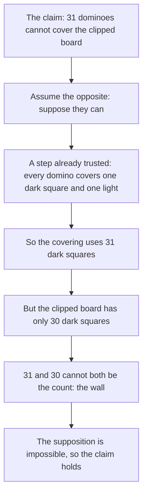

# Proof by contradiction: assume the opposite and watch it break

[Syllabus](../../../SYLLABUS.md) → [Foundations](../README.md) → [Proof](../README.md#s06) → Proof by contradiction

---

## General Overview

An 8-by-8 chessboard: 64 squares, striped dark and light, 32 of each. A box of dominoes, each covering two squares that share an edge. Lay 32 and the board is covered.

Now saw off two opposite corners — row 1 column 1, and row 8 column 8. That leaves 62 squares, and 31 dominoes cover 62 squares, so the count fits.

It never works. Not "it is fiddly" — never, in any arrangement. Running out of patience proves nothing. So suppose it does work, and follow that using only facts you already trust.

**To prove a claim, assume the opposite, take only steps you already trust, and keep going until you hit something impossible; the opposite is then dead, and the claim stands.**

### The picture: the shape of the move



---

## The formula

**Suppose 31 dominoes cover the clipped board. Then they cover 31 dark squares and 31 light. But the board holds 30 dark and 32 light. 31 is not 30, so no such covering exists.**

**Read it aloud:** if the opposite forces two counts that disagree, it cannot happen, so the claim is true.

| Piece | Plain meaning | In our example |
| --- | --- | --- |
| the claim | what you want to be true | 31 dominoes cannot cover the clipped board |
| the opposite | the claim with "not" in front | suppose they do cover it |
| a trusted step | a definition, or something already proved | a domino covers one dark, one light |
| the wall | two results that cannot both hold | 31 dark covered, 30 present |

---

## Why it works

### Step 0: there is no third box

A claim is either true or false. If assuming it false leads somewhere impossible, the false box is empty and the claim sits in the true one. That two-box rule backs the move ([Valid arguments](../05-Logic/06-valid-arguments.md)).

### Step 1: state the opposite exactly

The claim: no arrangement of 31 dominoes covers the clipped board. Its opposite: some arrangement does — one, not all. Flip it wrong and the proof is about the wrong thing ([Negating a quantifier](../05-Logic/05-negating-quantifiers-and-counterexamples.md)).

### Step 2: the fact that carries the proof

Colour by a rule, not by eye: a square is dark when its row number plus its column number is even. Row 1, column 1 gives 2 — dark; row 8, column 8 gives 16 — dark again.

Sharing an edge changes one of those numbers by 1 and leaves the other, so the total flips between even and odd. **Every domino covers one dark square and one light square.** The code below lists all 112 places a domino can sit on the full board: one of each in every one.

### Step 3: count both sides, and hit the wall

31 dominoes, one dark square each, need 31. The board started with 32 dark and both cut corners were dark, so 30 are left. A count cannot be 31 and 30, so no arrangement covers the clipped board.

Nobody laid a domino.

### The same move, one shelf over

Root 2 is the number whose square is 2. Suppose a fraction, a top number p over a bottom number q in lowest terms — common factors divided out — squares to 2. Then p × p = 2 × q × q, which forces p even (an odd number times itself is odd, and 2 × q × q is even), and then q even too. Both even means a factor of 2 was still in there. Wall. Fractions get close and stay wrong: 99 × 99 is 9801; 2 × 70 × 70, 9800. [Irrational numbers](../02-The%20Number%20Line/03-irrational-numbers.md) runs it properly.

---

## Worked numbers, by hand

The clipped board, in squares.

| Step | Arithmetic | Value |
| --- | --- | --- |
| squares on the whole board | 8 × 8 | 64 |
| dark squares on it | half of 64 | 32 |
| squares left after the two cuts | 64 − 2 | 62 |
| dark squares left, both cuts dark | 32 − 2 | **30** |
| squares 31 dominoes cover | 31 × 2 | 62 |
| dark squares 31 dominoes need | 31 × 1 | **31** |

The supposition asks a board with 30 dark squares for 31.

### What breaks if you drop a piece

| Mistake | Comes out at | What went wrong |
| --- | --- | --- |
| Cutting one dark corner and one light | 31 dark, 31 light | The colours balance and the argument says nothing |
| Counting squares and stopping | 62 = 31 × 2 | The square count fits; it cannot see colour |
| Trying layouts until you give up | nothing settled | Finding nothing is not a proof of nothing |

The code prints the first two. For the balanced cut a covering does exist: four dominoes across each of rows 2 to 8 makes 28, and columns 2 to 7 of row 1 take three more.

---

## Code, from first principles, and it actually runs

Nothing is imported. The board is built, the corners cut, the colours counted by the row-plus-column rule. The second road ignores that count: it lists every place a domino can sit and checks its two colours. The balanced cut is the control: a cut that should not break, so you can watch the check tell the two apart.

### Python

```python
# Proof by contradiction -- the check behind the card.  Nothing is imported.
# An 8-by-8 chessboard with the corners (1,1) and (8,8) cut off, and a box of
# 31 dominoes.  Road 1 colours every square by the row-plus-column rule and
# counts.  Road 2 lists every place a domino can sit and checks what it covers.
BOARD = [(r, c) for r in range(1, 9) for c in range(1, 9)]
def dark(s):                     # (1,1) and (8,8) are dark: row + column is even
    return (s[0] + s[1]) % 2 == 0
def tally(name, squares):
    d = sum(1 for s in squares if dark(s))
    print(f"{name:<32}{len(squares):>8}{d:>6}{len(squares) - d:>7}")
    return (len(squares), d, len(squares) - d)
PLACES = [(a, b) for a in BOARD for b in BOARD
          if a < b and abs(a[0] - b[0]) + abs(a[1] - b[1]) == 1]
SPLIT = sum(1 for a, b in PLACES if dark(a) != dark(b))   # road 2: one of each?
CUT = [s for s in BOARD if s not in ((1, 1), (8, 8))]
MIX = [s for s in BOARD if s not in ((1, 1), (1, 8))]
print(f"{'board':<32}{'squares':>8}{'dark':>6}{'light':>7}")
full = tally("the whole chessboard", BOARD)
cut = tally("two corners cut, both dark", CUT)
mix = tally("two corners cut, one of each", MIX)
print(f"places a domino can sit {len(PLACES)}, of those covering one dark and one light {SPLIT}")
print(f"31 dominoes cover 31 dark and 31 light; the cut board has {cut[1]} dark and {cut[2]} light")
print(f"root 2: 99 x 99 = {99 * 99}, 2 x 70 x 70 = {2 * 70 * 70}, apart by {99 * 99 - 2 * 70 * 70}")
assert full == (64, 32, 32) and cut == (62, 30, 32) and mix == (62, 31, 31)
assert len(PLACES) == 112 and SPLIT == 112
assert 31 * 2 == len(CUT) and 31 != cut[1] and 31 == mix[1]
print("ALL CHECKS PASS")
```

**Ran 2026-09-06 on macOS, Python 3.14.6, standard library only. All checks passed. Output, pasted from the run:**

```
board                            squares  dark  light
the whole chessboard                  64    32     32
two corners cut, both dark            62    30     32
two corners cut, one of each          62    31     31
places a domino can sit 112, of those covering one dark and one light 112
31 dominoes cover 31 dark and 31 light; the cut board has 30 dark and 32 light
root 2: 99 x 99 = 9801, 2 x 70 x 70 = 9800, apart by 1
ALL CHECKS PASS
```

### Rust

Same labels, built with `rustc --edition 2021 -O`.

```rust
// Proof by contradiction -- the same check as the Python one, in Rust.  No crates.
// An 8-by-8 chessboard with the corners (1,1) and (8,8) cut off, and a box of
// 31 dominoes.  Road 1 colours every square by the row-plus-column rule and
// counts.  Road 2 lists every place a domino can sit and checks what it covers.
fn dark(s: (i32, i32)) -> bool { (s.0 + s.1) % 2 == 0 }   // dark: row + column is even
fn tally(name: &str, squares: &[(i32, i32)]) -> (usize, usize, usize) {
    let d = squares.iter().filter(|&&s| dark(s)).count();
    println!("{:<32}{:>8}{:>6}{:>7}", name, squares.len(), d, squares.len() - d);
    (squares.len(), d, squares.len() - d)
}
fn main() {
    let board: Vec<(i32, i32)> = (1..9).flat_map(|r| (1..9).map(move |c| (r, c))).collect();
    let mut places: Vec<((i32, i32), (i32, i32))> = Vec::new();
    for &a in &board {
        for &b in &board {
            if a < b && (a.0 - b.0).abs() + (a.1 - b.1).abs() == 1 { places.push((a, b)); }
        }
    }
    let split = places.iter().filter(|&&(a, b)| dark(a) != dark(b)).count();  // road 2
    let cut_sq: Vec<(i32, i32)> = board.iter().cloned()
        .filter(|&s| s != (1, 1) && s != (8, 8)).collect();
    let mix_sq: Vec<(i32, i32)> = board.iter().cloned()
        .filter(|&s| s != (1, 1) && s != (1, 8)).collect();
    println!("{:<32}{:>8}{:>6}{:>7}", "board", "squares", "dark", "light");
    let full = tally("the whole chessboard", &board);
    let cut = tally("two corners cut, both dark", &cut_sq);
    let mix = tally("two corners cut, one of each", &mix_sq);
    println!("places a domino can sit {}, of those covering one dark and one light {}",
             places.len(), split);
    println!("31 dominoes cover 31 dark and 31 light; the cut board has {} dark and {} light",
             cut.1, cut.2);
    println!("root 2: 99 x 99 = {}, 2 x 70 x 70 = {}, apart by {}",
             99 * 99, 2 * 70 * 70, 99 * 99 - 2 * 70 * 70);
    assert!(full == (64, 32, 32) && cut == (62, 30, 32) && mix == (62, 31, 31));
    assert!(places.len() == 112 && split == 112);
    assert!(31 * 2 == cut_sq.len() && 31 != cut.1 && 31 == mix.1);
    println!("ALL CHECKS PASS");
}
```

**Ran 2026-09-06 on macOS, rustc 1.98.1, no crates. All checks passed. Output, pasted from the run:**

```
board                            squares  dark  light
the whole chessboard                  64    32     32
two corners cut, both dark            62    30     32
two corners cut, one of each          62    31     31
places a domino can sit 112, of those covering one dark and one light 112
31 dominoes cover 31 dark and 31 light; the cut board has 30 dark and 32 light
root 2: 99 x 99 = 9801, 2 x 70 x 70 = 9800, apart by 1
ALL CHECKS PASS
```

> [!TIP]
> **Try changing**
> Guess first, then run it. The asserts are pinned to the board, so one will fire.
> - **Cut the other corner.** Swap `(8, 8)` for `(1, 8)` in the cut list. That corner is light, the counts land at 31 and 31, and the wall is gone.
> - **Let a piece reach further.** Change the neighbour test from `== 1` to `<= 2`. The place count jumps from 112 to 306 while the one-of-each count stays at 112: 194 new pieces cover two squares of one colour, and the proof loses its engine.

---

## The usual mistake

> [!warning]
> **Calling a surprise a wall.** What you hit must be impossible, not merely odd. "31 dark squares needed, 30 present" is impossible. "This layout looks awkward" is not.
>
> - Using the claim itself as a step. If the argument leans on "no covering exists", it walked in a circle.
> - Dropping the condition that makes the wall a wall. Forget "in lowest terms" and "both even" is allowed, so nothing broke.
> - Treating a failed search as a proof. A million failed layouts leave the next one open; the colour count closes all at once.

---

## Where you meet it in real life

- **Impossibility claims.** "That cannot be scheduled, packed or wired" is often a colour count in disguise: find what every move preserves, then show the target has the wrong amount.
- **Claims that no such thing exists.** No fraction squares to 2 ([Irrational numbers](../02-The%20Number%20Line/03-irrational-numbers.md)); no list holds every decimal ([Cantor's diagonal](../09-Sizes%20of%20Infinity/03-cantors-diagonal-argument.md)); no set holds the sets that leave themselves out ([Russell's paradox](../07-Sets/06-russells-paradox.md)).
- **Crowded counting.** More items than boxes means some box holds two ([Pigeonhole](../08-Relations%20and%20Functions/08-pigeonhole-principle.md)).

> **Say it back**
> Assume the opposite. Take only steps you already trust. If that lands on something impossible, the opposite cannot hold, so your claim does. Every domino covers one dark and one light, so 31 dominoes need 31 dark; the clipped board has 30. No amount of trying would have settled it.

---

## What this builds on

- [Proof by contrapositive](02-proof-by-contrapositive.md): the other indirect move — prove the flipped statement. Try it first.
- [Irrational numbers](../02-The%20Number%20Line/03-irrational-numbers.md): root 2 and the fractions it escapes, this argument's classic home.

## Where this goes next

- [Choosing a proof strategy](06-choosing-a-proof-strategy.md): which move fits a claim, from its shape.
- [Russell's paradox](../07-Sets/06-russells-paradox.md): a collection whose own definition walks into a wall.
- [Pigeonhole](../08-Relations%20and%20Functions/08-pigeonhole-principle.md): suppose the crowding away, watch the total fail.
- [Cantor's diagonal](../09-Sizes%20of%20Infinity/03-cantors-diagonal-argument.md): assume every decimal is listed, build one that is not.

---

## Sources

Verified 6 Sep 2026; every link resolves.

- Hammack, Richard. *Book of Proof*, 3rd ed., 2018. [Book page](https://richardhammack.github.io/BookOfProof/). Chapter 6, root 2 worked.
- Golomb, Solomon W. *Polyominoes*, 2nd ed. Princeton University Press, 1994. [Publisher page](https://press.princeton.edu/books/paperback/9780691024448/polyominoes). The colouring argument for clipped boards.
- Velleman, Daniel J. *How to Prove It*, 3rd ed. Cambridge University Press, 2019. [doi:10.1017/9781108539890](https://doi.org/10.1017/9781108539890). Chapter 3 (paid).
