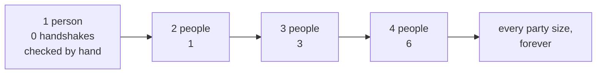

# Induction: knock over the first domino and show each knocks the next

[Syllabus](../../../SYLLABUS.md) → [Foundations](../README.md) → [Proof](../README.md#s06) → Proof by induction

---

## General Overview

Stand a row of dominoes on end down a hallway. Nobody pushes them over one at a time. Check two things instead: the first falls, and any domino that falls topples its neighbour. That flattens the row, however long the hallway.

The first fact is the **base case**, the second the **induction step**, and together they are **proof by induction**.

A claim they can carry: eight friends at a party, everyone shaking hands with everyone else once. At a party of n people the handshakes number n × (n − 1) ÷ 2 — for eight, 8 × 7 ÷ 2 = 28.

That covers every party size, and there is no largest party, so checking never finishes. Induction does, in two.

**Check the claim at the smallest case, then show any case carries the next, and it is proved for all of them at once.**

### The picture: a chain nobody has to walk



Only the first box is checked by hand. Every arrow is the same step.

---

## The formula

The formula is the thing being proved:

**At a party of n people, where every pair shakes hands once, the handshakes number n × (n − 1) ÷ 2.**

Two jobs prove it for every n. **Base case:** show it at 1 person. **Induction step:** any size k where it holds must hand it to k + 1.

| Piece | Plain meaning | In our party |
| --- | --- | --- |
| n | people at the party | 8 |
| k | a size where the claim holds | 7 |
| the base case | checked by hand at the smallest size | 1 person, 0 handshakes |
| the induction hypothesis | assuming it holds at k | 7 people, 21 handshakes |
| the induction step | a guest arrives, claim holds | 21 + 7 = 28 |

---

## Why it works

### Step 0: two jobs stand in for endlessly many

Party sizes never run out, so nobody checks them all. But they lie in a line, each one guest bigger than the last. A claim holding at the start and surviving one more guest cannot fail anywhere.

### Step 1: the base case, checked by hand

A party of one. Nobody to shake with: 0 handshakes. The claim says 1 × 0 ÷ 2, which is 0. First domino down.

### Step 2: the induction step, at the door

Suppose the claim holds at some size k — one size, already known. That party has k × (k − 1) ÷ 2 handshakes. That assumption has a name: the **induction hypothesis**.

One more guest walks in and shakes every hand in the room: k more, and nobody else shakes again. So the party of k + 1 has k × (k − 1) ÷ 2 + k. Put the k over 2 too: the top is k × (k − 1) + 2 × k, which is k × k + k, which is k × (k + 1). The count is (k + 1) × k ÷ 2.

The claim at size k + 1 reads (k + 1) × ((k + 1) − 1) ÷ 2, and (k + 1) − 1 is k. Same thing — the claim survived the guest.

### Step 3: why those two are enough

The base case puts the claim at 1, and the step hands it from any size to the next: 1 gives 2, 2 gives 3, 3 gives 4, nothing missed. The step is an if-then, not a claim that k works ([Valid arguments](../05-Logic/06-valid-arguments.md)): if 7 works, 8 does.

One route skips induction: each of n people shakes n − 1 hands, and n × (n − 1) counts every handshake twice, so halve it — the style of [Direct proof](01-direct-proof.md). When one step back is not enough, [Strong induction and the least element](05-strong-induction-and-well-ordering.md).

---

## Worked numbers, by hand

The party filling up:

| Step | Arithmetic | Value |
| --- | --- | --- |
| base case, 1 person | 1 × 0 ÷ 2 | 0 |
| guests 2 and 3 shake 1, then 2 | 0 + 1 + 2 | 3 |
| guests 4 and 5 shake 3, then 4 | 3 + 3 + 4 | 10 |
| guests 6 and 7 shake 5, then 6 | 10 + 5 + 6 | 21 |
| the step from 7 to 8 | 21 + 7 | 28 |
| the claim at 8 | 8 × 7 ÷ 2 | **28** |

Eight friends shake hands 28 times: the step built it a guest at a time, the formula in one line.

### What breaks if you drop a piece

| Mistake | Comes out at | What went wrong |
| --- | --- | --- |
| Skipping the base case | 29 | The step also carries the claim with a spare 1 added |
| Counting each handshake from both ends | 56 | 8 × 7 has every handshake twice |
| Checking sizes to 8, calling it proved | 36 | "Never more than 28 handshakes" dies at 9 |

---

## Code, from first principles, and it actually runs

Nothing is imported. Three roads to one count: every pair written out and tallied, the formula, and the induction run for real — start at one person, add each guest's handshakes. Three columns that must agree.

### Python

```python
# Induction -- the check behind the card.  Nothing is imported.  A party where
# every pair shakes hands once.  Two roads to the count: list the pairs and
# tally them, or use the formula.  Then the same count built one guest at a time.
def by_listing(n):                      # every pair, counted one at a time
    return sum(1 for a in range(n) for b in range(a + 1, n))

def by_formula(n):                      # the claim: n x (n - 1) / 2
    return n * (n - 1) // 2

built = {1: 0}                          # the induction, run for real: 1 person, 0 shakes
for n in range(2, 10):
    built[n] = built[n - 1] + (n - 1)   # the new guest shakes every hand already there

print(f"{'people':>7}{'pairs listed':>14}{'by the formula':>16}{'built by the step':>19}{'the guest shook':>17}")
for n in (1, 2, 3, 4, 5, 8):
    print(f"{n:>7}{by_listing(n):>14}{by_formula(n):>16}{built[n]:>19}{n - 1:>17}")
print(f"the step at 7 people: {by_formula(7)} + 7 = {by_formula(8)}")
print(f"the three mistakes come out at {by_formula(8) + 1}, {8 * 7} and {by_formula(9)} at 9 people")
assert by_listing(8) == 28 and by_formula(8) == 28
assert built == {n: by_listing(n) for n in built}
assert by_formula(1) == 0 and by_formula(9) == 36 and 8 * 7 == 56
print("ALL CHECKS PASS")
```

**Ran 2026-09-06 on macOS, Python 3.14.6, standard library only. All checks passed. Output, pasted from the run:**

```
 people  pairs listed  by the formula  built by the step  the guest shook
      1             0               0                  0                0
      2             1               1                  1                1
      3             3               3                  3                2
      4             6               6                  6                3
      5            10              10                 10                4
      8            28              28                 28                7
the step at 7 people: 21 + 7 = 28
the three mistakes come out at 29, 56 and 36 at 9 people
ALL CHECKS PASS
```

### Rust

Same numbers and labels, built with `rustc --edition 2021 -O`.

```rust
// Induction -- the same check as the Python one, in Rust.  No crates.  A party
// where every pair shakes hands once.  Two roads to the count: list the pairs
// and tally them, or use the formula.  Then the count built one guest at a time.
fn by_listing(n: i64) -> i64 {              // every pair, counted one at a time
    let mut c = 0;
    for a in 0..n { for _ in (a + 1)..n { c += 1; } }
    c
}

fn by_formula(n: i64) -> i64 {              // the claim: n x (n - 1) / 2
    n * (n - 1) / 2
}

fn main() {
    let mut built = [0i64; 10];             // the induction, run for real: 1 person, 0 shakes
    for n in 2..10 {
        built[n] = built[n - 1] + (n as i64 - 1);   // the new guest shakes every hand there
    }
    println!("{:>7}{:>14}{:>16}{:>19}{:>17}", "people", "pairs listed", "by the formula",
             "built by the step", "the guest shook");
    for n in [1i64, 2, 3, 4, 5, 8] {
        println!("{:>7}{:>14}{:>16}{:>19}{:>17}", n, by_listing(n), by_formula(n),
                 built[n as usize], n - 1);
    }
    println!("the step at 7 people: {} + 7 = {}", by_formula(7), by_formula(8));
    println!("the three mistakes come out at {}, {} and {} at 9 people",
             by_formula(8) + 1, 8 * 7, by_formula(9));
    assert!(by_listing(8) == 28 && by_formula(8) == 28);
    for n in 1..10 { assert!(built[n] == by_listing(n as i64)); }
    assert!(by_formula(1) == 0 && by_formula(9) == 36 && 8 * 7 == 56);
    println!("ALL CHECKS PASS");
}
```

**Ran 2026-09-06 on macOS, rustc 1.98.1, no crates. All checks passed. Output, pasted from the run:**

```
 people  pairs listed  by the formula  built by the step  the guest shook
      1             0               0                  0                0
      2             1               1                  1                1
      3             3               3                  3                2
      4             6               6                  6                3
      5            10              10                 10                4
      8            28              28                 28                7
the step at 7 people: 21 + 7 = 28
the three mistakes come out at 29, 56 and 36 at 9 people
ALL CHECKS PASS
```

The two outputs match line for line.

> [!TIP]
> **Try changing**
> Guess first, then run it.
> - **Break the base case.** Start the party of one at 1 handshake instead of 0. Every row shifts up by 1, eight people read 29, the step never notices.
> - **Drop the halving.** Take the divide-by-2 out of the formula. Eight people read 56 against 28 listed, and the first assert fires.

---

## The usual mistake

> [!warning]
> **Believing the induction hypothesis assumes what you are proving.** It does not. Inside the step nothing claims the party of 7 works — only that if 7 works, 8 works, for every size at once. The one outright claim is the base case, checked by hand.
>
> - **No base case.** A chain attached to nothing. Bolt a spare 1 onto the claim and the step still runs, to a wrong 29.
> - **A step that only fires from some sizes.** It must run from every k. One gap and the dominoes stop there.
> - **Cases instead of a proof.** "Never more than 28 handshakes" passes every size through 8, then fails at 9, at 36.

---

## Where you meet it in real life

- **Loops.** "Right every time round" is a base case and a step in work clothes: right on the first pass, each pass setting up the next.
- **Anything defined from a smaller version of itself.** A rule leaning on the case below it is proved from the bottom up.
- **Counting connections.** n × (n − 1) ÷ 2 is also the cables to wire n machines to each other: 8 machines, 28 cables.

> **Say it back**
> Induction proves a claim about every whole number with two jobs. Smallest case: a party of 1 has 0 handshakes, and 1 × 0 ÷ 2 is 0. The step: a party of k has k × (k − 1) ÷ 2 handshakes, one more guest shakes k hands, and that total is what the claim says at k + 1. First domino down, each topples its neighbour: eight friends, 28 handshakes, every size with them.

---

## What this builds on

- [Direct proof](01-direct-proof.md): what a proof is — the induction step is itself a small direct proof.
- [Quantifiers](../05-Logic/04-quantifiers.md): the "for every n" that induction exists to settle.

## Where this goes next

- [Strong induction and the least element](05-strong-induction-and-well-ordering.md): when one step back is not enough, and the smallest-counterexample version.
- [Peano's three rules](07-peano-and-one-plus-one.md): where induction comes from, as a rule of the counting numbers.

---

## Sources

Verified 6 Sep 2026; every link resolves.

- Rosen, Kenneth H. *Discrete Mathematics and Its Applications*, 8th ed. McGraw-Hill, 2019. [Publisher page](https://www.mheducation.com/highered/product/discrete-mathematics-applications-rosen/M9781259676512.html). The standard chapter.
- Velleman, Daniel J. *How to Prove It*, 3rd ed. Cambridge University Press, 2019. [doi:10.1017/9781108539890](https://doi.org/10.1017/9781108539890). The step written out in full.
- Halmos, Paul R. *Naive Set Theory*. Springer, 1974. [doi:10.1007/978-1-4757-1645-0](https://doi.org/10.1007/978-1-4757-1645-0). Why base-plus-step is allowed at all.
