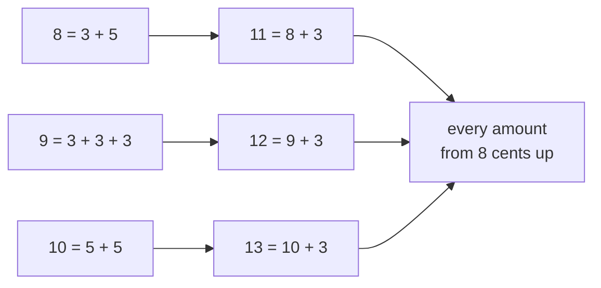

# Strong induction and the least element: assume every earlier case, or pick the smallest counterexample

[Syllabus](../../../SYLLABUS.md) → [Foundations](../README.md) → [Proof](../README.md#s06) → Strong induction and the least element

---

## General Overview

The post office has sold out of everything except 3-cent and 5-cent stamps. You want to pay a postage exactly, no overpaying.

8 cents: a 3 and a 5. 9: three 3s. 10: two 5s. 7 cents cannot be done.

Claim: every amount from 8 cents up can be paid exactly. Ordinary induction would get 11 from 10, but the smallest stamp is 3, so knowing 10 can be paid says nothing about 11. What works: 11 is 8 plus a 3-cent stamp — three cases back, past a one-step reach.

So lengthen the reach: let the step assume every earlier amount, not just the last. That is **strong induction**.

The proof has a second shape too. If it fails anywhere there is a smallest failure; show that one cannot exist and the claim stands. That rests on the **well-ordering principle**: every non-empty collection of counting numbers has a smallest member.

**Let the step lean on every earlier case, or grab the smallest counterexample and watch it break: two faces of one fact about the counting numbers.**

### The picture: three by hand, the rest leaning back



The left column is paid by hand. Every arrow is one move: back three cents, add a 3-cent stamp.

---

## The formula

The claim is the formula:

**Every amount of 8 cents or more can be paid exactly with 3-cent and 5-cent stamps.**

**Base cases:** pay 8, 9 and 10 by hand. **The strong step:** for any larger amount, assume everything below it from 8 up is payable; that amount minus 3 is one of those, so pay it and add a 3-cent stamp.

| Piece | Plain meaning | In our post office |
| --- | --- | --- |
| n | an amount of postage, in cents | 11 |
| k | the amount everything is settled up to | 10 |
| the base cases | paid by hand, the step's landing spots | 8, 9, 10 |
| the strong hypothesis | 8 to k, all payable | 8, 9, 10 payable |
| the strong step | back three, add a 3-cent stamp | 11 = 8 + 3 |
| well-ordering | any non-empty set of counting numbers has a least member | the least unpayable amount |

---

## Why it works

### Step 0: the longer reach is free

Nothing extra is assumed. The step stays an if-then: *if* the earlier cases hold, *then* this one does. Strong induction only widens that "if".

### Step 1: why three base cases

8 = 3 + 5. 9 = 3 + 3 + 3. 10 = 5 + 5. Three, not one: the step adds 3, so from 8 alone you get 11, 14, 17, never 9. Three in a row leave no gaps.

### Step 2: the strong step

Take 11. Assume every amount from 8 up to 10 is payable — the **strong hypothesis** (all earlier cases at once, not just the last). Now 11 minus 3 is 8: at least 8, below 11, inside the hypothesis. Pay 8, add a 3-cent stamp, 11 is paid. Nothing about 11 was special: past 10, every amount minus 3 is at least 8 and smaller.

### Step 3: the same proof, as a least counterexample

Suppose some amount of 8 cents or more cannot be paid. Collect them all. The collection is non-empty, so well-ordering hands you its smallest member: the least bad amount.

It is not 8, 9 or 10, paid by hand. So it is 11 or more, and it minus 3 is at least 8 — smaller, so not bad, so payable. Add a 3-cent stamp: the least bad amount is paid. Bad and not bad, so nothing was bad — [Proof by contradiction](03-proof-by-contradiction.md), aimed at the first failure.

Both run on the same fact. Strong induction pushes up from the bottom; well-ordering points at the first failure. Choosing between them is taste — [Choosing a proof strategy](06-choosing-a-proof-strategy.md).

<details>
<summary>Why counting numbers</summary>

The whole numbers below zero have no smallest, nor the positive fractions: halve any candidate. Counting numbers cannot fall forever.

</details>

---

## Worked numbers, by hand

The post office, in cents:

| Step | Arithmetic | Value |
| --- | --- | --- |
| by hand | 3 + 5 | 8 |
| by hand | 3 + 3 + 3 | 9 |
| by hand | 5 + 5 | 10 |
| the step, from 8 | 8 + 3 | 11 |
| the step, from 9 | 9 + 3 | 12 |
| the step, from 10 | 10 + 3 | 13 |
| never payable at all | 1, 2, 4 and 7 | **four of them** |

From 14 on, every amount is 3 more than one already paid. All four failures sit below 8, which is where the claim starts.

### What breaks if you drop a piece

| Mistake | Comes out at | What went wrong |
| --- | --- | --- |
| One base case, 8 alone | 9 | The step lands on 11, 14, 17, never 9 |
| A step looking back one amount | 11 | Back one needs a 1-cent stamp |
| Claiming it from 7 cents up | 7 | 7 cannot be paid |

---

## Code, from first principles, and it actually runs

Nothing is imported. Two roads to the same answer: the proof run forward, each amount leaning three cents back, and a plain search over every count of 3s against every count of 5s. The first two mistakes are that road, crippled.

### Python

```python
# Strong induction -- the check behind the card.  Nothing is imported.  A post
# office sells only 3-cent and 5-cent stamps.  Two roads to the payable amounts:
# build them by the strong step, or try every count of 3s against every count of 5s.
STAMPS = (3, 5)
BASES = (8, 9, 10)
MADE = {8: "3 + 5", 9: "3 + 3 + 3", 10: "5 + 5"}

def by_search(n):                       # every count of 3s against every count of 5s
    return any(t * 3 + f * 5 == n for t in range(n // 3 + 1) for f in range(n // 5 + 1))
def by_strong_step(limit, bases, reach):        # the proof itself, run forward
    paid = set(bases)
    for n in range(min(bases) + 1, limit + 1):
        if reach in STAMPS and n - reach in paid:    # lean on an amount already paid
            paid.add(n)
    return paid
paid = by_strong_step(40, BASES, 3)
searched = {n for n in range(41) if by_search(n)}
never = sorted(set(range(41)) - searched)
print(f"{'amount':>7}{'made from':>12}{'by the step':>13}{'by search':>11}")
for n in (7, 8, 9, 10, 11, 12, 13):
    made = MADE.get(n, f"{n - 3} + 3") if n >= 8 else "none"
    print(f"{n:>7}{made:>12}{'yes' if n in paid else 'no':>13}{'yes' if by_search(n) else 'no':>11}")
print(f"amounts that cannot be paid at all: {never} -- {len(never)} of them")
one_base = min(set(range(8, 41)) - by_strong_step(40, (8,), 3))
one_back = min(set(range(8, 41)) - by_strong_step(40, BASES, 1))
print(f"the three mistakes come out at {one_base}, {one_back} and 7")
assert paid == set(range(8, 41))
assert searched == set(range(41)) - {1, 2, 4, 7}
assert not by_search(7) and one_base == 9 and one_back == 11
print("ALL CHECKS PASS")
```

**Ran 2026-09-06 on macOS, Python 3.14.6, standard library only. All checks passed. Output, pasted from the run:**

```
 amount   made from  by the step  by search
      7        none           no         no
      8       3 + 5          yes        yes
      9   3 + 3 + 3          yes        yes
     10       5 + 5          yes        yes
     11       8 + 3          yes        yes
     12       9 + 3          yes        yes
     13      10 + 3          yes        yes
amounts that cannot be paid at all: [1, 2, 4, 7] -- 4 of them
the three mistakes come out at 9, 11 and 7
ALL CHECKS PASS
```

### Rust

Same numbers and labels.

```rust
// Strong induction -- the same check as the Python one, in Rust.  No crates.  A
// post office sells only 3-cent and 5-cent stamps.  Two roads to the payable
// amounts: build them by the strong step, or try every count of 3s and of 5s.
const STAMPS: [i64; 2] = [3, 5];
const BASES: [i64; 3] = [8, 9, 10];
fn by_search(n: i64) -> bool {          // every count of 3s against every count of 5s
    for t in 0..=(n / 3) { for f in 0..=(n / 5) { if t * 3 + f * 5 == n { return true; } } }
    false
}
fn by_strong_step(limit: i64, bases: &[i64], reach: i64) -> Vec<bool> {  // the proof, forward
    let mut paid = vec![false; (limit + 1) as usize];
    for &b in bases { paid[b as usize] = true; }
    for n in (bases[0] + 1)..=limit {
        if STAMPS.contains(&reach) && paid[(n - reach) as usize] { paid[n as usize] = true; }
    }
    paid
}
fn first_gap(paid: &[bool]) -> i64 { (8..41).find(|&n| !paid[n as usize]).unwrap_or(0) }
fn made(n: i64) -> String {
    match n { 7 => "none".into(), 8 => "3 + 5".into(), 9 => "3 + 3 + 3".into(),
              10 => "5 + 5".into(), _ => format!("{} + 3", n - 3) }
}
fn main() {
    let paid = by_strong_step(40, &BASES, 3);
    let never: Vec<i64> = (0..41).filter(|&n| !by_search(n)).collect();
    println!("{:>7}{:>12}{:>13}{:>11}", "amount", "made from", "by the step", "by search");
    for n in [7i64, 8, 9, 10, 11, 12, 13] {
        println!("{:>7}{:>12}{:>13}{:>11}", n, made(n),
                 if paid[n as usize] { "yes" } else { "no" }, if by_search(n) { "yes" } else { "no" });
    }
    let list: Vec<String> = never.iter().map(|v| v.to_string()).collect();
    println!("amounts that cannot be paid at all: [{}] -- {} of them", list.join(", "), never.len());
    let one_base = first_gap(&by_strong_step(40, &[8], 3));
    let one_back = first_gap(&by_strong_step(40, &BASES, 1));
    println!("the three mistakes come out at {}, {} and 7", one_base, one_back);
    assert!((8..41).all(|n| paid[n as usize]) && !paid[7]);
    assert!(never == vec![1, 2, 4, 7] && !by_search(7));
    assert!(one_base == 9 && one_back == 11);
    println!("ALL CHECKS PASS");
}
```

**Ran 2026-09-06 on macOS, rustc 1.98.1, no crates. All checks passed. Output, pasted from the run:**

```
 amount   made from  by the step  by search
      7        none           no         no
      8       3 + 5          yes        yes
      9   3 + 3 + 3          yes        yes
     10       5 + 5          yes        yes
     11       8 + 3          yes        yes
     12       9 + 3          yes        yes
     13      10 + 3          yes        yes
amounts that cannot be paid at all: [1, 2, 4, 7] -- 4 of them
the three mistakes come out at 9, 11 and 7
ALL CHECKS PASS
```

The two outputs match line for line.

> [!TIP]
> **Try changing**
> Guess first, then run it.
> - **Take two base cases away.** Build the forward road from `(8,)`: it lands on 11, 14, 17, never 9. First gap 9, and an assert fires.
> - **Reach back five, not three.** Change the 3 in the forward call to 5: you reach 13, 14, 15, never 11, and an assert fires.
> - **Drop 10 from the bases.** Build from `(8, 9)`: 10, 13, 16 and on are never reached, and an assert fires.

---

## The usual mistake

> [!warning]
> **Thinking strong induction assumes more than it may.** It never claims the earlier cases are true. It says: if everything from the bases up to here holds, so does this one. The only outright claims are 8, 9 and 10, by hand.
>
> - **Too few base cases.** The step reaches back three, so it needs three landing spots. From 8 alone, 9 is never paid.
> - **Reaching back further than the bases cover.** Back five off three bases and 11 is stranded.
> - **Treating the least counterexample as real.** It is assumed only to be destroyed.

---

## Where you meet it in real life

- **Splitting a number into primes.** Every whole number above 1 is a product of primes: the proof splits it into two smaller factors and leans on both, neither of them the case before.
- **Programs that call themselves.** A routine handing itself a smaller job stops, because the job sizes are counting numbers and cannot fall forever.
- **Packing sizes.** Beer in 4-packs and 7-packs: every order of 18 or more fills exactly — same argument, different stamps.

> **Say it back**
> With only 3-cent and 5-cent stamps, every amount from 8 cents up can be paid exactly. Ordinary induction cannot get 11 from 10; 11 is 8 plus a 3-cent stamp, three cases back. Strong induction lets the step assume every earlier case: pay 8, 9 and 10 by hand, and every larger amount is three more than something already paid. Or take the smallest unpayable amount: it minus 3 could be paid, so it could be paid too. One fact powers both routes — every non-empty set of counting numbers has a smallest member.

---

## What this builds on

- [Induction](04-proof-by-induction.md): base case and step; strong induction changes only what the step may assume.

## Where this goes next

- [Choosing a proof strategy](06-choosing-a-proof-strategy.md): which move fits which claim.

---

## Sources

Verified 6 Sep 2026: every link below resolves to the publisher's page.

- Velleman, Daniel J. *How to Prove It*, 3rd ed. Cambridge University Press, 2019. [doi:10.1017/9781108539890](https://doi.org/10.1017/9781108539890). The least counterexample, in full.
- Gunderson, David S. *Handbook of Mathematical Induction*, 2nd ed. Chapman and Hall/CRC, 2016. [Publisher page](https://www.routledge.com/Handbook-of-Mathematical-Induction-Theory-and-Applications/Gunderson/p/book/9781138199019). Every variant, stamps included.
- Rosen, Kenneth H. *Discrete Mathematics and Its Applications*, 8th ed. McGraw-Hill, 2019. [Publisher page](https://www.mheducation.com/highered/product/discrete-mathematics-applications-rosen/M9781259676512.html). Well-ordering stated as an axiom.
