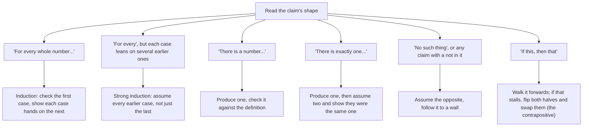

# Choosing a proof strategy: which move fits which claim, plus existence, uniqueness and working backwards

[Syllabus](../../../SYLLABUS.md) → [Foundations](../../../SYLLABUS.md#w01) → [Proof](../../../SYLLABUS.md#w01-s06) → Choosing a proof strategy

---

## General Overview

A fault-finding sheet is taped inside a garage's workshop door. Car will not start? Read the symptom first. Lights dead: battery. Engine turns, never fires: fuel. The symptom picks the tool.

Proofs come with the same sheet. The moves are already yours: [Direct proof](01-direct-proof.md), [Proof by contrapositive](02-proof-by-contrapositive.md), [Proof by contradiction](03-proof-by-contradiction.md), [Induction](04-proof-by-induction.md), [Strong induction and the least element](05-strong-induction-and-well-ordering.md). What stalls people is the blank page: which move this claim wants.

The claim tells you — not its subject, its **shape**: the words it opens with. Three claims tonight, all about whole numbers.

- Every whole number is even or odd.
- Some number, added to anything, leaves it unchanged.
- Only one such number exists.

**Read the shape — for every, there is, exactly one, not, if-then — and the shape names the move.**

### The picture: the sheet



---

## The formula

The sheet is the formula, one line each.

**For every → induction. Several earlier cases → strong induction. There is → produce one. Exactly one → produce one, then assume two and show they are equal. Not → assume the opposite. If-then → forwards, or flipped and swapped.**

A claim's opening words name the move.

| Piece | Plain meaning | On our sheet |
| --- | --- | --- |
| a claim's shape | its opening words, not its subject | for every, there is, exactly one |
| existence | at least one such thing is out there | some number leaves sums alone |
| a witness | the thing itself, named and checked | 0, since 0 + 7 = 7 |
| uniqueness | no second, different one | only one such number does |

---

## Why it works

### Step 0: a proof needs a place to stand

Line one has to be something you can write down, and each shape hands you different material. "For every" hands you a chain; "there is" hands you nothing until you find the thing; "not" hands you nothing at all, so you take the opposite instead.

### Step 1: the first two claims, straight off the sheet

**Every whole number is even or odd.** Shape: for every. **Even** means two times a whole number; **odd** means two times a whole number, plus one. Move: induction — 0 = 2 × 0 is even, and each step flips: two times a number, then that plus one, then two times the next ([Induction](04-proof-by-induction.md)).

**Some number, added to anything, leaves it unchanged.** Shape: there is. Move: produce one. Here: **0**, since 0 + 7 = 7, 0 + 23 = 23, and 0 + n = n for any whole number n. Naming a thing and checking it against the definition is the whole of an **existence proof**. Call such a number a **do-nothing** for adding; order does not matter in addition ([The three rearranging laws](../01-Everyday%20Arithmetic/05-arithmetic-laws.md)), so one check covers both sides.

### Step 2: "exactly one" is two jobs

Shape: exactly one — two claims in one coat. At least one exists (**existence**, done: 0), and there are not two different ones (**uniqueness**). Prove the first only and you have proved half.

The second job has a fixed move: **assume two, then show they were the same all along.**

Let a and b both be do-nothings. Add them, and read the one number a + b twice.

- b is a do-nothing, so adding b changes nothing: **a + b = a**.
- a is a do-nothing, so adding a changes nothing: **a + b = b**.

One number, two names, so **a = b**. There was nowhere for a second to hide — which is why 0 is *the* do-nothing for adding, not *a* do-nothing.

### Step 3: when nothing fits, work backwards

Start at the line you want and ask what would give it. Ask again, until you reach something you have. Two numbers are equal when one number answers to both names. So build one out of a and b — a + b — and read it twice.

Then write it forwards: given first, wanted last ([Direct proof](01-direct-proof.md)). If the sheet stays silent, assume the claim false ([Proof by contradiction](03-proof-by-contradiction.md)).

---

## Worked numbers, by hand

The three claims through the sheet, whole numbers 0 to 40.

| Step | Arithmetic | Value |
| --- | --- | --- |
| claim 1, the first case | 0 = 2 × 0 | even |
| claim 1, at 7 and one step on | 7 = 2 × 3 + 1, 8 = 2 × 4 | odd, then even |
| claim 1, dividing against flipping | two routes, 0 to 40 | agree on **41** |
| claim 2, the witness checked | 0 + 7, 0 + 23 | 7, 23 |
| claim 3, candidates that work | searched 0 to 40 | **1 of 41** |
| claim 3, the proof | a + b, read twice | **a = b** |

The search found one do-nothing among 41 candidates. The proof rules out the ones no search reaches.

### What breaks if you drop a piece

| Mistake | Comes out at | What went wrong |
| --- | --- | --- |
| Stopping once 0 turns up | 1 of 41 candidates | Existence proved, uniqueness untouched |
| One example for a "for every" claim | 7 is odd: one number of 41 checked | An example cannot cover all of them |
| Guessing a witness, not checking it | 1 + 7 = 8, not 7 | A witness counts once the definition agrees |

---

## Code, from first principles, and it actually runs

Nothing is imported. Claim 1 is settled twice — by dividing each number by 2, and by the induction route, even at 0 then flipping at every step — and the labellings compared. Claim 2 hunts a do-nothing among the candidates 0 to 40; claim 3 counts what turned up.

### Python

```python
# Choosing a proof strategy -- the check behind the card.  Nothing is imported.
# The mechanic's sheet, on three claims: every whole number is even or odd;
# some number leaves any sum alone; only one number does.  Whole numbers 0 to 40.
NUMBERS = list(range(41))
def rule(n):                    # even or odd by dividing: 7 = 2 x 3 + 1, odd
    return "even" if n % 2 == 0 else "odd"
def flip(n):                    # the induction route: even at 0, flip at every step
    label = "even"
    for _ in range(n):
        label = "odd" if label == "even" else "even"
    return label
def row(claim, shape, move, verdict):
    print(f"{claim:<34}{shape:<12}{move:<16}{verdict}")
by_rule, by_flip = [rule(n) for n in NUMBERS], [flip(n) for n in NUMBERS]
agree = sum(1 for a, b in zip(by_rule, by_flip) if a == b)
works = [z for z in NUMBERS if all(z + n == n for n in NUMBERS)]   # produce one, and count them
row("claim", "shape", "move", "verdict")
row("every whole number is even or odd", "for every", "induction", f"holds 0 to {NUMBERS[-1]}")
row("some number leaves any sum alone", "there is", "produce one", f"{works[0]} works")
row("only one such number does", "exactly one", "two, then equal", f"{len(works)} of {len(NUMBERS)} candidates")
print(f"7 = 2 x 3 + 1, {rule(7)}; 8 = 2 x 4, {rule(8)}; 0 = 2 x 0, {rule(0)}")
print(f"the dividing rule and the flipping route agree on {agree} numbers")
print(f"the witness: 0 + 7 = {0 + 7}, 0 + 23 = {0 + 23}; a wrong one: 1 + 7 = {1 + 7}, not 7")
print(f"the search found {len(works)} candidate; the proof, not the code, rules out a second")
assert by_rule == by_flip and agree == 41 and by_rule[7] == "odd"
assert works == [0] and 1 + 7 == 8 and 0 + 7 == 7
assert 7 == 2 * 3 + 1 and 8 == 2 * 4 and 2 * (3 + 1) == 8
print("ALL CHECKS PASS")
```

**Ran 2026-09-06 on macOS, Python 3.14.6, standard library only. All checks passed. Output, pasted from the run:**

```
claim                             shape       move            verdict
every whole number is even or odd for every   induction       holds 0 to 40
some number leaves any sum alone  there is    produce one     0 works
only one such number does         exactly one two, then equal 1 of 41 candidates
7 = 2 x 3 + 1, odd; 8 = 2 x 4, even; 0 = 2 x 0, even
the dividing rule and the flipping route agree on 41 numbers
the witness: 0 + 7 = 7, 0 + 23 = 23; a wrong one: 1 + 7 = 8, not 7
the search found 1 candidate; the proof, not the code, rules out a second
ALL CHECKS PASS
```

### Rust

Same numbers, same labels, built with `rustc --edition 2021 -O`.

```rust
// Choosing a proof strategy -- the same check as the Python one, in Rust.  No
// crates.  The mechanic's sheet, on three claims: every whole number is even or
// odd; some number leaves any sum alone; only one number does.  Numbers 0 to 40.
fn rule(n: i64) -> &'static str {      // even or odd by dividing: 7 = 2 x 3 + 1, odd
    if n % 2 == 0 { "even" } else { "odd" }
}
fn flip(n: i64) -> &'static str {      // the induction route: even at 0, flip at every step
    let mut label = "even";
    for _ in 0..n { label = if label == "even" { "odd" } else { "even" }; }
    label
}
fn row(claim: &str, shape: &str, mv: &str, verdict: String) {
    println!("{:<34}{:<12}{:<16}{}", claim, shape, mv, verdict);
}
fn main() {
    let numbers: Vec<i64> = (0..=40).collect();
    let by_rule: Vec<&str> = numbers.iter().map(|&n| rule(n)).collect();
    let by_flip: Vec<&str> = numbers.iter().map(|&n| flip(n)).collect();
    let agree = (0..numbers.len()).filter(|&i| by_rule[i] == by_flip[i]).count();
    let works: Vec<i64> = numbers.iter().cloned()                  // produce one, and count them
        .filter(|&z| numbers.iter().all(|&n| z + n == n)).collect();
    row("claim", "shape", "move", "verdict".to_string());
    row("every whole number is even or odd", "for every", "induction",
        format!("holds 0 to {}", numbers[numbers.len() - 1]));
    row("some number leaves any sum alone", "there is", "produce one",
        format!("{} works", works[0]));
    row("only one such number does", "exactly one", "two, then equal",
        format!("{} of {} candidates", works.len(), numbers.len()));
    println!("7 = 2 x 3 + 1, {}; 8 = 2 x 4, {}; 0 = 2 x 0, {}", rule(7), rule(8), rule(0));
    println!("the dividing rule and the flipping route agree on {} numbers", agree);
    println!("the witness: 0 + 7 = {}, 0 + 23 = {}; a wrong one: 1 + 7 = {}, not 7",
             0 + 7, 0 + 23, 1 + 7);
    println!("the search found {} candidate; the proof, not the code, rules out a second",
             works.len());
    assert!(by_rule == by_flip && agree == 41 && by_rule[7] == "odd");
    assert!(works == vec![0] && 1 + 7 == 8 && 0 + 7 == 7);
    assert!(7 == 2 * 3 + 1 && 8 == 2 * 4 && 2 * (3 + 1) == 8);
    println!("ALL CHECKS PASS");
}
```

**Ran 2026-09-06 on macOS, rustc 1.98.1, no crates. All checks passed. Output, pasted from the run:**

```
claim                             shape       move            verdict
every whole number is even or odd for every   induction       holds 0 to 40
some number leaves any sum alone  there is    produce one     0 works
only one such number does         exactly one two, then equal 1 of 41 candidates
7 = 2 x 3 + 1, odd; 8 = 2 x 4, even; 0 = 2 x 0, even
the dividing rule and the flipping route agree on 41 numbers
the witness: 0 + 7 = 7, 0 + 23 = 23; a wrong one: 1 + 7 = 8, not 7
the search found 1 candidate; the proof, not the code, rules out a second
ALL CHECKS PASS
```

The two outputs match line for line.

> [!TIP]
> **Try changing**
> Guess first, then run it.
> - **Break the flipping route.** Start `flip` at `"odd"`. Every label lands upside down, the routes stop agreeing, and the first assert fires.
> - **Widen the hunt.** Run the range past 40. Still one do-nothing, still 0 — but the candidate count moves and the assert pinned to 41 fires.

---

## The usual mistake

> [!warning]
> **Picking a move before reading the claim.** Contradiction is the usual reflex: it feels like doing something. Reading the opening words picks the tool for you.
>
> - **Half of "exactly one".** Producing 0 proves at least one exists, not that there is no second.
> - **Searching instead of proving.** 41 candidates checked is just that, and there is no last whole number.
> - **Leaving the proof backwards.** Backwards finds the chain; forwards is how it goes on the page.
> - **Mixing up flipping and assuming.** Flip both halves and swap: [Proof by contrapositive](02-proof-by-contrapositive.md). Assume it false: [Proof by contradiction](03-proof-by-contradiction.md).

---

## Where you meet it in real life

- **Fault-finding sheets.** Garages, helpdesks, triage: the symptom picks the test, so nobody has to be brilliant at 3 a.m.
- **Any sentence with "the" in it.** "The shortest route", "the account balance". A uniqueness claim, and somebody did the second job.
- **Existence with no example.** "There is a fix" is worth nothing until someone produces one and checks it.

> **Say it back**
> A claim's shape names the move. "For every whole number" wants induction: 0 is even, each step flips the label. "There is" wants a witness: produce 0, check 0 + 7 = 7. "Exactly one" is two jobs — produce one, then assume two and show they are the same. Let a and b both leave sums unchanged: a + b = a and a + b = b, so a = b. When nothing fits, work backwards from what you want, then write it forwards.

---

## What this builds on

- [Proof by contradiction](03-proof-by-contradiction.md): the move for a claim with a *not* in it, and the fallback when the sheet is silent.
- [Strong induction and the least element](05-strong-induction-and-well-ordering.md): the other route to claim 1 — take the smallest number that fails, show it cannot exist.

## Where this goes next

Nothing waits on this card: it is the sheet you keep beside the other five. The shelf closes with [Peano's three rules](07-peano-and-one-plus-one.md), where the counting numbers begin.

---

## Sources

Verified 6 Sep 2026; every link resolves.

- Velleman, Daniel J. *How to Prove It*, 3rd ed. Cambridge, 2019. [doi:10.1017/9781108539890](https://doi.org/10.1017/9781108539890). Section 3.6, existence and uniqueness.
- Hammack, Richard. *Book of Proof*, 3rd ed. [Book home](https://richardhammack.github.io/BookOfProof/) · [free PDF](https://richardhammack.github.io/BookOfProof/Main.pdf). Chapter 7, the claims that are not if-thens.
- Pólya, George. *How to Solve It*. [Princeton University Press](https://press.princeton.edu/books/paperback/9780691164076/how-to-solve-it). Working backwards.
