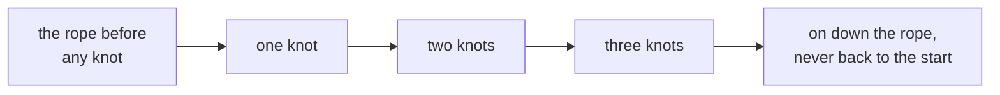

# Peano's three rules: building the counting numbers, and why 1 + 1 = 2 is a conclusion

[Syllabus](../../../SYLLABUS.md) → [Foundations](../../../SYLLABUS.md#w01) → [Proof](../../../SYLLABUS.md#w01-s06) → Peano's three rules

---

## General Overview

A shepherd opens the gate at dawn with a rope. One sheep through, one knot. Another sheep, another knot after the last. No number is said out loud.

At dusk a knot comes off for each sheep back. Bare rope, whole flock. Knots left, something is on the hill.

Cut it at any knot and you have a rope of your own: a counting number. Three rules pin them down. There is a **starting point**: the rope before any knot. Every rope has **exactly one next** — one more knot. That next **never lands on the start, and no two ropes share one**. And **nothing else counts as a rope**: every one comes from tying knots up from the start.

That third rule is induction, the method [Induction](04-proof-by-induction.md) runs on — here not a technique but a rule saying what the counting numbers *are*.

**Fix a start, fix a next, rule out everything else — then addition is a definition, and 1 + 1 = 2 unfolds from it.**

### The picture: one move, one direction



Every arrow is the same move: one more knot. None returns to the start, no two meet.

---

## The formula

The real word for "the next one" is **successor**. Write the successor of a rope n as next(n). From here on, next.

Numerals name short ropes:

**1 = next(zero)     and     2 = next(next(zero))**

Addition is not a fourth rule. Two lines say what plus does:

**Rule one: anything plus zero is that thing.**
**Rule two: anything plus next(n) is next of (that thing plus n).**

Point them at 1 + 1:

**1 + 1 = 1 + next(zero) = next(1 + zero) = next(1) = 2**

| Piece | Plain meaning | On the shepherd's rope |
| --- | --- | --- |
| zero | the starting point | the rope before any knot |
| n | any counting number | a rope with knots in it |
| next(n) | the successor of n: one more knot | next(zero) has one knot |
| 1 | next(zero) | one knot |
| 2 | next(next(zero)) | two knots |
| plus | the two rules above, nothing more | 1 + 1 gives 2 |

---

## Why it works

### Step 0: a rope, not a chant

The counting numbers are usually a chant: one, two, three. A chant has no reason in it. The rope has one move, and every number is a length of it.

### Step 1: the start, and the next

Zero is the rope with nothing tied: no bottom without it, nothing for induction to stand on. Every rope has one more knot, so the numbers never run out.

### Step 2: the two things the next may not do

**No next is zero.** Nothing is tied before the start, so the rope cannot close into a ring. Drop it and the rope is a clock face: count far enough and you are back at the start.

**No two ropes share a next.** Two counts never collapse onto one, so "the knot before this one" is a single knot. Drop it and the far end sticks: keep tying, stay put.

### Step 3: nothing else got in

The first two rules let a stray rope sit off to the side, never reached from the start. Rule three bans it. True at the start, true at each next whenever true before, so true everywhere: induction.

### Step 4: addition, defined and then run

Rule one handles zero. Rule two peels a knot off the right-hand rope and hangs it outside: each use leaves that side shorter, so it bottoms out at rule one.

So 1 + 1 = 2 is a conclusion, not a fact. Read 1 + 1 as 1 + next(zero), move the next outside, clear the inside by rule one, land on next(1): the name 2. Each step is a rule, a direct proof ([Direct proof](01-direct-proof.md)).

---

## Worked numbers, by hand

The shepherd's rope, counted in knots.

| Step | Arithmetic | Value |
| --- | --- | --- |
| the rope before any knot | zero | 0 |
| one | next(zero) | 1 |
| two | next(one) | 2 |
| 1 + 1, second 1 written out | 1 + next(zero) | 2 |
| rule two moves the next outside | next(1 + zero) | 2 |
| rule one finishes the inside | next(1) | **2** |
| the same rules on 2 + 3 | next(next(next(2 + zero))) | **5** |

Two knots and three knots make five, and nothing there was remembered.

### What breaks if you drop a piece

| Ban dropped | 2 + 3 lands on | What actually breaks |
| --- | --- | --- |
| No next is zero (a ring of four) | 1 | The sum is right: here 5 and 1 are one rope. Numerals stop naming separate ropes. |
| No two ropes share a next (a stuck end) | 3 | Right again: 5 and 3 are one rope. Tie more, stay put. |

Rule two without the outer next is a different mistake, not a dropped ban: the knot comes off and never goes back on, so 2 + 3 lands on 2 — a wrong sum. The code prints all three.

---

## Code, from first principles, and it actually runs

Nothing is imported. Only the ruler and the broken models use the plus sign; the two rules never touch it. A number is a rope: an empty box for zero, one more box per knot. Addition is the two rules alone. Then a second road: tie knots one at a time and land on the same rope.

### Python

```python
# Peano's three rules -- the check behind the card.  Nothing is imported.  A
# number is a rope: () is the rope before any knot, (r,) is one more knot tied
# after r.  Addition is the two rules alone, and 1 + 1 lands where it lands.
def nxt(r): return (r,)                      # the next knot after the rope r
def knots(r): return 0 if r == () else knots(r[0]) + 1      # the ruler, not the arithmetic
def add(m, n):                               # rule one: m + 0 = m.  rule two: m + next(n) = next(m + n)
    return m if n == () else nxt(add(m, n[0]))
def dropped_next(m, n):                      # a mistake: rule two without the outer next
    return m if n == () else dropped_next(m, n[0])
def walk(k, times, nextf):                   # second road: take the next knot, once per knot
    for _ in range(times): k = nextf(k)
    return k
zero = ()
one, two, three = nxt(zero), nxt(nxt(zero)), nxt(nxt(nxt(zero)))
def row(name, value): print(f"{name:<40}{value:>4}")
row("zero, the rope before any knot", knots(zero))
row("one, the knot after zero", knots(one))
row("two, the knot after one", knots(two))
row("1 + 1 by the two rules", knots(add(one, one)))
row("2 + 3 by the two rules", knots(add(two, three)))
row("2 + 3 by tying one knot at a time", knots(walk(two, knots(three), nxt)))
print(f"1 + 1 lands on two, knot for knot: {add(one, one) == two}")
print(f"the three mistakes come out at {walk(2, 3, lambda k: (k + 1) % 4)},",
      f"{walk(2, 3, lambda k: min(k + 1, 3))} and {knots(dropped_next(two, three))}")
assert knots(add(one, one)) == 2 and add(one, one) == two
assert knots(add(two, three)) == 5 and add(two, three) == walk(two, knots(three), nxt)
assert knots(zero) == 0 and knots(one) == 1 and knots(nxt(three)) == 4
print("ALL CHECKS PASS")
```

**Ran 2026-09-06 on macOS, Python 3.14.6, standard library only. All checks passed. Output, pasted from the run:**

```
zero, the rope before any knot             0
one, the knot after zero                   1
two, the knot after one                    2
1 + 1 by the two rules                     2
2 + 3 by the two rules                     5
2 + 3 by tying one knot at a time          5
1 + 1 lands on two, knot for knot: True
the three mistakes come out at 1, 3 and 2
ALL CHECKS PASS
```

### Rust

Same numbers and labels, built with `rustc --edition 2021 -O`.

```rust
// Peano's three rules -- the same check as peano_and_one_plus_one_check.py, in
// Rust.  No crates.  A number is a rope: Zero is the rope before any knot, and
// Knot(r) is one more knot tied after r.  Addition is the two rules alone.
#[derive(Clone, PartialEq)]
enum Rope { Zero, Knot(Box<Rope>) }
fn nxt(r: Rope) -> Rope { Rope::Knot(Box::new(r)) }        // the next knot after the rope r
fn knots(r: &Rope) -> i64 { match r { Rope::Zero => 0, Rope::Knot(i) => knots(i) + 1 } }
fn add(m: Rope, n: &Rope) -> Rope {                        // m + 0 = m;  m + next(n) = next(m + n)
    match n { Rope::Zero => m, Rope::Knot(i) => nxt(add(m, i)) }
}
fn dropped_next(m: Rope, n: &Rope) -> Rope {               // a mistake: rule two without the next
    match n { Rope::Zero => m, Rope::Knot(i) => dropped_next(m, i) }
}
// second road: tie one knot at a time.  Then the same walk on a rope that breaks a rule.
fn tie(mut m: Rope, times: i64) -> Rope { for _ in 0..times { m = nxt(m); } m }
fn walk(mut k: i64, times: i64, nextf: fn(i64) -> i64) -> i64 { for _ in 0..times { k = nextf(k); } k }
fn row(name: &str, value: i64) { println!("{:<40}{:>4}", name, value); }
fn main() {
    let (zero, one) = (Rope::Zero, nxt(Rope::Zero));
    let two = nxt(one.clone());
    let three = nxt(two.clone());
    row("zero, the rope before any knot", knots(&zero));
    row("one, the knot after zero", knots(&one));
    row("two, the knot after one", knots(&two));
    row("1 + 1 by the two rules", knots(&add(one.clone(), &one)));
    row("2 + 3 by the two rules", knots(&add(two.clone(), &three)));
    row("2 + 3 by tying one knot at a time", knots(&tie(two.clone(), knots(&three))));
    println!("1 + 1 lands on two, knot for knot: {}",
             if add(one.clone(), &one) == two { "True" } else { "False" });
    println!("the three mistakes come out at {}, {} and {}", walk(2, 3, |k| (k + 1) % 4),
             walk(2, 3, |k| (k + 1).min(3)), knots(&dropped_next(two.clone(), &three)));
    assert!(knots(&add(one.clone(), &one)) == 2 && add(one.clone(), &one) == two);
    assert!(knots(&add(two.clone(), &three)) == 5
            && add(two.clone(), &three) == tie(two.clone(), knots(&three)));
    assert!(knots(&zero) == 0 && knots(&one) == 1 && knots(&nxt(three)) == 4);
    println!("ALL CHECKS PASS");
}
```

**Ran 2026-09-06 on macOS, rustc 1.98.1, no crates. All checks passed. Output, pasted from the run:**

```
zero, the rope before any knot             0
one, the knot after zero                   1
two, the knot after one                    2
1 + 1 by the two rules                     2
2 + 3 by the two rules                     5
2 + 3 by tying one knot at a time          5
1 + 1 lands on two, knot for knot: True
the three mistakes come out at 1, 3 and 2
ALL CHECKS PASS
```

The two outputs match line for line.

> [!TIP]
> **Try changing**
> Guess first, then run it.
> - **Take the next off rule two.** Drop the outer `nxt` from `add`: every sum is then the left-hand rope, 2 + 3 reads 2, and the first assert fires — 1 + 1 lands on 1.
> - **Shorten the loop.** Count round three knots, not four: three steps from knot 2 land back on 2, so the line reads 2, 3 and 2.

---

## The usual mistake

> [!warning]
> **Reading 1 + 1 = 2 as a fact someone decided.** It is the end of a four-step unfolding, every step a rule or a name. Change a rule and the answer changes with it.
>
> - **Thinking next means "add one".** Backwards: next comes first, plus is defined from it. Saying next(n) is n + 1 borrows the thing being built.
> - **Treating induction as something the rules leave out.** It is rule three.
> - **Dropping a ban and not noticing.** In a ring of four the sum still comes out right; it is the numerals that quietly stop naming separate ropes.

---

## Where you meet it in real life

- **Tally marks.** The knots in another coat: a five-bar gate on a clipboard, no number named until the end.
- **Counters in code.** A counter starts somewhere and takes one next per pass — which is why counting passes proves anything: [Induction](04-proof-by-induction.md).
- **The rest of arithmetic.** Multiplying is defined from adding the same way, and the number families sit on this rope: [The number families](../02-The%20Number%20Line/01-number-families.md).

> **Say it back**
> A shepherd's rope counts with no numbers in it. Three rules pin down the counting numbers: a start, one next that is never the start and never shared, and nothing in there but what tying knots reaches. That third rule is induction. Addition is two lines: anything plus zero is itself, anything plus next(n) is next of the sum with n. Point them at 1 + 1: it unfolds to next(1), the name 2.

---

## What this builds on

- [Induction](04-proof-by-induction.md): the domino argument, here Peano's third rule.
- [The number families](../02-The%20Number%20Line/01-number-families.md): the counting numbers as a named family; this card is where it comes from.
- [Direct proof](01-direct-proof.md): the shape of the 1 + 1 unfolding.

## Where this goes next

- [Division with a remainder](../../02-Number%20theory/01-Divisibility%20and%20Primes/04-division-with-remainder.md): the least-element property at work.
- [No gaps](../../06-Calculus%20and%20analysis/01-Limits%20and%20Continuity/02-supremum-and-completeness.md): the reals, the last step.


---

## Sources

Verified 6 Sep 2026; every link resolves.

- Peano, Giuseppe. *Arithmetices principia, nova methodo exposita*. Turin, 1889. [Internet Archive scan](https://archive.org/details/arithmeticespri00peangoog). The original rules, in Latin; Peano starts at 1, not 0, but the theory is the same after renaming.
- Hammack, Richard. *Book of Proof*, 3rd ed. [Full text, free](https://richardhammack.github.io/BookOfProof/Main.pdf). The successor picture and induction as a principle.
- Tao, Terence. *Analysis I*, 4th ed. Springer, 2022. [doi:10.1007/978-981-19-7261-4](https://doi.org/10.1007/978-981-19-7261-4). Chapter 2 builds addition from the successor.
