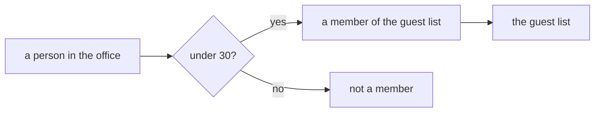

# Sets: a collection defined only by what belongs, with the empty set and set-builder shorthand

[Syllabus](../../../SYLLABUS.md) → [Foundations](../README.md) → [Sets](../README.md#s07) → Sets and membership

---

## General Overview

You are throwing a party. Five people work in your office: Ana is 24, Ben is 31, Cleo is 28, Dev is 41, Eli is 29. You invite everyone under 30. The guest list comes out **Ana, Cleo, Eli**.

The list answers one question: hand it a name, it says yes or no. Ana, yes. Ben, no. Nothing else is information. Write the names in another order, or write Ana twice, and it is the same guest list.

A collection like that — settled entirely by what is on it — is what we mean by a **set**. Its contents are its **members**.

**A set is nothing but its membership: same members, same set.**

### The picture: the one question a set answers



Everyone through one gate. The set is the yes pile.

---

## The formula

A set gets written down two ways, both naming the same thing.

Write the members out between braces. This is a **roster**:

**G = {Ana, Cleo, Eli}**

Or state the test instead. This is **set-builder shorthand**:

**G = {x in the office : x is under 30}**

Read it aloud: "G is the set of people x from the office such that x is under 30." The letter x stands for one person at a time; the colon reads "such that". Two spellings, one set.

| Symbol | Plain meaning | In our party |
| --- | --- | --- |
| $G$ | a name for one set: the guest list | Ana, Cleo, Eli |
| $\in$ | "is on it", the one question a set answers | Ana $\in$ G |
| $\notin$ | "is not on it" | Ben $\notin$ G |
| $\emptyset$ | the empty set: nobody on it | the office under-20s |
| { } | braces: the members are what sits inside | {Ana, Cleo, Eli} |
| : | inside braces, "such that" | {x in the office : x is under 30} |

---

## Why it works

### Walk the office once

Walk the office, one question each. Ana, 24: yes. Ben, 31: no. Cleo, 28: yes. Dev, 41: no. Eli, 29: yes. Three yeses, and the set is built.

That is all a set ever is. No order: you never asked who came first. No copies: each person was asked once. A list is a different object. Square brackets mean a list: [Cleo, Eli, Ana] differs from [Ana, Cleo, Eli], and [Eli, Ana, Cleo, Ana] has four entries. A set throws away both of those facts.

### Same members, same set

Compare **{Ana, Cleo, Eli}** with the scrambled spelling **{Eli, Ana, Cleo, Ana}**. Run all five office names past both. Ana: on both. Ben: neither. Cleo: both. Dev: neither. Eli: both.

Nothing could tell the two apart. One set, three members, not four. The rule has a name: **extensionality** — a set is fixed by its extension, meaning who is in it. The test is "for every name, on one exactly when on the other", and that "for every" is the for-all **quantifier** — the word for a claim that covers every case — from [Quantifiers](../05-Logic/04-quantifiers.md).

### The list with nobody on it

Ask for everyone in the office under 20. Nobody. Everyone over 60. Nobody. Two rules, no members. Same members — none — so the same set. There is exactly one such set: the **empty set**, written $\emptyset$ or as empty braces { }.

It is a thing, not the absence of one: an envelope with no invitation is still an envelope. And a list with the empty list written on it is not empty — it has one entry.

---

## Worked numbers, by hand

The party, end to end.

| Step | Arithmetic | Value |
| --- | --- | --- |
| people in the office | Ana, Ben, Cleo, Dev, Eli | 5 |
| the rule, one at a time | 24 yes, 31 no, 28 yes, 41 no, 29 yes | 3 yeses |
| the list, by the rule | keep the yeses | 3 |
| the list, written out | {Ana, Cleo, Eli} | 3 |
| same guests either way | every name, same answer | True |
| Ana is on the list | 24 is under 30 | True |
| Ben is on the list | 31 is not under 30 | False |
| the scrambled spelling | repeat dropped | 3 |
| nobody under 20 | no yeses | 0 |
| nobody over 60 | no yeses | 0 |
| the two empty lists agree | same members: none | **True** |

Three people are coming, and one empty list.

### What breaks if you drop a piece

| Mistake | Comes out at | What went wrong |
| --- | --- | --- |
| Counting the repeat in {Eli, Ana, Cleo, Ana} | 4 guests | A name written twice is one guest |
| Treating the list as ordered | 6 orderings | Three guests write in 3 × 2 × 1 = 6 orders, all one set |
| Dropping the "under 30" half | 5 guests | That is the whole office, not the party |

The code prints the two the data gives; 6 is 3 × 2 × 1 by hand.

---

## Code, from first principles, and it actually runs

Nothing is imported. The guest list is built from the rule, cross-checked against the list written by hand, then checked person by person, so a name that slipped in or out fires an assert — a line that stops the program if a claim is false.

### Python

```python
# Sets and membership -- the check behind the card.  Nothing is imported.  The
# office is five people with ages.  The party guest list is everyone under 30,
# written out by name and built again from the rule, plus two empty lists.
OFFICE = [("Ana", 24), ("Ben", 31), ("Cleo", 28), ("Dev", 41), ("Eli", 29)]

def under_30(age): return age < 30   # the party rule, strict: a 30-year-old is out
def by_rule(test):              # keep the office people the test says yes to
    return frozenset(name for name, age in OFFICE if test(age))

def row(name, value):
    print(f"{name:<30}{value:>6}")

names = ["Eli", "Ana", "Cleo", "Ana"]                 # scrambled, one name twice
written = frozenset(["Ana", "Cleo", "Eli"])           # the list, written out
guests = by_rule(under_30)                            # the same list, from the rule
row("people in the office", len(OFFICE))
row("guests, by the rule", len(guests))
row("guests, written out", len(written))
row("same guests either way", str(guests == written))
row("Ana is on the list", str("Ana" in guests))
row("Ben is on the list", str("Ben" in guests))
row("scrambled spelling, guests", len(frozenset(names)))
row("nobody in the office under 20", len(by_rule(lambda age: age < 20)))
row("nobody in the office over 60", len(by_rule(lambda age: age > 60)))
row("the two empty lists agree", str(by_rule(lambda age: age < 20) == by_rule(lambda age: age > 60)))
print(f"count the repeat: {len(names)} guests; count the orders: {3 * 2 * 1} spellings; drop the rule: {len(OFFICE)} guests")
assert guests == written and frozenset(names) == written    # order and repeats do not count
assert all(under_30(age) == (name in written) for name, age in OFFICE)   # person by person
assert len(guests) == 3 and len(OFFICE) == 5 and len(by_rule(lambda age: age > 60)) == 0 and not under_30(30)
print("ALL CHECKS PASS")
```

**Ran 2026-09-06 on macOS, Python 3.14.6, standard library only. All checks passed. Output, pasted from the run:**

```
people in the office               5
guests, by the rule                3
guests, written out                3
same guests either way          True
Ana is on the list              True
Ben is on the list             False
scrambled spelling, guests         3
nobody in the office under 20      0
nobody in the office over 60       0
the two empty lists agree       True
count the repeat: 4 guests; count the orders: 6 spellings; drop the rule: 5 guests
ALL CHECKS PASS
```

### Rust

Same numbers, same labels, built with `rustc --edition 2021 -O`. Rust builds its own set: drop repeats, sort, compare by members.

```rust
// Sets and membership -- the same check as sets_and_membership_check.py, in
// Rust.  No crates.  The office is five people with ages.  The guest list is
// everyone under 30, written out by name and built again from the rule.
const OFFICE: [(&str, i64); 5] = [("Ana", 24), ("Ben", 31), ("Cleo", 28), ("Dev", 41), ("Eli", 29)];

fn under_30(age: i64) -> bool { age < 30 }   // the party rule, strict: a 30-year-old is out
fn as_set(names: &[&str]) -> Vec<String> {   // a set: repeats dropped, order thrown away
    let mut out: Vec<String> = Vec::new();
    for n in names { if !out.contains(&n.to_string()) { out.push(n.to_string()); } }
    out.sort();
    out
}
fn by_rule(test: fn(i64) -> bool) -> Vec<String> {   // keep the office people it says yes to
    as_set(&OFFICE.iter().filter(|(_, age)| test(*age)).map(|(n, _)| *n).collect::<Vec<&str>>())
}
fn row(name: &str, value: String) { println!("{:<30}{:>6}", name, value); }
fn yes_no(b: bool) -> String { String::from(if b { "True" } else { "False" }) }
fn has(set: &[String], name: &str) -> bool { set.contains(&name.to_string()) }

fn main() {
    let names = ["Eli", "Ana", "Cleo", "Ana"];             // scrambled, one name twice
    let written = as_set(&["Ana", "Cleo", "Eli"]);         // the list, written out
    let guests = by_rule(under_30);                        // the same list, from the rule
    row("people in the office", OFFICE.len().to_string());
    row("guests, by the rule", guests.len().to_string());
    row("guests, written out", written.len().to_string());
    row("same guests either way", yes_no(guests == written));
    row("Ana is on the list", yes_no(has(&guests, "Ana")));
    row("Ben is on the list", yes_no(has(&guests, "Ben")));
    row("scrambled spelling, guests", as_set(&names).len().to_string());
    row("nobody in the office under 20", by_rule(|age| age < 20).len().to_string());
    row("nobody in the office over 60", by_rule(|age| age > 60).len().to_string());
    row("the two empty lists agree", yes_no(by_rule(|age| age < 20) == by_rule(|age| age > 60)));
    println!("count the repeat: {} guests; count the orders: {} spellings; drop the rule: {} guests", names.len(), 3 * 2 * 1, OFFICE.len());
    assert!(guests == written && as_set(&names) == written);   // order and repeats do not count
    assert!(OFFICE.iter().all(|(n, age)| under_30(*age) == has(&written, n)));   // person by person
    assert!(guests.len() == 3 && OFFICE.len() == 5 && by_rule(|age| age > 60).len() == 0 && !under_30(30));
    println!("ALL CHECKS PASS");
}
```

**Ran 2026-09-06 on macOS, rustc 1.98.1, no crates. All checks passed. Output, pasted from the run:**

```
people in the office               5
guests, by the rule                3
guests, written out                3
same guests either way          True
Ana is on the list              True
Ben is on the list             False
scrambled spelling, guests         3
nobody in the office under 20      0
nobody in the office over 60       0
the two empty lists agree       True
count the repeat: 4 guests; count the orders: 6 spellings; drop the rule: 5 guests
ALL CHECKS PASS
```

The two outputs match.

> [!TIP]
> **Try changing**
> Guess first, then run it. The asserts are pinned to the party as written, so expect one to fire.
> - **Move the cutoff.** Change `age < 30` to `age < 29` in the rule only. Eli is 29, so the rule now says two guests, the written-out list still says three, and the first assert fires.
> - **Add a fourth name.** Put `"Ben"` into `names`. A real new member, not a repeat: the count goes 3 to 4 and the first assert fires.

---

## The usual mistake

> [!warning]
> **Thinking the set is the piece of paper.** Two sheets with the names in different orders, one with a name written twice, are the same set. The paper is a spelling; the set is who answers yes.
>
> - Counting a repeated name as a second guest: {Eli, Ana, Cleo, Ana} has 3 members, not 4.
> - Reading the empty set as "no set". It is one particular set, and there is only one.
> - Confusing "on the list" with "part of the list". Ana is on the guest list. {Ana} is not on the guest list — it is a one-name list you could cut out of it. Two different relations; the second one is [Subsets and the power set](02-subsets-and-power-set.md).

---

## Where you meet it in real life

- **Guest lists, mailing lists, door lists.** The bouncer runs the only test a set knows: on it, or not.
- **Filters and searches.** "All customers under 30" is set-builder shorthand with a keyboard: state the test, the machine finds the members.
- **Answers to an equation.** The numbers that make it true form a set, so two equations with the same answers name one set.

> **Say it back**
> A set answers one question: in, or out. Write it by listing the members between braces, or by stating a rule — "the ones in the office under 30". Same set either way. Order does not count, repeats do not count, so two spellings with the same members are one set. The set with no members is the empty set, and there is exactly one of it.

---

## What this builds on

- [Quantifiers](../05-Logic/04-quantifiers.md): "for every" and "there is". Two sets are equal when, for every candidate, being on one matches being on the other.

## Where this goes next

- [Subsets and the power set](02-subsets-and-power-set.md): a whole set sitting inside another, and how many ways to pick some members.
- [Russell's paradox](06-russells-paradox.md): what goes wrong when a rule picks with no fence around what it picks from.

---

## Sources

Verified 6 Sep 2026; every link resolves.

- Halmos, Paul R. *Naive Set Theory*. Springer, 1974. [doi:10.1007/978-1-4757-1645-0](https://doi.org/10.1007/978-1-4757-1645-0). Chapter 1: membership as the one undefined idea.
- Enderton, Herbert B. *Elements of Set Theory*. Academic Press, 1977. [doi:10.1016/C2009-0-22079-4](https://doi.org/10.1016/C2009-0-22079-4). Chapter 1 makes same-members-same-set an axiom; the empty set falls out.
- Bagaria, Joan. "Set Theory." *Stanford Encyclopedia of Philosophy*, revised 2023. [plato.stanford.edu](https://plato.stanford.edu/entries/set-theory/). Free; section 2.1.
