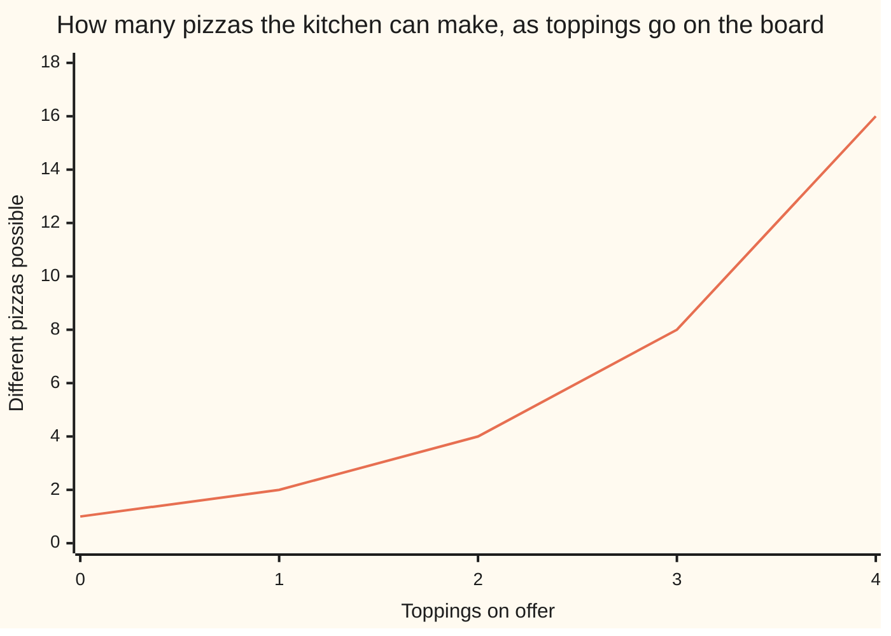

# Subsets and the power set: everything inside a set, and the 2^n ways to pick some of it

[Syllabus](../../../SYLLABUS.md) → [Foundations](../README.md) → [Sets](../README.md#s07) → Subsets and the power set

---

## General Overview

A pizza place has three toppings on offer: mushroom, olive, chilli. Tick any of them, all three, or none — none gets a plain cheese pizza.

How many different pizzas can that kitchen make? Eight.

Each pizza is a **subset** of the topping list: a set whose members all come from the set it sits inside. Plain is one, taking none; loaded is one, taking all. Gather all eight and that collection is the **power set** — the set of every subset at once.

Eight is not luck: each topping is a yes-or-no, and the menu doubles at every one.

**A subset is any part of a set, none of it and all of it included; the power set is those parts collected into one set; and because every member is an on-or-off choice, a set of n members — n is how many are on the list — has 2^n subsets, n twos multiplied.**

### The picture: one doubling per topping



The line is the size of the menu. It starts at 1: with nothing on the board the kitchen still makes the plain pizza. Each topping doubles it; a fourth reaches 16.

---

## The formula

The count is the choices, multiplied:

**Toppings on offer: 3. Pizzas possible: 2 × 2 × 2 = 8.**

One 2 per topping, on or off, and the 2s multiply because the choices do not interfere. Three 2s multiplied is written **2^3**, said "two to the power of three", so n members give **2^n** subsets.

| Piece | Plain meaning | In the pizza shop |
| --- | --- | --- |
| a set | a collection, fixed by what belongs | the three toppings |
| a subset | every member of it belongs to the bigger set | mushroom and olive: one pizza |
| the empty set | the set with no members | the plain pizza |
| the power set | the set of all subsets | the eight pizzas, gathered |
| n | how many members the set has | 3 |
| 2^n | n twos multiplied | 2 × 2 × 2 = 8 |

The subset sign is ⊆: A ⊆ B reads "every member of A is in B". The power set of A is written P(A).

---

## Why it works

### One switch per topping

Building a pizza is walking the list once, one question per stop: on, or off? Nothing ties the answers together — whatever mushroom got, olive still has both answers open. So the ways multiply: 2 times 2 times 2 is 8.

The eight, in the order the code prints them: plain; mushroom; olive; mushroom, olive; chilli; mushroom, chilli; olive, chilli; mushroom, olive, chilli.

Two of those are easy to lose. The empty set is a subset of every set: to deny that you would have to find a topping on the plain pizza that is not on the board — and the plain pizza has nothing on it. Every set is also a subset of itself.

### Each new topping doubles the list

The same fact, watched growing. Nothing on the board: one pizza, the plain one. Put mushroom up and every pizza already there stays, then shows up again with mushroom added — the old list twice: 2. Olive makes it 4, chilli 8, anchovy 16.

### Proving two menus are the same set

Claim: the chilli-free pizzas are exactly the subsets of {mushroom, olive}.

Written out, that power set has four members, and each member is itself a set:

**P({mushroom, olive}) = { { }, {mushroom}, {olive}, {mushroom, olive} }**

The tool is **double inclusion**: show each collection sits inside the other. Sets are equal when they have the same members, so two inclusions settle it.

- **Every chilli-free pizza is a subset of {mushroom, olive}.** Take a pizza with no chilli. Each topping on it came off the board, so it is mushroom or olive: every member lands in {mushroom, olive}, which is what subset means.
- **Every subset of {mushroom, olive} is a chilli-free pizza.** Its members are mushroom or olive, so all of them are on the board and none of them is chilli.

Both hold, so neither has anything the other misses. Same set, four pizzas. The style is [Direct proof](../06-Proof/01-direct-proof.md).

---

## Worked numbers, by hand

| Step | Arithmetic | Value |
| --- | --- | --- |
| the empty board, then mushroom | 1 × 2 | 2 |
| put olive up | 2 × 2 | 4 |
| put chilli up | 4 × 2 | 8 |
| all at once | 2 × 2 × 2 | **8** |
| pizzas with no chilli | 2 × 2 | 4 |
| pizzas with a topping | 8 − 1 | 7 |

Eight pizzas off three toppings, the plain one included.

### What breaks if you drop a piece

| Mistake | Comes out at | What went wrong |
| --- | --- | --- |
| Leaving the plain pizza out | 7 | The empty set is a subset |
| Counting toppings, not pizzas | 3 | A member is not a subset |
| Adding a 2 per topping | 6 | Free choices multiply, not add |

---

## Code, from first principles, and it actually runs

Nothing is imported. The eight pizzas are built the plain way: walk the topping list, copying the menu at each stop and adding that topping to the copy. Then the cross-check — the chilli-free pizzas against the four subsets of {mushroom, olive}, written out by hand. The double-inclusion claim, by machine.

### Python

```python
# Subsets and the power set -- the check behind the card.  Nothing is imported.
# Three toppings are on offer, so every pizza is a subset of that list.  Build
# the eight pizzas one topping at a time, then count them a second way.
TOPPINGS = ["mushroom", "olive", "chilli"]

def build(toppings):                     # every subset, one topping at a time
    out = [[]]                           # start with the plain pizza, no toppings
    for t in toppings:
        out = out + [p + [t] for p in out]    # each new topping doubles the menu
    return out

def name(pizza): return ", ".join(pizza) if pizza else "plain"
def row(label, value): print(f"{label:<34}{value:>5}")

pizzas = build(TOPPINGS)
sizes = [len(build((TOPPINGS + ["anchovy"])[:k])) for k in range(5)]
free = [p for p in pizzas if "chilli" not in p]
nonempty = [p for p in pizzas if p]
row("toppings on offer", len(TOPPINGS))
row("pizzas possible, 2 x 2 x 2", len(pizzas))
print("the eight pizzas: " + " | ".join(name(p) for p in pizzas))
print(f"{'menu size after each topping':<29}" + "".join(f"{v:>5}" for v in sizes))
row("chilli-free pizzas", len(free))
row("pizzas with at least one topping", len(nonempty))
print(f"the three mistakes come out at {len(nonempty)}, {len(TOPPINGS)} and {2 + 2 + 2}")
assert sorted(map(name, free)) == ["mushroom", "mushroom, olive", "olive", "plain"]
assert len(pizzas) == 2 * 2 * 2 and len(free) == 2 * 2 and len(nonempty) == 7
assert sizes == [1, 2, 4, 8, 16]
print("ALL CHECKS PASS")
```

**Ran 2026-09-06 on macOS, Python 3.14.6, standard library only. All checks passed. Output, pasted from the run:**

```
toppings on offer                     3
pizzas possible, 2 x 2 x 2            8
the eight pizzas: plain | mushroom | olive | mushroom, olive | chilli | mushroom, chilli | olive, chilli | mushroom, olive, chilli
menu size after each topping     1    2    4    8   16
chilli-free pizzas                    4
pizzas with at least one topping      7
the three mistakes come out at 7, 3 and 6
ALL CHECKS PASS
```

### Rust

Same numbers and labels, built with `rustc --edition 2021 -O`.

```rust
// Subsets and the power set -- the same check as subsets_and_power_set_check.py,
// in Rust.  No crates.  Three toppings are on offer, so every pizza is a subset
// of that list.  Build the eight pizzas one topping at a time, then count again.
const TOPPINGS: &[&str] = &["mushroom", "olive", "chilli"];
fn build(toppings: &[&str]) -> Vec<Vec<String>> {    // every subset, one topping at a time
    let mut out: Vec<Vec<String>> = vec![vec![]];    // start with the plain pizza
    for t in toppings {                              // each new topping doubles the menu
        let grown: Vec<Vec<String>> = out.iter().map(|p| {
            let mut q = p.clone(); q.push(t.to_string()); q }).collect();
        out.extend(grown);
    }
    out
}
fn name(p: &[String]) -> String { if p.is_empty() { "plain".into() } else { p.join(", ") } }
fn row(label: &str, value: usize) { println!("{:<34}{:>5}", label, value); }
fn main() {
    let mut four: Vec<&str> = TOPPINGS.to_vec(); four.push("anchovy");
    let pizzas = build(TOPPINGS);
    let sizes: Vec<usize> =                          // k toppings up, never past the board
        (0..5).map(|k| build(&four[..k.min(four.len())]).len()).collect();
    let free: Vec<Vec<String>> =
        pizzas.iter().filter(|p| !p.iter().any(|x| x == "chilli")).cloned().collect();
    let nonempty = pizzas.iter().filter(|p| !p.is_empty()).count();
    row("toppings on offer", TOPPINGS.len());
    row("pizzas possible, 2 x 2 x 2", pizzas.len());
    let names: Vec<String> = pizzas.iter().map(|p| name(p)).collect();
    println!("the eight pizzas: {}", names.join(" | "));
    let mut menu = format!("{:<29}", "menu size after each topping");
    for v in &sizes { menu.push_str(&format!("{:>5}", v)); }
    println!("{}", menu);
    row("chilli-free pizzas", free.len());
    row("pizzas with at least one topping", nonempty);
    println!("the three mistakes come out at {}, {} and {}", nonempty, TOPPINGS.len(), 2 + 2 + 2);
    let mut a: Vec<String> = free.iter().map(|p| name(p)).collect();
    a.sort();                                        // the four subsets, written out by hand
    assert!(a == ["mushroom", "mushroom, olive", "olive", "plain"]);
    assert!(pizzas.len() == 2 * 2 * 2 && free.len() == 2 * 2 && nonempty == 7);
    assert!(sizes == vec![1, 2, 4, 8, 16]);
    println!("ALL CHECKS PASS");
}
```

**Ran 2026-09-06 on macOS, rustc 1.98.1, no crates. All checks passed. Output, pasted from the run:**

```
toppings on offer                     3
pizzas possible, 2 x 2 x 2            8
the eight pizzas: plain | mushroom | olive | mushroom, olive | chilli | mushroom, chilli | olive, chilli | mushroom, olive, chilli
menu size after each topping     1    2    4    8   16
chilli-free pizzas                    4
pizzas with at least one topping      7
the three mistakes come out at 7, 3 and 6
ALL CHECKS PASS
```

The two outputs match line for line: whole counts, no rounding.

> [!TIP]
> **Try changing**
> Guess first, then run it. The asserts are pinned to three toppings, so one will fire.
> - **Take chilli off the board.** The menu halves to 4, the doubling line stalls at 8, 8, and the count assert fires.
> - **Put anchovy up for real.** 16 pizzas, and the asserts fire — they are pinned to three toppings.

---

## The usual mistake

> [!warning]
> **Mixing up a member with a subset.** Mushroom is a topping — a member of the set. {mushroom} is a pizza — a subset. The power set is built from the second kind. Count members and you get 3 where the answer is 8.
>
> - Forgetting the plain pizza, or the loaded one. Both are subsets: leave the plain one out and you get 7.
> - Adding instead of multiplying: 2 + 2 + 2 is 6, not 8.
> - Proving two sets equal from one inclusion, which leaves room to spare on the other side.

---

## Where you meet it in real life

- **Tick-all-that-apply forms.** Every checkbox doubles the ways the form can come back, so a short option list becomes a long one.
- **Probability.** An event is a subset of the outcomes: "an even roll" is a subset of the six faces of a die. How events combine: [Set operations](03-set-operations.md).
- **Testing software.** Each on-or-off setting doubles the states the thing can be in, so trying every one becomes impossible.

> **Say it back**
> A subset is a set whose members all come from another set; taking none counts, taking all counts. Collect every subset and that is the power set. Each member is one on-or-off choice, and free choices multiply, so n members give 2^n subsets — three toppings, eight pizzas. To prove two sets equal, show each sits inside the other.

---

## What this builds on

- [Sets](01-sets-and-membership.md): what a set is, what belonging means, and the empty set counted here.
- [Exponents](../03-Powers%2C%20Roots%20and%20Logarithms/01-exponents-and-powers.md): multiplying a number by itself over and over, written short.
- [Direct proof](../06-Proof/01-direct-proof.md): assume a thing is in one set, show it is in the other. Both halves of the double inclusion are that move.

## Where this goes next

- [Set operations](03-set-operations.md): union, intersection, difference and complement — how two subsets of one set combine.
- [Comparing infinities](../09-Sizes%20of%20Infinity/04-comparing-infinities.md): the power set is always bigger than the set it came from, infinite sets included — how one infinity beats another.

---

## Sources

Verified 6 Sep 2026; every link resolves.

- Hammack, Richard. *Book of Proof*, 3rd ed. [Free PDF](https://richardhammack.github.io/BookOfProof/Main.pdf). Subsets and power sets in chapter 1; double inclusion in chapter 8.
- Halmos, Paul R. *Naive Set Theory*. Springer, 1974. [doi:10.1007/978-1-4757-1645-0](https://doi.org/10.1007/978-1-4757-1645-0). Section 5: the axiom that a power set exists at all.
- Enderton, Herbert B. *Elements of Set Theory*. Academic Press, 1977. [doi:10.1016/C2009-0-22079-4](https://doi.org/10.1016/C2009-0-22079-4). Chapter 2: subsets, power sets, equality as two inclusions.
