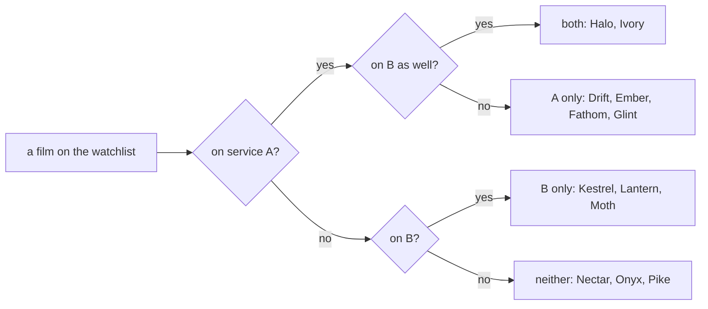

# Set operations: union, intersection, difference and complement, four piles from two lists

[Syllabus](../../../SYLLABUS.md) → [Foundations](../README.md) → [Sets](../README.md#s07) → Set operations

---

## General Overview

Twelve films sit on your watchlist. Six stream on service A. Five stream on service B. Two — Halo and Ivory — are on both.

Four questions come up. What can I watch tonight without paying for anything new? Which are on both, so the app does not matter? Which are on A but not on B? Which are on neither?

Each takes the two lists — and, for the last one, the whole watchlist — and hands one back. The four moves work on any two sets — [Sets](01-sets-and-membership.md) for what a set is.

**Combining two sets is one question per thing — or, and, and-not, not-at-all — and keeping everything that answers yes.**

### The picture: two gates, four piles



Every film lands in exactly one pile. Two overlapping circles in a box hold the same four piles as regions: that picture is a Venn diagram.

---

## The formula

A is the service A films, B the service B ones:

**A = {Drift, Ember, Fathom, Glint, Halo, Ivory}**
**B = {Halo, Ivory, Kestrel, Lantern, Moth}**

Nectar, Onyx and Pike are on neither. The four answers:

**A ∪ B = {Drift, Ember, Fathom, Glint, Halo, Ivory, Kestrel, Lantern, Moth} — 9 films**
**A ∩ B = {Halo, Ivory} — 2 films**
**A − B = {Drift, Ember, Fathom, Glint} — 4 films**
**not (A ∪ B) = {Nectar, Onyx, Pike} — 3 films**

**Read them aloud:** on either service, on both, on A but not B, on neither.

| Symbol | Plain meaning | In the watchlist |
| --- | --- | --- |
| U | universe: everything in play, fixed first | the 12 films |
| A ∪ B | union: in A, or in B, or both | 9 films |
| A ∩ B | intersection: in A and in B | 2 films |
| A − B | difference: in A, not in B | 4 films |
| not A | complement: in the universe, not in A | 6 films |
| { } | braces: the members sit inside | {Halo, Ivory} |

<details>
<summary>Written other ways elsewhere</summary>

The complement of A appears as A^c or Ā; the universe as U; and A − B as A \ B.

</details>

A complement needs everything in play named first: the **universe**, written U — here, the 12 films.

---

## Why it works

### Step 0: one film, two questions

Walk the list, asking each film twice: on A? on B? Each question has one answer, so every film drops into exactly one pile: 4 on A only, 2 on both, 3 on B only, 3 on neither — back to 12.

The four moves are those piles glued together: the union is the first three, 9 films; the intersection is "both", 2; A − B is "A only", 4 — an intersection with a "not" in it; the complement of the union is "neither", 3. Order matters for a difference: B − A is the B-only pile, 3 films.

### Step 1: the union counts the overlap once

Six plus five is 11, but only 9 films stream. Halo and Ivory got counted twice, once on each service, and each is one film. Take the 2 shared off: 6 + 5 − 2 = 9. The general rule: [Inclusion-exclusion](04-inclusion-exclusion.md).

### Step 2: De Morgan, not on either is not on A and not on B

The "neither" pile, reached two ways.

Road one, off the union: the 9 streaming films come off the 12, leaving Nectar, Onyx, Pike.

Road two, one service at a time. Not on A: Kestrel, Lantern, Moth, Nectar, Onyx, Pike — 6. Not on B: Drift, Ember, Fathom, Glint, Nectar, Onyx, Pike — 7. On both lists: Nectar, Onyx, Pike.

Same three films. The "not" moved inside the brackets and flipped or into and — De Morgan's law, on sets: [Logical equivalence and De Morgan](../05-Logic/03-logical-equivalence-and-de-morgan.md). The mirror law flips it: not on both services is not on A or not on B — missing from at least one, 10 films.

---

## Worked numbers, by hand

| Step | Arithmetic | Value |
| --- | --- | --- |
| the watchlist, the universe | count | 12 |
| on service A, on service B | count each | 6 and 5 |
| on both, A ∩ B | count | 2 |
| A ∪ B, overlap counted once | 6 + 5 − 2 | **9** |
| A − B, on A only | 6 − 2 | **4** |
| B − A, on B only | 5 − 2 | **3** |
| not on either, complement of A ∪ B | 12 − 9 | **3** |
| De Morgan: not on A (12 − 6 = 6), not on B (12 − 5 = 7) | on both lists | **3** |

Nine films are a click away tonight; three need a trip elsewhere.

### What breaks if you drop a piece

| Mistake | Comes out at | What went wrong |
| --- | --- | --- |
| Adding the services for the union | 11 | Halo and Ivory counted twice |
| Reading A − B as 6 − 5 | 1 | Only the 2 shared films leave A |
| De Morgan with "or" for "and" | 10 | Those are the films not on *both* |

---

## Code, from first principles, and it actually runs

Nothing is imported. Every film walks past the two questions into a pile — the definitions by hand. The counts are then checked by arithmetic, and the two roads to "neither" compared film by film.

### Python

```python
# Set operations -- the check behind the card.  Nothing is imported.  A 12-film
# watchlist: six films stream on service A, five on B, two on both.  Walk the
# list once, sorting each film into a pile, then count the answers a second way.
FILMS = ["Drift", "Ember", "Fathom", "Glint", "Halo", "Ivory",
         "Kestrel", "Lantern", "Moth", "Nectar", "Onyx", "Pike"]
A, B = FILMS[:6], FILMS[4:9]         # service A, service B; Halo and Ivory on both
def pick(test):                      # walk all twelve films, keep the yeses
    return [f for f in FILMS if test(f)]
union = pick(lambda f: f in A or f in B)
both = pick(lambda f: f in A and f in B)
a_only = pick(lambda f: f in A and f not in B)
b_only = pick(lambda f: f in B and f not in A)
neither = pick(lambda f: f not in A and f not in B)     # not on A, and not on B
outside = pick(lambda f: f not in union)                # the other road: not (A or B)
for label, films in [("films on the watchlist", FILMS), ("films on service A", A),
                     ("films on service B", B), ("on both, A and B", both),
                     ("A or B, the union", union), ("A minus B, on A only", a_only),
                     ("B minus A, on B only", b_only), ("not on either", outside)]:
    print(f"{label:<30}{len(films):>4}")
print(f"not on A: {len(pick(lambda f: f not in A))} -- not on B: "
      f"{len(pick(lambda f: f not in B))} -- in both of those lists: {len(neither)}")
print("A only: " + ", ".join(a_only) + " | both: " + ", ".join(both)
      + " | B only: " + ", ".join(b_only) + " | neither: " + ", ".join(outside))
print(f"the three mistakes come out at {len(A) + len(B)}, {len(A) - len(B)} "
      f"and {len(FILMS) - len(both)}")
assert len(union) == 6 + 5 - 2 and len(outside) == 12 - 9      # counted by arithmetic
assert outside == neither and neither == ["Nectar", "Onyx", "Pike"]   # De Morgan
assert both == ["Halo", "Ivory"] and len(a_only) == 4 and len(b_only) == 3
print("ALL CHECKS PASS")
```

**Ran 2026-09-06 on macOS, Python 3.14.6, standard library only. All checks passed. Output, pasted from the run:**

```
films on the watchlist          12
films on service A               6
films on service B               5
on both, A and B                 2
A or B, the union                9
A minus B, on A only             4
B minus A, on B only             3
not on either                    3
not on A: 6 -- not on B: 7 -- in both of those lists: 3
A only: Drift, Ember, Fathom, Glint | both: Halo, Ivory | B only: Kestrel, Lantern, Moth | neither: Nectar, Onyx, Pike
the three mistakes come out at 11, 1 and 10
ALL CHECKS PASS
```

### Rust

Same labels and numbers, built with `rustc --edition 2021 -O`.

```rust
// Set operations -- the same check as set_operations_check.py, in Rust.  No
// crates.  A 12-film watchlist: six films stream on service A, five on B, two
// on both.  Walk the list once into piles, then count the answers a second way.
const FILMS: [&str; 12] = ["Drift", "Ember", "Fathom", "Glint", "Halo", "Ivory",
                           "Kestrel", "Lantern", "Moth", "Nectar", "Onyx", "Pike"];
fn has(list: &[&str], f: &str) -> bool { list.iter().any(|x| *x == f) }
fn pick(test: impl Fn(&str) -> bool) -> Vec<&'static str> {   // walk all twelve films
    FILMS.iter().copied().filter(|f| test(f)).collect()
}
fn main() {
    let (a, b) = (&FILMS[..6], &FILMS[4..9]);    // service A, service B
    let union = pick(|f| has(a, f) || has(b, f));
    let both = pick(|f| has(a, f) && has(b, f));
    let a_only = pick(|f| has(a, f) && !has(b, f));
    let b_only = pick(|f| has(b, f) && !has(a, f));
    let neither = pick(|f| !has(a, f) && !has(b, f));         // not on A, and not on B
    let outside = pick(|f| !has(&union, f));                  // the other road
    let rows: [(&str, usize); 8] = [("films on the watchlist", FILMS.len()),
        ("films on service A", a.len()), ("films on service B", b.len()),
        ("on both, A and B", both.len()), ("A or B, the union", union.len()),
        ("A minus B, on A only", a_only.len()), ("B minus A, on B only", b_only.len()),
        ("not on either", outside.len())];
    for (label, n) in rows { println!("{:<30}{:>4}", label, n); }
    println!("not on A: {} -- not on B: {} -- in both of those lists: {}",
             pick(|f| !has(a, f)).len(), pick(|f| !has(b, f)).len(), neither.len());
    println!("A only: {} | both: {} | B only: {} | neither: {}", a_only.join(", "),
             both.join(", "), b_only.join(", "), outside.join(", "));
    println!("the three mistakes come out at {}, {} and {}",
             a.len() + b.len(), a.len() - b.len(), FILMS.len() - both.len());
    assert!(union.len() == 6 + 5 - 2 && outside.len() == 12 - 9);   // by arithmetic
    assert!(outside == neither && neither == ["Nectar", "Onyx", "Pike"]); // De Morgan
    assert!(both == ["Halo", "Ivory"] && a_only.len() == 4 && b_only.len() == 3);
    println!("ALL CHECKS PASS");
}
```

**Ran 2026-09-06 on macOS, rustc 1.98.1, no crates. All checks passed. Output, pasted from the run:**

```
films on the watchlist          12
films on service A               6
films on service B               5
on both, A and B                 2
A or B, the union                9
A minus B, on A only             4
B minus A, on B only             3
not on either                    3
not on A: 6 -- not on B: 7 -- in both of those lists: 3
A only: Drift, Ember, Fathom, Glint | both: Halo, Ivory | B only: Kestrel, Lantern, Moth | neither: Nectar, Onyx, Pike
the three mistakes come out at 11, 1 and 10
ALL CHECKS PASS
```

> [!TIP]
> **Try changing**
> Guess first, then run it. The asserts are pinned to this watchlist, so one fires each time.
> - **Swap Halo out of B for Nectar.** Change `FILMS[4:9]` to `FILMS[5:10]`: overlap 1, union 10, neither 2.
> - **Drop Pike from the watchlist.** Universe 11, union still 9, neither 2.
> - **Give B the same films as A.** Set B to `FILMS[:6]`: union 6, both 6, A − B empty, neither 6.

---

## The usual mistake

> [!warning]
> **Adding the two services and calling that the union.** Six plus five is 11, but only 9 films stream. Halo and Ivory were counted on each list, and they are still two films. A union never counts a thing twice.
>
> - Reading A − B as ordinary subtraction: 6 − 5 is 1, where the answer is 4. Only the 2 shared films leave A.
> - Taking a complement with no universe named: "not on A" is 6 films here, unanswerable across every film ever made.
> - Flipping the wrong word in De Morgan: not on A or not on B is 10 films, not 3.

---

## Where you meet it in real life

- **Search filters.** Two brands ticked is a union; adding a size, an intersection; "hide sold out", a difference.
- **Spreadsheets.** Stack two query results and drop duplicates: a union. Rows in both: an intersection.
- **Probability.** "Either happened" is a union, "both happened" an intersection, "it did not happen" a complement. See [Inclusion-exclusion](04-inclusion-exclusion.md).

> **Say it back**
> Two sets, four moves. The union is everything in one or the other or both, counted once: 6 and 5 with 2 shared gives 9, not 11. The intersection is what is in both, 2 films. A − B is A with anything also in B taken out, 4 films; B − A is another question, 3. The complement is the rest of the universe you named, 3 films on neither; and a "not" outside brackets moves inside and flips or into and.

---

## What this builds on

- [Subsets and the power set](02-subsets-and-power-set.md): A and B are subsets of the watchlist, and so is every answer here.
- [Logical equivalence and De Morgan](../05-Logic/03-logical-equivalence-and-de-morgan.md): the same or, and, not, and the same law about moving a "not" inside brackets.

## Where this goes next

- [Inclusion-exclusion](04-inclusion-exclusion.md): 6 + 5 − 2 as a rule, working for three sets and more.
- [Ordered pairs and the Cartesian product](05-ordered-pairs-and-cartesian-product.md): every member of one set paired with every member of the other.
- [Equivalence relations and partitions](../08-Relations%20and%20Functions/06-equivalence-relations-and-partitions.md): cutting a set into piles that do not overlap and leave nothing out.

---

## Sources

Verified 6 Sep 2026; every link resolves.

- Halmos, Paul R. *Naive Set Theory*. Springer, 1974. [doi:10.1007/978-1-4757-1645-0](https://doi.org/10.1007/978-1-4757-1645-0). Sections 4 and 5: unions and intersections from the axioms.
- Enderton, Herbert B. *Elements of Set Theory*. Academic Press, 1977. [doi:10.1016/C2009-0-22079-4](https://doi.org/10.1016/C2009-0-22079-4). Chapter 2: the algebra of these four, De Morgan included.
- Hammack, Richard. *Book of Proof*, 3rd ed. [Free PDF](https://richardhammack.github.io/BookOfProof/Main.pdf). Chapter 1, with Venn diagrams.
