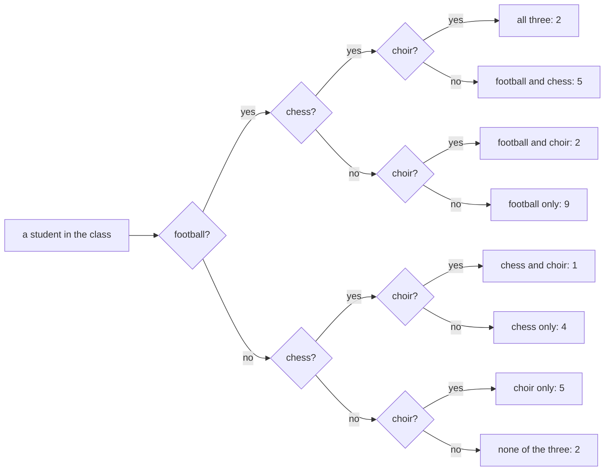

# Inclusion-exclusion: count the overlap once, not twice

[Syllabus](../../../SYLLABUS.md) → [Foundations](../README.md) → [Sets](../README.md#s07) → Inclusion-exclusion

---

## General Overview

A class of 30. Eighteen play football. Twelve play chess. How many play at least one?

Add them: 18 + 12 = 30, the whole class. Wrong, and you can feel it is wrong. Ask around: seven students play both games. Each of them sits on the football list **and** the chess list. Counted twice.

Take the seven off once: 18 + 12 − 7 = 23 play at least one game. Seven play neither.

Its name is **inclusion-exclusion**: include every group, exclude the double counts.

Ten of the class also sing in the choir. Three groups means three pairs to fix, and a knot of students on all three at once.

**Add the group sizes, take off every shared count, and put back what you took off too often, so every person ends up counted exactly once.**

### The picture: three questions, eight piles



That is a Venn diagram with the circles pulled apart: one pile per region, "none" the space outside all three. Every student lands in exactly one pile, and the piles add to 30.

---

## The formula

The arithmetic is the statement. Call the footballers F, the chess players C, the choir H, because C is already taken.

Two groups:

**18 + 12 − 7 = 23**

Add both sizes, then take off the students in both.

Three groups:

**18 + 12 + 10 − 7 − 4 − 3 + 2 = 28**

Add the three sizes. Take off the shared-by-two counts: 7 in both games, 4 in football and choir, 3 in chess and choir. Add back the 2 who do all three.

| Piece | Plain meaning | In the class |
| --- | --- | --- |
| how big a set is | how many things are in it, written with bars | \|F\| = 18 footballers |
| union, ∪ | in one group or the other, or both | F ∪ C is 23 students |
| intersection, ∩ | in both groups at once | F ∩ C is 7 students |
| the singles | the group sizes, added | 18 + 12 + 10 |
| the pairs | shared-by-two counts, taken off | 7, 4 and 3 |
| the triple | shared by all three, put back | 2 |

In symbols, two groups: \|F ∪ C\| = \|F\| + \|C\| − \|F ∩ C\|.

Three groups: \|F ∪ C ∪ H\| = \|F\| + \|C\| + \|H\| − \|F ∩ C\| − \|F ∩ H\| − \|C ∩ H\| + \|F ∩ C ∩ H\|. Singles in, pairs out, triple in.

The ∪ and ∩ come from [Set operations](03-set-operations.md). The minus is this card.

---

## Why it works

### Follow one student

Amara plays football only. One list, one tick, and no subtraction touches her.

Bruno plays both games. Two lists, two ticks, and the −7 takes one back, because he is one of the seven. One tick left.

Every student who plays either game is one of those two cases, so each ends on one tick. That is what "at least one" means.

### The third group needs one more fix

Follow the two students who do all three.

Each is counted three times by the sizes. Each also sits in all three shared-by-two counts, so all three subtractions hit them. Three ticks in, three out: they vanish.

So they go back in once: **+2**. Without that term the answer is 26 and two real students have been erased.

A student in exactly two groups is already right: two ticks in, one off by their single pair.

---

## Worked numbers, by hand

The class of 30, start to finish.

| Step | Arithmetic | Value |
| --- | --- | --- |
| football, then chess | count each list | 18 and 12 |
| plays both games | on both lists | 7 |
| at least one of the two | 18 + 12 − 7 | **23** |
| plays neither game | 30 − 23 | **7** |
| sings in the choir | count that list | 10 |
| the three shared pairs | one per pair | 7, 4 and 3 |
| all three | on every list | 2 |
| at least one of the three | 18 + 12 + 10 − 7 − 4 − 3 + 2 | **28** |
| does none of the three | 30 − 28 | **2** |

### The class, sliced

Every student sits in exactly one row.

| Slice of the class | Students |
| --- | --- |
| football only | 9 |
| chess only | 4 |
| choir only | 5 |
| football and chess only | 5 |
| football and choir only | 2 |
| chess and choir only | 1 |
| all three | 2 |
| none of the three | 2 |

The formula reaches 28 without listing any of this; the last row is what is left of the class, the complement from [Set operations](03-set-operations.md).

### What breaks if you drop a piece

| Mistake | Comes out at | What went wrong |
| --- | --- | --- |
| Adding the two lists | 30 | The seven in both counted twice, so all 30 look busy |
| Stopping after the pairs | 26 | The two in all three taken off to nothing |
| Taking the all-three off, not adding | 24 | Sign flipped; the same two go missing twice |

The code prints all three, and every number above.

---

## Code, from first principles, and it actually runs

Nothing is imported. The 30 students are built as a numbered roster, so the formula can be checked against a straight count: two roads to 23, two roads to 28.

### Python

```python
# Inclusion-exclusion -- the check behind the card.  Nothing is imported.  A class
# of 30 students, by number: who plays football, who plays chess, who sings in the
# choir.  The formula is worked the plain way, then checked against the roster.
CLASS = set(range(30))                                     # the whole class, by number
FOOT = {*range(0, 9), *range(18, 25), *range(26, 28)}      # 18 play football
CHESS = {*range(9, 13), *range(18, 23), *range(25, 28)}    # 12 play chess
CHOIR = {*range(13, 18), *range(23, 28)}                   # 10 sing in the choir
def row(name, *values):
    print(f"{name:<34}" + "".join(f"{v:>5}" for v in values))
foot, chess, choir = len(FOOT), len(CHESS), len(CHOIR)
fc, fh, ch, all3 = len(FOOT & CHESS), len(FOOT & CHOIR), len(CHESS & CHOIR), len(FOOT & CHESS & CHOIR)
two = foot + chess - fc                              # the overlap comes off once
three = foot + chess + choir - fc - fh - ch + all3   # pairs off, triple back on
alone = [len(a - b - d) for a, b, d in ((FOOT, CHESS, CHOIR), (CHESS, FOOT, CHOIR), (CHOIR, FOOT, CHESS))]
slices = alone + [fc - all3, fh - all3, ch - all3, all3]
row("football, chess, choir", foot, chess, choir)
row("both: F&C, F&H, C&H", fc, fh, ch)
row("all three", all3)
row("at least one of the two, formula", two)
row("at least one of the two, roster", len(FOOT | CHESS))       # the second road
row("neither of the two", len(CLASS) - two)
row("at least one of three, formula", three)
row("at least one of three, roster", len(FOOT | CHESS | CHOIR))
row("none of the three", len(CLASS) - three)
row("the seven slices of a class of 30", *slices)
print(f"the three mistakes come out at {foot + chess}, {three - all3} and {three - 2 * all3}")
assert len(CLASS) == 30 and two == len(FOOT | CHESS) == 23 and len(CLASS) - two == len(CLASS - (FOOT | CHESS)) == 7
assert three == len(FOOT | CHESS | CHOIR) == 28 and len(CLASS) - three == len(CLASS - (FOOT | CHESS | CHOIR)) == 2
assert sum(slices) == three and (foot, chess, choir, fc, fh, ch, all3) == (18, 12, 10, 7, 4, 3, 2)
print("ALL CHECKS PASS")
```

**Ran 2026-09-06 on macOS, Python 3.14.6, standard library only. All checks passed. Output, pasted from the run:**

```
football, chess, choir               18   12   10
both: F&C, F&H, C&H                   7    4    3
all three                             2
at least one of the two, formula     23
at least one of the two, roster      23
neither of the two                    7
at least one of three, formula       28
at least one of three, roster        28
none of the three                     2
the seven slices of a class of 30     9    4    5    5    2    1    2
the three mistakes come out at 30, 26 and 24
ALL CHECKS PASS
```

### Rust

Same numbers, same labels, built with `rustc --edition 2021 -O`.

```rust
// Inclusion-exclusion -- the same check as inclusion_exclusion_check.py, in Rust.
// No crates.  A class of 30 students, by number: who plays football, who plays
// chess, who sings in the choir.  The formula the plain way, then the roster.
use std::collections::HashSet;
fn roster(parts: &[(i32, i32)]) -> HashSet<i32> { parts.iter().flat_map(|(a, b)| *a..*b).collect() }
fn only(a: &HashSet<i32>, b: &HashSet<i32>, d: &HashSet<i32>) -> usize { a.difference(b).filter(|x| !d.contains(x)).count() }
fn row(name: &str, values: &[usize]) {
    let mut line = format!("{:<34}", name);
    for v in values { line.push_str(&format!("{:>5}", v)); }
    println!("{}", line);
}
fn main() {
    let class: HashSet<i32> = (0..30).collect();       // the whole class, by number
    let f = roster(&[(0, 9), (18, 25), (26, 28)]);     // 18 play football
    let c = roster(&[(9, 13), (18, 23), (25, 28)]);    // 12 play chess
    let h = roster(&[(13, 18), (23, 28)]);             // 10 sing in the choir
    let (foot, chess, choir) = (f.len(), c.len(), h.len());
    let fc_set: HashSet<i32> = f.intersection(&c).cloned().collect();
    let (fc, fh, ch, all3) = (fc_set.len(), f.intersection(&h).count(), c.intersection(&h).count(), fc_set.intersection(&h).count());
    let two = foot + chess - fc;                              // the overlap comes off once
    let three = foot + chess + choir - fc - fh - ch + all3;   // pairs off, triple back on
    let slices = [only(&f, &c, &h), only(&c, &f, &h), only(&h, &f, &c), fc - all3, fh - all3, ch - all3, all3];
    let either: HashSet<i32> = f.union(&c).cloned().collect();
    let union3: HashSet<i32> = either.union(&h).cloned().collect();
    row("football, chess, choir", &[foot, chess, choir]);
    row("both: F&C, F&H, C&H", &[fc, fh, ch]);
    row("all three", &[all3]);
    row("at least one of the two, formula", &[two]);
    row("at least one of the two, roster", &[either.len()]);      // the second road
    row("neither of the two", &[class.len() - two]);
    row("at least one of three, formula", &[three]);
    row("at least one of three, roster", &[union3.len()]);
    row("none of the three", &[class.len() - three]);
    row("the seven slices of a class of 30", &slices);
    println!("the three mistakes come out at {}, {} and {}", foot + chess, three - all3, three - 2 * all3);
    assert!(class.len() == 30 && two == either.len() && two == 23 && class.len() - two == 7 && class.difference(&either).count() == 7);
    assert!(three == union3.len() && three == 28 && class.len() - three == 2 && class.difference(&union3).count() == 2);
    assert!(slices.iter().sum::<usize>() == three && (foot, chess, choir, fc, fh, ch, all3) == (18, 12, 10, 7, 4, 3, 2));
    println!("ALL CHECKS PASS");
}
```

**Ran 2026-09-06 on macOS, rustc 1.98.1, no crates. All checks passed. Output, pasted from the run:**

```
football, chess, choir               18   12   10
both: F&C, F&H, C&H                   7    4    3
all three                             2
at least one of the two, formula     23
at least one of the two, roster      23
neither of the two                    7
at least one of three, formula       28
at least one of three, roster        28
none of the three                     2
the seven slices of a class of 30     9    4    5    5    2    1    2
the three mistakes come out at 30, 26 and 24
ALL CHECKS PASS
```

The two outputs match line for line.

> [!TIP]
> **Try changing**
> Guess first, then run it. The asserts are pinned to these numbers, so one will fire.
> - **Sign a footballer up for chess.** Add `8` to `CHESS`. Chess and both-games each go up by one, but 23 still play at least one game — he was already counted. The size assert fires.
> - **Drop the last term.** Delete `+ all3` from `three`. The answer falls to 26 and the roster count stops agreeing.

---

## The usual mistake

> [!warning]
> **Adding the lists and calling it the answer.** 18 + 12 is 30, the whole class, so the wrong method looks tidy. It counts memberships, not students, and seven students hold two.
>
> - Stopping after the three pairs: 26, not 28. The students in all three drop out completely.
> - Getting the last sign backwards, taking the all-three count off instead of adding it: 24.
> - Reading "18 play football" as "football only". The 18 counts everyone who also does something else.

---

## Where you meet it in real life

- **Surveys.** 70% used the app, 60% used the website, so 130% used something — until you ask how many used both.
- **Mailing lists.** Two queries return two row counts. The distinct customers are not the sum until you know how many sit in both: [Set operations](03-set-operations.md).
- **Chance.** The probability of one thing or the other is the two added, minus the chance of both — same shape, fractions instead of counts.

> **Say it back**
> Adding overlapping groups counts the shared people twice, so take the shared count off once: 18 + 12 − 7 = 23 play at least one game, 7 play neither. With three groups, the three pair subtractions wipe out whoever is in all three, so put those back: 18 + 12 + 10 − 7 − 4 − 3 + 2 = 28 do something, 2 do nothing. Singles in, pairs out, triple in.

---

## What this builds on

- [Set operations](03-set-operations.md): union, intersection and the complement, which this card turns into a count.

## Where this goes next

- [Ordered pairs and the Cartesian product](05-ordered-pairs-and-cartesian-product.md): the next card on this shelf, where sets are multiplied instead of counted.
- Four groups and more keep alternating in the same way; that general version sits with the counting cards further along.

---

## Sources

Verified 6 Sep 2026: every link below resolves to the publisher's page.

- Halmos, Paul R. *Naive Set Theory*. Springer, 1974. [doi:10.1007/978-1-4757-1645-0](https://doi.org/10.1007/978-1-4757-1645-0). The operations this card counts with.
- Graham, Ronald L., Donald E. Knuth and Oren Patashnik. *Concrete Mathematics*, 2nd ed. Addison-Wesley, 1994. [Publisher page](https://www.informit.com/store/concrete-mathematics-a-foundation-for-computer-science-9780201558029). Where this becomes a counting tool.
- Rota, Gian-Carlo. "On the Foundations of Combinatorial Theory I." *Zeitschrift für Wahrscheinlichkeitstheorie*, 1964. [doi:10.1007/BF00531932](https://doi.org/10.1007/BF00531932). Why the alternating signs are no coincidence.
