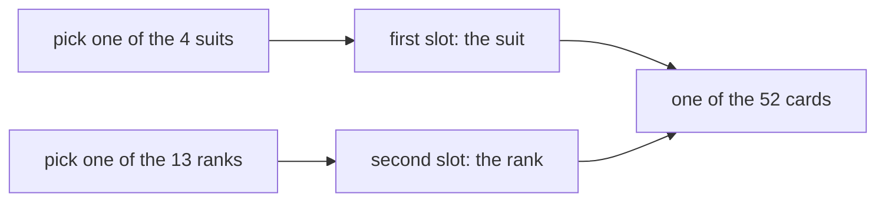

# Ordered pairs and the Cartesian product: the deck is suits times ranks

Foundations → Sets → Pairs → Ordered pairs and the Cartesian product

---

## General Overview

Fan out a new deck. Every card carries two facts and no more: a **suit** — clubs, diamonds, hearts, spades — and a **rank** — 2 through 10, then jack, queen, king, ace.

Four suits, thirteen ranks, every suit meeting every rank once. So the deck is 4 × 13, which is 52.

Name a card and you name both facts in a settled order: **(hearts, king)**, suit first, rank second. Two things in fixed slots is an **ordered pair**; the set of all of them is the **Cartesian product** of the suits and the ranks.

**Pair every member of one set with every member of another, slots in order, and the result has as many members as the two sizes multiplied.**

### The picture: two picks make a card



Two picks, one card.

---

## The formula

Call the four suits **A** and the thirteen ranks **B**, two sets in the sense of [sets-and-membership](01-sets-and-membership.md). The deck is **A × B**, said "A cross B" — the same cross as in 4 × 13, put on sets instead of numbers.

**A × B = every ordered pair (a, b) where a is a member of A and b is a member of B**

Read it aloud: **take each member of A in turn, run it past every member of B, and write the two down in that order.**

No listing needed:

**52 = 4 × 13**

| Piece | Plain meaning | In the deck |
| --- | --- | --- |
| an ordered pair, written (a, b) | two things in fixed slots, first then second | (hearts, king) |
| the first slot | what the pair says first, taken from A | hearts, a suit |
| the second slot | what it says second, taken from B | king, a rank |
| A × B, the Cartesian product | the set of all such pairs | all 52 cards |
| the size of A × B | the size of A times the size of B | 4 × 13 = 52 |

---

## Why it works

### The slots are jobs, not just positions

A set forgets order: {hearts, king} and {king, hearts} are one set, from [sets-and-membership](01-sets-and-membership.md). Braces cannot say which came first.

A pair has to. The convention is suit first, rank second, for the whole deck. So (king, hearts) claims a suit called king and a rank called hearts. No such card: same two words, other order, and only one order names a card.

The rule in full: **two ordered pairs are the same exactly when their first slots match and their seconds match.** So (a, b) and (b, a) differ whenever a and b differ.

Flip every card and you get a second set, B × A: 13 × 4 = 52 pairs of the form (rank, suit). Same size, no member shared with the deck — their intersection is empty, from [set-operations](03-set-operations.md). Nothing is shared here because no suit is a rank; sets that overlap do share pairs.

### Why the sizes multiply instead of adding

Walk the deck a suit at a time. Clubs: 13 cards. Diamonds: 13 more. Hearts: 13. Spades: 13. That is 13 + 13 + 13 + 13 = 52 — four helpings of thirteen, which is what 4 × 13 means.

Adding gives 4 + 13 = 17, which counts names on two lists: four suits, thirteen ranks. Every suit is walked through all thirteen ranks, so the ranks are used four times over.

A café with two drinks and three pastries works the same way: 2 × 3 = 6 combinations, six when written out.

Pair the suits with a set of ranks holding nothing — the empty set — and every pair is missing its second slot. So 4 × 0 = 0, and no suits with thirteen ranks is 0 as well.

---

## Worked numbers, by hand

The deck, then the café.

| Step | Arithmetic | Value |
| --- | --- | --- |
| suits | clubs, diamonds, hearts, spades | 4 |
| ranks | 2 to 10, jack, queen, king, ace | 13 |
| the deck, suits times ranks | 4 × 13 | **52** |
| the deck, a suit at a time | 13 + 13 + 13 + 13 | **52** |
| (hearts, king) is a card | hearts is a suit, king a rank | True |
| (king, hearts) is a card | king is not a suit | False |
| cards the two orders share | nothing sits in both | 0 |
| the café, drinks times pastries | 2 × 3 | 6 |
| the café, listed one by one | six written out | 6 |
| four suits, no ranks | 4 × 0 | 0 |

Fifty-two cards, six café combinations.

### What breaks if you drop a piece

| Mistake | Comes out at | What went wrong |
| --- | --- | --- |
| Adding the sizes instead of pairing | 17 | 4 + 13 counts names, not cards |
| A deck missing its aces | 48 | 4 × 12, one rank short |
| Reading the slots backwards | 0 | the row "(king, hearts) is a card" comes out False; the two orders share 0 |

All three appear below.

---

## Code, from first principles, and it actually runs

Nothing is imported. The deck is built by running every suit past every rank, then cross-checked by a road that never multiplies: one suit at a time, 13 + 13 + 13 + 13. Then the flipped deck, the café menu, and an empty side.

### Python

```python
# Ordered pairs and the Cartesian product -- the check behind the card.  Nothing
# is imported.  A deck is every (suit, rank) pair: 4 suits, 13 ranks, 52 cards.
# The cafe menu is every (drink, pastry) pair: 2 drinks, 3 pastries, 6 combos.
SUITS = ["clubs", "diamonds", "hearts", "spades"]
RANKS = ["2", "3", "4", "5", "6", "7", "8", "9", "10", "jack", "queen", "king", "ace"]
def product(first, second):        # every member of first with every member of second
    return {(a, b) for a in first for b in second}
def row(name, value):
    print(f"{name:<34}{value:>5}")
deck = product(SUITS, RANKS)
flipped = product(RANKS, SUITS)              # the same combinations, slots swapped
by_suit = sum(len(RANKS) for suit in SUITS)  # the second road: 13 + 13 + 13 + 13
menu = product(["coffee", "tea"], ["croissant", "scone", "muffin"])
LISTED = {("coffee", "croissant"), ("coffee", "scone"), ("coffee", "muffin"),
          ("tea", "croissant"), ("tea", "scone"), ("tea", "muffin")}
row("suits in a deck", len(SUITS))
row("ranks in a suit", len(RANKS))
row("cards, 4 suits times 13 ranks", len(deck))
row("cards, counted a suit at a time", by_suit)
row("(hearts, king) is a card", str(("hearts", "king") in deck))
row("(king, hearts) is a card", str(("king", "hearts") in deck))
row("cards the two orders share", len(deck & flipped))
row("combos, 2 drinks times 3 pastries", len(menu))
row("combos, listed one by one", len(LISTED))
row("4 suits times no ranks at all", len(product(SUITS, [])))
print(f"the two mistakes come out at {len(SUITS) + len(RANKS)} and {len(SUITS) * (len(RANKS) - 1)}")
assert len(deck) == 52 and by_suit == 52 and len(deck) == by_suit
assert ("hearts", "king") in deck and ("king", "hearts") not in deck and len(deck & flipped) == 0
assert menu == LISTED and len(product(SUITS, [])) == 0
print("ALL CHECKS PASS")
```

**Ran 2026-09-06 on macOS, Python 3.14.6, standard library only. All checks passed. Output, pasted from the run:**

```
suits in a deck                       4
ranks in a suit                      13
cards, 4 suits times 13 ranks        52
cards, counted a suit at a time      52
(hearts, king) is a card           True
(king, hearts) is a card          False
cards the two orders share            0
combos, 2 drinks times 3 pastries     6
combos, listed one by one             6
4 suits times no ranks at all         0
the two mistakes come out at 17 and 48
ALL CHECKS PASS
```

### Rust

Same numbers, same labels, built with `rustc --edition 2021 -O`. Rust sorts its pairs into a list instead of a set.

```rust
// Ordered pairs and the Cartesian product -- the same check as the Python one,
// in Rust.  No crates.  A deck is every (suit, rank) pair: 4 suits, 13 ranks,
// 52 cards.  The cafe menu is every (drink, pastry) pair: 2 times 3, 6 combos.
const SUITS: [&str; 4] = ["clubs", "diamonds", "hearts", "spades"];
const RANKS: [&str; 13] = ["2", "3", "4", "5", "6", "7", "8", "9", "10", "jack", "queen", "king", "ace"];
fn product<'a>(first: &[&'a str], second: &[&'a str]) -> Vec<(&'a str, &'a str)> {
    let mut out = Vec::new();      // every member of first with every member of second
    for a in first { for b in second { out.push((*a, *b)); } }
    out.sort(); out
}
fn has(pairs: &[(&str, &str)], a: &str, b: &str) -> bool { pairs.contains(&(a, b)) }
fn shared(x: &[(&str, &str)], y: &[(&str, &str)]) -> usize {
    x.iter().filter(|p| y.contains(p)).count()
}
fn row(name: &str, value: String) { println!("{:<34}{:>5}", name, value); }
fn yes_no(b: bool) -> String { String::from(if b { "True" } else { "False" }) }
fn main() {
    let none: [&str; 0] = [];
    let deck = product(&SUITS, &RANKS);
    let flipped = product(&RANKS, &SUITS);            // the same combinations, slots swapped
    let by_suit: usize = SUITS.iter().map(|_| RANKS.len()).sum();   // 13 + 13 + 13 + 13
    let menu = product(&["coffee", "tea"], &["croissant", "scone", "muffin"]);
    let mut listed = vec![("coffee", "croissant"), ("coffee", "scone"), ("coffee", "muffin"), ("tea", "croissant"), ("tea", "scone"), ("tea", "muffin")];
    listed.sort();
    row("suits in a deck", SUITS.len().to_string());
    row("ranks in a suit", RANKS.len().to_string());
    row("cards, 4 suits times 13 ranks", deck.len().to_string());
    row("cards, counted a suit at a time", by_suit.to_string());
    row("(hearts, king) is a card", yes_no(has(&deck, "hearts", "king")));
    row("(king, hearts) is a card", yes_no(has(&deck, "king", "hearts")));
    row("cards the two orders share", shared(&deck, &flipped).to_string());
    row("combos, 2 drinks times 3 pastries", menu.len().to_string());
    row("combos, listed one by one", listed.len().to_string());
    row("4 suits times no ranks at all", product(&SUITS, &none).len().to_string());
    println!("the two mistakes come out at {} and {}", SUITS.len() + RANKS.len(), SUITS.len() * (RANKS.len() - 1));
    assert!(deck.len() == 52 && by_suit == 52 && deck.len() == by_suit);
    assert!(has(&deck, "hearts", "king") && !has(&deck, "king", "hearts") && shared(&deck, &flipped) == 0);
    assert!(menu == listed && product(&SUITS, &none).len() == 0);
    println!("ALL CHECKS PASS");
}
```

**Ran 2026-09-06 on macOS, rustc 1.98.1, no crates. All checks passed. Output, pasted from the run:**

```
suits in a deck                       4
ranks in a suit                      13
cards, 4 suits times 13 ranks        52
cards, counted a suit at a time      52
(hearts, king) is a card           True
(king, hearts) is a card          False
cards the two orders share            0
combos, 2 drinks times 3 pastries     6
combos, listed one by one             6
4 suits times no ranks at all         0
the two mistakes come out at 17 and 48
ALL CHECKS PASS
```

The two outputs match line for line: whole counts, nothing to round.

> [!TIP]
> **Try changing**
> Guess first, then run it. The asserts are pinned to a full deck, so expect one to fire.
> - **Take the aces out.** Drop `"ace"` from `RANKS`. Twelve ranks, so both roads land on 48 — but the first assert holds 52, and fires.
> - **Give the café a third drink.** Add `"cocoa"`. The menu jumps to 9 while `LISTED`, typed by hand, holds 6, so the last assert fires.

---

## The usual mistake

> [!warning]
> **Adding the two sets instead of pairing them.** Four suits and thirteen ranks make 52 cards, not 17. Seventeen is the number of names on the two lists. Pairing is not pooling: each suit is run past every rank.
>
> - Writing a pair in braces. {hearts, king} is the same set as {king, hearts}, so braces cannot hold a deck. Parentheses can.
> - Assuming A × B and B × A are the same because both hold 52 members. Same size, different members.
> - Expecting an empty side to leave the other side standing. It comes out at 0, not 4.

---

## Where you meet it in real life

- **Spreadsheets.** A cell reference is an ordered pair: column first, row second. Swap the slots and you land elsewhere.
- **Stock lists.** Every size in every colour. The number of items to order is sizes times colours, not sizes plus colours.
- **Coordinates.** A point on a screen or a map is (across, up): the pair is the address, the order the convention.

> **Say it back**
> An ordered pair is two things in two fixed slots: first, then second. (hearts, king) is a card; (king, hearts) is not, because the slots mean different jobs. Braces cannot do that: {hearts, king} and {king, hearts} are one set. The Cartesian product A × B is every pair with first from A and second from B, so the deck is 4 × 13 = 52 cards. Sizes multiply, never add, and an empty side empties the product.

---

## What this builds on

- [set-operations](03-set-operations.md): union, intersection and difference. The deck and the flipped deck are two sets of pairs whose intersection is empty.

## Where this goes next

- [relations](../08-Relations%20and%20Functions/01-relations.md): keep only some of the pairs in A × B — a subset, in the sense of [subsets-and-power-set](02-subsets-and-power-set.md) — and you have a relation: a rule saying which things go with which.

---

## Sources

Verified 6 Sep 2026; every link resolves.

- Hammack, Richard. *Book of Proof*, 3rd ed. [Free PDF](https://richardhammack.github.io/BookOfProof/Main.pdf). Chapter 1.2: the product as a grid.
- Halmos, Paul R. *Naive Set Theory*. Springer, 1974. [doi:10.1007/978-1-4757-1645-0](https://doi.org/10.1007/978-1-4757-1645-0). Section 6: a pair built from plain sets.
- Enderton, Herbert B. *Elements of Set Theory*. Academic Press, 1977. [doi:10.1016/C2009-0-22079-4](https://doi.org/10.1016/C2009-0-22079-4). Chapter 3: the pair, its equality rule, the product.
