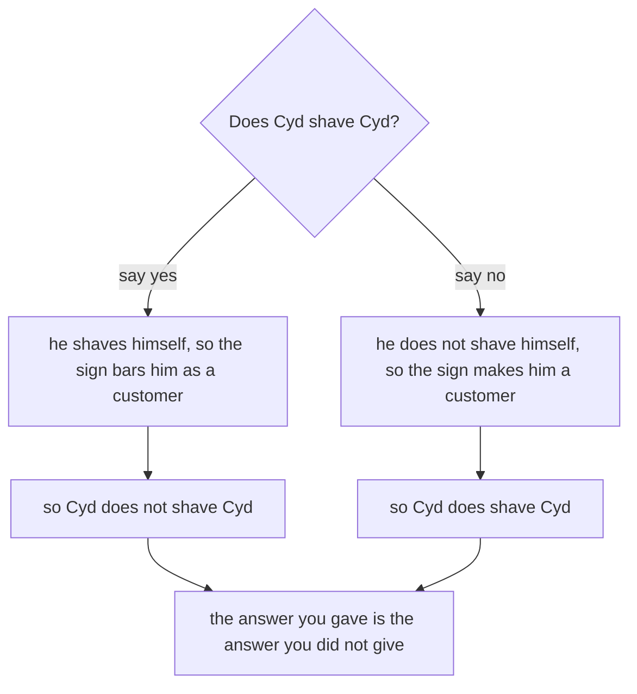

# Russell's paradox: why 'the set of all sets that do not contain themselves' cannot exist

[Syllabus](../../../SYLLABUS.md) → [Foundations](../../../SYLLABUS.md#w01) → [Sets](../../../SYLLABUS.md#w01-s07) → Russell's paradox

---

## General Overview

Three people live in the village: Ada, Ben and Cyd. Cyd is the barber, and the shop sign makes a promise.

**Cyd shaves every villager who does not shave themselves, and nobody else.**

Ada shaves herself, so Cyd leaves her alone. Ben does not, so Cyd shaves Ben. Now ask the sign about Cyd.

If Cyd shaves himself, the sign bars him as a customer — so he does not. If he does not, the sign makes him a customer — so he does. No barber can keep that sign.

Trade "shaves" for "is a member of" and the rule builds a collection: all the sets that are not members of themselves. Bertrand Russell sent that to Gottlob Frege in 1902 and it took the floor out from under how sets were then built.

**A rule that ranges over everything ranges over the thing it is building. So "everything, anywhere, that passes this test" is not a way to build a set.**

### The picture: the two answers swap places



---

## The formula

The sign, one villager at a time. The letter x stands for one villager, as in set-builder shorthand on [Sets](01-sets-and-membership.md):

**Cyd shaves x exactly when x does not shave x.**

Promised for every villager, so promised when x is Cyd:

**Cyd shaves Cyd exactly when Cyd does not shave Cyd.**

Membership runs the same sentence. The move that breaks names a collection $R$ with nothing to cut from:

**$R$ = {x : x is not a member of x}**

The safe move starts from a set $A$ already in hand:

**the Russell cut of $A$ = {x in $A$ : x is not a member of x}**

| Symbol | Plain meaning | In our village |
| --- | --- | --- |
| $R$ | the collection the rule tries to name | Cyd's customers |
| $\in$ | "is a member of" | Ben $\in$ Cyd's list |
| $\notin$ | "is not a member of" | Ada $\notin$ Cyd's list |
| $A$ | the set you start from, to cut down | — |
| { } | braces: the members sit inside | {Ben} |
| : | inside braces, "such that" | {x in $A$ : x is not in x} |

---

## Why it works

### Step 0: the rule asks about itself

The sign says "every villager". Cyd is a villager, so the sign has an opinion about him. That is the whole paradox; the rest is bookkeeping.

### Step 1: run the promise at the barber

Put Cyd in for x. Both answers are ruled out, so the sentence is false. But the sign promised it. That is [Proof by contradiction](../06-Proof/03-proof-by-contradiction.md): assume it, reach a wreck, conclude it was never there.

### Step 2: the same flip, with membership

Ask whether a set belongs to itself. Most do not: the set of villagers is not a villager. Gather every set that is not a member of itself and call it $R$. Is $R$ a member of $R$? If it is, it fails its own entry test, so it is not. If it is not, it passes, so it is. Same wreck, so no such set exists.

### Step 3: cut, do not sweep

The sweep has a name: unrestricted comprehension. The repair is separation, also called specification: start from a set $A$ already in hand and keep the members of $A$ that pass. It always exists, because you never reached past $A$ to get it.

One hole comes with it. The Russell cut of $A$ is never a member of $A$ — if it were, the flip would run again inside $A$. Every set is missing its own Russell cut, so no set holds everything.

---

## Worked numbers, by hand

Cyd holds a list of the people he shaves. A list is any set of villagers, so there are eight lists he could hold ([Subsets and the power set](02-subsets-and-power-set.md)).

| Step | Arithmetic | Value |
| --- | --- | --- |
| villagers | Ada, Ben, Cyd | 3 |
| lists he could hold | 2 × 2 × 2 | 8 |
| lists with Ada off and Ben on | Cyd free either way | 2 |
| lists that break at Cyd | every one | 8 |
| lists that keep the promise | none | **0** |
| the Russell collection over the eight | no list holds a list | 8 |
| the fullest of the eight | Ada, Ben, Cyd | 3 |
| how many of the eight hold eight | eight is not three | **0** |

Two zeros, one point: no list keeps the sign, and the Russell collection sits outside the eight. The eight lists hold villagers, not lists, so none could hold itself: that last count pictures the flip rather than proving it.

### What breaks if you drop a piece

| Mistake | Comes out at | What went wrong |
| --- | --- | --- |
| Getting Ada and Ben right, then stopping | 2 lists look fine | Both break at Cyd, as all 8 do |
| Hunting the collection among the eight | 0 of the eight | It holds 8; the fullest holds 3 |
| Reading the flip as a puzzle | 0 answers, not 1 | The rule is at fault, not the barber |

---

## Code, from first principles, and it actually runs

Nothing is imported. The barber road tries all eight lists Cyd could hold and counts how many keep the sign. The second road drops barbers: it makes those eight lists into sets that may hold sets, gathers the ones not members of themselves, and asks whether that gathering is one of the eight.

### Python

```python
# Russell's paradox -- the check behind the card.  Nothing is imported.  Three
# villagers: Ada shaves herself, Ben does not, Cyd is the barber who shaves the
# villagers who do not shave themselves.  Then the same trap again, for sets.
VILLAGERS = ["Ada", "Ben", "Cyd"]
LISTS = [[v for i, v in enumerate(VILLAGERS) if n >> i & 1] for n in range(8)]
SETS = [frozenset(l) for l in LISTS]           # the second road: sets, not barbers

def shaves_self(v, lst): return v == "Ada" or (v == "Cyd" and "Cyd" in lst)
def promise_ok(v, lst): return (v in lst) == (not shaves_self(v, lst))
def row(name, value): print(f"{name:<46}{value:>2}")

kept = sum(1 for l in LISTS if all(promise_ok(v, l) for v in VILLAGERS))
others = sum(1 for l in LISTS if promise_ok("Ada", l) and promise_ok("Ben", l))
broken = sum(1 for l in LISTS if not promise_ok("Cyd", l))
holders = sum(1 for s in SETS if s in s)       # a real self-membership test
russell = frozenset(s for s in SETS if s not in s)
biggest = max(len(s) for s in SETS)
row("villagers in the village", len(VILLAGERS))
row("lists of villagers there are, in all", len(LISTS))
row("lists that get Ada and Ben right", others)
row("lists that keep the barber's whole promise", kept)
row("lists that break it at the barber himself", broken)
row("of the eight sets, ones that hold themselves", holders)
row("the Russell set, how many it holds", len(russell))
row("the most members any one of the eight holds", biggest)
row("how many of the eight hold eight", sum(1 for s in SETS if len(s) == 8))
row("the Russell set found among the eight", int(russell in SETS))
assert len(LISTS) == 8 and others == 2 and kept == 0 and broken == 8
assert holders == 0 and len(russell) == 8 and biggest == 3 and russell not in SETS
print("ALL CHECKS PASS")
```

**Ran 2026-09-06 on macOS, Python 3.14.6, standard library only. All checks passed. Output, pasted from the run:**

```
villagers in the village                       3
lists of villagers there are, in all           8
lists that get Ada and Ben right               2
lists that keep the barber's whole promise     0
lists that break it at the barber himself      8
of the eight sets, ones that hold themselves   0
the Russell set, how many it holds             8
the most members any one of the eight holds    3
how many of the eight hold eight               0
the Russell set found among the eight          0
ALL CHECKS PASS
```

### Rust

Same numbers, same labels; built with `rustc --edition 2021 -O`.

```rust
// Russell's paradox -- the same check as the Python one, in Rust.  No crates.
// Three villagers: Ada shaves herself, Ben does not, Cyd is the barber who
// shaves the villagers who do not shave themselves.  Then the trap for sets.
const VILLAGERS: [&str; 3] = ["Ada", "Ben", "Cyd"];

#[derive(Clone, PartialEq)]
enum Item { Villager(&'static str), Set(Vec<Item>) }   // a member may be a set

fn list_of(n: usize) -> Vec<&'static str> { (0..3).filter(|i| n >> i & 1 == 1).map(|i| VILLAGERS[i]).collect() }
fn as_set(l: &[&'static str]) -> Item { Item::Set(l.iter().map(|v| Item::Villager(v)).collect()) }
fn holds(s: &Item, m: &Item) -> bool { matches!(s, Item::Set(ms) if ms.contains(m)) }
fn size(s: &Item) -> usize { match s { Item::Set(ms) => ms.len(), _ => 0 } }
fn shaves_self(v: &str, l: &[&str]) -> bool { v == "Ada" || (v == "Cyd" && l.contains(&"Cyd")) }
fn promise_ok(v: &str, l: &[&str]) -> bool { l.contains(&v) == !shaves_self(v, l) }
fn row(name: &str, value: usize) { println!("{:<46}{:>2}", name, value); }

fn main() {
    let lists: Vec<Vec<&str>> = (0..8).map(list_of).collect();
    let sets: Vec<Item> = lists.iter().map(|l| as_set(l)).collect();
    let kept = lists.iter().filter(|l| VILLAGERS.iter().all(|v| promise_ok(v, l))).count();
    let others = lists.iter().filter(|l| promise_ok("Ada", l) && promise_ok("Ben", l)).count();
    let broken = lists.iter().filter(|l| !promise_ok("Cyd", l)).count();
    let holders = sets.iter().filter(|&s| holds(s, s)).count();
    let russell = Item::Set(sets.iter().filter(|&s| !holds(s, s)).cloned().collect());
    let biggest = sets.iter().map(size).max().unwrap();
    row("villagers in the village", VILLAGERS.len());
    row("lists of villagers there are, in all", lists.len());
    row("lists that get Ada and Ben right", others);
    row("lists that keep the barber's whole promise", kept);
    row("lists that break it at the barber himself", broken);
    row("of the eight sets, ones that hold themselves", holders);
    row("the Russell set, how many it holds", size(&russell));
    row("the most members any one of the eight holds", biggest);
    row("how many of the eight hold eight", sets.iter().filter(|&s| size(s) == 8).count());
    row("the Russell set found among the eight", sets.contains(&russell) as usize);
    assert!(lists.len() == 8 && others == 2 && kept == 0 && broken == 8);
    assert!(holders == 0 && size(&russell) == 8 && biggest == 3 && !sets.contains(&russell));
    println!("ALL CHECKS PASS");
}
```

**Ran 2026-09-06 on macOS, rustc 1.98.1, no crates. All checks passed. Output, pasted from the run:**

```
villagers in the village                       3
lists of villagers there are, in all           8
lists that get Ada and Ben right               2
lists that keep the barber's whole promise     0
lists that break it at the barber himself      8
of the eight sets, ones that hold themselves   0
the Russell set, how many it holds             8
the most members any one of the eight holds    3
how many of the eight hold eight               0
the Russell set found among the eight          0
ALL CHECKS PASS
```

> [!TIP]
> **Try changing**
> Guess first, then run it. The asserts are pinned to the village numbers, so expect one to fire.
> - **Let Cyd off the hook.** Make the self-shaving test say Cyd never shaves himself. One list then keeps the promise, so that count stops being 0.
> - **Add a fourth villager.** Put a fourth name in the roster, change every 8 to 16 and the roster count 3 to 4. All sixteen still break at the barber; the Ada-and-Ben count doubles, so that assert fires.

---

## The usual mistake

> [!warning]
> **Treating it as a question with a hidden answer.** People hunt for the trick: a beard, a cousin who shaves him. The sentence rules out both answers, so the fault is in the sign. The finding is not "here is a strange set" but "there is no such set, and the rule that promised one is wrong".
>
> - Thinking one particular set is broken. What is broken is the way of building sets.
> - Thinking the safe version costs nothing. Every set is missing its own Russell cut, so no set holds everything.
> - Thinking bigger sets escape it. A fourth villager gives more lists, and every one still breaks.

---

## Where you meet it in real life

- **The rules of set theory.** Foundations dodge this flip by making set-builder shorthand always name a set to cut from — the habit set on [Sets](01-sets-and-membership.md), used on [Set operations](03-set-operations.md).
- **Programs that read programs.** "Does this program stop?" cannot be answered by a program. Feed the answering program its own description and the answer flips.
- **Anything that catalogues itself.** A directory of every directory that does not list itself.

> **Say it back**
> A barber promises to shave exactly the villagers who do not shave themselves. Ask about the barber and each answer turns into its opposite, so no such sign can be kept. Membership does the same: the collection of all sets that are not members of themselves would belong to itself exactly when it does not. So it does not exist. Build sets by cutting down a set already in hand, never by sweeping up everything.

---

## What this builds on

- [Sets](01-sets-and-membership.md): membership, and the set-builder shorthand this card fences in.
- [Proof by contradiction](../06-Proof/03-proof-by-contradiction.md): assume it, reach a wreck, conclude it never existed.

## Where this goes next

Last card on the Sets shelf. Its neighbours [Inclusion-exclusion](04-inclusion-exclusion.md) and [Ordered pairs and the Cartesian product](05-ordered-pairs-and-cartesian-product.md) build sets the safe way, from sets already in hand.

---

## Sources

Verified 6 Sep 2026; every link resolves.

- Deutsch, Harry, Oliver Marshall and Andrew David Irvine. "Russell's Paradox." *Stanford Encyclopedia of Philosophy*. [plato.stanford.edu](https://plato.stanford.edu/entries/russell-paradox/). The history, the barber, and both repairs.
- Halmos, Paul R. *Naive Set Theory*. Springer, 1974. [doi:10.1007/978-1-4757-1645-0](https://doi.org/10.1007/978-1-4757-1645-0). Teaches cutting from a set already in hand.
- Hammack, Richard. *Book of Proof*, 3rd ed. [richardhammack.github.io](https://richardhammack.github.io/BookOfProof/). Free textbook; chapter 1 on why set-builder needs a bound.
