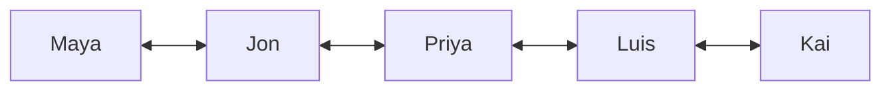

# Relations: a list of which pairs are linked, and four tests on it

[Syllabus](../../../SYLLABUS.md) → [Foundations](../../../SYLLABUS.md#w01) → [Relations and Functions](../../../SYLLABUS.md#w01-s08) → Relations and their four tests

---

## General Overview

Five people share an office: Maya, Jon, Priya, Luis, Kai. Pull this week's email log. Maya and Jon wrote to each other. So did Jon and Priya, Priya and Luis, Luis and Kai. Nobody else, and nobody emailed themselves.

The log answers one question at a time: take two names in order, has the first emailed the second? There are 25 ordered pairs to ask about, and 8 come back yes. Keep those 8. A set of ordered pairs like that is a **relation**.

Now their heights: Maya 168 cm, Jon 175, Priya 162, Luis 181, Kai 170. "Is at least as tall as" is a second relation on the same five, and a longer list — counted below.

**A relation is the set of ordered pairs where the link holds, and every question you ask about it is a question about that set.**

### The picture: this week's email, as arrows



Each double arrow is two ordered pairs, one each way. No arrow between Maya and Kai, so neither pair is in.

---

## The formula

The list is the object. Write "a emailed b" as the ordered pair (a, b), sender first:

**has emailed = {(Maya, Jon), (Jon, Maya), (Jon, Priya), (Priya, Jon), (Priya, Luis), (Luis, Priya), (Luis, Kai), (Kai, Luis)}**

Call the list R; a R b means (a, b) is in R. With A the five people, R is a subset of the grid A × A from [Ordered pairs and the Cartesian product](../07-Sets/05-ordered-pairs-and-cartesian-product.md).

Four tests get asked of a list like that. Let a, b, c be people from the five; any two of them may be the same person.

- **Reflexive:** every person is linked to themselves — all five pairs (Maya, Maya) through (Kai, Kai) are in.
- **Symmetric:** whenever (a, b) is in, (b, a) is in.
- **Antisymmetric:** whenever (a, b) and (b, a) are both in, a and b are the same person.
- **Transitive:** whenever (a, b) and (b, c) are in, (a, c) is in — every chain has a shortcut.

| Piece | Plain meaning | In our example |
| --- | --- | --- |
| an ordered pair | two names in a fixed order, (first, second) | (Maya, Jon): Maya emailed Jon |
| a relation, R | the set of pairs where the link holds | the 8 pairs above |
| a loop | a pair with one name written twice | (Maya, Maya) |
| the grid behind it, A × A | every pair you could ask about | 25 of them |

---

## Why it works

### Order inside the pair is the point

(Luis, Kai) and (Kai, Luis) are different pairs. Email has both — those two wrote back. Height keeps only (Luis, Kai), since 181 is at least 170 and 170 is not at least 181. Dropping one direction is how a ranking gets written down.

### Each test is a scan of the list

Each test is a claim about the whole list — the shape [Quantifiers](../05-Logic/04-quantifiers.md) sets out — so one missing or one unwanted pair settles it.

| Test | has emailed | is at least as tall as |
| --- | --- | --- |
| reflexive | fails: no (Maya, Maya), nobody mails themselves | passes: all five loops, 168 is at least 168 |
| symmetric | passes: all 4 conversations went both ways | fails: (Luis, Jon) is in, (Jon, Luis) is not |
| antisymmetric | fails: (Maya, Jon) and (Jon, Maya), Maya is not Jon | passes: two-way needs equal heights, and no two are equal |
| transitive | fails: Maya to Jon, Jon to Priya, no Maya to Priya | passes: 181 at least 175 and 175 at least 170 forces 181 at least 170 |

Height passes three: arithmetic does the work every time. Symmetric and antisymmetric are not opposites: one wants every link two-way, the other wants none except loops, and a relation can pass both or fail both.

---

## Worked numbers, by hand

| Step | Arithmetic | Value |
| --- | --- | --- |
| pairs you could ask about | 5 × 5 | 25 |
| pairs in has emailed | 4 conversations, 2 directions each | **8** |
| pairs in is at least as tall as | 5 + 4 + 3 + 2 + 1 | **15** |

That sum runs tallest first: Luis is at least as tall as all 5, Jon as 4, Kai 3, Maya 2, Priya only herself.

### What breaks if you drop a piece

| Mistake | Comes out at | What went wrong |
| --- | --- | --- |
| Logging each conversation once, not both ways | 4 pairs | Half the arrows gone, and symmetric fails |
| Leaving one loop out of is at least as tall as | 14 pairs | Reflexive turns to no — one missing pair does it |
| Adding every link the chains imply | 25 pairs | The transitive closure: the same list with every shortcut added. Here that links everyone to everyone and the log says nothing |

---

## Code, from first principles, and it actually runs

The email list is built from the 4 conversations, the height list from the five numbers. Each test is answered twice: once by walking the pairs one at a time, straight off the definition, and once by set arithmetic — reverse the list, overlap it with the original, and follow it twice in a row. That two-step list is the **composition** of the relation with itself. Eight answers, two routes, and the run stops if any disagree. The last line re-counts the two broken lists.

### Python

```python
# Relations -- the check behind the card.  Nothing is imported.  Five teammates, the pairs of "has emailed" and of "is at least as tall as", each put through four tests, twice.
PEOPLE = ["Maya", "Jon", "Priya", "Luis", "Kai"]
CM = {"Maya": 168, "Jon": 175, "Priya": 162, "Luis": 181, "Kai": 170}
TALKED = [("Maya", "Jon"), ("Jon", "Priya"), ("Priya", "Luis"), ("Luis", "Kai")]
NAMES = ["reflexive", "symmetric", "antisymmetric", "transitive"]
EMAIL = {q for a, b in TALKED for q in ((a, b), (b, a))}
TALL = {(a, b) for a in PEOPLE for b in PEOPLE if CM[a] >= CM[b]}
def two_step(R):                 # a to b in R, then b to c in R, so a to c: the composition
    return {(a, c) for a, b in R for c in PEOPLE if (b, c) in R}
def tests(R):                    # straight off the four definitions, one pair at a time
    return (all((a, a) in R for a in PEOPLE), all((b, a) in R for a, b in R),
            all(a == b for a, b in R if (b, a) in R),
            all((a, c) in R for a, b in R for c in PEOPLE if (b, c) in R))
def again(R):                    # second route: whole sets, reversed and stepped twice
    rev, loops = {(b, a) for a, b in R}, {(a, a) for a in PEOPLE}
    return (loops <= R, rev == R, (R & rev) <= loops, two_step(R) <= R)
shut = set(EMAIL)                # add the two-step pairs over and over until none is new
while not two_step(shut) <= shut: shut |= two_step(shut)
ONEWAY, NOLOOP = set(TALKED), TALL - {("Maya", "Maya")}   # the two broken lists from the card
print(f"five teammates, {len(PEOPLE) * len(PEOPLE)} possible ordered pairs")
print("heights in cm: " + ", ".join(f"{p} {CM[p]}" for p in PEOPLE))
print(f"has emailed: {len(TALKED)} conversations, 2 directions each, {len(EMAIL)} ordered pairs")
print("is at least as tall as: " + " + ".join(str(sum(1 for y in CM.values() if x >= y)) for x in sorted(CM.values(), reverse=True)) + f" = {len(TALL)} ordered pairs")
print(f"{'test':<15}{'has emailed':<13}is at least as tall as")
for n, x, y in zip(NAMES, tests(EMAIL), tests(TALL)): print(f"{n:<15}{('yes' if x else 'no'):<13}{'yes' if y else 'no'}")
print(f"both routes agree on all {2 * len(NAMES)} answers; every link the chains imply: {len(shut)} pairs")
print(f"log one direction only: {len(ONEWAY)} pairs, symmetric {'yes' if tests(ONEWAY)[1] else 'no'}; drop one loop: {len(NOLOOP)} pairs, reflexive {'yes' if tests(NOLOOP)[0] else 'no'}")
assert len(EMAIL) == 8 and len(TALL) == 5 + 4 + 3 + 2 + 1 and len(shut) == 25 and len(ONEWAY) == 4 and len(NOLOOP) == 14 and not tests(ONEWAY)[1] and not tests(NOLOOP)[0]
assert tests(EMAIL) == (False, True, False, False) and tests(TALL) == (True, False, True, True) and again(EMAIL) == tests(EMAIL) and again(TALL) == tests(TALL)
print("ALL CHECKS PASS")
```

**Ran 2026-09-06 on macOS, Python 3.14.6, standard library only. All checks passed. Output, pasted from the run:**

```
five teammates, 25 possible ordered pairs
heights in cm: Maya 168, Jon 175, Priya 162, Luis 181, Kai 170
has emailed: 4 conversations, 2 directions each, 8 ordered pairs
is at least as tall as: 5 + 4 + 3 + 2 + 1 = 15 ordered pairs
test           has emailed  is at least as tall as
reflexive      no           yes
symmetric      yes          no
antisymmetric  no           yes
transitive     no           yes
both routes agree on all 8 answers; every link the chains imply: 25 pairs
log one direction only: 4 pairs, symmetric no; drop one loop: 14 pairs, reflexive no
ALL CHECKS PASS
```

### Rust

Same numbers, built with `rustc --edition 2021 -O`.

```rust
// Relations -- the same check as relations_check.py, in Rust.  No crates.  Five teammates,
// the pairs of "has emailed" and of "is at least as tall as", each put through four tests, twice.
use std::collections::BTreeSet;
const PEOPLE: [&str; 5] = ["Maya", "Jon", "Priya", "Luis", "Kai"];
const CM: [i64; 5] = [168, 175, 162, 181, 170];
const TALKED: [(usize, usize); 4] = [(0, 1), (1, 2), (2, 3), (3, 4)];
const NAMES: [&str; 4] = ["reflexive", "symmetric", "antisymmetric", "transitive"];
type Rel = BTreeSet<(usize, usize)>;
fn two_step(r: &Rel) -> Rel {          // a to b in r, then b to c in r, so a to c: the composition
    r.iter().flat_map(|&(a, b)| (0..5).filter(move |&c| r.contains(&(b, c))).map(move |c| (a, c))).collect()
}
fn tests(r: &Rel) -> [bool; 4] {       // straight off the four definitions, one pair at a time
    [(0..5).all(|a| r.contains(&(a, a))), r.iter().all(|&(a, b)| r.contains(&(b, a))),
     r.iter().all(|&(a, b)| a == b || !r.contains(&(b, a))),
     r.iter().all(|&(a, b)| (0..5).all(|c| !r.contains(&(b, c)) || r.contains(&(a, c))))]
}
fn again(r: &Rel) -> [bool; 4] {       // second route: whole sets, reversed and stepped twice
    let (rev, loops): (Rel, Rel) = (r.iter().map(|&(a, b)| (b, a)).collect(), (0..5).map(|a| (a, a)).collect());
    [loops.is_subset(r), rev == *r, r.intersection(&rev).all(|p| loops.contains(p)), two_step(r).is_subset(r)]
}
fn main() {
    let email: Rel = TALKED.iter().flat_map(|&(a, b)| [(a, b), (b, a)]).collect();
    let tall: Rel = (0..5).flat_map(|a| (0..5).map(move |b| (a, b))).filter(|&(a, b)| CM[a] >= CM[b]).collect();
    let mut shut = email.clone();      // add the two-step pairs over and over until none is new
    while !two_step(&shut).is_subset(&shut) { shut = shut.union(&two_step(&shut)).cloned().collect(); }
    let oneway: Rel = TALKED.iter().cloned().collect(); let mut noloop = tall.clone(); noloop.remove(&(0, 0));   // the two broken lists from the card
    let mut c: Vec<usize> = CM.iter().map(|x| CM.iter().filter(|y| x >= y).count()).collect(); c.sort_unstable(); c.reverse();
    println!("five teammates, {} possible ordered pairs", PEOPLE.len() * PEOPLE.len());
    println!("heights in cm: {}", (0..5).map(|i| format!("{} {}", PEOPLE[i], CM[i])).collect::<Vec<String>>().join(", "));
    println!("has emailed: {} conversations, 2 directions each, {} ordered pairs", TALKED.len(), email.len());
    println!("is at least as tall as: {} = {} ordered pairs", c.iter().map(|n| n.to_string()).collect::<Vec<String>>().join(" + "), tall.len());
    println!("{:<15}{:<13}{}", "test", "has emailed", "is at least as tall as");
    let (te, tt) = (tests(&email), tests(&tall));
    for i in 0..4 { println!("{:<15}{:<13}{}", NAMES[i], if te[i] { "yes" } else { "no" }, if tt[i] { "yes" } else { "no" }); }
    println!("both routes agree on all {} answers; every link the chains imply: {} pairs", 2 * NAMES.len(), shut.len());
    println!("log one direction only: {} pairs, symmetric {}; drop one loop: {} pairs, reflexive {}", oneway.len(), if tests(&oneway)[1] { "yes" } else { "no" }, noloop.len(), if tests(&noloop)[0] { "yes" } else { "no" });
    assert!(email.len() == 8 && tall.len() == 5 + 4 + 3 + 2 + 1 && shut.len() == 25 && oneway.len() == 4 && noloop.len() == 14 && !tests(&oneway)[1] && !tests(&noloop)[0]);
    assert!(te == [false, true, false, false] && tt == [true, false, true, true] && again(&email) == te && again(&tall) == tt);
    println!("ALL CHECKS PASS");
}
```

**Ran 2026-09-06 on macOS, rustc 1.98.1, no crates. All checks passed. Output, pasted from the run:**

```
five teammates, 25 possible ordered pairs
heights in cm: Maya 168, Jon 175, Priya 162, Luis 181, Kai 170
has emailed: 4 conversations, 2 directions each, 8 ordered pairs
is at least as tall as: 5 + 4 + 3 + 2 + 1 = 15 ordered pairs
test           has emailed  is at least as tall as
reflexive      no           yes
symmetric      yes          no
antisymmetric  no           yes
transitive     no           yes
both routes agree on all 8 answers; every link the chains imply: 25 pairs
log one direction only: 4 pairs, symmetric no; drop one loop: 14 pairs, reflexive no
ALL CHECKS PASS
```

The two outputs match line for line: this is all counting.

> [!TIP]
> **Try changing**
> Guess first, then run it. The asserts are pinned to the house numbers, so expect one to fire.
> - **Give everyone a self-loop.** Add the five loops to the email list: reflexive turns to yes, antisymmetric still no — Maya and Jon write both ways.
> - **Make two heights tie.** Set Priya to 168 cm, Maya's height: antisymmetric turns to no, each now at least as tall as the other.

---

## The usual mistake

> [!warning]
> **Reading a relation as a rule instead of as a list of pairs.** "Has emailed" sounds like something to work out. It is not: the relation *is* those 8 pairs, and every test is a question about them. Change one pair and the relation has changed.
>
> - Testing transitive on the chains you happen to notice. It dies at the first chain with no shortcut: Maya to Jon to Priya.
> - Leaving the loops out. Height passes reflexive only on those five easy-to-forget pairs.

---

## Where you meet it in real life

- **Relational databases.** A two-column table is a list of ordered pairs — that is where "relational" comes from, more columns allowed too. A join is the two-step composition.
- **Rankings.** Is at least as tall as is reflexive, antisymmetric and transitive — the three tests that make an order: [Orders](07-partial-and-total-orders.md).
- **Sameness rules.** "Born in the same year as" is reflexive, symmetric and transitive, and rules like that cut a group into blocks: [Equivalence relations and partitions](06-equivalence-relations-and-partitions.md).

> **Say it back**
> A relation R is a set of ordered pairs: the ones where a link holds, order kept. The email log is 8 pairs out of 25; is at least as tall as, on the same five, is 15. Reflexive wants every loop. Symmetric wants every link both ways. Antisymmetric wants no two-way link except loops. Transitive wants every chain to have a shortcut. Email passes one of the four; height passes the other three.

---

## What this builds on

- [Ordered pairs and the Cartesian product](../07-Sets/05-ordered-pairs-and-cartesian-product.md): the ordered pair (a, b), which remembers which name came first, and the grid of 25 a relation is picked out of.

A relation is a set — [Sets](../07-Sets/01-sets-and-membership.md), [Subsets and the power set](../07-Sets/02-subsets-and-power-set.md) — and a subset of that grid.

## Where this goes next

- [Functions](02-functions.md): the relations answering every input with exactly one output.
- [Equivalence relations and partitions](06-equivalence-relations-and-partitions.md): what happens when a relation passes reflexive, symmetric and transitive at once.

---

## Sources

Verified 6 Sep 2026; every link resolves.

- Hammack, Richard. *Book of Proof*, 3rd ed., 2018. [Book page](https://richardhammack.github.io/BookOfProof/). Chapter 11 defines a relation as a set of ordered pairs and runs these tests.
- Halmos, Paul R. *Naive Set Theory*. Springer, 1974. [doi:10.1007/978-1-4757-1645-0](https://doi.org/10.1007/978-1-4757-1645-0). Sections 7 and 8 build relations from ordered pairs, nothing else.
- Enderton, Herbert B. *Elements of Set Theory*. Academic Press, 1977. [Publisher page](https://shop.elsevier.com/books/elements-of-set-theory/enderton/978-0-12-238440-0). Chapter 3 builds relations, inverse and composition from ordered pairs.
