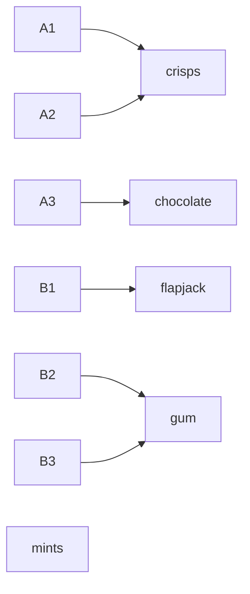

# Functions: one output for every input, with domain, codomain and range

[Syllabus](../../../SYLLABUS.md) → [Foundations](../../../SYLLABUS.md#w01) → [Relations and Functions](../../../SYLLABUS.md#w01-s08) → What a function is

---

## General Overview

The machine in the corridor has six buttons: A1, A2, A3, B1, B2, B3. Behind the glass, five snacks are stocked: crisps, chocolate, flapjack, gum, mints.

Press a button and exactly one snack drops. Never nothing. Never two. That promise is what makes the machine usable: point at a button and you can say what you will be holding.

Two buttons are wired to the same crisps, A1 and A2, because crisps sell. Nothing is wired to the mints; they sit there, stocked and unreachable. Neither breaks the promise, which is only about pressing.

**A function is a rule that hands every input exactly one output: no input left unanswered, no input answered twice.**

### The picture: what each button is wired to



Six arrows out, one per button. Two land on crisps, two on gum. Nothing arrives at the mints — the reason there is a third word, range, below.

---

## The formula

The wiring is the function. Write each press as an ordered pair (button, snack), as in [Relations](01-relations.md):

**f = {(A1, crisps), (A2, crisps), (A3, chocolate), (B1, flapjack), (B2, gum), (B3, gum)}**

Written short: **f: buttons → snacks**. Left of the arrow is the domain, right the codomain.

Call the rule f, so f(A1) = crisps reads "press A1, get crisps". A relation is a function exactly when every button appears as a first name **exactly once**: at least once, so nothing goes unanswered; at most once, so nothing is ambiguous.

**domain = the 6 buttons, codomain = the 5 snacks stocked, range = the 4 reached**

| Piece | Plain meaning | In our example |
| --- | --- | --- |
| f, and f(A1) | the wiring, and A1's output | the 6 pairs; crisps |
| domain | the inputs the rule accepts | the 6 buttons |
| codomain | where outputs are declared to live | the 5 snacks stocked |
| range | the outputs actually produced | crisps, chocolate, flapjack, gum |
| preimage of a snack | every input that lands on it | crisps: A1 and A2 |

---

## Why it works

### Two demands, and either can fail alone

Count the pairs starting with each button; every count must be 1. B3 jamming pushes a count to 0 and leaves 5 of the 6 answered. A1 dropping crisps *and* chocolate pushes one to 2, making 7 pairs for 6 buttons. Either failure shows in the list, before you press anything.

### The codomain is a promise, the range is the receipt

The codomain is declared before anyone checks: snacks stocked here, all 5. The range is what turns up, 4, since the mints are never reached, and it always sits inside the codomain. Whether it fills the codomain is the question [One-to-one and onto](04-injective-surjective-bijective.md) asks.

### Forwards: the image of a set

Take a handful of buttons and collect what they give. A1 and A3 give crisps and chocolate: 2 snacks. That is the **image** of {A1, A3}, and the range is the image of the whole domain.

### Backwards: the preimage of a set

Go the other way: name a snack, ask which buttons deliver it. Crisps come from A1 and A2: 2 buttons — the **preimage** of crisps. The preimage of mints holds 0 buttons — the empty set from [Sets](../07-Sets/01-sets-and-membership.md). It hands back a set, not a single input: running the machine backwards needs [Inverse functions](05-inverse-functions.md).

Counting backwards tests forwards. Buttons behind each snack: crisps 2, chocolate 1, flapjack 1, gum 2, mints 0. Add them: 6, the number of buttons. Miss 6 and something is wrong forwards; hitting 6 is not proof, so the per-button count stays the real test. The code runs both.

### The indicator function

Chocolate and mints have sold out. Write that as a function from the 5 snacks stocked to two values: 1 if sold out, 0 if not. In order it reads 0 1 0 0 1 — the **indicator function** of the sold-out set, also called the characteristic function, written 1_A. Add the five values: 2, the number sold out. Turning a yes or no into a 1 or a 0 makes counting into adding — why probability leans on it. It sends two snacks to 1: chocolate and mints. Push that pair back through f and you get the buttons that will disappoint: A3 alone, 1 button. Not 2: the sold-out mints had no button.

---

## Worked numbers, by hand

| Step | Arithmetic | Value |
| --- | --- | --- |
| the domain and codomain | buttons, then snacks | 6 and 5 |
| the range, snacks reached | 5 stocked, 1 never given | **4** |
| the preimage of crisps | A1 and A2 | **2** |
| buttons behind each snack | 2 + 1 + 1 + 2 + 0 | **6** |
| the indicator of sold out | 0 + 1 + 0 + 0 + 1 | 2 |
| buttons giving a sold-out snack | A3 only | 1 |

Six buttons, four outcomes, one snack you can see and cannot have.

### What breaks if you drop a piece

| Mistake | Comes out at | What went wrong |
| --- | --- | --- |
| B3 jams and gives nothing | 5 of 6 answered | An input with no output |
| A1 drops crisps and chocolate | 7 pairs for 6 buttons | An input with two outputs |
| Calling the codomain the range | 5, not 4 | The mints are stocked, unreached |

---

## Code, from first principles, and it actually runs

Nothing is imported. The wiring is read forwards, button by button, then backwards, snack by snack, and the two readings must agree.

### Python

```python
# Functions -- the check behind the card.  Nothing is imported.  A vending machine: 6 buttons, 5 snacks stocked.  The wiring is read forwards, button by button, then backwards, snack by snack, and the two readings must agree.
BUTTONS = ["A1", "A2", "A3", "B1", "B2", "B3"]
SNACKS = ["crisps", "chocolate", "flapjack", "gum", "mints"]
WIRING = [("A1", "crisps"), ("A2", "crisps"), ("A3", "chocolate"), ("B1", "flapjack"), ("B2", "gum"), ("B3", "gum")]
SOLD_OUT = ["chocolate", "mints"]
def out(pairs, b):                       # forwards: the snacks this button hands out
    return [s for x, s in pairs if x == b]
def preimage(pairs, target):             # backwards: every button whose snack is in target
    return [b for b in BUTTONS if any(s in target for s in out(pairs, b))]
def image(pairs, buttons):               # forwards: every snack those buttons hand out
    return [s for s in SNACKS if any(s in out(pairs, b) for b in buttons)]
counts, answered = [len(preimage(WIRING, [s])) for s in SNACKS], [len(out(WIRING, b)) for b in BUTTONS]
rng, rng2 = image(WIRING, BUTTONS), [s for s in SNACKS if counts[SNACKS.index(s)] > 0]   # two routes to the range
indicator = [1 if s in SOLD_OUT else 0 for s in SNACKS]
jam, double = [p for p in WIRING if p[0] != "B3"], WIRING + [("A1", "chocolate")]         # B3 gives nothing; A1 drops two
print(f"buttons (domain): {', '.join(BUTTONS)} -- {len(BUTTONS)}")
print(f"snacks stocked (codomain): {', '.join(SNACKS)} -- {len(SNACKS)}")
print("wiring: " + ", ".join(f"{b} {s}" for b, s in WIRING))
print(f"every button answered exactly once: {'yes' if answered == [1] * len(BUTTONS) else 'no'}, {len(WIRING)} pairs for {len(BUTTONS)} buttons")
print(f"range (snacks actually given): {', '.join(rng)} -- {len(rng)}")
print("buttons per snack: " + ", ".join(f"{s} {n}" for s, n in zip(SNACKS, counts)) + f" -- {sum(counts)} in total")
print(f"preimage of crisps: {', '.join(preimage(WIRING, ['crisps']))} -- {len(preimage(WIRING, ['crisps']))} buttons; preimage of mints: none -- {len(preimage(WIRING, ['mints']))} buttons")
print(f"image of A1 and A3: {', '.join(image(WIRING, ['A1', 'A3']))} -- {len(image(WIRING, ['A1', 'A3']))} snacks")
print(f"sold out {{{', '.join(SOLD_OUT)}}}: indicator {' '.join(str(i) for i in indicator)}, sum {sum(indicator)}; buttons hitting it: {', '.join(preimage(WIRING, SOLD_OUT))} -- {len(preimage(WIRING, SOLD_OUT))}")
print(f"broken: a jammed B3 answers {len(jam)} of {len(BUTTONS)}; A1 dropping two answers {len(double)} pairs for {len(BUTTONS)} buttons")
assert answered == [1] * 6 and len(WIRING) == 6 and len(jam) == 5 and len(double) == 7
assert rng == ["crisps", "chocolate", "flapjack", "gum"] and rng == rng2 and len(rng) == 4 and "mints" not in rng
assert counts == [2, 1, 1, 2, 0] and sum(counts) == len(BUTTONS) and preimage(WIRING, ["crisps"]) == ["A1", "A2"] and preimage(WIRING, ["mints"]) == []
assert sum(indicator) == 2 and preimage(WIRING, SOLD_OUT) == ["A3"] and image(WIRING, ["A1", "A3"]) == ["crisps", "chocolate"] and preimage(double, ["chocolate"]) == ["A1", "A3"]
print("ALL CHECKS PASS")
```

**Ran 2026-09-06 on macOS, Python 3.14.6, standard library only. All checks passed. Output, pasted from the run:**

```
buttons (domain): A1, A2, A3, B1, B2, B3 -- 6
snacks stocked (codomain): crisps, chocolate, flapjack, gum, mints -- 5
wiring: A1 crisps, A2 crisps, A3 chocolate, B1 flapjack, B2 gum, B3 gum
every button answered exactly once: yes, 6 pairs for 6 buttons
range (snacks actually given): crisps, chocolate, flapjack, gum -- 4
buttons per snack: crisps 2, chocolate 1, flapjack 1, gum 2, mints 0 -- 6 in total
preimage of crisps: A1, A2 -- 2 buttons; preimage of mints: none -- 0 buttons
image of A1 and A3: crisps, chocolate -- 2 snacks
sold out {chocolate, mints}: indicator 0 1 0 0 1, sum 2; buttons hitting it: A3 -- 1
broken: a jammed B3 answers 5 of 6; A1 dropping two answers 7 pairs for 6 buttons
ALL CHECKS PASS
```

### Rust

Same numbers, same labels, via `rustc --edition 2021 -O`.

```rust
// Functions -- the same check as functions_check.py, in Rust.  No crates.  A vending machine: 6 buttons,
// 5 snacks stocked.  The wiring is read forwards, button by button, then backwards, snack by snack.
const BUTTONS: [&str; 6] = ["A1", "A2", "A3", "B1", "B2", "B3"];
const SNACKS: [&str; 5] = ["crisps", "chocolate", "flapjack", "gum", "mints"];
const WIRING: [(&str, &str); 6] = [("A1", "crisps"), ("A2", "crisps"), ("A3", "chocolate"), ("B1", "flapjack"), ("B2", "gum"), ("B3", "gum")];
const SOLD_OUT: [&str; 2] = ["chocolate", "mints"];
fn out(pairs: &[(&'static str, &'static str)], b: &str) -> Vec<&'static str> {          // forwards: the snacks this button hands out
    pairs.iter().filter(|p| p.0 == b).map(|p| p.1).collect()
}
fn preimage(pairs: &[(&'static str, &'static str)], target: &[&str]) -> Vec<&'static str> {   // backwards: every button whose snack is in target
    BUTTONS.iter().cloned().filter(|b| out(pairs, b).iter().any(|s| target.contains(s))).collect()
}
fn image(pairs: &[(&'static str, &'static str)], buttons: &[&str]) -> Vec<&'static str> {     // forwards: every snack those buttons hand out
    SNACKS.iter().cloned().filter(|s| buttons.iter().any(|b| out(pairs, b).contains(s))).collect()
}
fn join(xs: &[&str]) -> String { xs.join(", ") }
fn main() {
    let counts: Vec<usize> = SNACKS.iter().map(|s| preimage(&WIRING, &[s]).len()).collect();
    let answered: Vec<usize> = BUTTONS.iter().map(|b| out(&WIRING, b).len()).collect();
    let (rng, rng2) = (image(&WIRING, &BUTTONS), SNACKS.iter().cloned().enumerate().filter(|&(i, _)| counts[i] > 0).map(|(_, s)| s).collect::<Vec<&str>>());   // two routes to the range
    let indicator: Vec<usize> = SNACKS.iter().map(|s| if SOLD_OUT.contains(s) { 1 } else { 0 }).collect();
    let (jam, double): (Vec<(&str, &str)>, Vec<(&str, &str)>) = (WIRING.iter().cloned().filter(|p| p.0 != "B3").collect(), WIRING.iter().cloned().chain([("A1", "chocolate")]).collect());   // B3 gives nothing; A1 drops two
    let (crisps, mints, sold) = (preimage(&WIRING, &["crisps"]), preimage(&WIRING, &["mints"]), preimage(&WIRING, &SOLD_OUT));
    let img = image(&WIRING, &["A1", "A3"]);
    println!("buttons (domain): {} -- {}", join(&BUTTONS), BUTTONS.len());
    println!("snacks stocked (codomain): {} -- {}", join(&SNACKS), SNACKS.len());
    println!("wiring: {}", WIRING.iter().map(|p| format!("{} {}", p.0, p.1)).collect::<Vec<String>>().join(", "));
    println!("every button answered exactly once: {}, {} pairs for {} buttons", if answered == vec![1; BUTTONS.len()] { "yes" } else { "no" }, WIRING.len(), BUTTONS.len());
    println!("range (snacks actually given): {} -- {}", join(&rng), rng.len());
    println!("buttons per snack: {} -- {} in total", SNACKS.iter().zip(&counts).map(|(s, n)| format!("{} {}", s, n)).collect::<Vec<String>>().join(", "), counts.iter().sum::<usize>());
    println!("preimage of crisps: {} -- {} buttons; preimage of mints: none -- {} buttons", join(&crisps), crisps.len(), mints.len());
    println!("image of A1 and A3: {} -- {} snacks", join(&img), img.len());
    println!("sold out {{{}}}: indicator {}, sum {}; buttons hitting it: {} -- {}", join(&SOLD_OUT), indicator.iter().map(|i| i.to_string()).collect::<Vec<String>>().join(" "), indicator.iter().sum::<usize>(), join(&sold), sold.len());
    println!("broken: a jammed B3 answers {} of {}; A1 dropping two answers {} pairs for {} buttons", jam.len(), BUTTONS.len(), double.len(), BUTTONS.len());
    assert!(answered == vec![1; 6] && WIRING.len() == 6 && jam.len() == 5 && double.len() == 7);
    assert!(rng == ["crisps", "chocolate", "flapjack", "gum"] && rng == rng2 && rng.len() == 4 && !rng.contains(&"mints"));
    assert!(counts == [2, 1, 1, 2, 0] && counts.iter().sum::<usize>() == BUTTONS.len() && crisps == ["A1", "A2"] && mints.is_empty());
    assert!(indicator.iter().sum::<usize>() == 2 && sold == ["A3"] && img == ["crisps", "chocolate"] && preimage(&double, &["chocolate"]) == ["A1", "A3"]);
    println!("ALL CHECKS PASS");
}
```

**Ran 2026-09-06 on macOS, rustc 1.98.1, no crates. All checks passed. Output, pasted from the run:**

```
buttons (domain): A1, A2, A3, B1, B2, B3 -- 6
snacks stocked (codomain): crisps, chocolate, flapjack, gum, mints -- 5
wiring: A1 crisps, A2 crisps, A3 chocolate, B1 flapjack, B2 gum, B3 gum
every button answered exactly once: yes, 6 pairs for 6 buttons
range (snacks actually given): crisps, chocolate, flapjack, gum -- 4
buttons per snack: crisps 2, chocolate 1, flapjack 1, gum 2, mints 0 -- 6 in total
preimage of crisps: A1, A2 -- 2 buttons; preimage of mints: none -- 0 buttons
image of A1 and A3: crisps, chocolate -- 2 snacks
sold out {chocolate, mints}: indicator 0 1 0 0 1, sum 2; buttons hitting it: A3 -- 1
broken: a jammed B3 answers 5 of 6; A1 dropping two answers 7 pairs for 6 buttons
ALL CHECKS PASS
```

The two outputs match line for line: all counting.

> [!TIP]
> **Try changing**
> Guess first, then run it. The asserts are pinned to the wiring above, so expect one to fire.
> - **Wire a button to the mints.** Change B3 to mints: the range goes from 4 to 5, and gum drops to 1 button.
> - **Hand out a snack nobody stocked.** Wire B1 to raisins: the range drops from 4 to 3 and buttons per snack falls to 5, since both routes only ask about the 5 stocked. Flapjack loses its only button. An output outside the codomain is a broken declaration, not a wider range.

---

## The usual mistake

> [!warning]
> **Treating the codomain and the range as the same set.** The codomain is declared up front: 5 snacks. The range is what the buttons reach: 4. The gap is the mints — the whole content of "onto", two cards from here.
>
> - Reading a repeat as a broken rule. Two buttons giving crisps is fine; one button giving two snacks is not.
> - Reading the preimage as an inverse. The preimage of crisps is 2 buttons; of mints, empty.
> - Forgetting that a function must answer *every* input. A jammed B3 leaves 5 of 6.

---

## Where you meet it in real life

- **Spreadsheet lookups.** A lookup column is a function from key to value; a missing or duplicate key is these two failures.
- **Prices, doses, tax bands.** One answer per input, by law or by design. Two answers is a dispute; none is a bug.
- **Chaining rules.** Button to snack, snack to price: two functions back to back — [Composing functions](03-composition.md).

> **Say it back**
> A function hands every input exactly one output. Six buttons, six pairs, one snack each. The domain is the six buttons; the codomain the five snacks stocked, declared up front; the range the four that turn up, never the mints. The preimage of crisps is the two buttons giving it; of mints, empty. The indicator of sold out reads 0 1 0 0 1, and adding it counts them: 2.

---

## What this builds on

- [Relations](01-relations.md): a relation is any set of ordered pairs; a function is the tidy kind, every first name appearing exactly once.
- [Ordered pairs and the Cartesian product](../07-Sets/05-ordered-pairs-and-cartesian-product.md): the ordered pair (button, snack), input first.

## Where this goes next

- [Composing functions](03-composition.md): running one function into another, and what the domain and range do.
- [One-to-one and onto](04-injective-surjective-bijective.md): what this card left open — repeats like crisps, gaps like the mints.

---

## Sources

Verified 6 Sep 2026; every link resolves.

- Hammack, Richard. *Book of Proof*, 3rd ed., 2018. [Book page](https://richardhammack.github.io/BookOfProof/). Chapter 12: function as a relation, image, preimage.
- Halmos, Paul R. *Naive Set Theory*. Springer, 1974. [doi:10.1007/978-1-4757-1645-0](https://doi.org/10.1007/978-1-4757-1645-0). Section 8: functions from ordered pairs alone.
- Enderton, Herbert B. *Elements of Set Theory*. Academic Press, 1977. [Publisher page](https://shop.elsevier.com/books/elements-of-set-theory/enderton/978-0-12-238440-0). Chapter 3: domain, range, image, preimage.
