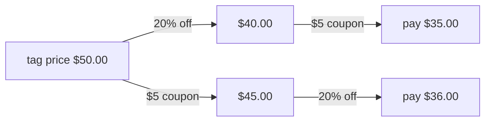

# Composing functions: do one, then the other

[Syllabus](../../../SYLLABUS.md) → [Foundations](../README.md) → [Relations and Functions](../README.md#s08) → Composing functions

---

## General Overview

A jacket is $50. The shop is running two offers at once: 20% off everything, and a $5 coupon.

The cashier takes the 20% off first: $50 becomes $40, and the coupon takes that to $35. Your friend buys the same jacket from a cashier who rings the coupon first: $50 becomes $45, and the 20% takes it to $36.

Same jacket, same offers, a dollar apart. Only the order changed.

Each offer is a rule that takes a price and hands back a price: a function, as in [Functions](02-functions.md). Feeding one rule's answer into the other is **composition**, and the two steps together are one rule.

**Feeding one function's output into another makes one new function, and the order you feed them in usually changes the answer.**

### The picture: the same $50, two orders



One route pays $35.00, the other $36.00.

---

## The formula

Call the 20% offer **f** and the coupon **g**. The letters name the rules, not numbers.

**f(price) = 0.8 × price** — 20% off is keeping four fifths.
**g(price) = price − 5** — take the coupon off.

Do f first, then hand its answer to g. Written **g(f(price))**: the rule closest to the price runs first, and you read outwards. Out loud, **"g after f"**. Also written g ∘ f, with a small circle, still meaning f runs first.

Each chain collapses into one rule. Step 2 does the working; here is where they land.

**g after f: 0.8 × price − 5, so a $50 jacket costs $35**

**f after g: 0.8 × (price − 5), so a $50 jacket costs $36**

**Read it aloud: put the first rule's answer where the second rule's input goes, and two steps become one.**

| Piece | Plain meaning | In our example |
| --- | --- | --- |
| price | the input, the number on the tag | $50.00 |
| f | the 20% offer: keep four fifths | $50.00 gives $40.00 |
| g | the coupon: take five dollars off | $50.00 gives $45.00 |
| g after f, written g(f(price)) | do f, hand the answer to g | $35.00 |
| f after g, written f(g(price)) | do g, hand the answer to f | $36.00 |
| the do-nothing rule | hands back the price untouched | $50.00 gives $50.00 |

---

## Why it works

### Step 0: the first rule's output must be the second rule's kind of input

Both offers take a price over $5 and hand back a price. That is the only reason they chain, in either order. If the coupon handed back a colour, no price rule could follow. Checking a chain is checking that each rule's outputs are inputs the next accepts: the domain and codomain of [Functions](02-functions.md).

### Step 1: run them in order, on the real number

20% off $50 keeps four fifths: $40. The coupon now works on $40, not on $50, so you pay $35. The other way round, the coupon takes $50 to $45, and the 20% works on $45: you pay $36.

The second rule never sees the tag price, only what the first rule handed it.

### Step 2: collapse the two steps into one rule

Do it again with "price" standing where the number was.

f hands over 0.8 × price. Give that to g, which takes 5 off: **0.8 × price − 5**.

The other order: g hands over price − 5. Give that to f, which keeps four fifths: **0.8 × (price − 5)**, and multiplying out, **0.8 × price − 4**.

The two rules differ only in that last number. The coupon is worth $5 applied last, $4 when it goes through the 20% first, because 0.8 × 5 = 4. So the gap is $1 on any price: 20% of the coupon.

A chain of steps is one function: one rule takes the tag price to the money.

### Step 3: the rule that changes nothing

Ring up a rule that leaves the price alone, then take the 20% off: $40, what the 20% does alone. A rule that hands back what it was given is the **identity**, and putting it on either end of a chain changes nothing. It is to composing what 0 is to adding.

Add a third offer and the queue order is all that matters — which pair you collapse into one rule first changes nothing. That is **associativity**.

Running a chain backwards is [Inverse functions](05-inverse-functions.md).

---

## Worked numbers, by hand

| Step | Arithmetic | Value |
| --- | --- | --- |
| the tag price | on the label | $50.00 |
| 20% off | 50 × 0.8 | $40.00 |
| then the coupon | 40 − 5 | **$35.00** |
| the coupon first | 50 − 5 | $45.00 |
| then 20% off | 45 × 0.8 | **$36.00** |
| the gap | 36 − 35 | $1.00 |
| the coupon, through the 20% | 5 × 0.8 | $4.00 |
| the same orders, on an $80.00 coat | 80 × 0.8 − 5, and (80 − 5) × 0.8 | $59.00 and $60.00 |

Percentage first, you pay $35. Coupon first, $36. The order is a shop policy worth a dollar.

### What breaks if you drop a piece

| Mistake | Comes out at | What went wrong |
| --- | --- | --- |
| Reading the chain left to right | $36.00 | The rule nearest the price runs first |
| In the coupon-first order, taking the 20% off $50 instead of $45 | $40.00 | The second rule works on the new price |
| Collapsing the coupon-first order to 0.8 × price − 5 | $35.00 | Through the 20%, the $5 coupon is worth $4 |

---

## Code, from first principles, and it actually runs

Nothing is imported. Prices are whole cents and these ones are whole multiples of five cents, so the fifths come out exact. Each chain is walked one rule at a time, then again by its collapsed rule: two roads to the same money.

### Python

```python
# Composing functions -- the check behind the card.  Nothing is imported.  A $50 item and two offers: 20% off, and $5 off.
# Each offer is a rule that takes a price in whole cents and hands back a price.  Every chain is walked step by step, then
# again as one collapsed rule, and the two roads must agree.
PRICE, COUPON, OTHER = 5000, 500, 8000
def percent_off(c): return c * 4 // 5            # the 20% offer: keep four fifths; these prices are whole multiples of five cents, so it is exact
def coupon_off(c): return c - COUPON             # the $5 offer
def nothing(c): return c                         # the do-nothing rule
def money(c): return f"${c // 100}.{c % 100:02d}"
def chain(rules, c):                             # do the first rule, feed its answer to the next
    steps = [c]
    for rule in rules: steps.append(rule(steps[-1]))
    return steps
def walk(rules, c): return " -> ".join(money(s) for s in chain(rules, c))
pc, cp = chain([percent_off, coupon_off], PRICE)[-1], chain([coupon_off, percent_off], PRICE)[-1]
pc_rule, cp_rule = percent_off(PRICE) - COUPON, percent_off(PRICE) - percent_off(COUPON)   # each chain again, as one rule
pc2, cp2 = chain([percent_off, coupon_off], OTHER)[-1], chain([coupon_off, percent_off], OTHER)[-1]
none_then_pc = chain([nothing, percent_off], PRICE)[-1]
def row(name, value): print(f"{name:<38}{value}")
row("item price", money(PRICE))
row("20% off, then $5 off, step by step", walk([percent_off, coupon_off], PRICE))
row("$5 off, then 20% off, step by step", walk([coupon_off, percent_off], PRICE))
row("coupon after percent, as one rule", f"0.8 x price - {money(COUPON)} = {money(pc_rule)}")
row("percent after coupon, as one rule", f"0.8 x price - {money(percent_off(COUPON))} = {money(cp_rule)}")
row("the two orders differ by", f"{money(cp - pc)}, which is 20% of the {money(COUPON)} coupon")
row(f"on an {money(OTHER)} item, the two orders", f"{money(pc2)} and {money(cp2)}, still {money(cp2 - pc2)} apart")
row("do nothing, then 20% off", f"{money(none_then_pc)} -- 20% off on its own")
assert pc == 3500 and cp == 3600 and cp - pc == 100
assert pc == pc_rule and cp == cp_rule and percent_off(COUPON) == 400
assert pc2 == 5900 and cp2 == 6000 and none_then_pc == 4000
print("ALL CHECKS PASS")
```

**Ran 2026-09-06 on macOS, Python 3.14.6, standard library only. All checks passed. Output, pasted from the run:**

```
item price                            $50.00
20% off, then $5 off, step by step    $50.00 -> $40.00 -> $35.00
$5 off, then 20% off, step by step    $50.00 -> $45.00 -> $36.00
coupon after percent, as one rule     0.8 x price - $5.00 = $35.00
percent after coupon, as one rule     0.8 x price - $4.00 = $36.00
the two orders differ by              $1.00, which is 20% of the $5.00 coupon
on an $80.00 item, the two orders     $59.00 and $60.00, still $1.00 apart
do nothing, then 20% off              $40.00 -- 20% off on its own
ALL CHECKS PASS
```

### Rust

Same numbers, same labels, via `rustc --edition 2021 -O`.

```rust
// Composing functions -- the same check as composition_check.py, in Rust.  No crates.  A $50 item and two offers: 20% off,
// and $5 off.  Each offer is a rule that takes a price in whole cents and hands back a price.  Every chain is walked step
// by step, then again as one collapsed rule, and the two roads must agree.
const PRICE: i64 = 5000;
const COUPON: i64 = 500;
const OTHER: i64 = 8000;
fn percent_off(c: i64) -> i64 { c * 4 / 5 }        // the 20% offer: keep four fifths; these prices are whole multiples of five cents, so it is exact
fn coupon_off(c: i64) -> i64 { c - COUPON }        // the $5 offer
fn nothing(c: i64) -> i64 { c }                    // the do-nothing rule
fn money(c: i64) -> String { format!("${}.{:02}", c / 100, c % 100) }
fn chain(rules: &[fn(i64) -> i64], c: i64) -> Vec<i64> {   // do the first rule, feed its answer to the next
    let mut steps = vec![c];
    for rule in rules { steps.push(rule(*steps.last().unwrap())); }
    steps
}
fn walk(rules: &[fn(i64) -> i64], c: i64) -> String {
    chain(rules, c).iter().map(|s| money(*s)).collect::<Vec<String>>().join(" -> ")
}
fn row(name: &str, value: &str) { println!("{:<38}{}", name, value); }
fn main() {
    let first: &[fn(i64) -> i64] = &[percent_off, coupon_off];
    let second: &[fn(i64) -> i64] = &[coupon_off, percent_off];
    let (pc, cp) = (*chain(first, PRICE).last().unwrap(), *chain(second, PRICE).last().unwrap());
    let (pc_rule, cp_rule) = (percent_off(PRICE) - COUPON, percent_off(PRICE) - percent_off(COUPON));   // each chain again, as one rule
    let (pc2, cp2) = (*chain(first, OTHER).last().unwrap(), *chain(second, OTHER).last().unwrap());
    let none_then_pc = *chain(&[nothing, percent_off], PRICE).last().unwrap();
    row("item price", &money(PRICE));
    row("20% off, then $5 off, step by step", &walk(first, PRICE));
    row("$5 off, then 20% off, step by step", &walk(second, PRICE));
    row("coupon after percent, as one rule", &format!("0.8 x price - {} = {}", money(COUPON), money(pc_rule)));
    row("percent after coupon, as one rule", &format!("0.8 x price - {} = {}", money(percent_off(COUPON)), money(cp_rule)));
    row("the two orders differ by", &format!("{}, which is 20% of the {} coupon", money(cp - pc), money(COUPON)));
    row(&format!("on an {} item, the two orders", money(OTHER)), &format!("{} and {}, still {} apart", money(pc2), money(cp2), money(cp2 - pc2)));
    row("do nothing, then 20% off", &format!("{} -- 20% off on its own", money(none_then_pc)));
    assert!(pc == 3500 && cp == 3600 && cp - pc == 100);
    assert!(pc == pc_rule && cp == cp_rule && percent_off(COUPON) == 400);
    assert!(pc2 == 5900 && cp2 == 6000 && none_then_pc == 4000);
    println!("ALL CHECKS PASS");
}
```

**Ran 2026-09-06 on macOS, rustc 1.98.1, no crates. All checks passed. Output, pasted from the run:**

```
item price                            $50.00
20% off, then $5 off, step by step    $50.00 -> $40.00 -> $35.00
$5 off, then 20% off, step by step    $50.00 -> $45.00 -> $36.00
coupon after percent, as one rule     0.8 x price - $5.00 = $35.00
percent after coupon, as one rule     0.8 x price - $4.00 = $36.00
the two orders differ by              $1.00, which is 20% of the $5.00 coupon
on an $80.00 item, the two orders     $59.00 and $60.00, still $1.00 apart
do nothing, then 20% off              $40.00 -- 20% off on its own
ALL CHECKS PASS
```

The two outputs match line for line: whole cents throughout, and the fifths are exact.

> [!TIP]
> **Try changing**
> Guess first, then run it. The asserts are pinned to these numbers, so expect one to fire.
> - **Make the coupon $10.** Set `COUPON` to `1000`. The gap doubles: 20% of $10, so $2. The orders come out at $30.00 and $32.00.
> - **Make the percentage offer do nothing.** Have the 20% rule hand back `c` untouched. Both orders pay $45.00 and the gap closes: with the do-nothing rule, order stops mattering.

---

## The usual mistake

> [!warning]
> **Thinking the second offer still comes off the tag price.** It does not. The second rule only sees what the first handed it. Coupon first, and the 20% comes off $45, not $50: $36, not $35.
>
> - Reading a chain left to right. "g after f" runs f first.
> - Assuming order never matters. Sometimes it does not, but that is checked, not assumed.
> - Moving a discount through a percentage without shrinking it. Through 20% off, a $5 coupon is worth $4.

---

## Where you meet it in real life

- **Discounts, then tax.** Shops and tax offices publish the order, because the total depends on it.
- **Unit conversions.** Feet to metres, metres to kilometres. Chain them and one rule takes feet to kilometres.
- **Spreadsheets and code.** A formula wrapped around another is composition: the whole run is one function of the input.

> **Say it back**
> Composing means doing one rule and feeding its answer to the next. A $50 jacket, 20% off then a $5 coupon, costs $35; the coupon first, then the 20%, costs $36. The second rule only sees what the first handed it, so order matters. "g after f" runs f first. Work the brackets through and the chain is one rule: 0.8 × price − 5 one way, 0.8 × price − 4 the other.

---

## What this builds on

- [Functions](02-functions.md): one output for every input, and the domain and codomain that decide whether two rules chain.

## Where this goes next

- [Inverse functions](05-inverse-functions.md): chaining a rule with the one that undoes it, and when that exists.

---

## Sources

Verified 6 Sep 2026; every link resolves.

- Hammack, Richard. *Book of Proof*, 3rd ed., 2018. [Book page](https://richardhammack.github.io/BookOfProof/). Chapter 12: composition, read right to left.
- Halmos, Paul R. *Naive Set Theory*. Springer, 1974. [doi:10.1007/978-1-4757-1645-0](https://doi.org/10.1007/978-1-4757-1645-0). Section 10: composites from ordered pairs alone.
- Enderton, Herbert B. *Elements of Set Theory*. Academic Press, 1977. [Publisher page](https://shop.elsevier.com/books/elements-of-set-theory/enderton/978-0-12-238440-0). Chapter 3: composites and the identity.
