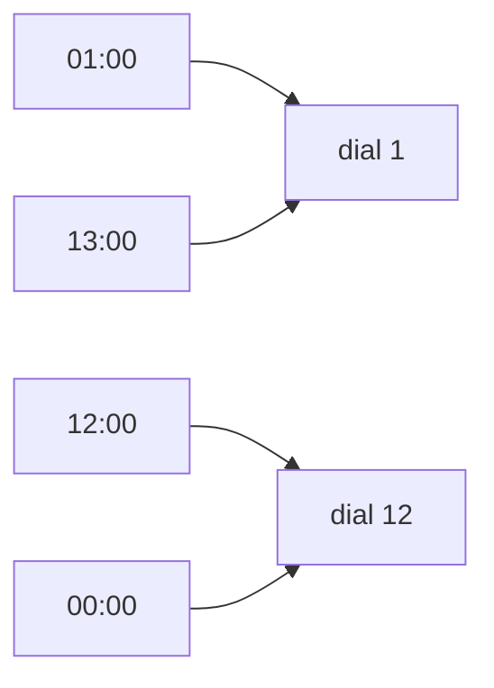

# One-to-one and onto: no two inputs share an output, and every output gets hit

[Syllabus](../../../SYLLABUS.md) → [Foundations](../../../SYLLABUS.md#w01) → [Relations and Functions](../../../SYLLABUS.md#w01-s08) → One-to-one and onto

---

## General Overview

It is 13:00. The kitchen clock says 1.

The clock runs a rule: it takes an hour of the day — 0 to 23 — and hands back a dial number, 1 to 12. Every hour gets exactly one answer, so it is a function, in the sense of [Functions](02-functions.md).

Two questions are left.

**Does any dial number take two hours?** Yes. 01:00 and 13:00 both give 1. To the dial they are the same.

**Does every dial number get used?** Yes. All 12, 2 hours each, 24 in total.

Crowding and gaps are two different faults. The clock crowds and has no gaps: one can happen without the other.

**One-to-one means no output takes two inputs. Onto means no output is left out. A function that is both pairs the two sets off exactly, one for one.**

### The picture: where four hours arrive



Four of the 24 hours. Two arrive at dial 1, two at dial 12: every dial number takes exactly 2 hours.

---

## The formula

Forwards, every function looks alike: one arrow leaves each input. Only the far end varies. Stand at an output and count the arrows arriving.

**Never two arriving anywhere: one-to-one, also called injective.
Never none arriving anywhere: onto, also called surjective.
Exactly one arriving at every output: both at once, called a bijection.**

Two arriving is a collision; none arriving is a gap. The clock's arrivals, dial 1 through dial 12, read 2 2 2 2 2 2 2 2 2 2 2 2. There is a 2, so not one-to-one. There is no 0, so onto.

| Piece | Plain meaning | In our example |
| --- | --- | --- |
| domain | the inputs the rule accepts | the 24 hours, 0 to 23 |
| codomain | the outputs it is declared to reach | the 12 dial numbers |
| arrivals at an output | how many inputs land on it | 2 at every dial number |
| one-to-one, or injective | never two arriving | fails: 01:00 and 13:00 both give 1 |
| onto, or surjective | never none arriving | holds: all 12 reached |
| both, a bijection | exactly one arriving everywhere | not the clock — the seating below |

Onto is a claim about the codomain: the outputs you declared, not the ones that turned up.

---

## Why it works

### One-to-one: nothing gets lost

Eight guests with place cards 1 to 8, eight numbered seats. Guest 1 takes seat 1, guest 2 seat 2, down the row. Arrivals at each seat: 1 1 1 1 1 1 1 1. No seat took two, so it is one-to-one.

Every seat holds exactly one guest, so point at a seat and name the guest: the trip runs backwards — [Inverse functions](05-inverse-functions.md). That needs both tests, not just this one. The clock cannot: 01:00 and 13:00 go in as two different hours and come out as one dial number.

### Onto: nothing gets missed, against what you declared

Same guests, same order, ten seats. Arrivals: 1 1 1 1 1 1 1 1 0 0. Still one-to-one, nobody shares. Not onto: 2 seats have none arriving. The guests did not change; the room did. Onto is always onto *something*: the codomain you declared.

### Sizes settle half of it at most

Nine guests, eight seats: one seat holds 2. More inputs than outputs and one-to-one is impossible. Fewer inputs than outputs and onto is impossible: eight cannot fill ten.

Equal sizes settle nothing alone. Eight guests, eight seats: two crowd seat 3, so 7 seats of 8 are filled and neither test passes. On finite sets equal counts buy only this: if one test passes, so does the other.

### Both at once is a pairing

Back to eight guests in eight seats: exactly 1 arriving everywhere. Each guest a seat, each seat a guest, nothing spare. That is a bijection — and what "the same size" means: you never counted, you paired off — [Same size means pairable](../09-Sizes%20of%20Infinity/01-same-size-by-pairing.md).

---

## Worked numbers, by hand

| Step | Arithmetic | Value |
| --- | --- | --- |
| the clock's job | hours 0 to 23, onto dial 1 to 12 | 24 and 12 |
| arrivals at every dial number | 24 shared over 12 | 2 |
| the clock | a 2 somewhere, no 0 anywhere | **not one-to-one, onto** |
| 8 guests, 8 seats: arrivals each | 8 shared over 8 | 1 |
| that seating | no 2 anywhere, no 0 anywhere | **one-to-one and onto** |
| the same 8 guests, 10 seats: empty | 10 − 8 | **2** |

Two hours to a dial number; one guest to a seat; 2 seats spare.

### What breaks if you drop a piece

| Mistake | Comes out at | What went wrong |
| --- | --- | --- |
| Nine guests into eight seats | one seat holds 2 | More inputs than outputs |
| Two guests crowd seat 3 | 7 seats of 8 filled | Equal sizes, neither test passing |
| Calling the ten-seat row onto | 2 seats with none arriving | Onto is judged against the declared seats |

---

## Code, from first principles, and it actually runs

Nothing is imported. Each seating is read forwards — collect the outputs, look for a repeat, check they cover the codomain — then backwards, by counting arrivals. The routes must agree, and the code stops if they do not.

### Python

```python
# One-to-one and onto -- the check behind the card.  Nothing is imported.  The
# 24-hour clock read onto a 12-hour dial, then eight guests seated two ways.
# Route 1 reads the arrows forwards; route 2 counts the arrivals at each output.
DIAL, SEATS, TEN = list(range(1, 13)), list(range(1, 9)), list(range(1, 11))
def dial(h): return h % 12 if h % 12 else 12   # 00:00 and 12:00 both give dial 12
def arrivals(pairs, codomain):                 # route 2: inputs landing on each output
    return [sum(1 for _, b in pairs if b == c) for c in codomain]
def verdict(pairs, codomain):
    hits = [b for _, b in pairs]
    assert set(hits) <= set(codomain), "an output landed outside the codomain"
    one_to_one, onto = len(set(hits)) == len(pairs), set(codomain) <= set(hits)   # route 1
    n = arrivals(pairs, codomain)
    assert (one_to_one, onto) == (max(n) <= 1, min(n) >= 1)                       # the routes agree
    return ("one-to-one" if one_to_one else "not one-to-one") + (" and onto" if onto else " and not onto")
def show(label, pairs, codomain, unit):
    n = arrivals(pairs, codomain)
    print(f"{label}: {verdict(pairs, codomain)}")
    print(f"  arrivals at each {unit}: {' '.join(str(x) for x in n)} -- {sum(n)} in total, {n.count(0)} with none arriving")
clock, seated = [(h, dial(h)) for h in range(24)], [(g, g) for g in range(1, 9)]   # guest 1 in seat 1, and so on
nine, crowd = seated + [(9, 1)], [(g, s) for g, s in zip(range(1, 9), [1, 2, 3, 3, 5, 6, 7, 8])]   # a ninth guest; two guests take seat 3
show("the clock, 24 hours (0 to 23) onto 12 dial numbers", clock, DIAL, "dial number")
print(f"  01:00 gives dial {dial(1)}, 13:00 gives dial {dial(13)}, 12:00 gives dial {dial(12)}, 00:00 gives dial {dial(0)}")
show("eight guests, eight numbered seats", seated, SEATS, "seat")
show("the same eight guests in a ten-seat row", seated, TEN, "seat")
print(f"breaks: nine guests into eight seats -- {verdict(nine, SEATS)}, one seat holds {max(arrivals(nine, SEATS))}")
print(f"breaks: two guests crowd seat 3 -- {verdict(crowd, SEATS)}, {8 - arrivals(crowd, SEATS).count(0)} seats of 8 filled")
assert verdict(clock, DIAL) == "not one-to-one and onto" and arrivals(clock, DIAL) == [2] * 12
assert verdict(seated, SEATS) == "one-to-one and onto" and verdict(seated, TEN) == "one-to-one and not onto"
assert max(arrivals(nine, SEATS)) == 2 and arrivals(crowd, SEATS).count(0) == 1 and sum(arrivals(clock, DIAL)) == 24
print("ALL CHECKS PASS")
```

**Ran 2026-09-06 on macOS, Python 3.14.6, standard library only. All checks passed. Output, pasted from the run:**

```
the clock, 24 hours (0 to 23) onto 12 dial numbers: not one-to-one and onto
  arrivals at each dial number: 2 2 2 2 2 2 2 2 2 2 2 2 -- 24 in total, 0 with none arriving
  01:00 gives dial 1, 13:00 gives dial 1, 12:00 gives dial 12, 00:00 gives dial 12
eight guests, eight numbered seats: one-to-one and onto
  arrivals at each seat: 1 1 1 1 1 1 1 1 -- 8 in total, 0 with none arriving
the same eight guests in a ten-seat row: one-to-one and not onto
  arrivals at each seat: 1 1 1 1 1 1 1 1 0 0 -- 8 in total, 2 with none arriving
breaks: nine guests into eight seats -- not one-to-one and onto, one seat holds 2
breaks: two guests crowd seat 3 -- not one-to-one and not onto, 7 seats of 8 filled
ALL CHECKS PASS
```

### Rust

Same numbers, same labels, via `rustc --edition 2021 -O`.

```rust
// One-to-one and onto -- the same check as the Python, in Rust.  No crates.  The
// 24-hour clock read onto a 12-hour dial, then eight guests seated two ways.
// Route 1 reads the arrows forwards; route 2 counts the arrivals at each output.
fn dial(h: i64) -> i64 { if h % 12 == 0 { 12 } else { h % 12 } }   // 00:00 and 12:00 both give dial 12
fn arrivals(pairs: &[(i64, i64)], codomain: &[i64]) -> Vec<usize> {   // route 2: inputs landing on each output
    codomain.iter().map(|c| pairs.iter().filter(|p| p.1 == *c).count()).collect()
}
fn verdict(pairs: &[(i64, i64)], codomain: &[i64]) -> String {
    let mut hits: Vec<i64> = pairs.iter().map(|p| p.1).collect();
    hits.sort_unstable(); hits.dedup();
    let mut cod: Vec<i64> = codomain.to_vec();
    cod.sort_unstable(); cod.dedup(); assert!(hits.iter().all(|h| cod.contains(h)), "an output landed outside the codomain");
    let (one_to_one, onto) = (hits.len() == pairs.len(), cod.iter().all(|c| hits.contains(c)));   // route 1
    let n = arrivals(pairs, codomain);
    assert_eq!((one_to_one, onto), (*n.iter().max().unwrap() <= 1, *n.iter().min().unwrap() >= 1));   // the routes agree
    format!("{}{}", if one_to_one { "one-to-one" } else { "not one-to-one" }, if onto { " and onto" } else { " and not onto" })
}
fn show(label: &str, pairs: &[(i64, i64)], codomain: &[i64], unit: &str) {
    let n = arrivals(pairs, codomain);
    println!("{}: {}", label, verdict(pairs, codomain));
    println!("  arrivals at each {}: {} -- {} in total, {} with none arriving", unit,
             n.iter().map(|x| x.to_string()).collect::<Vec<String>>().join(" "),
             n.iter().sum::<usize>(), n.iter().filter(|&&x| x == 0).count());
}
fn main() {
    let (dial12, seats, ten): (Vec<i64>, Vec<i64>, Vec<i64>) = ((1..=12).collect(), (1..=8).collect(), (1..=10).collect());
    let (clock, seated): (Vec<(i64, i64)>, Vec<(i64, i64)>) = ((0..24).map(|h| (h, dial(h))).collect(), (1..=8).map(|g| (g, g)).collect());   // guest 1 in seat 1
    let mut nine = seated.clone(); nine.push((9, 1));                             // a ninth guest, still eight seats
    let crowd: Vec<(i64, i64)> = (1..=8).zip([1, 2, 3, 3, 5, 6, 7, 8]).collect(); // two guests take seat 3
    show("the clock, 24 hours (0 to 23) onto 12 dial numbers", &clock, &dial12, "dial number");
    println!("  01:00 gives dial {}, 13:00 gives dial {}, 12:00 gives dial {}, 00:00 gives dial {}", dial(1), dial(13), dial(12), dial(0));
    show("eight guests, eight numbered seats", &seated, &seats, "seat");
    show("the same eight guests in a ten-seat row", &seated, &ten, "seat");
    println!("breaks: nine guests into eight seats -- {}, one seat holds {}", verdict(&nine, &seats), arrivals(&nine, &seats).iter().max().unwrap());
    println!("breaks: two guests crowd seat 3 -- {}, {} seats of 8 filled", verdict(&crowd, &seats), 8 - arrivals(&crowd, &seats).iter().filter(|&&x| x == 0).count());
    assert!(verdict(&clock, &dial12) == "not one-to-one and onto" && arrivals(&clock, &dial12) == vec![2; 12]);
    assert!(verdict(&seated, &seats) == "one-to-one and onto" && verdict(&seated, &ten) == "one-to-one and not onto");
    assert!(*arrivals(&nine, &seats).iter().max().unwrap() == 2 && arrivals(&crowd, &seats).iter().filter(|&&x| x == 0).count() == 1 && arrivals(&clock, &dial12).iter().sum::<usize>() == 24);
    println!("ALL CHECKS PASS");
}
```

**Ran 2026-09-06 on macOS, rustc 1.98.1, no crates. All checks passed. Output, pasted from the run:**

```
the clock, 24 hours (0 to 23) onto 12 dial numbers: not one-to-one and onto
  arrivals at each dial number: 2 2 2 2 2 2 2 2 2 2 2 2 -- 24 in total, 0 with none arriving
  01:00 gives dial 1, 13:00 gives dial 1, 12:00 gives dial 12, 00:00 gives dial 12
eight guests, eight numbered seats: one-to-one and onto
  arrivals at each seat: 1 1 1 1 1 1 1 1 -- 8 in total, 0 with none arriving
the same eight guests in a ten-seat row: one-to-one and not onto
  arrivals at each seat: 1 1 1 1 1 1 1 1 0 0 -- 8 in total, 2 with none arriving
breaks: nine guests into eight seats -- not one-to-one and onto, one seat holds 2
breaks: two guests crowd seat 3 -- not one-to-one and not onto, 7 seats of 8 filled
ALL CHECKS PASS
```

The two outputs match line for line.

> [!TIP]
> **Try changing**
> Guess first, then run it. The asserts are pinned to the seatings above, so expect one to fire.
> - **Shrink the room.** On the first line, set `TEN` to the eight seats: the verdict flips to onto. The codomain moved, not the rule.
> - **Give the clock the numbers 0 to 23.** Set `DIAL` to those and send each hour to itself: arrivals become 1 twenty-four times, a bijection you can read backwards.

---

## The usual mistake

> [!warning]
> **Reading "one output per input" as one-to-one.** Every function does that; it is what the word means. One-to-one is the other direction: no *output* takes two inputs. The clock gives every hour one dial number and is still not one-to-one: dial 1 takes 2 hours.
>
> - Saying onto without saying onto what. The guests are onto eight seats, not onto ten.
> - Reading equal sizes as a pairing. Eight into eight can fail both tests: 7 seats of 8 filled.
> - Reading this as a fact about every set. Shift every whole number up by one: nothing collides, but 0 is never reached — one-to-one and not onto, same numbers on both sides.
> - Treating "one-to-one" and "one-to-one correspondence" as one phrase. The first is injective alone; the second is the whole pairing, a bijection.

---

## Where you meet it in real life

- **ID numbers, barcodes, order references.** One-to-one is the whole requirement: two customers on one reference and the system cannot separate them, as the dial cannot separate 01:00 from 13:00.
- **Clocks, calendars, rounding.** A rule folding a big range onto a small one is deliberately not one-to-one. The fold is the point; the cost is you cannot undo it.
- **Rotas and seating.** Everyone placed, nothing double-booked, nothing idle: a bijection.

> **Say it back**
> A function already gives every input one output. Two questions are left: does any output take two inputs, and is any output left out? Never two is one-to-one, or injective; never none is onto, or surjective; both at once is a bijection. Count the arrivals at each output and you have answered both. The clock is onto and not one-to-one, 2 hours at every dial number; eight guests in eight seats is a bijection; the same eight in ten seats is one-to-one and not onto.

---

## What this builds on

- [Functions](02-functions.md): one output for every input, and the split between the codomain you declare and the range you reach. This card asks the two questions that split leaves open.

## Where this goes next

- [Inverse functions](05-inverse-functions.md): running the arrows backwards, possible exactly when the function is a bijection.
- [Same size means pairable](../09-Sizes%20of%20Infinity/01-same-size-by-pairing.md): a bijection is what "the same size" means.

---

## Sources

Verified 6 Sep 2026; every link resolves.

- Hammack, Richard. *Book of Proof*, 3rd ed., 2018. [Book page](https://richardhammack.github.io/BookOfProof/). Chapter 12, proved slowly.
- Halmos, Paul R. *Naive Set Theory*. Springer, 1974. [doi:10.1007/978-1-4757-1645-0](https://doi.org/10.1007/978-1-4757-1645-0). Sections 8 and 10: one-to-one, onto, then the inverse.
- Enderton, Herbert B. *Elements of Set Theory*. Academic Press, 1977. [Publisher page](https://shop.elsevier.com/books/elements-of-set-theory/enderton/978-0-12-238440-0). Chapter 6: pairing as the definition of size.
