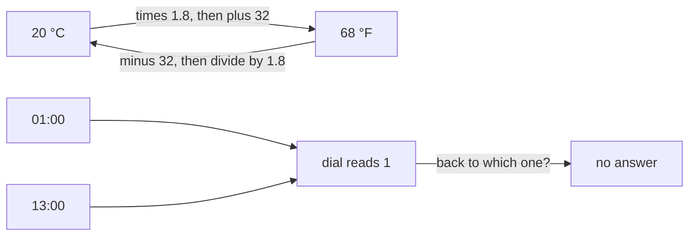

# Inverse functions: undoing a function, possible exactly when it is a bijection

Foundations → Relations and Functions → Functions → Inverse functions

---

## General Overview

It is 20 °C outside. Your cousin in Chicago wants that in Fahrenheit. Multiply by 1.8, add 32: 68 °F.

She sends 68 °F back. Take off the 32, divide by 1.8: 20 °C. Home again — the trip out threw nothing away.

Now the clock on her phone. It shows 13:00 as a dial reading of 1. Hand someone that dial and ask what the 24-hour clock said. They cannot. 01:00 reads 1. 13:00 reads 1. Two hours, one reading, morning and afternoon gone.

**A rule can be undone exactly when it never crowds two inputs onto one output and never leaves an output unreached: the two halves of a bijection, from [injective-surjective-bijective](04-injective-surjective-bijective.md).**

### The picture: one trip that comes home, one that cannot



One arrow each way between the temperatures. Two into the dial reading, none out.

---

## The formula

**F = 1.8 × C + 32**

**C = (F − 32) ÷ 1.8**

**Read it aloud:** forwards, stretch by 1.8 and shift up 32; back, take off the shift, then the stretch.

The undo is called the **inverse**. If f is the forward rule, the inverse is written **f^-1**, said "f inverse": it sends each output back to the input that made it. The raised −1 is a label, not a power, not 1 over f.

| Piece | Plain meaning | In our example |
| --- | --- | --- |
| the forward rule | the machine you start with | F = 1.8 × C + 32 |
| the inverse, f^-1 | sends each output back to its input; the −1 is a label, not a power | C = (F − 32) ÷ 1.8 |
| one-to-one | no two inputs share an output | only 20 °C gives 68 °F |
| onto | every output is reached | every Fahrenheit temperature has a Celsius behind it |
| a bijection | one-to-one and onto at once | the temperature rule, not the clock |
| the identity | hands back what it was given | 20 °C out and back is 20 °C |

---

## Why it works

### Undo the jobs in reverse order

Going out, the temperature is stretched by 1.8, then shifted up 32. Coming back, both reverse and the order flips: the shift went on last, so it comes off first. Coat over shirt going on, coat off first coming off.

68 take away 32 is 36; 36 divided by 1.8 is 20. The other order gives about 5.8.

### Home from both directions

An inverse works both ways round. Out from 20 °C and back: 20 °C. Back from 68 °F and out again: 68 °F. Either round trip is the **identity**, the rule that hands back what it was given, unchanged — [composition](03-composition.md) doing the joining. Only one rule does this: pick an output and its input is already decided.

The check sends four temperatures out and back, −40, 0, 20 and 100 °C, and all 4 come home. At −40 the scales agree: 1.8 × −40 + 32 is −40 again.

### Two inputs on one output, and nothing to hand back

Ask the clock's inverse which hour gave dial reading 1. It must answer with one hour. The honest answer is two: 01:00 and 13:00. A rule answering an input twice is not a function ([functions](02-functions.md)), so the inverse does not exist. Not hidden — not there.

The whole day is like this: 12 readings, 24 hours, 2 hours behind every one. Every reading is reached, so the clock is onto — and onto alone is not enough. The mirror failure is an output nothing produces: the inverse is handed it with no input to give back. Rule out both and you have ruled in a bijection. **Undoable and bijection are the same condition.**

### The repair

Shrinking the inputs fixes it. Over the morning alone, 00:00 to 11:00, one hour lands on dial 1 and the reading can be undone. Same rule, fewer inputs, a new answer.

---

## Worked numbers, by hand

| Step | Arithmetic | Value |
| --- | --- | --- |
| twenty degrees, forwards | 1.8 × 20 + 32 | 68 |
| take off the shift | 68 − 32 | 36 |
| take out the stretch | 36 ÷ 1.8 | **20** |
| four temperatures, out and back | −40, 0, 20, 100 °C | **4 of 4 home** |
| which Celsius gives 68 °F | every whole degree, −50 to 100 | **1 input** |
| which hours give dial 1 | 01:00 and 13:00 | **2 inputs** |

One input behind the answer and you can walk back. Two and you cannot. The search covers whole degrees; the algebra covers the rest: take off 32, divide by 1.8, land on exactly one Celsius.

### What breaks if you drop a piece

| Mistake | Comes out at | What went wrong |
| --- | --- | --- |
| Undoing in the wrong order: divide, then subtract | about 5.8 | The shift went on last, so it comes off first |
| Undoing the shift, forgetting the stretch | 36 | The 1.8 is still in there |
| Reading the clock dial backwards | 2 hours, not 1 | Two inputs share it, nothing to hand back |

---

## Code, from first principles, and it actually runs

Nothing is imported. Two roads back: the undo rule does the algebra, and a search walks every input to see which land there. On the clock it finds two.

### Python

```python
# Inverse functions -- the check behind the card.  Nothing is imported.  Celsius to Fahrenheit,
# F = 1.8 x C + 32, is undone by C = (F - 32) / 1.8.  The 24-hour clock read onto a 12-hour dial is
# not.  Two roads back: the undo rule, and a search of every input for the ones that land there.
CELSIUS = [-40, 0, 20, 100]
def to_f(c): return 1.8 * c + 32                                  # forwards: Celsius to Fahrenheit
def to_c(f): return (f - 32) / 1.8                                # the undo: Fahrenheit to Celsius
def dial(h): return 12 if h % 12 == 0 else h % 12                 # forwards: 24-hour clock to dial
def lands_on(rule, inputs, target):                               # the search road: who lands there
    return [x for x in inputs if rule(x) == target]
def fmt(x): return f"{x:.10f}".rstrip("0").rstrip(".")
fahr, hours = [to_f(c) for c in CELSIUS], range(24)
home = [to_c(f) for f in fahr]
back = sum(1 for c, h in zip(CELSIUS, home) if abs(c - h) < 1e-9)
found, readings = lands_on(to_f, range(-50, 101), to_f(20)), sorted({dial(h) for h in hours})
one, per, morning = lands_on(dial, hours, 1), [len(lands_on(dial, hours, d)) for d in readings], lands_on(dial, range(12), 1)
print(f"the rule: F = 1.8 x C + 32, so 20 C -> {fmt(to_f(20))} F")
print(f"the undo: C = (F - 32) / 1.8, so 68 F -> {fmt(to_c(68))} C")
print(f"round trip, {', '.join(fmt(c) for c in CELSIUS)} C -> {', '.join(fmt(f) for f in fahr)} F -> {', '.join(fmt(c) for c in home)} C -- {back} of {len(CELSIUS)} home")
print(f"search road, whole degrees -50 to 100 C landing on 68 F: {', '.join(str(c) for c in found)} -- {len(found)} input")
print(f"the one temperature both scales share: 1.8 x -40 + 32 = {fmt(to_f(-40))}")
print(f"the clock: {len(list(hours))} hours onto {len(readings)} dial readings, readings reached {len(readings)} of 12")
print(f"hours landing on dial 1: 01:00 and 13:00 -- {len(one)} inputs, so no undo")
print(f"hours behind each reading: {' '.join(str(p) for p in per)} -- {sum(per)} in total")
print(f"cut the day at noon, 00:00 to 11:00: hours landing on dial 1 = {len(morning)}, so the undo exists")
print(f"undone in the wrong order, 68 / 1.8 - 32 = {68 / 1.8 - 32:.4f}; only the +32 undone, 68 - 32 = {68 - 32}")
assert fahr == [-40.0, 32.0, 68.0, 212.0] and to_f(-40) == -40.0 and back == 4
assert found == [20] and len(found) == 1 and fmt(to_c(68)) == "20"
assert list(one) == [1, 13] and readings == list(range(1, 13)) and dial(12) == 12 and dial(13) == 1
assert per == [2] * 12 and sum(per) == 24 and len(morning) == 1 and [len(lands_on(dial, range(12), d)) for d in readings] == [1] * 12
print("ALL CHECKS PASS")
```

**Ran 2026-09-06 on macOS, Python 3.14.6, standard library only. All checks passed. Output, pasted from the run:**

```
the rule: F = 1.8 x C + 32, so 20 C -> 68 F
the undo: C = (F - 32) / 1.8, so 68 F -> 20 C
round trip, -40, 0, 20, 100 C -> -40, 32, 68, 212 F -> -40, 0, 20, 100 C -- 4 of 4 home
search road, whole degrees -50 to 100 C landing on 68 F: 20 -- 1 input
the one temperature both scales share: 1.8 x -40 + 32 = -40
the clock: 24 hours onto 12 dial readings, readings reached 12 of 12
hours landing on dial 1: 01:00 and 13:00 -- 2 inputs, so no undo
hours behind each reading: 2 2 2 2 2 2 2 2 2 2 2 2 -- 24 in total
cut the day at noon, 00:00 to 11:00: hours landing on dial 1 = 1, so the undo exists
undone in the wrong order, 68 / 1.8 - 32 = 5.7778; only the +32 undone, 68 - 32 = 36
ALL CHECKS PASS
```

### Rust

Same numbers, same labels, via `rustc --edition 2021 -O`.

```rust
// Inverse functions -- the same check as inverse_functions_check.py, in Rust.  No crates.  Celsius
// to Fahrenheit, F = 1.8 x C + 32, is undone by C = (F - 32) / 1.8.  The 24-hour clock read onto a
// 12-hour dial is not.  Two roads back: the undo rule, and a search of every input.
const CELSIUS: [f64; 4] = [-40.0, 0.0, 20.0, 100.0];
fn to_f(c: f64) -> f64 { 1.8 * c + 32.0 }                         // forwards: Celsius to Fahrenheit
fn to_c(f: f64) -> f64 { (f - 32.0) / 1.8 }                       // the undo: Fahrenheit to Celsius
fn dial(h: i64) -> i64 { if h % 12 == 0 { 12 } else { h % 12 } }  // forwards: 24-hour clock to dial
fn lands_on(inputs: &[i64], target: i64) -> Vec<i64> {            // the search road: who lands there
    inputs.iter().cloned().filter(|&x| dial(x) == target).collect()
}
fn fmt(x: f64) -> String { format!("{:.10}", x).trim_end_matches('0').trim_end_matches('.').to_string() }
fn join(xs: &[f64]) -> String { xs.iter().map(|&x| fmt(x)).collect::<Vec<String>>().join(", ") }
fn main() {
    let hours: Vec<i64> = (0..24).collect();
    let fahr: Vec<f64> = CELSIUS.iter().map(|&c| to_f(c)).collect();
    let home: Vec<f64> = fahr.iter().map(|&f| to_c(f)).collect();
    let back = CELSIUS.iter().zip(&home).filter(|(c, h)| (*c - *h).abs() < 1e-9).count();
    let found: Vec<i64> = (-50..=100).filter(|&c| to_f(c as f64) == to_f(20.0)).collect();
    let mut readings: Vec<i64> = hours.iter().map(|&h| dial(h)).collect();
    readings.sort_unstable();
    readings.dedup();
    let (one, morning) = (lands_on(&hours, 1), lands_on(&(0..12).collect::<Vec<i64>>(), 1));
    let per: Vec<usize> = readings.iter().map(|&d| lands_on(&hours, d).len()).collect();
    println!("the rule: F = 1.8 x C + 32, so 20 C -> {} F", fmt(to_f(20.0)));
    println!("the undo: C = (F - 32) / 1.8, so 68 F -> {} C", fmt(to_c(68.0)));
    println!("round trip, {} C -> {} F -> {} C -- {} of {} home", join(&CELSIUS), join(&fahr), join(&home), back, CELSIUS.len());
    println!("search road, whole degrees -50 to 100 C landing on 68 F: {} -- {} input", found.iter().map(|c| c.to_string()).collect::<Vec<String>>().join(", "), found.len());
    println!("the one temperature both scales share: 1.8 x -40 + 32 = {}", fmt(to_f(-40.0)));
    println!("the clock: {} hours onto {} dial readings, readings reached {} of 12", hours.len(), readings.len(), readings.len());
    println!("hours landing on dial 1: 01:00 and 13:00 -- {} inputs, so no undo", one.len());
    println!("hours behind each reading: {} -- {} in total", per.iter().map(|p| p.to_string()).collect::<Vec<String>>().join(" "), per.iter().sum::<usize>());
    println!("cut the day at noon, 00:00 to 11:00: hours landing on dial 1 = {}, so the undo exists", morning.len());
    println!("undone in the wrong order, 68 / 1.8 - 32 = {:.4}; only the +32 undone, 68 - 32 = {}", 68.0 / 1.8 - 32.0, 68 - 32);
    assert!(fahr == [-40.0, 32.0, 68.0, 212.0] && to_f(-40.0) == -40.0 && back == 4);
    assert!(found == [20] && found.len() == 1 && fmt(to_c(68.0)) == "20");
    assert!(one == [1, 13] && readings == (1..=12).collect::<Vec<i64>>() && dial(12) == 12 && dial(13) == 1);
    assert!(per == [2; 12] && per.iter().sum::<usize>() == 24 && morning.len() == 1
        && readings.iter().all(|&d| lands_on(&(0..12).collect::<Vec<i64>>(), d).len() == 1));
    println!("ALL CHECKS PASS");
}
```

**Ran 2026-09-06 on macOS, rustc 1.98.1, no crates. All checks passed. Output, pasted from the run:**

```
the rule: F = 1.8 x C + 32, so 20 C -> 68 F
the undo: C = (F - 32) / 1.8, so 68 F -> 20 C
round trip, -40, 0, 20, 100 C -> -40, 32, 68, 212 F -> -40, 0, 20, 100 C -- 4 of 4 home
search road, whole degrees -50 to 100 C landing on 68 F: 20 -- 1 input
the one temperature both scales share: 1.8 x -40 + 32 = -40
the clock: 24 hours onto 12 dial readings, readings reached 12 of 12
hours landing on dial 1: 01:00 and 13:00 -- 2 inputs, so no undo
hours behind each reading: 2 2 2 2 2 2 2 2 2 2 2 2 -- 24 in total
cut the day at noon, 00:00 to 11:00: hours landing on dial 1 = 1, so the undo exists
undone in the wrong order, 68 / 1.8 - 32 = 5.7778; only the +32 undone, 68 - 32 = 36
ALL CHECKS PASS
```

The two outputs match line for line.

> [!TIP]
> **Try changing**
> Guess first, then run it. The asserts are pinned to the numbers above, so one will fire.
> - **Flatten the stretch.** Set the 1.8 to 0: every Celsius temperature now goes to 32 °F. Only 1 of the 4 round trips comes home, and the search finds 151 whole degrees on one output, not 1.
> - **Give the day a 25th hour.** Run the clock over 00:00 to 24:00. Dial reading 12 picks up a third hour: the counts read 2 2 2 2 2 2 2 2 2 2 2 3, total 25.

---

## The usual mistake

> [!warning]
> **Thinking every rule has an inverse, and finding it is a matter of algebra.** For the clock there is no expression to find. Two hours land on the same reading, so any answer would be two things at once.
>
> - Wrong order: 68 ÷ 1.8 − 32 gives about 5.8, not 20.
> - Stopping halfway: 68 − 32 gives 36, and calling that Celsius.
> - Treating onto as enough. The clock reaches all 12 readings and still cannot be undone.

---

## Where you meet it in real life

- **Unit conversion.** Every converter is a pair of rules that undo each other: feet and metres, pounds and kilos.
- **Passwords.** A login stores a scramble of your password, built so two inputs can collide and nothing walks back. Not undoable, on purpose.
- **Timestamps.** Store 13:00 and you can print 1 pm. Store 1 pm and the afternoon is gone — the dial's loss, in a column.


> **Say it back**
> An inverse walks a function backwards: give it an output, it hands back the input. Celsius to Fahrenheit stretches by 1.8 and shifts up 32; the way back takes off the 32 first, then divides by 1.8, so 20 °C goes out to 68 °F and home to 20 °C. The clock cannot come home: 01:00 and 13:00 both read 1, so the walk back has two answers and is no rule at all. An inverse exists exactly when no two inputs share an output and no output goes unreached — when the function is a bijection.

---

## What this builds on

- [composition](03-composition.md): one rule then another. Undo means the two, either way round, leave everything where it was.
- [injective-surjective-bijective](04-injective-surjective-bijective.md): one-to-one and onto, the two conditions this card turns into a yes or no.

## Where this goes next

Nothing later on this shelf leans on it; the shelf turns to [equivalence-relations-and-partitions](06-equivalence-relations-and-partitions.md). Undoing returns wherever a rule runs in reverse: solving for an input, a logarithm undoing a power, decrypting a message.

---

## Sources

Verified 6 Sep 2026; every link resolves.

- Hammack, Richard. *Book of Proof*, 3rd ed., 2018. [Book page](https://richardhammack.github.io/BookOfProof/). Chapter 12: the proof that undoable means bijective.
- Halmos, Paul R. *Naive Set Theory*. Springer, 1974. [doi:10.1007/978-1-4757-1645-0](https://doi.org/10.1007/978-1-4757-1645-0). Section 10: inverses and composites.
- Enderton, Herbert B. *Elements of Set Theory*. Academic Press, 1977. [Publisher page](https://shop.elsevier.com/books/elements-of-set-theory/enderton/978-0-12-238440-0). Chapter 3: a relation reversed, and when it is a function.
