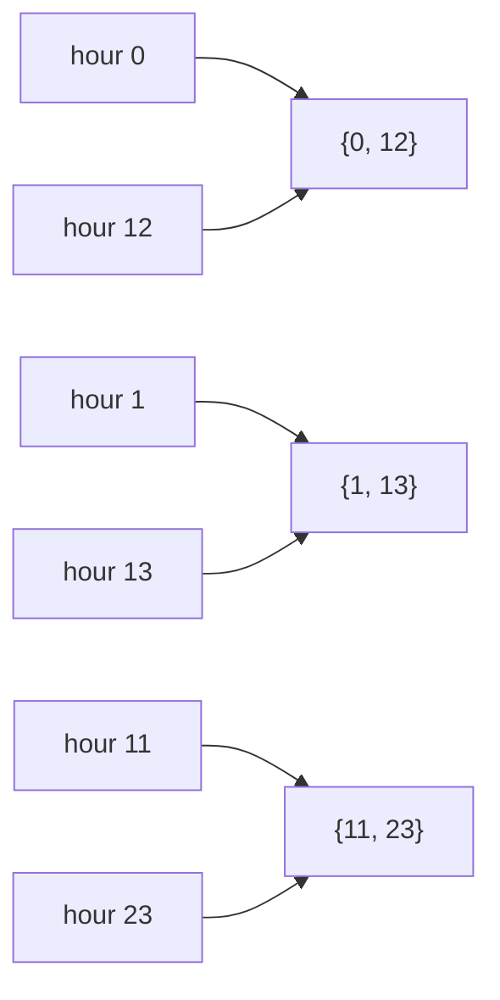

# Equivalence relations and partitions: a sameness rule cuts a set into blocks, and the blocks give the rule back

[Syllabus](../../../SYLLABUS.md) → [Foundations](../../../SYLLABUS.md#w01) → [Relations and Functions](../../../SYLLABUS.md#w01-s08) → Equivalence relations and partitions

---

## General Overview

A day has 24 hours, numbered 0 to 23. The kitchen clock has 12 readings, taking the 12 on its face as 0: at hour 15 the dial shows 3, at hour 23 it shows 11, at hour 3 it shows 3 again.

Take this rule: two hours count as the same when the dial shows the same for both. That is a relation on the 24 hours — a set of ordered pairs, [Relations](01-relations.md) — and 48 of the 24 × 24 = 576 pairs are in it.

The rule sorts the day: 0 with 12, 1 with 13, 2 with 14, up to 11 with 23. Twelve piles of two, every hour in exactly one, none left over. A split like that is a **partition**, and each pile is a **block**.

**A rule that is reflexive, symmetric and transitive cuts a set into blocks that cover everything and never overlap, and "in the same block" is that rule handed back.**

### The picture: two hours in, one block out



Three of the twelve blocks. The rest look the same.

---

## The formula

The rule is the object:

**same reading on a 12-hour dial: hour a and hour b are linked when the dial shows the same number for both**

Here a and b are any two of the 24 hours, possibly the same. Three of the four tests from [Relations](01-relations.md) settle it:

- **Reflexive:** every hour is linked to itself.
- **Symmetric:** if a is linked to b, then b is linked to a.
- **Transitive:** if a is linked to b and b is linked to c, then a is linked to c.

Pass all three and it is an **equivalence relation**, a sameness rule. The blocks fall out:

**the 24 hours, cut into 12 blocks of 2: {0, 12}, {1, 13}, {2, 14}, ... , {11, 23}**

| Piece | Plain meaning | In our example |
| --- | --- | --- |
| the dial reading | the hour, minus 12 when it is 12 or more | hour 15 shows 3 |
| a sameness rule, or equivalence relation | a relation passing all three tests | same reading on a dial |
| a block, formally an equivalence class | all the rule links one thing to, itself included | the block of hour 0 is {0, 12} |
| a partition | non-empty blocks, never overlapping, covering the set | the 12 blocks, {0, 12} up to {11, 23} |

Books write a ~ b for "linked", [a] for a's block.

---

## Why it works

### Reflexive fills a block

The block of an hour is everything the rule links it to. Hour 0: to 12, and to itself, so {0, 12}. Reflexive is the only reason 0 is in there. Drop it and an hour sits outside its own block — no cover, no partition.

### Symmetric and transitive stop blocks overlapping

Suppose the block of a and the block of b share an hour, h. Then a is linked to h, and b to h. Symmetric turns the second round: h is linked to b. Transitive joins them: a is linked to b. Anything in a's block is linked to a, so to b, so it sits in b's block — and the same the other way. One block, two labels.

So two blocks match exactly or share nothing: cover, no overlap — a partition.

### Piles first, rule second

A sock drawer: 9 socks in 3 piles by colour, 4 black, 3 white, 2 grey. Already a partition — no pile empty, no sock in two piles, none on the floor.

Say two socks are linked when they share a pile. A sock is in its own pile, sharing reads both ways, and a chain of sharing stays in one pile because a sock has only one. Reflexive, symmetric, transitive — and the blocks come back as the piles. Rule and partition are one object described twice.

---

## Worked numbers, by hand

| Step | Arithmetic | Value |
| --- | --- | --- |
| hours in a day | 0 to 23 | 24 |
| ordered pairs to ask about | 24 × 24 | 576 |
| dial readings, so blocks | 15 shows 3, 23 shows 11 | **12** |
| linked pairs, counted by blocks | 12 × 2 × 2 | **48** |
| linked pairs in the sock drawer | 4 × 4 + 3 × 3 + 2 × 2 | **29** |

A block of 2 holds 2 × 2 = 4 linked pairs, so twelve blocks give 48 — the same 48 the code gets counting pair by pair.

### What breaks if you drop a piece

| Mistake | Comes out at | What went wrong |
| --- | --- | --- |
| "Same reading, and not the same hour" | 24 pairs | Reflexive gone, transitive with it: hour 0 is not in its own block |
| "Readings at most 1 apart, no wrap" | 136 pairs | Transitive gone: 2 with 3, 3 with 4, not 2 with 4, blocks overlap |
| One grey sock left on the floor | 26 pairs | The piles stop covering the drawer: no partition |

---

## Code, from first principles, and it actually runs

Nothing is imported. Both rules go through the three tests straight off the definitions — one pair at a time, one triple for transitive. Their blocks are collected. Second road: the blocks hand back the rule "in the same block", checked against the original on all 576 pairs, the pairs re-counted from block sizes. Then the three broken rules.

### Python

```python
# Equivalence relations and partitions -- the check behind the card.  Nothing is imported.  "Same reading on a 12-hour dial" on the 24 hours of a day, a sock drawer sorted into piles, and three rules that break.
HOURS, SOCKS, PILES = list(range(24)), list(range(9)), [[0, 1, 2, 3], [4, 5, 6], [7, 8]]; pile = {s: i for i, p in enumerate(PILES) for s in p}
def dial(h): return h - 12 if h >= 12 else h          # what a 12-hour face shows at hour h
def tests(rule, S):                                   # straight off the definitions: pairs, and triples for transitive
    return (all(rule(a, a) for a in S), all(rule(b, a) for a in S for b in S if rule(a, b)),
            all(rule(a, c) for a in S for b in S for c in S if rule(a, b) and rule(b, c)))
def blocks(rule, S): return sorted({tuple(b for b in S if rule(a, b)) for a in S})
def linked(rule, S): return sum(1 for a in S for b in S if rule(a, b))
def yn(t): return ", ".join(f"{n} {'yes' if v else 'no'}" for n, v in zip(("reflexive", "symmetric", "transitive"), t))
def fmt(bs): return ", ".join("{" + ", ".join(str(x) for x in b) + "}" for b in bs)
same, sockrule = (lambda a, b: dial(a) == dial(b)), (lambda a, b: pile[a] == pile[b])
B, PILE_TUPLES = blocks(same, HOURS), sorted(tuple(p) for p in PILES)
inblock = lambda a, b: any(a in blk and b in blk for blk in B)      # second road: the blocks hand a rule back
loose, near, floor = (lambda a, b: same(a, b) and a != b), (lambda a, b: abs(dial(a) - dial(b)) <= 1), (lambda a, b: sockrule(a, b) and a != 8 and b != 8)
agree = all(same(a, b) == inblock(a, b) for a in HOURS for b in HOURS)
print(f"24 hours, {len(HOURS) * len(HOURS)} ordered pairs to ask about; hour 3 shows {dial(3)}, hour 15 shows {dial(15)}, hour 23 shows {dial(23)}")
print("same reading on a 12-hour dial: " + yn(tests(same, HOURS)))
print(f"{len(B)} blocks of {len(B[0])}: {fmt(B[:3])}, ... , {fmt(B[-1:])}")
print(f"linked ordered pairs: {len(B)} blocks x {len(B[0])} x {len(B[0])} = {linked(same, HOURS)}")
print(f"those blocks back to a rule, in the same block: {linked(inblock, HOURS)} pairs, agrees on all {len(HOURS) * len(HOURS)} pairs: {'yes' if agree else 'no'}")
print(f"sock drawer, {len(SOCKS)} socks in piles of 4, 3 and 2: " + yn(tests(sockrule, SOCKS)))
print(f"linked ordered pairs: 4 x 4 + 3 x 3 + 2 x 2 = {linked(sockrule, SOCKS)}")
print(f"that rule's blocks are the {len(PILES)} piles back again: {'yes' if blocks(sockrule, SOCKS) == PILE_TUPLES else 'no'}")
print(f"same reading, different hour: {linked(loose, HOURS)} pairs, " + yn(tests(loose, HOURS)) + "; hour 0 is not in its own block")
print(f"readings at most 1 apart, no wrap: {linked(near, HOURS)} pairs, " + yn(tests(near, HOURS)) + "; 2 with 3 and 3 with 4 but not 2 with 4")
print(f"a sock left on the floor: {linked(floor, SOCKS)} pairs, " + yn(tests(floor, SOCKS)) + "; that sock is in no pile")
assert tests(same, HOURS) == (True, True, True) and len(B) == 12 and B[0] == (0, 12) and B[11] == (11, 23) and linked(same, HOURS) == 48
assert agree and linked(inblock, HOURS) == sum(len(b) * len(b) for b in B) and linked(sockrule, SOCKS) == 4 * 4 + 3 * 3 + 2 * 2 and blocks(sockrule, SOCKS) == PILE_TUPLES
assert (linked(loose, HOURS), linked(near, HOURS), linked(floor, SOCKS)) == (24, 136, 26) and not loose(0, 0) and not floor(8, 8) and near(2, 3) and near(3, 4) and not near(2, 4) and (tests(loose, HOURS), tests(near, HOURS), tests(floor, SOCKS)) == ((False, True, False), (True, True, False), (False, True, True))
print("ALL CHECKS PASS")
```

**Ran 2026-09-06 on macOS, Python 3.14.6, standard library only. All checks passed. Output, pasted from the run:**

```
24 hours, 576 ordered pairs to ask about; hour 3 shows 3, hour 15 shows 3, hour 23 shows 11
same reading on a 12-hour dial: reflexive yes, symmetric yes, transitive yes
12 blocks of 2: {0, 12}, {1, 13}, {2, 14}, ... , {11, 23}
linked ordered pairs: 12 blocks x 2 x 2 = 48
those blocks back to a rule, in the same block: 48 pairs, agrees on all 576 pairs: yes
sock drawer, 9 socks in piles of 4, 3 and 2: reflexive yes, symmetric yes, transitive yes
linked ordered pairs: 4 x 4 + 3 x 3 + 2 x 2 = 29
that rule's blocks are the 3 piles back again: yes
same reading, different hour: 24 pairs, reflexive no, symmetric yes, transitive no; hour 0 is not in its own block
readings at most 1 apart, no wrap: 136 pairs, reflexive yes, symmetric yes, transitive no; 2 with 3 and 3 with 4 but not 2 with 4
a sock left on the floor: 26 pairs, reflexive no, symmetric yes, transitive yes; that sock is in no pile
ALL CHECKS PASS
```

### Rust

Same numbers, built with `rustc --edition 2021 -O`.

```rust
// Equivalence relations and partitions -- the same check as the Python, in Rust.  No crates.  "Same reading on a 12-hour dial" on the 24 hours of a day, a sock drawer sorted into piles, and three rules that break.
type Rule = fn(i64, i64) -> bool;
fn dial(h: i64) -> i64 { if h >= 12 { h - 12 } else { h } }        // what a 12-hour face shows at hour h
fn pile(s: i64) -> i64 { if s < 4 { 0 } else if s < 7 { 1 } else { 2 } }
fn same(a: i64, b: i64) -> bool { dial(a) == dial(b) }
fn sockrule(a: i64, b: i64) -> bool { pile(a) == pile(b) }
fn loose(a: i64, b: i64) -> bool { same(a, b) && a != b }
fn near(a: i64, b: i64) -> bool { (dial(a) - dial(b)).abs() <= 1 }
fn floor(a: i64, b: i64) -> bool { sockrule(a, b) && a != 8 && b != 8 }   // one grey sock left out of every pile
fn inblock(a: i64, b: i64) -> bool { blocks(same, &hours()).iter().any(|blk| blk.contains(&a) && blk.contains(&b)) }
fn hours() -> Vec<i64> { (0..24).collect() }   fn socks() -> Vec<i64> { (0..9).collect() }
fn tests(r: Rule, s: &[i64]) -> [bool; 3] {                        // straight off the definitions: pairs, and triples for transitive
    [s.iter().all(|&a| r(a, a)), s.iter().all(|&a| s.iter().all(|&b| !r(a, b) || r(b, a))), s.iter().all(|&a| s.iter().all(|&b| s.iter().all(|&c| !(r(a, b) && r(b, c)) || r(a, c))))]
}
fn blocks(r: Rule, s: &[i64]) -> Vec<Vec<i64>> {
    let mut out: Vec<Vec<i64>> = s.iter().map(|&a| s.iter().cloned().filter(|&b| r(a, b)).collect()).collect(); out.sort(); out.dedup(); out
}
fn linked(r: Rule, s: &[i64]) -> usize { s.iter().map(|&a| s.iter().filter(|&&b| r(a, b)).count()).sum() }
fn yn(t: [bool; 3]) -> String { ["reflexive", "symmetric", "transitive"].iter().zip(t).map(|(n, v)| format!("{} {}", n, if v { "yes" } else { "no" })).collect::<Vec<String>>().join(", ") }
fn fmt(bs: &[Vec<i64>]) -> String { bs.iter().map(|b| format!("{{{}}}", b.iter().map(|x| x.to_string()).collect::<Vec<String>>().join(", "))).collect::<Vec<String>>().join(", ") }
fn main() {
    let (h, s, piles) = (hours(), socks(), vec![vec![0i64, 1, 2, 3], vec![4, 5, 6], vec![7, 8]]);
    let b = blocks(same, &h);                                      // second road: those blocks hand a rule back
    let agree = h.iter().all(|&x| h.iter().all(|&y| same(x, y) == inblock(x, y)));
    println!("24 hours, {} ordered pairs to ask about; hour 3 shows {}, hour 15 shows {}, hour 23 shows {}", h.len() * h.len(), dial(3), dial(15), dial(23));
    println!("same reading on a 12-hour dial: {}", yn(tests(same, &h)));
    println!("{} blocks of {}: {}, ... , {}", b.len(), b[0].len(), fmt(&b[..3]), fmt(&b[b.len() - 1..]));
    println!("linked ordered pairs: {} blocks x {} x {} = {}", b.len(), b[0].len(), b[0].len(), linked(same, &h));
    println!("those blocks back to a rule, in the same block: {} pairs, agrees on all {} pairs: {}", linked(inblock, &h), h.len() * h.len(), if agree { "yes" } else { "no" });
    println!("sock drawer, {} socks in piles of 4, 3 and 2: {}", s.len(), yn(tests(sockrule, &s)));
    println!("linked ordered pairs: 4 x 4 + 3 x 3 + 2 x 2 = {}", linked(sockrule, &s));
    println!("that rule's blocks are the {} piles back again: {}", piles.len(), if blocks(sockrule, &s) == piles { "yes" } else { "no" });
    println!("same reading, different hour: {} pairs, {}; hour 0 is not in its own block", linked(loose, &h), yn(tests(loose, &h)));
    println!("readings at most 1 apart, no wrap: {} pairs, {}; 2 with 3 and 3 with 4 but not 2 with 4", linked(near, &h), yn(tests(near, &h)));
    println!("a sock left on the floor: {} pairs, {}; that sock is in no pile", linked(floor, &s), yn(tests(floor, &s)));
    assert!(tests(same, &h) == [true, true, true] && b.len() == 12 && b[0] == vec![0, 12] && b[11] == vec![11, 23] && linked(same, &h) == 48);
    assert!(agree && linked(inblock, &h) == b.iter().map(|x| x.len() * x.len()).sum::<usize>() && linked(sockrule, &s) == 4 * 4 + 3 * 3 + 2 * 2 && blocks(sockrule, &s) == piles);
    assert!((linked(loose, &h), linked(near, &h), linked(floor, &s)) == (24, 136, 26) && !loose(0, 0) && !floor(8, 8) && near(2, 3) && near(3, 4) && !near(2, 4) && tests(loose, &h) == [false, true, false] && tests(near, &h) == [true, true, false] && tests(floor, &s) == [false, true, true]);
    println!("ALL CHECKS PASS");
}
```

**Ran 2026-09-06 on macOS, rustc 1.98.1, no crates. All checks passed. Output, pasted from the run:**

```
24 hours, 576 ordered pairs to ask about; hour 3 shows 3, hour 15 shows 3, hour 23 shows 11
same reading on a 12-hour dial: reflexive yes, symmetric yes, transitive yes
12 blocks of 2: {0, 12}, {1, 13}, {2, 14}, ... , {11, 23}
linked ordered pairs: 12 blocks x 2 x 2 = 48
those blocks back to a rule, in the same block: 48 pairs, agrees on all 576 pairs: yes
sock drawer, 9 socks in piles of 4, 3 and 2: reflexive yes, symmetric yes, transitive yes
linked ordered pairs: 4 x 4 + 3 x 3 + 2 x 2 = 29
that rule's blocks are the 3 piles back again: yes
same reading, different hour: 24 pairs, reflexive no, symmetric yes, transitive no; hour 0 is not in its own block
readings at most 1 apart, no wrap: 136 pairs, reflexive yes, symmetric yes, transitive no; 2 with 3 and 3 with 4 but not 2 with 4
a sock left on the floor: 26 pairs, reflexive no, symmetric yes, transitive yes; that sock is in no pile
ALL CHECKS PASS
```

The two outputs match line for line: all counting.

> [!TIP]
> **Try changing**
> Guess first, then run it. One assert will fire.
> - **Put a 24-hour face on the clock.** The dial shows the hour itself: 24 blocks of one, 24 linked pairs, sameness collapsed into equality.
> - **Move a sock.** Make the piles 4, 4 and 1: linked pairs go to 33 and the assert pinned to 29 fires.

---

## The usual mistake

> [!warning]
> **Treating the blocks as something you choose afterwards.** Once a rule passes the three tests the blocks are decided, one per dial reading — and the blocks decide the rule right back. Grab either end and you hold both.
>
> - Checking symmetric and transitive, forgetting reflexive. "Same reading, and not the same hour" is symmetric and nothing more: hour 0 falls out of its own block, and transitive falls too — 0 links to 12, 12 back to 0, but not 0 to 0.
> - Reading transitive as "everything is linked to everything". It only says a chain has a shortcut: hour 3 stays linked to 15 and itself, nothing more.

---

## Where you meet it in real life

- **Group by.** A pivot table, or GROUP BY in SQL, drops rows into piles by one column: "same value there" is the rule, the piles its blocks.
- **Clock arithmetic.** Any number in place of 12, and the blocks get names and an arithmetic of their own: [Residue classes](../../02-Number%20theory/03-Clock%20Arithmetic/03-residue-classes.md).
- **Sorting anything.** Recycling bins, laundry, a deck split by suit: every item in one place.

> **Say it back**
> A rule is a sameness rule when everything is linked to itself, links work both ways, and every chain has a shortcut. "Same reading on a 12-hour dial" passes all three and cuts the 24 hours into 12 blocks of two, {0, 12} up to {11, 23}. Reflexive puts each hour in a block; symmetric and transitive stop blocks overlapping. Backwards: socks in piles are a partition, and "in the same pile" is the rule those piles hand back.

---

## What this builds on

- [Relations](01-relations.md): a relation as the set of ordered pairs where a link holds, and three of its four tests.
- [Set operations](../07-Sets/03-set-operations.md): overlap and cover, all a partition asks about.

## Where this goes next

- [Orders](07-partial-and-total-orders.md): swap symmetric for antisymmetric and the same kind of list becomes a ranking, not piles.
- [Residue classes](../../02-Number%20theory/03-Clock%20Arithmetic/03-residue-classes.md): each block collapsed to one new thing — the quotient — that you can add and multiply.

---

## Sources

Verified 6 Sep 2026; every link resolves.

- Hammack, Richard. *Book of Proof*, 3rd ed., 2018. [Book page](https://richardhammack.github.io/BookOfProof/). Chapter 11 proves the classes partition the set.
- Halmos, Paul R. *Naive Set Theory*. Springer, 1974. [doi:10.1007/978-1-4757-1645-0](https://doi.org/10.1007/978-1-4757-1645-0). Section 7 builds it from ordered pairs alone.
- Enderton, Herbert B. *Elements of Set Theory*. Academic Press, 1977. [Publisher page](https://shop.elsevier.com/books/elements-of-set-theory/enderton/978-0-12-238440-0). Chapter 3 runs it both ways.
