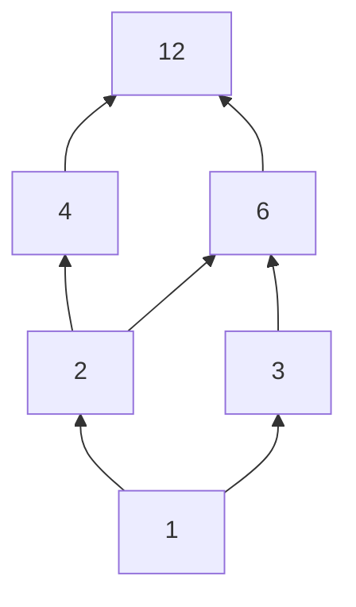

# Orders: rankings where some pairs may be incomparable, drawn as a Hasse diagram

[Syllabus](../../../SYLLABUS.md) → [Foundations](../../../SYLLABUS.md#w01) → [Relations and Functions](../../../SYLLABUS.md#w01-s08) → Partial and total orders

---

## General Overview

Twelve people, split into equal teams with nobody left over. The sizes that work are the six divisors of 12: 1, 2, 3, 4, 6, 12. Say **a divides b** when b splits into whole a's — 2 divides 12, because 12 is six 2s. 5 does not.

Stack those six by "divides": 2 divides 4, and 4 divides 12, a run of three. Now ask about 2 and 3. Neither divides the other. Call such a pair **incomparable**. Line the same six up by "less than or equal to" and nothing is left over: one queue, 1 up to 12.

**An order is a rule that passes three tests. Pass a fourth — every pair compares — and it is total as well.**

### The picture: the six divisors of 12, under "divides"



Up the page means "divides into". Only the 7 short steps are drawn; the rest you walk, so 1 to 2 to 4 to 12 says 1 divides 12. That is a **Hasse diagram**. 2 and 3 sit side by side with no upward path either way.

---

## The formula

Three tests, on the six divisors of 12 with "divides" as the rule. Let a, b and c be numbers from the six.

**Reflexive: every number divides itself. Antisymmetric: if a divides b and b divides a, then a and b are the same number. Transitive: if a divides b and b divides c, then a divides c.**

Pass all three and it is a **partial order**; a set with one on it is a **poset**, short for partially ordered set. A fourth test says which kind:

**Comparability: for every a and b, either a divides b or b divides a.**

Divides fails that one at 2 and 3. A rule passing all four is a **total order**; "less than or equal to" on these six is one.

| Piece | Plain meaning | In our example |
| --- | --- | --- |
| a divides b | b divided by a leaves no remainder | 3 divides 12; 3 does not divide 4 |
| a partial order | passes the first three tests | divides: 18 pairs |
| comparable | one of the two is below the other | 2 and 6 yes, 2 and 3 no |
| a total order | every pair compares as well | less than or equal to: 21 pairs |
| a cover | a step up with nothing in between | 2 up to 6, not 1 up to 6 |

---

## Why it works

### The three tests are three things a ranking must not do

Reflexive fills in the easy pairs, so "below or equal to" is one rule, not two. Antisymmetric bans the loop: if 4 were below 6 and 6 below 4, "below" would mean nothing. Transitive bans the gap: 2 below 6 and 6 below 12 must force 2 below 12, or the diagram lies.

Divides passes all three: 12 is one 12; if each of two numbers is a whole number of the other, neither is smaller, so they are equal; 12 is two 6s and 6 is two 3s, so 12 is four 3s.

### Comparability is a fourth demand, and nothing forces it

No test mentions a pair with no link. 2 and 3 have none, and no test complains — a fact about them, not a fault in the rule. Add comparability and the six lie in one queue, as "less than or equal to" does.

### Only the short steps need drawing

A cover is a step with nothing strictly in between. Draw covers only and 7 arrows carry what the 12 different-number pairs say. Put the six self-pairs back, link the arrows over and over — 1 to 2 and 2 to 4 gives 1 to 4 — and all 18 pairs return. The queue is called a **chain**; it takes 5 arrows, each number to the next.

---

## Worked numbers, by hand

| Step | Arithmetic | Value |
| --- | --- | --- |
| pairs where the first divides the second | 6 + 4 + 3 + 2 + 2 + 1 | **18** |
| of those, two different divisors | 18 − 6 | 12 |
| two different divisors in all | 6 × 5 ÷ 2 | 15 |
| pairs that never compare | 15 − 12 | **3** |
| where the first is less than or equal | 6 + 5 + 4 + 3 + 2 + 1 | **21** |

That first count runs down the list: 1 divides 6 of them, 2 divides 4 of them, 3 divides 3, 4 and 6 divide 2 each, 12 divides only itself. The 3 that never compare are 2 and 3, 3 and 4, 4 and 6: why divides has 18 pairs and the queue 21.

### What breaks if you drop a piece

| Mistake | Comes out at | What went wrong |
| --- | --- | --- |
| Drawing every link, not only the covers | 12 arrows, not 7 | The 5 long ones read off as paths |
| Using "divides and is not equal" | 12 pairs, reflexive no | The self-pairs go, so the first test fails |

---

## Code, from first principles, and it actually runs

The six divisors go through the four tests twice: as "divides", then as "less than or equal to". Then the divides order is rebuilt from its 7 covers alone: a second road to the same 18 pairs. A rule with a gap in it fails transitivity.

### Python

```python
# Orders -- the check behind the card.  Nothing is imported.  The six divisors of 12 under "divides",
# and the same six under "less than or equal": three order tests each, then comparability, then covers.
D, NAMES = [1, 2, 3, 4, 6, 12], ["reflexive", "antisymmetric", "transitive", "all pairs compare"]
DIV, LEQ = {(a, b) for a in D for b in D if b % a == 0}, {(a, b) for a in D for b in D if a <= b}
def tests(R):                  # the three order tests, then the extra one that makes it total
    return (all((a, a) in R for a in D), all(a == b for a, b in R if (b, a) in R),
            all((a, c) in R for a, b in R for c in D if (b, c) in R),
            all((a, b) in R or (b, a) in R for a in D for b in D))
def covers(R):                 # a step up with nothing strictly in between: the Hasse edges
    return sorted((a, b) for a, b in R if a != b and not any((a, m) in R and (m, b) in R for m in D if m != a and m != b))
def rebuild(edges):            # the loops, then chain the edges over and over: the second road
    R = {(a, a) for a in D} | set(edges)
    while any((a, c) not in R for a, b in R for x, c in R if b == x):
        R |= {(a, c) for a, b in R for x, c in R if b == x}
    return R
COV, LCOV = covers(DIV), covers(LEQ)
INCOMP = sorted((a, b) for a in D for b in D if a < b and (a, b) not in DIV and (b, a) not in DIV)
STRICT, GAPPY = {(a, b) for a, b in DIV if a != b}, {(a, a) for a in D} | {(1, 2), (2, 4)}   # loops dropped; 1 to 2 and 2 to 4, no 1 to 4
print(f"the six divisors of 12: {', '.join(map(str, D))} -- {len(D) * len(D)} ordered pairs to ask about")
print("divides pairs, counting multiples: " + " + ".join(str(sum(1 for b in D if b % a == 0)) for a in D) + f" = {len(DIV)}")
print("less than or equal pairs:          " + " + ".join(str(sum(1 for b in D if a <= b)) for a in D) + f" = {len(LEQ)}")
print(f"{'test':<20}{'divides':<9}less than or equal")
for n, x, y in zip(NAMES, tests(DIV), tests(LEQ)): print(f"{n:<20}{('yes' if x else 'no'):<9}{'yes' if y else 'no'}")
print(f"incomparable under divides: {', '.join(f'({a}, {b})' for a, b in INCOMP)} -- {len(INCOMP)} of the {len(D) * (len(D) - 1) // 2} pairs")
print(f"Hasse edges: divides {len(COV)} ({', '.join(f'{a}-{b}' for a, b in COV)}), the chain {len(LCOV)}")
print(f"rebuilt from those {len(COV)} edges plus loops: {len(rebuild(COV))} pairs, the same list; strict divides: {len(STRICT)} pairs, reflexive {'yes' if tests(STRICT)[0] else 'no'}")
assert len(DIV) == 18 and len(LEQ) == 21 and len(STRICT) == 12 and INCOMP == [(2, 3), (3, 4), (4, 6)]
assert tests(DIV) == (True, True, True, False) and tests(LEQ) == (True, True, True, True) and not tests(STRICT)[0] and tests(GAPPY) == (True, True, False, False)
assert rebuild(COV) == DIV and COV == [(1, 2), (1, 3), (2, 4), (2, 6), (3, 6), (4, 12), (6, 12)] and LCOV == [(1, 2), (2, 3), (3, 4), (4, 6), (6, 12)]
print("ALL CHECKS PASS")
```

**Ran 2026-09-06 on macOS, Python 3.14.6, standard library only. All checks passed. Output, pasted from the run:**

```
the six divisors of 12: 1, 2, 3, 4, 6, 12 -- 36 ordered pairs to ask about
divides pairs, counting multiples: 6 + 4 + 3 + 2 + 2 + 1 = 18
less than or equal pairs:          6 + 5 + 4 + 3 + 2 + 1 = 21
test                divides  less than or equal
reflexive           yes      yes
antisymmetric       yes      yes
transitive          yes      yes
all pairs compare   no       yes
incomparable under divides: (2, 3), (3, 4), (4, 6) -- 3 of the 15 pairs
Hasse edges: divides 7 (1-2, 1-3, 2-4, 2-6, 3-6, 4-12, 6-12), the chain 5
rebuilt from those 7 edges plus loops: 18 pairs, the same list; strict divides: 12 pairs, reflexive no
ALL CHECKS PASS
```

### Rust

Same numbers, built with `rustc --edition 2021 -O`.

```rust
// Orders -- the same check as partial_and_total_orders_check.py, in Rust.  No crates.  The six divisors of 12 under "divides", and the same six under "less than or equal": three order tests each, then covers.
use std::collections::BTreeSet; type Rel = BTreeSet<(i64, i64)>;
const D: [i64; 6] = [1, 2, 3, 4, 6, 12]; const NAMES: [&str; 4] = ["reflexive", "antisymmetric", "transitive", "all pairs compare"];
fn yn(b: bool) -> &'static str { if b { "yes" } else { "no" } }
fn build(f: fn(i64, i64) -> bool) -> Rel {
    let mut r = Rel::new(); for &a in D.iter() { for &b in D.iter() { if f(a, b) { r.insert((a, b)); } } } r
}
fn tests(r: &Rel) -> [bool; 4] {   // the three order tests, then the extra one that makes it total
    [D.iter().all(|&a| r.contains(&(a, a))), r.iter().all(|&(a, b)| a == b || !r.contains(&(b, a))),
     r.iter().all(|&(a, b)| D.iter().all(|&c| !r.contains(&(b, c)) || r.contains(&(a, c)))),
     D.iter().all(|&a| D.iter().all(|&b| r.contains(&(a, b)) || r.contains(&(b, a))))]
}
fn covers(r: &Rel) -> Vec<(i64, i64)> {   // a step up with nothing strictly in between: the Hasse edges
    r.iter().filter(|&&(a, b)| a != b && !D.iter().any(|&m| m != a && m != b && r.contains(&(a, m)) && r.contains(&(m, b)))).cloned().collect()
}
fn rebuild(edges: &[(i64, i64)]) -> Rel {   // the loops, then chain the edges over and over: the second road
    let mut r: Rel = D.iter().map(|&a| (a, a)).collect(); for &e in edges { r.insert(e); }
    loop { let mut more = r.clone();
        for &(a, b) in r.iter() { for &(x, c) in r.iter() { if b == x { more.insert((a, c)); } } }
        if more == r { return r; } r = more; }
}
fn main() {
    let (div, leq) = (build(|a, b| b % a == 0), build(|a, b| a <= b));
    let (cov, lcov, strict, gappy) = (covers(&div), covers(&leq), div.iter().filter(|&&(a, b)| a != b).cloned().collect::<Rel>(), D.iter().map(|&a| (a, a)).chain([(1, 2), (2, 4)]).collect::<Rel>());   // gappy: 1 to 2 and 2 to 4, no 1 to 4
    let mut incomp: Vec<(i64, i64)> = Vec::new();   for &a in D.iter() { for &b in D.iter() { if a < b && !div.contains(&(a, b)) && !div.contains(&(b, a)) { incomp.push((a, b)); } } }
    let count = |f: fn(i64, i64) -> bool| D.iter().map(|&a| D.iter().filter(|&&b| f(a, b)).count().to_string()).collect::<Vec<String>>().join(" + ");
    let pairs = |v: &[(i64, i64)], sep: &str, br: bool| v.iter().map(|(a, b)| if br { format!("({}{}{})", a, sep, b) } else { format!("{}{}{}", a, sep, b) }).collect::<Vec<String>>().join(", ");
    println!("the six divisors of 12: {} -- {} ordered pairs to ask about", D.iter().map(|x| x.to_string()).collect::<Vec<String>>().join(", "), D.len() * D.len());
    println!("divides pairs, counting multiples: {} = {}", count(|a, b| b % a == 0), div.len());
    println!("less than or equal pairs:          {} = {}", count(|a, b| a <= b), leq.len());
    let (td, tl) = (tests(&div), tests(&leq)); println!("{:<20}{:<9}{}", "test", "divides", "less than or equal");
    for i in 0..4 { println!("{:<20}{:<9}{}", NAMES[i], yn(td[i]), yn(tl[i])); }
    println!("incomparable under divides: {} -- {} of the {} pairs", pairs(&incomp, ", ", true), incomp.len(), D.len() * (D.len() - 1) / 2);
    println!("Hasse edges: divides {} ({}), the chain {}", cov.len(), pairs(&cov, "-", false), lcov.len());
    println!("rebuilt from those {} edges plus loops: {} pairs, the same list; strict divides: {} pairs, reflexive {}", cov.len(), rebuild(&cov).len(), strict.len(), yn(tests(&strict)[0]));
    assert!(div.len() == 18 && leq.len() == 21 && strict.len() == 12 && incomp == [(2, 3), (3, 4), (4, 6)]);
    assert!(td == [true, true, true, false] && tl == [true, true, true, true] && !tests(&strict)[0] && tests(&gappy) == [true, true, false, false]);
    assert!(rebuild(&cov) == div && cov == [(1, 2), (1, 3), (2, 4), (2, 6), (3, 6), (4, 12), (6, 12)] && lcov == [(1, 2), (2, 3), (3, 4), (4, 6), (6, 12)]);
    println!("ALL CHECKS PASS");
}
```

**Ran 2026-09-06 on macOS, rustc 1.98.1, no crates. All checks passed. Output, pasted from the run:**

```
the six divisors of 12: 1, 2, 3, 4, 6, 12 -- 36 ordered pairs to ask about
divides pairs, counting multiples: 6 + 4 + 3 + 2 + 2 + 1 = 18
less than or equal pairs:          6 + 5 + 4 + 3 + 2 + 1 = 21
test                divides  less than or equal
reflexive           yes      yes
antisymmetric       yes      yes
transitive          yes      yes
all pairs compare   no       yes
incomparable under divides: (2, 3), (3, 4), (4, 6) -- 3 of the 15 pairs
Hasse edges: divides 7 (1-2, 1-3, 2-4, 2-6, 3-6, 4-12, 6-12), the chain 5
rebuilt from those 7 edges plus loops: 18 pairs, the same list; strict divides: 12 pairs, reflexive no
ALL CHECKS PASS
```

> [!TIP]
> **Try changing**
> Guess first, then run it. The asserts are pinned to these numbers, so expect one to fire.
> - **Swap 12 for 8.** Use 1, 2, 4, 8: divides passes all four tests — the divisors of 8 stack in one queue, nothing incomparable.
> - **Add 5.** Divides gains 5 with itself and 1 with 5. 5 shares nothing with 2, 3, 4, 6 or 12, so pairs that never compare go from 3 to 8.

---

## The usual mistake

> [!warning]
> **Reading "incomparable" as "tied".** 2 and 3 are not equal, not level. The rule says nothing about them. A tie would need 2 to divide 3 and 3 to divide 2, and antisymmetry would make them the same number.
>
> - Assuming every order is a queue. Divides passes all three tests and is no queue: 3 of the 15 pairs never compare.
> - Reading a missing arrow as "unrelated". 2 and 3 share 1 below and 6 above, on different branches.

---

## Where you meet it in real life

- **Build tools.** In `make`, some tasks must come before others; the rest run in any order. Flattening that partial order into one list is a topological sort.
- **Version history.** In git, "is an ancestor of" passes the three tests. Two branch tips are incomparable; that is when a merge is needed.
- **Sorting.** A sort needs a total order: a comparison must answer for every pair. Reflexive, antisymmetric and transitive are three of the four tests in [Relations](01-relations.md); an order swaps out symmetric.

> **Say it back**
> An order is a rule passing three tests: everything is below or equal to itself, two things below each other are the same thing, below-then-below means below. The six divisors of 12 under "divides" pass all three, 18 pairs — but 3 of the 15 pairs never compare, so it is partial and not total. The same six under "less than or equal to" make one queue, 21 pairs. Draw only the covers and you have a Hasse diagram: 7 arrows that, with the six self-pairs, rebuild all 18.

---

## What this builds on

- [Equivalence relations and partitions](06-equivalence-relations-and-partitions.md): reflexive, symmetric and transitive is a sameness rule cutting a set into blocks. Swap symmetric for antisymmetric and it ranks instead.
- [The number line and inequalities](../02-The%20Number%20Line/02-number-line-and-inequalities.md): "less than or equal to" on the number line, the total order everything else is judged against.

## Where this goes next

- [Boolean algebra](../../03-Algebra/10-For%20the%20Curious/05-boolean-algebra-and-lattices.md): given two incomparable things, is there a nearest thing above both, and a nearest below? Lattices answer that.

---

## Sources

Verified 6 Sep 2026; every link resolves.

- Hammack, Richard. *Book of Proof*, 3rd ed., 2018. [Book page](https://richardhammack.github.io/BookOfProof/). Chapter 11, partial orders and divisibility.
- Velleman, Daniel J. *How to Prove It*, 3rd ed. Cambridge University Press, 2019. [doi:10.1017/9781108539890](https://doi.org/10.1017/9781108539890). Chapter 4, partial against total.
- Davey, B. A., and H. A. Priestley. *Introduction to Lattices and Order*, 2nd ed. Cambridge University Press, 2002. [doi:10.1017/CBO9780511809088](https://doi.org/10.1017/CBO9780511809088). Chapter 1, covers and Hasse diagrams.
