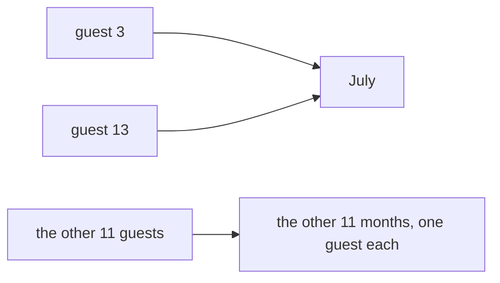

# Pigeonhole: more pigeons than holes means some hole holds two

[Syllabus](../../../SYLLABUS.md) → [Foundations](../README.md) → [Relations and Functions](../README.md#s08) → Pigeonhole

---

## General Overview

Thirteen people sit down to dinner. Nobody has mentioned birthdays.

Two of them were born in the same month. That is settled before anyone is asked.

Twelve months. Give every month one guest and you have placed twelve. The thirteenth has to stand somewhere, and every month is taken.

That is the argument, all of it. It has a name because it works on anything sortable into labelled boxes. The things placed are **pigeons**, the labels they land in **holes**. Here: guests, and months. Older books call it Dirichlet’s box, or drawer, principle.

Same move, other holes: the sentence below runs to 27 words, and there are 26 letters. Two words start with the same letter.

**More pigeons than holes, and some hole holds two — for any placing at all, without looking at it.**

### The picture: thirteen guests, twelve months



Guests 3 and 13 both land on July; the other 11 take the other 11 months, one apiece — the thinnest spread available, and a month still holds two.

---

## The formula

The statement is the arithmetic, on the dinner:

**12 months × 1 guest each = 12 guests, and 13 guests turned up.**

**Read it aloud:** twelve months, filled as thinly as anyone could, hold twelve people; the thirteenth has nowhere empty to stand.

| Piece | Plain meaning | In our example |
| --- | --- | --- |
| the pigeons | the things being placed | the 13 guests |
| the holes | the labels they land in | the 12 months |
| the placing | each pigeon lands in exactly one hole | each guest has one birth month |
| one to a hole | the most the holes take, nothing shared | 12 guests |
| the principle | more pigeons than holes forces a share | 13 beats 12 |

Same line, the sentence: 26 letters × 1 word each = 26 words, and there are 27.

**More than one round.** Twenty-five guests, the same twelve months: give every month two and you have placed 24, so some month holds three. Each further round of the holes drives the fullest one deeper. Spread them evenly and that is exactly how deep it gets.

---

## Why it works

### Fill every hole once and stop

Deal the guests out one to a month, refusing to double up. January to December: twelve placed, a thirteenth guest still in your hand. Order did not matter, nor did who the guests were. Twelve is the ceiling on a no-sharing placing, and thirteen is above it.

### The version that is a proof

Turn it round and it is proof by contradiction — [Proof by contradiction](../06-Proof/03-proof-by-contradiction.md).

Suppose no month holds two. Then every month holds one guest or none, so twelve months hold at most 12 guests. But 13 sat down. The supposition fits 13 people into 12 places, which is false — so the supposition is false, and some month holds two.

That is the form to write down: it takes any numbers, and never asks which month.

### Said as a function

Sending each guest to their birth month is a function — one output for every input, [Functions](02-functions.md). Thirteen inputs, twelve outputs.

One-to-one means no output takes two inputs — [One-to-one and onto](04-injective-surjective-bijective.md). Here it is unavailable: **from a bigger finite set into a smaller one, no function is one-to-one.** Two inputs must share an output.

---

## Worked numbers, by hand

| Step | Arithmetic | Value |
| --- | --- | --- |
| guests, then months | 13 pigeons, 12 holes | 13 and 12 |
| the most that fit, nothing shared | 12 × 1 | 12 |
| guests left over | 13 − 12 | **1** |
| months holding two, in the code | July only | **1** |
| twenty-five guests, twelve months | 12 × 2 = 24, and 25 turned up | **3 in some month** |
| words, then letters to start them | 27 pigeons, 26 holes | 27 and 26 |
| words left over | 27 − 26 | **1** |

One over the ceiling is enough. Two guests share a month, two words share a first letter, and no birthday was asked, no word read.

### What breaks if you drop a piece

| Mistake | Comes out at | What went wrong |
| --- | --- | --- |
| Twelve guests, not thirteen | fullest month holds 1 | Equal counts force nothing |
| Naming July in advance | shift every birthday on a month: August | The principle names no hole |
| Reading it as "every month holds two" | 1 month of 12 holds two, 11 hold one | One crowded hole is the promise |

The code prints the first two as `breaks:` lines; the third is the months-holding-two count above.

---

## Code, from first principles, and it actually runs

Nothing is imported. Each placing is read two ways: walk the list and stop at the first label used twice, then count what landed in each hole. A repeat found one way has to show up as a crowded hole the other way, or the code stops.

### Python

```python
# Pigeonhole -- the check behind the card.  Nothing is imported.  Thirteen guests
# at a dinner and the twelve months, then a sentence of 27 words and the 26 letters.
# Route 1 walks the list and catches the repeat; route 2 counts what each hole holds.
MONTHS = ["January", "February", "March", "April", "May", "June", "July", "August", "September", "October", "November", "December"]
LETTERS = list("abcdefghijklmnopqrstuvwxyz")
BORN = ["March", "November", "July", "January", "September", "December", "April", "June", "February", "August", "May", "October", "July"]
SENTENCE = "Every guest brought a dish, and dinner ran late, so nobody counted the months until Priya asked, quietly, whether any two of us shared a birthday month"
INITIALS, LATER = [w[0].lower() for w in SENTENCE.split()], [MONTHS[(MONTHS.index(m) + 1) % 12] for m in BORN]
def first_repeat(labels):                       # route 1: stop at the first hole used twice
    seen = {}
    for i, lab in enumerate(labels):
        if seen.setdefault(lab, i) != i: return seen[lab] + 1, i + 1, lab
    return None
def loads(labels, holes): return [labels.count(h) for h in holes]      # route 2: how many landed in each hole
def show(what, labels, holes, one, many, holes_name):
    rep, n = first_repeat(labels), loads(labels, holes)
    assert (rep is None) == (max(n) <= 1)       # the two routes agree, every time
    print(f"{what}: {len(labels)} {many} into {len(holes)} {holes_name} -- {len(labels) - len(holes)} more than there are {holes_name}")
    print(f"  the forced repeat: {one} {rep[0]} and {one} {rep[1]}, both {rep[2]}" if rep else f"  no repeat forced, the fullest hole holds {max(n)}")
    print(f"  {holes_name} holding two or more: {sum(1 for x in n if x > 1)}, holding one: {n.count(1)}, holding none: {n.count(0)}")
    print(f"  with no sharing: {len(holes)} {holes_name} hold {len(holes)} {many} at most, and {len(labels)} {many} do not fit")
    return rep, n
rep_m, n_m = show("the dinner", BORN, MONTHS, "guest", "guests", "months")
rep_w, n_w = show("the sentence", INITIALS, LETTERS, "word", "words", "letters")
assert rep_m == (3, 13, "July") and n_m.count(1) == 11 and n_m.count(0) == 0
assert rep_w == (4, 6, "a") and max(n_w) == 5 and len(INITIALS) == 27
print(f"breaks: the first 12 guests into 12 months -- no repeat forced, fullest month holds {max(loads(BORN[:12], MONTHS))}")
print(f"breaks: every guest born a month later -- the repeat moves to {first_repeat(LATER)[2]}, still {max(loads(LATER, MONTHS))} guests")
assert first_repeat(BORN[:12]) is None and max(loads(BORN[:12], MONTHS)) == 1 and first_repeat(LATER)[2] == "August"
print("ALL CHECKS PASS")
```

**Ran 2026-09-06 on macOS, Python 3.14.6, standard library only. All checks passed. Output, pasted from the run:**

```
the dinner: 13 guests into 12 months -- 1 more than there are months
  the forced repeat: guest 3 and guest 13, both July
  months holding two or more: 1, holding one: 11, holding none: 0
  with no sharing: 12 months hold 12 guests at most, and 13 guests do not fit
the sentence: 27 words into 26 letters -- 1 more than there are letters
  the forced repeat: word 4 and word 6, both a
  letters holding two or more: 7, holding one: 10, holding none: 9
  with no sharing: 26 letters hold 26 words at most, and 27 words do not fit
breaks: the first 12 guests into 12 months -- no repeat forced, fullest month holds 1
breaks: every guest born a month later -- the repeat moves to August, still 2 guests
ALL CHECKS PASS
```

### Rust

Same numbers, same labels, via `rustc --edition 2021 -O`.

```rust
// Pigeonhole -- the same check as the Python, in Rust.  No crates.  Thirteen guests
// at a dinner and the twelve months, then a sentence of 27 words and the 26 letters.
// Route 1 walks the list and catches the repeat; route 2 counts what each hole holds.
fn first_repeat(labels: &[String]) -> Option<(usize, usize, String)> {   // route 1: the first hole used twice
    for j in 0..labels.len() {
        for i in 0..j { if labels[i] == labels[j] { return Some((i + 1, j + 1, labels[j].clone())); } }
    }
    None
}
fn loads(labels: &[String], holes: &[String]) -> Vec<usize> {            // route 2: how many landed in each hole
    holes.iter().map(|h| labels.iter().filter(|l| l == &h).count()).collect()
}
fn show(what: &str, labels: &[String], holes: &[String], one: &str, many: &str, holes_name: &str) -> (Option<(usize, usize, String)>, Vec<usize>) {
    let (rep, n) = (first_repeat(labels), loads(labels, holes));
    assert_eq!(rep.is_none(), *n.iter().max().unwrap() <= 1);            // the two routes agree, every time
    println!("{}: {} {} into {} {} -- {} more than there are {}", what, labels.len(), many, holes.len(), holes_name, labels.len() - holes.len(), holes_name);
    match &rep { Some(r) => println!("  the forced repeat: {} {} and {} {}, both {}", one, r.0, one, r.1, r.2),
                 None => println!("  no repeat forced, the fullest hole holds {}", n.iter().max().unwrap()) }
    println!("  {} holding two or more: {}, holding one: {}, holding none: {}", holes_name,
             n.iter().filter(|&&x| x > 1).count(), n.iter().filter(|&&x| x == 1).count(), n.iter().filter(|&&x| x == 0).count());
    println!("  with no sharing: {} {} hold {} {} at most, and {} {} do not fit", holes.len(), holes_name, holes.len(), many, labels.len(), many);
    (rep, n)
}
fn main() {
    let months: Vec<String> = ["January", "February", "March", "April", "May", "June", "July", "August", "September", "October", "November", "December"].iter().map(|s| s.to_string()).collect();
    let letters: Vec<String> = "abcdefghijklmnopqrstuvwxyz".chars().map(|c| c.to_string()).collect();
    let born: Vec<String> = ["March", "November", "July", "January", "September", "December", "April", "June", "February", "August", "May", "October", "July"].iter().map(|s| s.to_string()).collect();
    let sentence = "Every guest brought a dish, and dinner ran late, so nobody counted the months until Priya asked, quietly, whether any two of us shared a birthday month";
    let initials: Vec<String> = sentence.split_whitespace().map(|w| w[..1].to_lowercase()).collect();
    let later: Vec<String> = born.iter().map(|m| months[(months.iter().position(|x| x == m).unwrap() + 1) % 12].clone()).collect();
    let first12: Vec<String> = born[..12].to_vec();
    let (rep_m, n_m) = show("the dinner", &born, &months, "guest", "guests", "months");
    let (rep_w, n_w) = show("the sentence", &initials, &letters, "word", "words", "letters");
    assert!(rep_m == Some((3, 13, "July".to_string())) && n_m.iter().filter(|&&x| x == 1).count() == 11 && n_m.iter().filter(|&&x| x == 0).count() == 0);
    assert!(rep_w == Some((4, 6, "a".to_string())) && *n_w.iter().max().unwrap() == 5 && initials.len() == 27);
    println!("breaks: the first 12 guests into 12 months -- no repeat forced, fullest month holds {}", loads(&first12, &months).iter().max().unwrap());
    println!("breaks: every guest born a month later -- the repeat moves to {}, still {} guests", first_repeat(&later).unwrap().2, loads(&later, &months).iter().max().unwrap());
    assert!(first_repeat(&first12).is_none() && *loads(&first12, &months).iter().max().unwrap() == 1 && first_repeat(&later).unwrap().2 == "August");
    println!("ALL CHECKS PASS");
}
```

**Ran 2026-09-06 on macOS, rustc 1.98.1, no crates. All checks passed. Output, pasted from the run:**

```
the dinner: 13 guests into 12 months -- 1 more than there are months
  the forced repeat: guest 3 and guest 13, both July
  months holding two or more: 1, holding one: 11, holding none: 0
  with no sharing: 12 months hold 12 guests at most, and 13 guests do not fit
the sentence: 27 words into 26 letters -- 1 more than there are letters
  the forced repeat: word 4 and word 6, both a
  letters holding two or more: 7, holding one: 10, holding none: 9
  with no sharing: 26 letters hold 26 words at most, and 27 words do not fit
breaks: the first 12 guests into 12 months -- no repeat forced, fullest month holds 1
breaks: every guest born a month later -- the repeat moves to August, still 2 guests
ALL CHECKS PASS
```

The two outputs match line for line: whole counts, nothing to round.

> [!TIP]
> **Try changing**
> Guess first, then run it. The asserts are pinned to the dinner, so expect one to fire.
> - **Send a guest home.** Cut the last name off `BORN`: 12 guests, 12 months. The routes agree still, the run says the fullest hole holds 1 — nothing is forced — and then the pinned assert fires.
> - **Invent a thirteenth month.** Add one to `MONTHS`. July still holds two, because these guests happen to collide — but 13 into 13 no longer makes it certain, and that gap is the card.

---

## The usual mistake

> [!warning]
> **Reading it as "probably".** It is not a likelihood. Thirteen guests do not *tend* to share a birth month; two of them do, in every arrangement of thirteen people into twelve months. How birthdays cluster in the world is not used.
>
> - Expecting it to name the hole. It says a month holds two, never which. Shift every birthday on a month: the shared one moves to August.
> - Reading "some hole holds two" as "the holes are crowded". At the dinner, 1 month of 12 holds two and 11 hold one.
> - Counting the labels used, not the labels available. There are 26 letters whether or not a word starts with one, and only 17 do here. The 26 you know before reading; the 17 only after.

---

## Where you meet it in real life

- **Hash tables and file fingerprints.** More possible inputs than slots, so some two inputs share a slot. More keys than slots and a real collision is forced. Collision handling there is arithmetic, not caution.
- **Timetables and rotas.** Thirteen sessions, twelve rooms, one hour: something is double-booked, before anyone opens the spreadsheet.
- **Compression.** No scheme shrinks every file: fewer short outputs than long inputs is the dinner's shortage, one-to-one refused.

> **Say it back**
> Thirteen guests, twelve months. Fill each month once, twelve placed, and the thirteenth shares. That is the pigeonhole principle: more pigeons than holes, and some hole holds two, whatever the placing. As a proof it is a contradiction: if no month held two, 13 would fit into 12 places. As a function: no rule from a bigger finite set into a smaller one is one-to-one. It promises a shared hole exists, never which.

---

## What this builds on

- [One-to-one and onto](04-injective-surjective-bijective.md): one-to-one means no output takes two inputs. Here it becomes impossible, on sizes alone.
- [Proof by contradiction](../06-Proof/03-proof-by-contradiction.md): suppose the opposite and count. Denying the shared month is what fits 13 people into 12 places.

## Where this goes next

Nothing on this shelf follows it: pigeonhole closes Relations and Functions.

Finiteness is the whole condition. Double every whole number and you land in the even numbers — half of them, seemingly, and still nothing doubles up. That is what infinite means: [Same size means pairable](../09-Sizes%20of%20Infinity/01-same-size-by-pairing.md). Push the counting further and you get Ramsey theory, where enough pigeons force a whole pattern, not just a shared hole.

---

## Sources

Verified 6 Sep 2026; every link resolves.

- Hammack, Richard. *Book of Proof*, 3rd ed., 2018. [Book page](https://richardhammack.github.io/BookOfProof/). One-to-one, and the counting that breaks it.
- Rosen, Kenneth H. *Discrete Mathematics and Its Applications*, 8th ed. McGraw Hill. [Publisher page](https://www.mheducation.com/highered/product/discrete-mathematics-applications-rosen/M9781259676512.html). Section 6.2, the standard statement.
- Aigner, Martin, and Günter M. Ziegler. *Proofs from THE BOOK*, 6th ed. Springer, 2018. [doi:10.1007/978-3-662-57265-8](https://doi.org/10.1007/978-3-662-57265-8). Chapter 27, what it proves once aimed properly.
