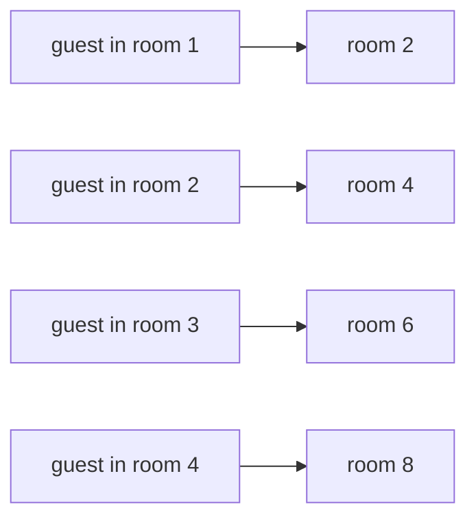

# Same size means pairable: comparing sets without counting

Foundations → Sizes of Infinity → Pairing → Same size means pairable

---

## General Overview

A hotel has a room for every counting number: room 1, room 2, room 3, on forever, no last room. Tonight every room is full.

A guest arrives with no booking. The clerk asks everyone to move up one: room 1 to room 2, room 2 to room 3, on down the corridor. Nobody is turned out, room 1 is empty, and the new guest checks in.

Then the strange part. The clerk could instead have sent everyone to an even-numbered room — room 1 to room 2, room 2 to room 4, room 3 to room 6 — and every guest would still be alone in a room, every odd room empty. The even rooms alone hold the whole hotel.

A hotel with 8 rooms can do neither.

**Two collections are the same size when you can pair them off with nothing left over on either side — no counting involved.**

### The picture: every guest into an even room



Four arrows shown; the corridor goes on forever the same way. Every arrow lands somewhere different, and every even room gets one.

---

## The formula

The pairing is the statement:

**room 1 → room 2, room 2 → room 4, room 3 → room 6, and so on**

Write **n** for a room number, any counting number:

**guest in room n → room 2n**

**Read it aloud:** double the room number, and that is where that guest goes.

It is a real pairing — a **bijection** — exactly when it passes both tests from [injective-surjective-bijective](../08-Relations%20and%20Functions/04-injective-surjective-bijective.md).

| Piece | Plain meaning | In our example |
| --- | --- | --- |
| n | a room number | 1 to 8 shown |
| room n → room 2n | the pairing rule | room 3 to room 6 |
| one-to-one | no two guests in one room | 8 guests, 8 rooms |
| onto | no target room left empty | every even room up to 16 is used |
| bijection | one-to-one and onto at once | the doubling rule |

From here on the hotel is just the picture. **Bijection** does the work; **set** is the plain word for a collection taken together; **cardinality** is the word for the size two paired sets share.

---

## Why it works

### Step 0: counting is pairing underneath

A shepherd with no words for numbers drops a pebble in a bag as each sheep leaves, and takes one out as each returns. Empty bag, all home. He never counted; he paired. Pairing does not care how big the sets are.

### Step 1: the full hotel takes one more

Everyone moves up one: room n to room n+1. Different rooms give different next rooms, so nobody collides; every room from 2 on is somebody's next room, so no target room is left empty. Across the first 8 rooms the guests land in rooms 2 through 9; room 1 receives nobody. The hotel is now paired with the hotel minus room 1: same size.

### Step 2: the even rooms alone hold everybody

Now doubling: room n to room 2n. One-to-one, because doubling two different numbers gives two different answers. Onto, because you can name any even room, halve it, and have the guest in it: room 16 holds the guest from room 8.

Both tests pass, so this is a bijection. **The even numbers are the same size as all the counting numbers, with half of them apparently missing.** The code checks this a second way: it lists the even rooms up to 16 without doubling and gets the same 8.

### Step 3: a finite hotel cannot do either

8 rooms, 8 guests. Move everyone up one and the guest from room 8 has no room 9: 7 housed, 1 outside. Even rooms only leaves rooms 2, 4, 6, 8: 4 housed, 4 outside.

Turn that around and you have Dedekind's test: with the usual set-theory assumptions ([axiom-of-choice](05-axiom-of-choice.md)), a set is infinite exactly when it pairs with a part of itself that leaves something out. Infinite does not mean enormous. It means pairable with a piece of yourself. Same size then behaves like equality — reflexive, symmetric, transitive: [equivalence-relations-and-partitions](../08-Relations%20and%20Functions/06-equivalence-relations-and-partitions.md).

---

## Worked numbers, by hand

| Step | Arithmetic | Value |
| --- | --- | --- |
| everyone up one, room 1 freed | 1+1, on to 8+1 | rooms 2 to 9 |
| every guest doubled | 1 × 2, on to 8 × 2 | 2, 4, 6, 8, 10, 12, 14, 16 |
| those even rooms, counted | count them | **8** |

Eight guests, eight even rooms, nobody sharing.

### What breaks if you drop a piece

| Mistake | Comes out at | What went wrong |
| --- | --- | --- |
| Moving up one, hotel of 8 rooms | 7 of 8 housed | There is no room 9 |
| Even rooms only, same hotel | 4 of 8 housed | Half of 8 rooms is 4 rooms |

---

## Code, from first principles, and it actually runs

Nothing is imported. Both pairings run forwards on the first 8 rooms, then backwards, then cross-check against the even rooms listed with no doubling. The finite hotel of 8 rooms fails both.

### Python

```python
# Same size means pairable -- the check behind the card.  Nothing is imported.
# The hotel has a room for every counting number and every room is full; the
# first 8 rooms are shown.  Two pairings, each read forwards and then backwards,
# and a finite hotel of 8 rooms that manages neither.
N = 8
guests = list(range(1, N + 1))
shift = [n + 1 for n in guests]                            # a new guest: everyone moves up one
even = [2 * n for n in guests]                             # every guest into an even room
back = [r // 2 for r in even]                              # the same pairing, read backwards
listed = [r for r in range(1, 2 * N + 1) if r % 2 == 0]    # the even rooms, listed straight
small = list(range(1, N + 1))                              # the finite hotel: 8 rooms and no more
housed = len([n for n in small if n + 1 in small])
small_even = [r for r in small if r % 2 == 0]
def row(name, values):
    print(f"{name}: " + ", ".join(str(v) for v in values))
row("the hotel, rooms 1 to 8 shown, every room full", guests)
row("a new guest: everyone moves up one, room n to room n+1", shift)
print(f"room 1 is now empty: {len(set(shift))} guests in {len(set(shift))} different rooms, none lost")
row("every guest into an even room, room n to room 2n", even)
row("the same pairing backwards, each even room halved", back)
row("the even rooms up to 16, listed straight", listed)
print(f"that is {len(listed)} even rooms for {len(guests)} guests, nobody doubled up, no even room left empty")
print(f"the endless hotel has room {N + 1}; the finite one stops at {N} -- same {N} guests, different answer")
print(f"finite hotel of 8 rooms: moving up one houses {housed} of {N}, {N - housed} guest left outside")
print(f"finite hotel of 8 rooms: the even rooms are {', '.join(str(r) for r in small_even)} -- {len(small_even)} rooms for {N} guests, {N - len(small_even)} left outside")
assert len(set(shift)) == N and 1 not in shift and sorted(shift) == list(range(2, N + 2))
assert back == guests and even == listed and len(set(even)) == N
assert housed == 7 and small_even == [2, 4, 6, 8] and len(small_even) == 4
print("ALL CHECKS PASS")
```

**Ran 2026-09-06 on macOS, Python 3.14.6, standard library only. All checks passed. Output, pasted from the run:**

```
the hotel, rooms 1 to 8 shown, every room full: 1, 2, 3, 4, 5, 6, 7, 8
a new guest: everyone moves up one, room n to room n+1: 2, 3, 4, 5, 6, 7, 8, 9
room 1 is now empty: 8 guests in 8 different rooms, none lost
every guest into an even room, room n to room 2n: 2, 4, 6, 8, 10, 12, 14, 16
the same pairing backwards, each even room halved: 1, 2, 3, 4, 5, 6, 7, 8
the even rooms up to 16, listed straight: 2, 4, 6, 8, 10, 12, 14, 16
that is 8 even rooms for 8 guests, nobody doubled up, no even room left empty
the endless hotel has room 9; the finite one stops at 8 -- same 8 guests, different answer
finite hotel of 8 rooms: moving up one houses 7 of 8, 1 guest left outside
finite hotel of 8 rooms: the even rooms are 2, 4, 6, 8 -- 4 rooms for 8 guests, 4 left outside
ALL CHECKS PASS
```

### Rust

Same numbers, same labels, built with `rustc --edition 2021 -O`.

```rust
// Same size means pairable -- the same check as same_size_by_pairing_check.py,
// in Rust.  No crates.  The hotel has a room for every counting number and
// every room is full; the first 8 rooms are shown.  Two pairings, each read
// forwards and then backwards, and a finite hotel of 8 rooms that manages
// neither.
const N: i64 = 8;

fn distinct(v: &[i64]) -> usize { let mut s = v.to_vec(); s.sort(); s.dedup(); s.len() }

fn row(name: &str, values: &[i64]) {
    let parts: Vec<String> = values.iter().map(|v| v.to_string()).collect();
    println!("{}: {}", name, parts.join(", "));
}

fn main() {
    let guests: Vec<i64> = (1..=N).collect();
    let shift: Vec<i64> = guests.iter().map(|n| n + 1).collect();          // a new guest: everyone moves up one
    let even: Vec<i64> = guests.iter().map(|n| 2 * n).collect();           // every guest into an even room
    let back: Vec<i64> = even.iter().map(|r| r / 2).collect();             // the same pairing, read backwards
    let listed: Vec<i64> = (1..=2 * N).filter(|r| r % 2 == 0).collect();   // the even rooms, listed straight
    let small: Vec<i64> = (1..=N).collect();                               // the finite hotel: 8 rooms and no more
    let housed = small.iter().filter(|n| small.contains(&(*n + 1))).count() as i64;
    let small_even: Vec<i64> = small.iter().cloned().filter(|r| r % 2 == 0).collect();
    row("the hotel, rooms 1 to 8 shown, every room full", &guests);
    row("a new guest: everyone moves up one, room n to room n+1", &shift);
    println!("room 1 is now empty: {} guests in {} different rooms, none lost", distinct(&shift), distinct(&shift));
    row("every guest into an even room, room n to room 2n", &even);
    row("the same pairing backwards, each even room halved", &back);
    row("the even rooms up to 16, listed straight", &listed);
    println!("that is {} even rooms for {} guests, nobody doubled up, no even room left empty", listed.len(), guests.len());
    println!("the endless hotel has room {}; the finite one stops at {} -- same {} guests, different answer", N + 1, N, N);
    println!("finite hotel of 8 rooms: moving up one houses {} of {}, {} guest left outside", housed, N, N - housed);
    let se: Vec<String> = small_even.iter().map(|r| r.to_string()).collect();
    println!("finite hotel of 8 rooms: the even rooms are {} -- {} rooms for {} guests, {} left outside",
             se.join(", "), small_even.len(), N, N - small_even.len() as i64);
    assert!(distinct(&shift) == N as usize && !shift.contains(&1) && shift == (2..=N + 1).collect::<Vec<i64>>());
    assert!(back == guests && even == listed && distinct(&even) == N as usize);
    assert!(housed == 7 && small_even == [2, 4, 6, 8] && small_even.len() == 4);
    println!("ALL CHECKS PASS");
}
```

**Ran 2026-09-06 on macOS, rustc 1.98.1, no crates. All checks passed. Output, pasted from the run:**

```
the hotel, rooms 1 to 8 shown, every room full: 1, 2, 3, 4, 5, 6, 7, 8
a new guest: everyone moves up one, room n to room n+1: 2, 3, 4, 5, 6, 7, 8, 9
room 1 is now empty: 8 guests in 8 different rooms, none lost
every guest into an even room, room n to room 2n: 2, 4, 6, 8, 10, 12, 14, 16
the same pairing backwards, each even room halved: 1, 2, 3, 4, 5, 6, 7, 8
the even rooms up to 16, listed straight: 2, 4, 6, 8, 10, 12, 14, 16
that is 8 even rooms for 8 guests, nobody doubled up, no even room left empty
the endless hotel has room 9; the finite one stops at 8 -- same 8 guests, different answer
finite hotel of 8 rooms: moving up one houses 7 of 8, 1 guest left outside
finite hotel of 8 rooms: the even rooms are 2, 4, 6, 8 -- 4 rooms for 8 guests, 4 left outside
ALL CHECKS PASS
```

The two outputs match line for line.

> [!TIP]
> **Try changing**
> Guess first, then run it. The asserts are pinned to the hotel above, so expect one to fire.
> - **Three times the room instead of double** — `even = [3 * n for n in guests]`. Nobody shares, but the rooms used are no longer the even rooms, so the second assert fires.
> - **Stand still** — `shift = [n for n in guests]`. The first assert fires: room 1 never empties.
> - **Stop the list one room short** — `listed = [r for r in range(1, 2 * N) if r % 2 == 0]`. The second assert fires: room 16 goes missing.

---

## The usual mistake

> [!warning]
> **Assuming a part must be smaller than the whole.** True in the 8-room hotel: 4 even rooms, 4 of 8 guests housed. False in the endless one. Every guest gets an even room alone, and the doubling never runs out.
>
> - Treating the even rooms as "half". Half of 8 rooms is 4 rooms and 4 guests outside. Half an endless corridor is another endless corridor.
> - Calling a rule a pairing when it passes one test only. Sending every guest to room 2 is onto its one target room, not one-to-one, and proves nothing.
> - Thinking the doubling runs out. There is no last room, so there is no last even room either.

---

## Where you meet it in real life

- **Seats and tickets.** A full theatre needs no headcount. One ticket per seat, none spare, none missing: [functions](../08-Relations%20and%20Functions/02-functions.md) as a measuring tool.
- **Barcodes.** A record for every item and an item for every record is one-to-one and onto: [injective-surjective-bijective](../08-Relations%20and%20Functions/04-injective-surjective-bijective.md). Count one side and you have counted both.
- **Streaming a list.** Anything handed to you one item at a time, forever, is paired with the counting numbers: [countable-sets](02-countable-sets.md).

> **Say it back**
> Two sets are the same size when you can pair them off with nothing left over on either side. No counting, so the test survives sets that never end. Moving everyone up one frees room 1 and loses nobody. Doubling each room number fits the whole hotel into the even rooms, so the even numbers are the same size as the counting numbers. A hotel of 8 rooms can do neither.

---

## What this builds on

- [injective-surjective-bijective](../08-Relations%20and%20Functions/04-injective-surjective-bijective.md): one-to-one, onto, and the word bijection for a rule that is both. This card runs that test where the sets never end.

## Where this goes next

- [countable-sets](02-countable-sets.md): everything that pairs with the counting numbers, fractions included.
- [cantors-diagonal-argument](03-cantors-diagonal-argument.md): a set that cannot be paired with them, however you try.
- [comparing-infinities](04-comparing-infinities.md): fitting both ways means equal, and every set loses to its own power set, from [subsets-and-power-set](../07-Sets/02-subsets-and-power-set.md).
- [axiom-of-choice](05-axiom-of-choice.md): what it takes to make infinitely many picks at once.

---

## Sources

Verified 6 Sep 2026: every link below resolves to the publisher's page.

- Dauben, Joseph W. *Georg Cantor: His Mathematics and Philosophy of the Infinite*. Princeton University Press, 1990. [Publisher page](https://press.princeton.edu/books/paperback/9780691024479/georg-cantor). Where pairing as the test of size came from.
- Halmos, Paul R. *Naive Set Theory*. Springer, 1974. [Publisher page](https://link.springer.com/book/10.1007/978-1-4757-1645-0). The careful version, in two pages.
- Gamow, George. *One Two Three . . . Infinity*. Dover, 1988. [Publisher page](https://store.doverpublications.com/products/9780486256641). The book that put the hotel in front of general readers.
