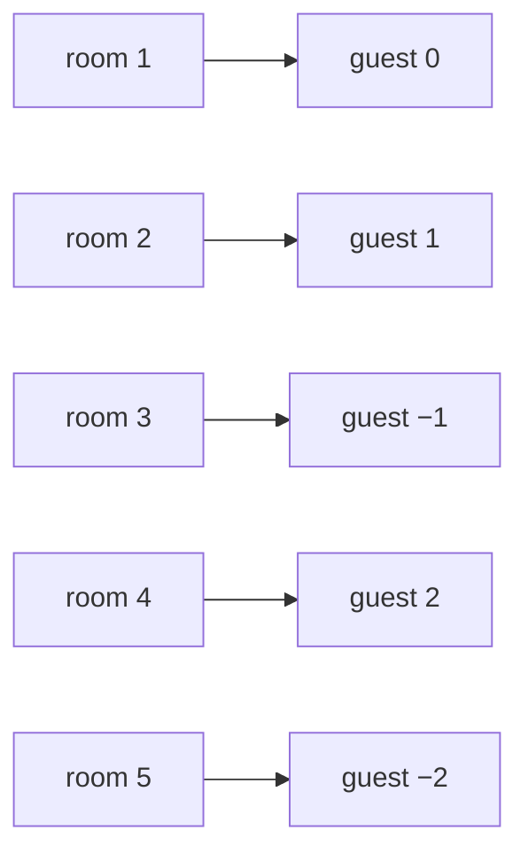

# Countable sets: anything you can put in a queue, fractions included

[Syllabus](../../../SYLLABUS.md) → [Foundations](../../../SYLLABUS.md#w01) → [Sizes of Infinity](../../../SYLLABUS.md#w01-s09) → Countable sets

---

## General Overview

The hotel has a room for every counting number: 1, 2, 3, on forever. Tonight a coach arrives carrying the integers — every whole number, every negative of one, and 0.

The clerk does not count them. He queues them: 0, 1, −1, 2, −2, 3, −3, 4, −4. Zero takes room 1, 1 takes room 2, −1 room 3, 2 room 4. Nobody shares, and no guest has more than finitely many ahead.

Then the fractions arrive, and they look worse: between any two sit more, forever. He houses them anyway: a grid, top number down the side, bottom across, walked along the diagonals, not the rows. 1/2 takes room 3, 2/1 room 4.

**A set is countable when the whole of it fits in one queue — a first, a second, a third — with every member in it once. Finite sets count too; the queue just stops. The interesting case is the one that never does. The integers manage it. So do the fractions.**

### The picture: the coach unloading



Each room, and the integer that walks into it.

---

## The formula

The integers, written out:

**Room 1: 0. Room 2: 1. Room 3: −1. Room 4: 2. Room 5: −2.**

**Read it aloud:** an even room number halved is the guest; an odd one past the first is that room minus 1, halved, made negative.

The fractions, the first ten rooms:

**Room 1: 0. Room 2: 1/1. Room 3: 1/2. Room 4: 2/1. Room 5: 1/3. Room 6: 3/1. Room 7: 1/4. Room 8: 2/3. Room 9: 3/2. Room 10: 4/1.**

**Read it aloud:** 0 goes in room 1; then take the fractions whose top and bottom add to 2, then 3, then 4, and on; inside a batch go by rising top, skip any already queued.

| Piece | Plain meaning | At the hotel |
| --- | --- | --- |
| a queue | a first, a second, a third, forever | rooms 1, 2, 3, ... |
| countable | the whole set fits in one queue | the integers, the fractions |
| the integers | whole numbers, their negatives, and 0 | 0, 1, −1, 2, −2 |
| the grid | tops down the side, bottoms across | row 2, column 1 holds 2/1 |
| a repeat | a fraction already queued, renamed | 2/2 is 1/1 again |

---

## Why it works

### A queue is a pairing

The clerk never counts. He hands out rooms so everyone gets one and no room takes two: a pairing, the whole of "same size" ([Same size means pairable](01-same-size-by-pairing.md)). Room numbers **are** counting numbers, so a queue pairs the set with them. The rule sending guest to room is a function ([Functions](../08-Relations%20and%20Functions/02-functions.md)); one each, none missed, none shared, is a bijection ([One-to-one and onto](../08-Relations%20and%20Functions/04-injective-surjective-bijective.md)).

### The integers bounce out from zero

Walk the number line from the far negative end and you never start: there is no first integer. Bounce out from the middle instead. Then the room can be worked out from the guest — a positive gets its double, so 2 is in room 4; a negative gets 1 minus its double, so −2 is in room 5. Read back that way and the nine guests land in rooms 1 to 9.

### The fractions lie in a grid, and the diagonals cut across it

Tops down the side, bottoms across, so every positive fraction is in there somewhere.

| | 1 | 2 | 3 |
| --- | --- | --- | --- |
| **1** | 1/1 | 1/2 | 1/3 |
| **2** | 2/1 | 2/2 | 2/3 |
| **3** | 3/1 | 3/2 | 3/3 |

Do not read along a row: row 1 alone is 1/1, 1/2, 1/3 and on forever, so 2/1 never gets a room. Read the diagonals instead — cells whose top and bottom add to the same total. That total starts at 2, and each diagonal is short: one finishes, the next starts.

Two repairs make it exact. 0 goes at the front, in room 1. Any cell that is an earlier guest renamed — 2/2 is 1/1, 3/3 is 1/1 — gets skipped. So 1/2 is in room 3 and 2/1 in room 4. Negative fractions fit by the integers' trick, each behind its positive; the code queues 0 and the positives, and the bounce takes the rest.

---

## Worked numbers, by hand

| Guest | How the queue reaches them | Room |
| --- | --- | --- |
| 2 | 2 doubled | 4 |
| −2 | 1 minus 2 times −2 | 5 |
| 1/2 | diagonal adding to 3, first cell | **3** |
| 2/1 | diagonal adding to 3, second cell | **4** |
| 2/3 | diagonal adding to 5, after 1/4 | 8 |

Every guest named gets a room, an ordinary counting number.

### What breaks if you drop a piece

| Mistake | Comes out at | What went wrong |
| --- | --- | --- |
| Walking along a row | 2/1 gets no room | Row 1 alone uses every room |
| Leaving repeats in | 2/2 takes room 6 | 2/2 is 1/1: one guest, two rooms |
| Forgetting the 0 | 1/2 takes room 2 | Every later room shifts down |

The code prints the last two.

---

## Code, from first principles, and it actually runs

Nothing is imported. The integers are queued, then read back guest to room. The fractions are walked off the grid a diagonal at a time, and hcf 1 — top and bottom sharing no factor — is the skip test for renames. Each room is found again by counting the earlier diagonals.

### Python

```python
# Countable sets -- the check behind the card.  Nothing is imported.  The hotel desk
# queues the integers 0, 1, -1, 2, -2, ..., then the positive fractions off the grid of
# top over bottom, walked along the diagonals, repeats skipped.  Rooms found twice over.
def hcf(a, b):                      # highest common factor, by repeated remainders
    while b: a, b = b, a % b
    return a
def guests(rooms):                  # room 1 holds 0, even rooms go up, odd rooms down
    return [0 if r == 1 else r // 2 if r % 2 == 0 else (1 - r) // 2 for r in range(1, rooms + 1)]
def room_of(k):                     # the other way round: the room a given integer gets
    return 1 if k == 0 else 2 * k if k > 0 else 1 - 2 * k
def queue(rooms, skip=True):        # 0 first, then the diagonals, one height at a time
    q = ["0"]
    for height in range(2, rooms + 2):
        q += [f"{t}/{height - t}" for t in range(1, height) if not skip or hcf(t, height - t) == 1]
    return q[:rooms]
def room_by_counting(top, bottom):  # second road: count what the earlier diagonals held
    earlier = sum(1 for h in range(2, top + bottom) for t in range(1, h) if hcf(t, h - t) == 1)
    return 1 + earlier + sum(1 for t in range(1, top + 1) if hcf(t, top + bottom - t) == 1)
ints, fracs, kept, nozero, long = guests(9), queue(10), queue(7, False), queue(4)[1:], queue(60)
print("integer queue, rooms 1 to 9    " + " ".join(str(k) for k in ints))
print("those integers, read back      " + " ".join(str(room_of(k)) for k in ints))
print("grid rows 1 to 3               " + " | ".join(" ".join(f"{t}/{b}" for b in (1, 2, 3)) for t in (1, 2, 3)))
print("fraction queue, rooms 1 to 10  " + " ".join(fracs))
print(f"1/2 is in room {fracs.index('1/2') + 1} and 2/1 in room {fracs.index('2/1') + 1}, both agreed by counting the diagonals")
print(f"repeats left in, 2/2 takes room {kept.index('2/2') + 1}; the 0 dropped, 1/2 takes room {nozero.index('1/2') + 1} and 2/1 room {nozero.index('2/1') + 1}")
print(f"the first 60 rooms hold {len(set(long))} different guests")
assert ints == [0, 1, -1, 2, -2, 3, -3, 4, -4] and [room_of(k) for k in ints] == list(range(1, 10))
assert fracs == ["0", "1/1", "1/2", "2/1", "1/3", "3/1", "1/4", "2/3", "3/2", "4/1"] and kept[5] == "2/2"
assert len(set(long)) == 60 and all(room_by_counting(int(f.split("/")[0]), int(f.split("/")[1])) == i + 1 for i, f in enumerate(long) if i)
print("ALL CHECKS PASS")
```

**Ran 2026-09-06 on macOS, Python 3.14.6, standard library only. All checks passed. Output, pasted from the run:**

```
integer queue, rooms 1 to 9    0 1 -1 2 -2 3 -3 4 -4
those integers, read back      1 2 3 4 5 6 7 8 9
grid rows 1 to 3               1/1 1/2 1/3 | 2/1 2/2 2/3 | 3/1 3/2 3/3
fraction queue, rooms 1 to 10  0 1/1 1/2 2/1 1/3 3/1 1/4 2/3 3/2 4/1
1/2 is in room 3 and 2/1 in room 4, both agreed by counting the diagonals
repeats left in, 2/2 takes room 6; the 0 dropped, 1/2 takes room 2 and 2/1 room 3
the first 60 rooms hold 60 different guests
ALL CHECKS PASS
```

### Rust

Same rows, same labels, built with `rustc --edition 2021 -O`.

```rust
// Countable sets -- the same check as countable_sets_check.py, in Rust.  No crates.  The
// hotel desk queues the integers 0, 1, -1, 2, -2, ..., then the positive fractions off the
// grid of top over bottom, walked along the diagonals, repeats skipped.  Rooms found twice.
use std::collections::HashSet;
fn hcf(mut a: i64, mut b: i64) -> i64 { while b != 0 { let t = a % b; a = b; b = t; } a }
fn guests(n: i64) -> Vec<i64> { (1..=n).map(|r| if r == 1 { 0 } else if r % 2 == 0 { r / 2 } else { (1 - r) / 2 }).collect() }
fn room_of(k: i64) -> i64 { if k == 0 { 1 } else if k > 0 { 2 * k } else { 1 - 2 * k } }
fn queue(rooms: usize, skip: bool) -> Vec<String> {   // 0 first, then the diagonals
    let mut q = vec![String::from("0")];
    for h in 2..rooms + 2 { for t in 1..h { if !skip || hcf(t as i64, (h - t) as i64) == 1 {
        q.push(format!("{}/{}", t, h - t)); } } }
    q.truncate(rooms); q
}
fn room_by_counting(top: i64, bottom: i64) -> i64 {   // second road: count the earlier diagonals
    let mut n = 1;
    for h in 2..top + bottom { for t in 1..h { if hcf(t, h - t) == 1 { n += 1; } } }
    for t in 1..=top { if hcf(t, top + bottom - t) == 1 { n += 1; } }
    n
}
fn at(q: &[String], f: &str) -> usize { q.iter().position(|x| x == f).unwrap() + 1 }
fn main() {
    let (ints, fracs) = (guests(9), queue(10, true));
    let (kept, nozero, long) = (queue(7, false), queue(4, true)[1..].to_vec(), queue(60, true));
    let grid: Vec<String> = (1..4).map(|t| (1..4).map(|b| format!("{}/{}", t, b)).collect::<Vec<_>>().join(" ")).collect();
    let show = |v: &[i64]| v.iter().map(|k| k.to_string()).collect::<Vec<_>>().join(" ");
    println!("integer queue, rooms 1 to 9    {}", show(&ints));
    println!("those integers, read back      {}", show(&ints.iter().map(|k| room_of(*k)).collect::<Vec<_>>()));
    println!("grid rows 1 to 3               {}", grid.join(" | "));
    println!("fraction queue, rooms 1 to 10  {}", fracs.join(" "));
    println!("1/2 is in room {} and 2/1 in room {}, both agreed by counting the diagonals", at(&fracs, "1/2"), at(&fracs, "2/1"));
    println!("repeats left in, 2/2 takes room {}; the 0 dropped, 1/2 takes room {} and 2/1 room {}", at(&kept, "2/2"), at(&nozero, "1/2"), at(&nozero, "2/1"));
    let distinct: HashSet<&String> = long.iter().collect();
    println!("the first 60 rooms hold {} different guests", distinct.len());
    assert!(ints == vec![0, 1, -1, 2, -2, 3, -3, 4, -4] && (1..=9i64).eq(ints.iter().map(|k| room_of(*k))));
    assert!(fracs == vec!["0", "1/1", "1/2", "2/1", "1/3", "3/1", "1/4", "2/3", "3/2", "4/1"] && kept[5] == "2/2");
    assert!(distinct.len() == 60 && long.iter().enumerate().skip(1).all(|(i, f)| { let p: Vec<i64> =
        f.split('/').map(|x| x.parse().unwrap()).collect(); room_by_counting(p[0], p[1]) == i as i64 + 1 }));
    println!("ALL CHECKS PASS");
}
```

**Ran 2026-09-06 on macOS, rustc 1.98.1, no crates. All checks passed. Output, pasted from the run:**

```
integer queue, rooms 1 to 9    0 1 -1 2 -2 3 -3 4 -4
those integers, read back      1 2 3 4 5 6 7 8 9
grid rows 1 to 3               1/1 1/2 1/3 | 2/1 2/2 2/3 | 3/1 3/2 3/3
fraction queue, rooms 1 to 10  0 1/1 1/2 2/1 1/3 3/1 1/4 2/3 3/2 4/1
1/2 is in room 3 and 2/1 in room 4, both agreed by counting the diagonals
repeats left in, 2/2 takes room 6; the 0 dropped, 1/2 takes room 2 and 2/1 room 3
the first 60 rooms hold 60 different guests
ALL CHECKS PASS
```

The two outputs match line for line.

> [!TIP]
> **Try changing**
> Guess first, then run it. The asserts are pinned to the house numbers, so one will fire.
> - **Keep the repeats.** Turn the skip off: 2/2 walks into room 6, but 2/2 is 1/1, who already has room 2 — one guest, two rooms — and the second assert fires.
> - **Drop the 0.** Start at 1/1 and every fraction shifts down one: 1/2 lands in room 2.

---

## The usual mistake

> [!warning]
> **Thinking countable means the counting finishes.** It never finishes. Countable means each member sits at a numbered place in one queue, reached after finitely many others, while the queue runs forever. There is no last room to run out of.
>
> - "There must be more fractions, they are packed in between." Packed close is not more numerous: 1/2 checks in at room 3.
> - "The negatives double the load." The bounce takes them: −2 is in room 5.
> - Reading the grid along a row. 2/1 is never called.
> - Booking the repeats: 2/2 takes room 6, but 1/1 is in room 2.

---

## Where you meet it in real life

- **Anything a program can print.** Every file, every sentence, every program that could be written lines up by length then alphabet.
- **Work that arrives without end.** A log, a sensor feed, a ticket line: first, second, third.
- **Marks on a ruler.** Every point named by a fraction of an inch is countable, however dense the marks. The points no fraction names are the ones no queue reaches: [Cantor's diagonal](03-cantors-diagonal-argument.md).

> **Say it back**
> A set is countable when it fits in one queue: a first, a second, a third, everyone in it once. The integers bounce out from zero, so 2 gets room 4 and −2 room 5. The fractions come off the grid of top over bottom, walked along the diagonals with renamed ones skipped: 1/2 gets room 3, 2/1 room 4. The queue never ends, and never has to: a guest needs a room, not a last room.

---

## What this builds on

- [Same size means pairable](01-same-size-by-pairing.md): same size means pairing off with nothing left over; a queue is that pairing, against the counting numbers.
- [The number families](../02-The%20Number%20Line/01-number-families.md): which numbers are which — here, the integers and the fractions.

## Where this goes next

- [Cantor's diagonal](03-cantors-diagonal-argument.md): the guests who cannot be queued at all. Every list of the real numbers misses one, built out of the list itself.

---

## Sources

Verified 6 Sep 2026; every link resolves.

- Cantor, Georg. "Über eine Eigenschaft des Inbegriffes aller reellen algebraischen Zahlen." *Journal für die reine und angewandte Mathematik* 77 (1874): 258–262. [doi:10.1515/crll.1874.77.258](https://doi.org/10.1515/crll.1874.77.258). Where infinity split into sizes.
- Halmos, Paul R. *Naive Set Theory*. Springer, 1974. [doi:10.1007/978-1-4757-1645-0](https://doi.org/10.1007/978-1-4757-1645-0). Sections 22 and 23.
- Stillwell, John. *The Real Numbers*. Springer, 2013. [doi:10.1007/978-3-319-01577-4](https://doi.org/10.1007/978-3-319-01577-4). The fractions queued, beside the numbers that refuse.
