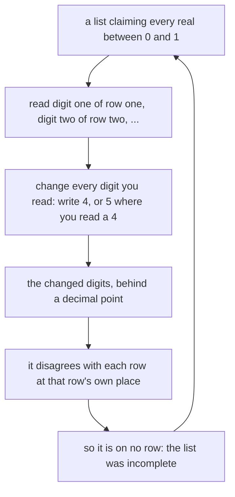

# Cantor's diagonal: the real numbers cannot be listed

Foundations → Sizes of Infinity → Cantor's argument → Cantor's diagonal

---

## General Overview

The hotel has a room for every counting number: room 1, room 2, room 3, on forever. Tonight every real number between 0 and 1 turns up and asks for a room. A real number is an endless string of digits behind a point.

The clerk says the list is complete: nobody left standing. Write it out, one guest's decimals per row.

Read down the diagonal: first digit of the first number, second digit of the second, third of the third. Change every digit you read: write a 4 in its place, or a 5 if the digit you read is a 4. Put a decimal point in front.

That number is not in room 1: it disagrees there in the first place. Not room 2: it disagrees in the second. It disagrees with every room at that room's own place, so it is nobody's.

**Take any list of the reals, change the digits down its diagonal by that rule, and you have built a real the list left out: the reals cannot be queued.** The counting numbers are infinite; the reals are a strictly bigger infinity.

### The picture



Add the guest and renumber: new list, new diagonal.

---

## The formula

The rule is the whole thing:

**go down the diagonal, digit one of row one onward, and write a 4 in each place you read — or a 5, where you read a 4.**

| Piece | Plain meaning | On the hotel list |
| --- | --- | --- |
| a row | one guest's number, as decimals | 0.142857… |
| the diagonal | digit one of row one, digit two of row two, down | read below |
| the new number | the changed digits, behind a point | a string of 4s and 5s |
| uncountable | no queue is long enough | the reals from 0 to 1 |

---

## Why it works

### Step 0: a list is a promise you can check

Countable means the members deal out as row one, row two, row three, everybody reached by counting: the pairing from [same-size-by-pairing](01-same-size-by-pairing.md), a bijection in [injective-surjective-bijective](../08-Relations%20and%20Functions/04-injective-surjective-bijective.md). Take any such list and find a real it left out.

### Step 1: the diagonal beats each row at its own place

Row one gives its first digit, row two its second, row three its third: every row visited at a different place. Change that digit and what you build disagrees with that row there. Digits that disagree almost always mean different numbers — almost, because a few have two spellings. That is why the rule writes 4s and 5s; Step 2 shows the hole they plug. So what you built is no row at all. That is [proof-by-contradiction](../06-Proof/03-proof-by-contradiction.md): assume the list is complete, produce what it missed.

And it is an ordinary real, between 0 and 1. Most reals run on with no pattern: [irrational-numbers](../02-The%20Number%20Line/03-irrational-numbers.md).

### Step 2: the repair the popular version skips

The popular telling says add 1 to every digit, 9 coming round to 0. It leaks. Some numbers have two spellings: 0.4999… and 0.5000… are one number written twice, so different digits need not mean a different number. Give the clerk rows all reading 0.4999… and adding 1 builds 0.50000 — that same number, already listed.

Writing 4s and 5s closes it: never a 0, never a 9, and such a string has one spelling only.

The same move, with no decimals at all, shows any set is smaller than its collection of subsets: [comparing-infinities](04-comparing-infinities.md), on the power set from [subsets-and-power-set](../07-Sets/02-subsets-and-power-set.md).

---

## Worked numbers, by hand

Five guests, five places, one spare digit printed. A corner of an endless list.

| Room | Guest, written out | Diagonal digit |
| --- | --- | --- |
| 1 | 1/7 = 0.142857… | 1 |
| 2 | 1/2 = 0.500000… | 0 |
| 3 | 1/3 = 0.333333… | 3 |
| 4 | 5/9 = 0.555555… | 5 |
| 5 | 1/8 = 0.125000… | 0 |

| Step | Arithmetic | Value |
| --- | --- | --- |
| read the diagonal down | the digit column above | 10350 |
| write 4, or 5 for a 4 | no diagonal digit here is a 4 | **0.44444…** |
| the popular rule, add 1 | every digit up by one | **0.21461…** |
| the rooms, as whole numbers | first five digits, so the code can compare | 14285 50000 33333 55555 12500 |

0.44444… disagrees with room 1 in the first place, room 2 in the second, on down; so does 0.21461… here.

The picture lies in one place: a finite table misses many rows by ordinary counting. The theorem is that an *infinite* table still misses at least one.

### What breaks if you drop a piece

| Mistake | Comes out at | What went wrong |
| --- | --- | --- |
| Copying the diagonal, not changing it | 0.10350 | It agrees with every row it touched |
| Adding 1 across room 1, not down | 0.25396 | Room 1 dodged, the rest untouched |
| Adding 1 on rows all reading 0.4999… | 0.50000 | Same number, other spelling |

---

## Code, from first principles, and it actually runs

Nothing is imported. The decimals come from long division, a digit at a time, greedily: 1/2 reads 500000, never 499999. The diagonal is read a second, independent way — place five worked straight from 1/8, not lifted from the printed row. Both rules are built and checked digit by digit against the rows they must disagree with.

### Python

```python
# Cantor's diagonal -- the check behind the card.  Nothing is imported.  Five
# hotel guests hold five reals between 0 and 1.  Read down the diagonal, write a
# 4 in every place (a 5 where the digit read is a 4), and the number is nobody's.
GUESTS = [(1, 7), (1, 2), (1, 3), (5, 9), (1, 8)]
PLACES = 5
def digits(p, q):                 # long division, greedy: 1/2 -> "500000", never "499999"
    out, left = "", p
    for _ in range(PLACES + 1):
        out += str(left * 10 // q)
        left = left * 10 % q
    return out
def bump(d):                      # add 1 to a digit, 9 goes round to 0
    return str((int(d) + 1) % 10)
rows = [digits(p, q) for p, q in GUESTS]
diagonal = "".join(rows[i][i] for i in range(PLACES))
safer = "".join("5" if d == "4" else "4" for d in diagonal)   # the 4-or-5 rule
built = "".join(bump(d) for d in diagonal)                    # the popular add-1 rule
for i, ((p, q), row) in enumerate(zip(GUESTS, rows)):
    print(f"guest {i + 1}  {p}/{q}  0.{row}   diagonal digit {row[i]}")
print(f"the diagonal reads {diagonal}, the 4-or-5 rule builds 0.{safer}")
print(f"the popular add-1 rule builds 0.{built}")
print(f"as whole numbers {int(built)} is none of " + " ".join(str(int(r[:PLACES])) for r in rows))
across = "".join(bump(d) for d in rows[0][:PLACES])           # bumped row 1, not the diagonal
trap = "".join(bump(d) for d in "49999")                      # a list of 0.4999... rows
print(f"the three mistakes come out at 0.{diagonal}, 0.{across} and 0.{trap}")
assert diagonal == "".join(str((p * 10 ** (i + 1) // q) % 10) for i, (p, q) in enumerate(GUESTS))
assert safer == "44444" and all(safer[i] != rows[i][i] for i in range(PLACES))
assert int(built) == 21461 and all(built[i] != rows[i][i] for i in range(PLACES))
print("ALL CHECKS PASS")
```

**Ran 2026-09-06 on macOS, Python 3.14.6, standard library only. All checks passed. Output, pasted from the run:**

```
guest 1  1/7  0.142857   diagonal digit 1
guest 2  1/2  0.500000   diagonal digit 0
guest 3  1/3  0.333333   diagonal digit 3
guest 4  5/9  0.555555   diagonal digit 5
guest 5  1/8  0.125000   diagonal digit 0
the diagonal reads 10350, the 4-or-5 rule builds 0.44444
the popular add-1 rule builds 0.21461
as whole numbers 21461 is none of 14285 50000 33333 55555 12500
the three mistakes come out at 0.10350, 0.25396 and 0.50000
ALL CHECKS PASS
```

### Rust

Built with `rustc --edition 2021 -O`.

```rust
// Cantor's diagonal -- the same check as the Python twin, in Rust.  No crates.
// Five hotel guests hold five reals between 0 and 1.  Read down the diagonal, write
// a 4 in every place (a 5 where the digit read is a 4), and the number is nobody's.
const GUESTS: [(i64, i64); 5] = [(1, 7), (1, 2), (1, 3), (5, 9), (1, 8)];
const PLACES: usize = 5;
fn digits(p: i64, q: i64) -> String {   // long division, greedy: 1/2 -> "500000", not "499999"
    let (mut out, mut left) = (String::new(), p);
    for _ in 0..(PLACES + 1) { out.push_str(&(left * 10 / q).to_string()); left = left * 10 % q; }
    out
}
fn bump(d: u8) -> char {                   // add 1 to a digit, 9 goes round to 0
    char::from(b'0' + (d - b'0' + 1) % 10)
}
fn bump_all(s: &str) -> String { s.bytes().map(bump).collect() }
fn main() {
    let rows: Vec<String> = GUESTS.iter().map(|&(p, q)| digits(p, q)).collect();
    let diagonal: String = (0..PLACES).map(|i| rows[i].as_bytes()[i] as char).collect();
    let safer: String = diagonal.chars().map(|c| if c == '4' { '5' } else { '4' }).collect();
    let built = bump_all(&diagonal);
    for i in 0..PLACES {
        println!("guest {}  {}/{}  0.{}   diagonal digit {}", i + 1, GUESTS[i].0,
                 GUESTS[i].1, rows[i], rows[i].as_bytes()[i] as char);
    }
    println!("the diagonal reads {}, the 4-or-5 rule builds 0.{}", diagonal, safer);
    println!("the popular add-1 rule builds 0.{}", built);
    let heads: Vec<i64> = rows.iter().map(|r| r[..PLACES].parse::<i64>().unwrap()).collect();
    let whole: i64 = built.parse::<i64>().unwrap();
    let listed: Vec<String> = heads.iter().map(|h| h.to_string()).collect();
    println!("as whole numbers {} is none of {}", whole, listed.join(" "));
    let across = bump_all(&rows[0][..PLACES]);          // bumped row 1, not the diagonal
    let trap = bump_all("49999");                       // a list of 0.4999... rows
    println!("the three mistakes come out at 0.{}, 0.{} and 0.{}", diagonal, across, trap);
    let check: String = GUESTS.iter().enumerate()
        .map(|(i, &(p, q))| ((p * 10_i64.pow(i as u32 + 1) / q) % 10).to_string()).collect();
    assert!(diagonal == check);
    assert!(safer == "44444" && (0..PLACES).all(|i| safer.as_bytes()[i] != rows[i].as_bytes()[i]));
    assert!(whole == 21461 && (0..PLACES).all(|i| built.as_bytes()[i] != rows[i].as_bytes()[i]));
    println!("ALL CHECKS PASS");
}
```

**Ran 2026-09-06 on macOS, rustc 1.98.1, no crates. All checks passed. Output, pasted from the run:**

```
guest 1  1/7  0.142857   diagonal digit 1
guest 2  1/2  0.500000   diagonal digit 0
guest 3  1/3  0.333333   diagonal digit 3
guest 4  5/9  0.555555   diagonal digit 5
guest 5  1/8  0.125000   diagonal digit 0
the diagonal reads 10350, the 4-or-5 rule builds 0.44444
the popular add-1 rule builds 0.21461
as whole numbers 21461 is none of 14285 50000 33333 55555 12500
the three mistakes come out at 0.10350, 0.25396 and 0.50000
ALL CHECKS PASS
```

Whole digits throughout, nothing to round: the outputs match line for line.

> [!TIP]
> **Try changing**
> Guess first, then run it. The asserts are pinned to the hotel numbers, so one will fire.
> - **Subtract 1 instead of adding it**, 0 coming round to 9. The diagonal 10350 gives 0.09249, which escapes every room here — but subtracting puts 9s back and reopens the 0.4999… hole. The assert pinned to 21461 fires.
> - **Swap guest 1 and guest 5.** Same rooms, diagonal 10355, escapee 0.21466. Somebody is left out either way.

---

## The usual mistake

> [!warning]
> **Thinking the fix is to add the missing number to the list.** You can: put it in room 1 and shuffle everyone up. But that list has a new diagonal, which hands you another missing number. The argument is not one number a list forgot; it is a machine that eats any list.
>
> - **"That new number is too weird to be real."** It is an endless string of digits between 0 and 1, like any other real.
> - **"A cleverer list would work."** A list is already the most general way to give one room per counting number.
> - **"Then the fractions are uncountable too."** No, the fractions queue: [countable-sets](02-countable-sets.md).

---

## Where you meet it in real life

- **Software that cannot be written.** No program can decide whether another halts; the proof is this diagonal, run down a list of programs.
- **What a computer can name.** A machine picks from a listable supply of patterns, so the reals it can name are a sliver.
- **The next rung.** Every set is smaller than its collection of subsets, forever: [comparing-infinities](04-comparing-infinities.md).

> **Say it back**
> Someone hands you a list of every real between 0 and 1. Read down the diagonal and change every digit you read: a 4, or a 5 where you read a 4. What you built disagrees with each row at that row's own place, and a string of 4s and 5s has one spelling only, so it is on no row. Every list fails the same way. The reals are uncountable: a strictly bigger infinity than the counting numbers.

---

## What this builds on

- [countable-sets](02-countable-sets.md): what a list of an infinite set is, and that the fractions have one.
- [proof-by-contradiction](../06-Proof/03-proof-by-contradiction.md): assume the list is complete, build the guest it missed.
- [irrational-numbers](../02-The%20Number%20Line/03-irrational-numbers.md): decimals running on with no pattern, as almost every guest is.

## Where this goes next

- [comparing-infinities](04-comparing-infinities.md): fits-both-ways means equal size; every set is smaller than its collection of subsets.

---

## Sources

Verified 6 Sep 2026; every link resolves.

- Cantor, Georg. "Über eine elementare Frage der Mannigfaltigkeitslehre." *Jahresbericht der Deutschen Mathematiker-Vereinigung* 1 (1891): 75-78.
- Abbott, Stephen. *Understanding Analysis*, 2nd ed. Springer, 2015. [doi:10.1007/978-1-4939-2712-8](https://doi.org/10.1007/978-1-4939-2712-8). Section 1.6, the careful diagonal and its two-spellings repair.
- Halmos, Paul R. *Naive Set Theory*. Springer, 1974. [doi:10.1007/978-1-4757-1645-0](https://doi.org/10.1007/978-1-4757-1645-0). The same argument on subsets.
- Stillwell, John. *The Real Numbers: An Introduction to Set Theory and Analysis*. Springer, 2013. [doi:10.1007/978-3-319-01577-4](https://doi.org/10.1007/978-3-319-01577-4). Reals and sizes of infinity together.
