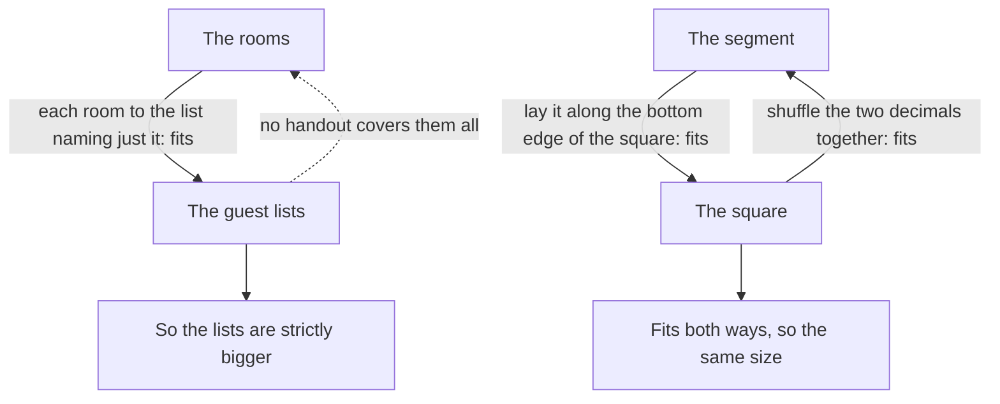

# Comparing infinities: fits-both-ways means equal, and every set is smaller than its power set

[Syllabus](../../../SYLLABUS.md) → [Foundations](../README.md) → [Sizes of Infinity](../README.md#s09) → Comparing infinities

---

## General Overview

The hotel has a room for every counting number: room 1, room 2, room 3, on forever. A tour group hands the desk a **guest list** — which rooms it wants. Any rooms at all: every room, or none.

How many guest lists? More than there are rooms, and not by a little.

Give each room the list naming just that room: different rooms, different lists, so the rooms fit inside the lists. Go the other way and it fails — hand lists out however you like and one is left over. All the lists, gathered, are the **power set** of the rooms: [Subsets and the power set](../07-Sets/02-subsets-and-power-set.md).

When neither side wins, a second tool settles it: if each of two collections fits inside the other, they are the same size — that is **Cantor–Bernstein**.

**Fitting one way says "no bigger". Fitting both ways says "the same size". Nothing fits both ways with its own power set, so there is no biggest infinity.**

### The picture: two comparisons



Solid arrows fit one collection inside another. The dashed arrow is the one that cannot exist.

---

## The formula

Two statements, written out.

**Cantor's theorem, in the hotel: 4 rooms, 16 guest lists. Hand the lists out any way at all, and the list of the rooms left off their own list is never one you handed out.**

**Cantor–Bernstein: the segment fits inside the square and the square inside the segment, so the two hold equally many points.**

| Piece | Plain meaning | In the hotel |
| --- | --- | --- |
| fits inside | each member gets its own slot: one-to-one, [One-to-one and onto](../08-Relations%20and%20Functions/04-injective-surjective-bijective.md) | room 1 to {1}, the list with just room 1 |
| the guest lists | all of them at once: the power set | 16, for 4 rooms |
| the same size | pairable one for one: [Same size means pairable](01-same-size-by-pairing.md) | segment, square |

---

## Why it works

### Step 0: "no bigger" and "the same size" are two questions

Neither side can be counted, so counting is not the test. One collection **fits inside** another when a rule gives each member its own slot, never two to a slot. That says no bigger, and it need not use up the other side.

### Step 1: the rooms fit inside the guest lists

Room 1 to {1}, room 2 to {2}, room 5 to {5}. No slot shared, so the rooms are no bigger.

### Step 2: no handout covers the guest lists

Shrink the hotel to four rooms and hand each room a list, picked at random: room 1 gets {1,2}, room 2 gets {1,3,4}, room 3 gets {} (the list with nobody on it), room 4 gets {2,4}.

Walk the corridor. That walk is the **diagonal**. One question at each door: **is this room on its own list?** Yes, leave it out of the list you are building. No, put it in. The table below builds {2,3}.

Room 1 did not get {2,3}: they disagree about room 1. Room 2 did not: they disagree about room 2. Same at doors 3 and 4 — so the rule beats any handout. The code checks all 65536.

### Step 3: the hotel could have been anything

Step 2 never used the number four, or the order of the rooms. Any collection, any handout of its subsets: the missed list is built the same way. Step 1 generalises too: each member to the list naming just it. So every collection is strictly smaller than its power set — the rooms, the lists of rooms, the lists of lists of rooms, a bigger infinity every time.

### Step 4: fitting both ways means equal

Cantor–Bernstein: two fittings, one each way, sew into a single pairing. No extra assumption is needed — no axiom of choice.

A segment fits inside a square: lay it along the bottom edge. The square fits inside the segment — a square point is two decimals, so shuffle their digits together, first of one, first of the other, and out comes a single decimal. Write each decimal so it never ends in all 9s, and no two collide. So a segment holds as many points as a whole square. Cantor wrote to Dedekind: I see it, but I do not believe it.

<details>
<summary>The question nobody could answer</summary>

The counting numbers are one infinity. Their guest lists are a bigger infinity: the points of the line. Is there a size in between? The guess that there is not is the **continuum hypothesis**. Gödel showed in 1940 that set theory cannot disprove it, Cohen in 1963 that it cannot prove it either.

</details>

---

## Worked numbers, by hand

The four-room hotel, handout from Step 2.

| Step | Answer | Value |
| --- | --- | --- |
| 1 on {1,2}? | yes | out |
| 2 on {1,3,4}? | no | in |
| 3 on {}? | no | in |
| 4 on {2,4}? | yes | out |
| the missed list | those four answers | **{2,3}** |
| handouts that miss | all 65536 of the 65536 | **65536** |
| square points, and their shuffles | 100 × 100, all different | **10000** |

Four rooms cannot cover sixteen lists, and no cleverness closes the gap.

### What breaks if you drop a piece

| Mistake | Comes out at | What went wrong |
| --- | --- | --- |
| Hoping a smarter handout covers every list | 65536 | All 65536 miss their own doors' list |
| Counting one guest list per room | 4 | 4 rooms, 16 lists |
| Calling the square bigger for having two sides | 10000 | Both come out at 10000 |

---

## Code, from first principles, and it actually runs

Nothing is imported. The hotel is worked the plain way, then again over all 65536 handouts. Then the segment and square.

### Python

```python
# Comparing infinities -- the check behind the card.  Nothing is imported.
# Part one: a four-room hotel and its sixteen guest lists.  Part two: the
# points of a segment and of a square, written out to four decimal digits.
ROOMS = [1, 2, 3, 4]
LISTS = [tuple(r for r in ROOMS if n // 2 ** (r - 1) % 2) for n in range(16)]
SAMPLE = {1: (1, 2), 2: (1, 3, 4), 3: (), 4: (2, 4)}
def show(lst): return "{" + ",".join(str(r) for r in lst) + "}"
def diagonal(a): return tuple(r for r in ROOMS if r not in a[r])   # left off its own list
def row(name, value): print(f"{name:<38}{value:>7}")
row("rooms in the hotel", len(ROOMS))
row("possible guest lists, all different", len(set(LISTS)))
row("the sample assignment", " ".join(f"{r}:{show(SAMPLE[r])}" for r in ROOMS))
row("the guest list it misses", show(diagonal(SAMPLE)))
missed = 0
for n in range(16 ** 4):                     # every way to hand one list to each room
    a = {r: LISTS[n // 16 ** (r - 1) % 16] for r in ROOMS}
    missed += diagonal(a) not in a.values()
row("all ways to give one list to each room", 16 ** 4)
row("ways the diagonal list is still missed", missed)
sq = [(a, b) for a in range(100) for b in range(100)]
weave = {p: f"{p[0] // 10}{p[1] // 10}{p[0] % 10}{p[1] % 10}" for p in sq}  # square point to segment point
back = {p: (int(s[0] + s[2]), int(s[1] + s[3])) for p, s in weave.items()}  # and back again
row("square points, two digits per side", len(sq))
row("segment points, four digits", 10 * 10 * 10 * 10)
row("interleave into the segment, distinct", len(set(weave.values())))
row("each point comes back as itself", sum(p == q for p, q in back.items()))
assert diagonal(SAMPLE) == (2, 3) and diagonal(SAMPLE) not in SAMPLE.values()
assert missed == 16 ** 4 and len(set(LISTS)) == 16
assert len(set(weave.values())) == 10000 and all(p == q for p, q in back.items())
print("ALL CHECKS PASS")
```

**Ran 2026-09-06 on macOS, Python 3.14.6, standard library only. All checks passed. Output, pasted from the run:**

```
rooms in the hotel                          4
possible guest lists, all different        16
the sample assignment                 1:{1,2} 2:{1,3,4} 3:{} 4:{2,4}
the guest list it misses                {2,3}
all ways to give one list to each room  65536
ways the diagonal list is still missed  65536
square points, two digits per side      10000
segment points, four digits             10000
interleave into the segment, distinct   10000
each point comes back as itself         10000
ALL CHECKS PASS
```

### Rust

Same numbers, same labels, built with `rustc --edition 2021 -O`.

```rust
// Comparing infinities -- the same check as comparing_infinities_check.py, in Rust.  No crates.
// A four-room hotel and its sixteen guest lists, then a segment and a square to four digits.
use std::collections::{BTreeMap, BTreeSet};
const ROOMS: [usize; 4] = [1, 2, 3, 4];
fn list_of(n: usize) -> Vec<usize> { ROOMS.iter().copied().filter(|&r| n / (1 << (r - 1)) % 2 == 1).collect() }
fn show(l: &[usize]) -> String { format!("{{{}}}", l.iter().map(|r| r.to_string()).collect::<Vec<_>>().join(",")) }
fn diagonal(a: &[Vec<usize>; 4]) -> Vec<usize> { ROOMS.iter().copied().filter(|&r| !a[r - 1].contains(&r)).collect() }
fn unweave(t: &str) -> (usize, usize) { let d: Vec<usize> = t.bytes().map(|c| (c - b'0') as usize).collect(); (d[0] * 10 + d[2], d[1] * 10 + d[3]) }
fn row(name: &str, value: String) { println!("{:<38}{:>7}", name, value); }
fn main() {
    let s: [Vec<usize>; 4] = [vec![1, 2], vec![1, 3, 4], vec![], vec![2, 4]];
    let lists: BTreeSet<Vec<usize>> = (0..16).map(list_of).collect();
    row("rooms in the hotel", ROOMS.len().to_string());
    row("possible guest lists, all different", lists.len().to_string());
    let names: Vec<String> = ROOMS.iter().map(|&r| format!("{}:{}", r, show(&s[r - 1]))).collect();
    row("the sample assignment", names.join(" "));
    row("the guest list it misses", show(&diagonal(&s)));   // the rooms left off their own list
    let mut missed = 0usize;
    for n in 0..65536usize {                                // every way to hand one list to each room
        let a: [Vec<usize>; 4] = [list_of(n % 16), list_of(n / 16 % 16), list_of(n / 256 % 16), list_of(n / 4096 % 16)];
        if !a.iter().any(|l| *l == diagonal(&a)) { missed += 1; }
    }
    row("all ways to give one list to each room", 65536.to_string());
    row("ways the diagonal list is still missed", missed.to_string());
    let (mut sq, mut weave) = (BTreeSet::new(), BTreeMap::new());
    for a in 0..100usize { for b in 0..100usize {
        sq.insert((a, b));
        weave.insert((a, b), format!("{}{}{}{}", a / 10, b / 10, a % 10, b % 10));   // square point to segment point
    } }
    let distinct: BTreeSet<&String> = weave.values().collect();
    let same = weave.iter().filter(|(p, t)| unweave(t) == **p).count();   // and back again
    row("square points, two digits per side", sq.len().to_string());
    row("segment points, four digits", (10 * 10 * 10 * 10).to_string());
    row("interleave into the segment, distinct", distinct.len().to_string());
    row("each point comes back as itself", same.to_string());
    assert!(diagonal(&s) == vec![2, 3] && !s.iter().any(|l| *l == vec![2, 3]));
    assert!(missed == 65536 && lists.len() == 16);
    assert!(distinct.len() == 10000 && same == 10000);
    println!("ALL CHECKS PASS");
}
```

**Ran 2026-09-06 on macOS, rustc 1.98.1, no crates. All checks passed. Output, pasted from the run:**

```
rooms in the hotel                          4
possible guest lists, all different        16
the sample assignment                 1:{1,2} 2:{1,3,4} 3:{} 4:{2,4}
the guest list it misses                {2,3}
all ways to give one list to each room  65536
ways the diagonal list is still missed  65536
square points, two digits per side      10000
segment points, four digits             10000
interleave into the segment, distinct   10000
each point comes back as itself         10000
ALL CHECKS PASS
```

> [!TIP]
> **Try changing**
> Guess first, then run it.
> - **Put room 3 on its own list.** Give room 3 `(3,)` instead of `()`. The missed list loses 3 and becomes {2}, and the first check stops with an error.
> - **Repeat a digit.** End the shuffle with `{p[0] % 10}` twice. Square points collide, the shuffle is not a fitting, and the last check stops with an error.

---

## The usual mistake

> [!warning]
> **Thinking the missed list is a gap you could patch.** People accept that this handout misses {2,3}, then say: fine, give {2,3} to room 1. But that is a new handout, and the rule builds a new missed list.
>
> - Reading "fits inside" as "the same size". One-way fitting rules out bigger, nothing more.
> - Reaching for Cantor–Bernstein with one fitting. Against a power set the second one does not exist.

---

## Where you meet it in real life

- **Programs against jobs.** A program is a finite piece of text, so programs queue up: [Countable sets](02-countable-sets.md). The jobs — a yes-or-no answer per input — are a power set. Most jobs have no program.
- **The real numbers.** The points of a line are the counting numbers' guest lists in decimal dress, which is why they cannot be listed: [Cantor's diagonal](03-cantors-diagonal-argument.md).
- **Dimension is not size.** A one-inch segment has as many points as a cube.

> **Say it back**
> A collection fits inside another when every member gets its own slot. Fitting one way means no bigger. Fitting both ways means the same size — Cantor–Bernstein — which gives a segment and a square equally many points. Now take any collection and its guest lists. Hand them out however you like: the list of the members left off their own list is never one you handed out.

---

## What this builds on

- [Cantor's diagonal](03-cantors-diagonal-argument.md): the same walk, on decimals. Here it runs on guest lists, and on any collection.
- [Subsets and the power set](../07-Sets/02-subsets-and-power-set.md): what a subset is, and why all of them together are the power set.
- [Same size means pairable](01-same-size-by-pairing.md) and [One-to-one and onto](../08-Relations%20and%20Functions/04-injective-surjective-bijective.md): same size means pairable, and the names for these rules.

## Where this goes next

- [The axiom of choice](05-axiom-of-choice.md): one pick from each of endlessly many boxes — not needed for anything above, and not everybody wants it.

---

## Sources

Verified 6 Sep 2026; every link resolves.

- Halmos, Paul R. *Naive Set Theory*. Springer, 1974. [doi:10.1007/978-1-4757-1645-0](https://doi.org/10.1007/978-1-4757-1645-0). Sections 22 to 25.
- Cantor, Georg. *Contributions to the Founding of the Theory of Transfinite Numbers*. Dover, 1955. [Publisher page](https://store.doverpublications.com/products/9780486600451). The author's own words.
- Cohen, Paul J. "The Independence of the Continuum Hypothesis." *PNAS*, 1963. [PMC221287](https://pmc.ncbi.nlm.nih.gov/articles/PMC221287/). Closes the folded question.
