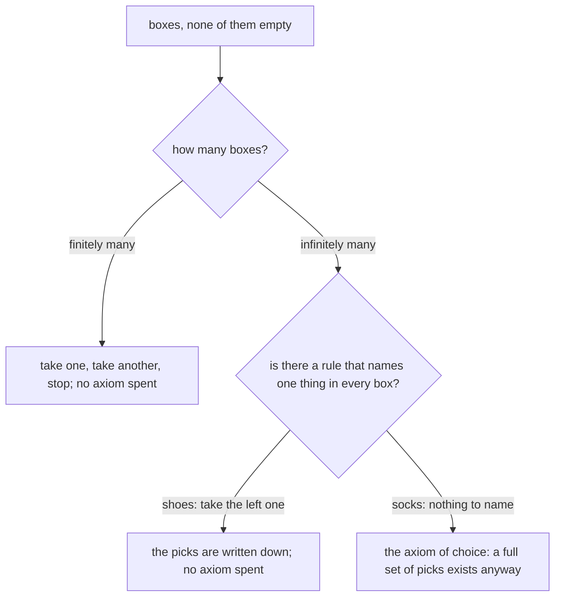

# The axiom of choice: one pick from each of infinitely many boxes, and why it is debated

Foundations → Sizes of Infinity → For the curious → The axiom of choice

---

## General Overview

The hotel has a room for every counting number: room 1, room 2, and on forever. Housekeeping keeps a lost-property box per room, none of them empty.

Say each box holds a pair of shoes, and you want one shoe out of every box at once. Easy: **take the left one**. Four words, every room covered.

Now say each box holds two identical socks. Take which one? The socks give you nothing to name them by, so no sentence names one in every box.

The axiom of choice says the picks exist anyway.

**Given a pile of boxes, none empty, you may take one thing out of every box at once — even when nothing written down says which.**

### The picture: when the axiom is needed



---

## The formula

The axiom is one sentence:

**Every box in the pile has something in it. So there is a full set of picks: one thing out of every box, all at once.**

**Read it aloud:** no box is empty, so a full set of picks exists — all at once, not one after another.

A full set of picks has a proper name: a **choice function**, a function reading one member out of each box ([functions](../08-Relations%20and%20Functions/02-functions.md)). Choice function from here on; the socks stay as the picture.

| Piece | Plain meaning | In the lost property |
| --- | --- | --- |
| a box | a set with something in it | two socks |
| the pile | all the boxes together (the proper term: a family) | one per room, forever |
| a full pick | one thing out of every box, at once | one sock from each box |
| a choice function | the proper name for a full pick | what the axiom hands you |
| a rule | a sentence naming the pick in every box | "take the left one" |

---

## Why it works

### Step 0: a rule does the whole job

"Take the left one" answers for every box at once, however many there are. Where a rule exists, the ordinary ways of building sets produce the picks, no axiom spent. Boxes of counting numbers are the same: "take the smallest" ([strong-induction-and-well-ordering](../06-Proof/05-strong-induction-and-well-ordering.md)).

### Step 1: identical socks leave nothing to say

Nothing tells the two socks apart, so no sentence points at one. Three boxes: shrug and grab, three times, stop. A box for every room: no stopping, and no rule to do the work instead.

The axiom allows it anyway: the picks exist as one set, with nothing naming them. That is why it is an axiom and not a result: the other rules of set theory can neither prove it nor disprove it.

### Step 2: two things it buys

The pile can dwarf the hotel: a box for every non-empty set of real numbers is more boxes than there are rooms ([comparing-infinities](04-comparing-infinities.md)). Both claims here need that size.

**Every set can be lined up so that every non-empty part of it has a first member.** That is a well-ordering; the counting numbers are the model ([strong-induction-and-well-ordering](../06-Proof/05-strong-induction-and-well-ordering.md)). You cannot list the real numbers 1st, 2nd, 3rd and reach them all ([cantors-diagonal-argument](03-cantors-diagonal-argument.md)) — yet the axiom says an order exists where every non-empty part has a first member, and nobody can write it down.

**Every vector space has a basis.** A vector space is a collection of arrows you can add and stretch; a basis is a small set of them that builds all the rest. In wilder spaces nobody can exhibit a basis; the axiom says there is one.

### Step 3: one strange consequence

A solid ball can be cut into five pieces which, moved and turned but never stretched, fit together into two balls the size of the first. That is Banach–Tarski: a theorem, not a trick. The pieces are so ragged no volume can be given to them; the axiom conjures them. Quoted, not computed: no program reaches it.

The axiom is rarely used raw. The everyday form is Zorn's lemma, waiting in the algebra wing. Zorn's lemma and the line-up each give the axiom back: one claim, three sets of clothes.

---

## Worked numbers, by hand

Ten boxes out of the pile.

| Step | Arithmetic | Value |
| --- | --- | --- |
| socks in one box | left, right | 2 |
| boxes in the pile | rooms 1 to 10 | 10 |
| three boxes, by hand | 2 × 2 × 2 | 8 |
| ten boxes, every full pick | ten twos multiplied | 1024 |
| the same, built and counted | count the list | 1024 |
| the shoe rule, picks it names | the all-left pick | **1** |
| one of the ten boxes empty | nothing to take | **0** |

The shoe rule points at one pick out of 1024. Take the rule away and the 1024 are still there, nothing pointing.

### What breaks if you drop a piece

| Mistake | Comes out at | What went wrong |
| --- | --- | --- |
| Stopping at three boxes | 8 picks | Finitely many never needed the axiom |
| Letting one box be empty | 0 picks | Every box must hold something |
| Counting a pick as one sock | 10 socks per pick | Each pick holds one sock from every one of the ten boxes |

---

## Code, from first principles, and it actually runs

Nothing is imported. Ten boxes, two socks each, every full pick counted twice: by multiplying the box sizes, and by building each pick a box at a time. Two roads, one number. The code sees only the finite corridor.

### Python

```python
# The axiom of choice -- the check behind the card.  Nothing is imported.  Ten
# lost-property boxes, two socks in each.  Count every full pick -- one sock out
# of every box, all at once -- twice: by multiplying, and by building them all.
SOCKS = ("left", "right")
def full_picks(boxes):          # every way to take one thing out of every box
    picks = [()]
    for box in boxes:
        picks = [p + (s,) for p in picks for s in box]
    return picks

def row(name, value): print(f"{name:<44}{value:>5}")

ten, three = [SOCKS] * 10, [SOCKS] * 3
gap = [SOCKS] * 9 + [()]                       # one box with nothing in it
picks = full_picks(ten)
shoe_rule = tuple("left" for box in ten)       # "take the left one", written out
mult = 1
for box in ten: mult = mult * len(box)         # the second road: 2 x 2 x ... x 2
row("boxes of socks", len(ten))
row("socks in each box", len(SOCKS))
row("full picks, by multiplying", mult)
row("full picks, by building every one", len(picks))
row("full picks with only three boxes", len(full_picks(three)))
row("full picks when one box is empty", len(full_picks(gap)))
row("picks the shoe rule names", picks.count(shoe_rule))
row("different picks, ten socks in each", len({p for p in picks if len(p) == len(ten)}))
assert mult == 1024 and len(picks) == 1024 == len(set(picks))
assert len(full_picks(three)) == 8 and len(full_picks(gap)) == 0
assert picks.count(shoe_rule) == 1 and shoe_rule in picks
print("ALL CHECKS PASS")
```

**Ran 2026-09-06 on macOS, Python 3.14.6, standard library only. All checks passed. Output, pasted from the run:**

```
boxes of socks                                 10
socks in each box                               2
full picks, by multiplying                   1024
full picks, by building every one            1024
full picks with only three boxes                8
full picks when one box is empty                0
picks the shoe rule names                       1
different picks, ten socks in each           1024
ALL CHECKS PASS
```

### Rust

Same numbers, same labels, built with `rustc --edition 2021 -O`.

```rust
// The axiom of choice -- the same check as the Python one, in Rust.  No crates.
// Ten lost-property boxes, two socks in each.  Count every full pick -- one sock
// out of every box, all at once -- twice: by multiplying, and by building them.
const SOCKS: [&str; 2] = ["left", "right"];
fn full_picks(boxes: &[Vec<&'static str>]) -> Vec<Vec<&'static str>> {
    let mut picks: Vec<Vec<&'static str>> = vec![Vec::new()];
    for b in boxes {                    // every way to take one thing out of every box
        let mut next = Vec::new();
        for p in &picks { for s in b { let mut q = p.clone(); q.push(*s); next.push(q); } }
        picks = next;
    }
    picks
}

fn row(name: &str, value: usize) { println!("{:<44}{:>5}", name, value); }

fn main() {
    let ten: Vec<Vec<&str>> = (0..10).map(|_| SOCKS.to_vec()).collect();
    let three: Vec<Vec<&str>> = (0..3).map(|_| SOCKS.to_vec()).collect();
    let mut gap: Vec<Vec<&str>> = (0..9).map(|_| SOCKS.to_vec()).collect();
    gap.push(Vec::new());                          // one box with nothing in it
    let picks = full_picks(&ten);
    let shoe_rule: Vec<&str> = ten.iter().map(|_| "left").collect();
    let mut mult = 1;
    for b in &ten { mult = mult * b.len(); }       // the second road: 2 x 2 x ... x 2
    let named = picks.iter().filter(|p| *p == &shoe_rule).count();
    let mut kept: Vec<&Vec<&str>> = picks.iter().filter(|p| p.len() == ten.len()).collect(); kept.sort(); kept.dedup();
    row("boxes of socks", ten.len());
    row("socks in each box", SOCKS.len());
    row("full picks, by multiplying", mult);
    row("full picks, by building every one", picks.len());
    row("full picks with only three boxes", full_picks(&three).len());
    row("full picks when one box is empty", full_picks(&gap).len());
    row("picks the shoe rule names", named);
    row("different picks, ten socks in each", kept.len());
    assert!(mult == 1024 && picks.len() == 1024 && kept.len() == 1024);
    assert!(full_picks(&three).len() == 8 && full_picks(&gap).len() == 0);
    assert!(named == 1 && picks.contains(&shoe_rule));
    println!("ALL CHECKS PASS");
}
```

**Ran 2026-09-06 on macOS, rustc 1.98.1, no crates. All checks passed. Output, pasted from the run:**

```
boxes of socks                                 10
socks in each box                               2
full picks, by multiplying                   1024
full picks, by building every one            1024
full picks with only three boxes                8
full picks when one box is empty                0
picks the shoe rule names                       1
different picks, ten socks in each           1024
ALL CHECKS PASS
```

> [!TIP]
> **Try changing**
> Guess first, then run it. The asserts are pinned to the ten boxes.
> - **Put a third sock in every box.** Both roads climb together and stay equal, which is the point; the first assert fires, naming the old total.
> - **Empty a second box.** Guess the count first. Still none: one empty box kills them all, and every assert stays green.

---

## The usual mistake

> [!warning]
> **Thinking the axiom tells you which sock.** It says a full set of picks exists, names none of them, and gives no way to find one. A proof leaning on it can end at "such a thing exists" and hand you nothing to build with.
>
> - Thinking small piles need it. Three boxes give 8 picks; write one out by hand.
> - Thinking every infinite pile needs it. A rule beats the axiom every time.
> - Thinking it rescues an empty box. 0 picks either way.

---

## Where you meet it in real life

- **One member for each group.** Sort a set into groups, take one to represent each ([equivalence-relations-and-partitions](../08-Relations%20and%20Functions/06-equivalence-relations-and-partitions.md)). Infinitely many groups, nothing to sort on: the axiom.
- **Running an onto function backwards.** Every output is hit, so pick one input per output and go back ([injective-surjective-bijective](../08-Relations%20and%20Functions/04-injective-surjective-bijective.md)). Over infinitely many outputs, the axiom again.
- **Existence proofs.** Papers flag a proof that leans on the axiom.

> **Say it back**
> A pile of boxes, none of them empty, and you want one thing out of every box at once. Finitely many: take them one at a time. Infinitely many, with a rule to hand — shoes, take the left one — the rule does it. Infinitely many boxes of identical socks: no rule names a sock, and the axiom of choice says the picks are there anyway. It buys a line-up of any set where every non-empty part has a first member, and a basis for every vector space; it costs a ball rebuilt as two.

---

## What this builds on

- [comparing-infinities](04-comparing-infinities.md): comparing sets once counting stops; the boxes could be every non-empty subset of a set ([subsets-and-power-set](../07-Sets/02-subsets-and-power-set.md)).
- [strong-induction-and-well-ordering](../06-Proof/05-strong-induction-and-well-ordering.md): every non-empty set of counting numbers has a smallest — the line-up the axiom claims for all the rest.

## Where this goes next

Last card on the shelf. Zorn's lemma, the axiom in working clothes and equivalent to it, waits in the algebra wing. Behind it: [same-size-by-pairing](01-same-size-by-pairing.md), [countable-sets](02-countable-sets.md), [cantors-diagonal-argument](03-cantors-diagonal-argument.md).

---

## Sources

Verified 6 Sep 2026; every link resolves.

- Bell, John L. "The Axiom of Choice." *Stanford Encyclopedia of Philosophy*. [plato.stanford.edu](https://plato.stanford.edu/entries/axiom-choice/). Statement, history, argument.
- Herrlich, Horst. *Axiom of Choice*. Springer, 2006. [doi:10.1007/11601562](https://doi.org/10.1007/11601562). What breaks without it, what turns strange with it.
- Tomkowicz, Grzegorz, and Stan Wagon. *The Banach–Tarski Paradox*, 2nd ed. Cambridge University Press, 2016. [doi:10.1017/CBO9781107337145](https://doi.org/10.1017/CBO9781107337145). The five pieces in full.
