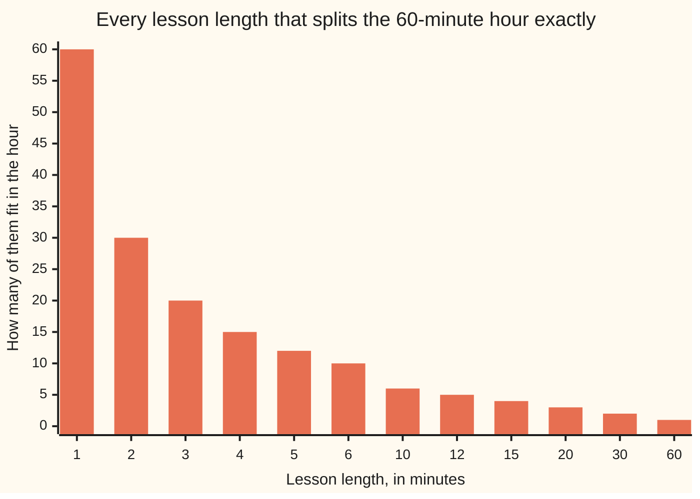

# Divides: when one number goes into another with nothing left over

[Syllabus](../../../SYLLABUS.md) → [Number theory](../../../SYLLABUS.md#w02) → [Divisibility and Primes](../../../SYLLABUS.md#w02-s01) → Divides

---

## General Overview

An hour is 60 minutes. You are cutting one into lessons, all the same length, and you want the hour to end just as a lesson does.

A 15-minute lesson works: four of them fill the hour. A 12-minute lesson works: five. An 8-minute lesson does not — seven of them leave 4 minutes stranded.

Twelve lengths work, and only twelve. Each goes into 60 a whole number of times. There is a word for that: each of them **divides** 60.

**One number divides another when the second is the first multiplied by a whole number, with nothing left over.**

### The picture: which lengths fit, and how many



One bar per length: how many lessons of that length fill the hour. Only these twelve lengths work, and the bars read the same from either end: they come in six pairs.

---

## The formula

The arithmetic is the statement:

**60 = 4 × 15, so 4 divides 60.**

Four goes into sixty, 15 times. Try 8-minute lessons and it will not close:

**60 = 8 × 7 + 4, so 8 does not divide 60.**

Seven lessons, then 4 minutes stranded. A leftover of anything but zero means "does not divide".

| Piece | Plain meaning | In the hour |
| --- | --- | --- |
| the divisor | the number doing the going-in | 4, a 4-minute lesson |
| the multiple | the number being gone into | 60, the hour |
| the partner | how many times it goes in | 15 lessons |
| the leftover | what is stranded at the end | 0 for 4; 4 for 8 |

The two ends of that fact have names: 4 is a **factor** of 60, and 60 is a **multiple** of 4.

The shorthand is one upright bar: 4 | 60, read "4 divides 60". It is not a division sign and not a fraction line: 4 | 60 is a yes-or-no, while 60 ÷ 4 is a number, 15. This card uses the words.

---

## Why it works

### Divisors arrive in pairs

If the hour holds fifteen 4-minute lessons, it holds four 15-minute lessons too. Only the name of the length changed. One fact, two divisors, and they turn up together:

1 × 60, 2 × 30, 3 × 20, 4 × 15, 5 × 12, 6 × 10

Six pairs, twelve divisors. The list is not memory, it is pairing.

### Which is why you can stop early

Work upwards from 1 and you meet the smaller member of a pair first; its partner comes free. So test only until the two would cross. They cross near 8: 8 × 8 = 64, past 60. A divisor of 8 or more needs a partner under 8, and everything under 8 has been tried. Test 1 to 7, keep both ends, done.

### 1 and 0, the strange ones

1 divides every number, since any number is itself times 1: 60 = 1 × 60. So 1 is on every list, and tells you nothing.

Every number divides 0: 0 = 60 × 0, and 0 = 4 × 0. An empty hour splits evenly into any length; you run none of them. That includes 0 itself, since 0 = 0 × 1. But 0 divides nothing else: zero times a whole number is zero, never 60.

---

## Worked numbers, by hand

The 60-minute hour, testing lengths upward.

| Step | Arithmetic | Value |
| --- | --- | --- |
| 1-minute lessons | 60 = 1 × 60 | 60 fit |
| 2-minute, then 3-minute | 60 = 2 × 30, 60 = 3 × 20 | 30 fit, 20 fit |
| 4-minute, then 5-minute | 60 = 4 × 15, 60 = 5 × 12 | 15 fit, 12 fit |
| 6-minute | 60 = 6 × 10 | 10 fit |
| 7-minute | 60 = 7 × 8 + 4 | 4 over, so no |
| stop here | 8 × 8 = 64, past 60 | nothing new above 7 |
| both ends of each pair | 1 to 6 and their partners | **12 divisors of 60** |

Twelve lengths end the hour cleanly; every other length strands minutes.

### What breaks if you drop a piece

| Mistake | Comes out at | What went wrong |
| --- | --- | --- |
| Listing only the lengths tested, 1 to 6 | 6 divisors | The six partners were left out |
| Rounding 60 ÷ 8 down to 7 lessons | 4 minutes stranded | A leftover of 4 means 8 does not divide 60 |
| Saying "60 divides 12" for "12 divides 60" | False, not True | The big number does not go into the small one |

The code prints all three.

---

## Code, from first principles, and it actually runs

Nothing is imported. The hour is worked the plain way: try every length from 1 to 60, keep the ones with no leftover. Then the list is built again from pairs, testing only 1 to 7 and taking both ends. Three asserts hold the two together.

### Python

```python
# Divides -- the check behind the card.  Nothing is imported.  The 60-minute
# hour: which lesson lengths split it exactly.  Road one tests every length
# from 1 to 60.  Road two tests only 1 to 7 and takes both ends of each pair.
HOUR = 60

def divides(a, b):              # does a go into b with nothing left over?
    if a == 0:                  # 0 times anything is 0, so 0 reaches nothing else
        return b == 0
    return b % a == 0

brute = [a for a in range(1, HOUR + 1) if divides(a, HOUR)]
pairs = [(a, HOUR // a) for a in range(1, 8) if divides(a, HOUR)]
from_pairs = sorted({n for pair in pairs for n in pair})     # the check, second road
print("the pairs that multiply to 60   " + "  ".join(f"{a} x {b}" for a, b in pairs))
print("divisors of 60, smallest first  " + " ".join(str(a) for a in brute))
print("their partners, same order      " + " ".join(str(HOUR // a) for a in brute))
print(f"how many divisors 60 has        {len(brute)}")
print(f"tested 1 up to 7, because 8 x 8 = {8 * 8} is past {HOUR}")
print(f"8 does not divide 60:  60 = 8 x {HOUR // 8} + {HOUR % 8}")
print(f"12 divides 60:  {divides(12, HOUR)}         60 divides 12:  {divides(HOUR, 12)}")
print(f"1 divides 60:   {divides(1, HOUR)}         60 divides 0:   {divides(HOUR, 0)}")
print(f"0 divides 60:   {divides(0, HOUR)}        0 divides 0:    {divides(0, 0)}")
print(f"stopping the list at 6 finds only {len([a for a in brute if a <= 6])} of the {len(brute)}")

assert brute == [1, 2, 3, 4, 5, 6, 10, 12, 15, 20, 30, 60]
assert from_pairs == brute and len(brute) == 12
assert all(a * (HOUR // a) == HOUR for a in brute) and HOUR % 8 == 4 and HOUR // 8 == 7
print("ALL CHECKS PASS")
```

**Ran 2026-09-06 on macOS, Python 3.14.6, standard library only. All checks passed. Output, pasted from the run:**

```
the pairs that multiply to 60   1 x 60  2 x 30  3 x 20  4 x 15  5 x 12  6 x 10
divisors of 60, smallest first  1 2 3 4 5 6 10 12 15 20 30 60
their partners, same order      60 30 20 15 12 10 6 5 4 3 2 1
how many divisors 60 has        12
tested 1 up to 7, because 8 x 8 = 64 is past 60
8 does not divide 60:  60 = 8 x 7 + 4
12 divides 60:  True         60 divides 12:  False
1 divides 60:   True         60 divides 0:   True
0 divides 60:   False        0 divides 0:    True
stopping the list at 6 finds only 6 of the 12
ALL CHECKS PASS
```

### Rust

Same numbers, same labels, built with `rustc --edition 2021 -O`.

```rust
// Divides -- the same check as divides_check.py, in Rust.  No crates.  The
// 60-minute hour: which lesson lengths split it exactly.  Road one tests every
// length from 1 to 60.  Road two tests only 1 to 7 and takes both ends.
const HOUR: i64 = 60;

fn divides(a: i64, b: i64) -> bool {   // does a go into b with nothing left over?
    if a == 0 { return b == 0; }       // 0 times anything is 0, so 0 reaches nothing else
    b % a == 0
}

fn yes(b: bool) -> &'static str { if b { "True" } else { "False" } }

fn joined(v: &[i64]) -> String {
    v.iter().map(|x| x.to_string()).collect::<Vec<String>>().join(" ")
}

fn main() {
    let brute: Vec<i64> = (1..=HOUR).filter(|&a| divides(a, HOUR)).collect();
    let pairs: Vec<(i64, i64)> = (1..8).filter(|&a| divides(a, HOUR)).map(|a| (a, HOUR / a)).collect();
    let mut from_pairs: Vec<i64> = Vec::new();                   // the check, second road
    for &(a, b) in &pairs { from_pairs.push(a); from_pairs.push(b); }
    from_pairs.sort();
    let shown: Vec<String> = pairs.iter().map(|(a, b)| format!("{} x {}", a, b)).collect();
    let partners: Vec<i64> = brute.iter().map(|&a| HOUR / a).collect();
    println!("the pairs that multiply to 60   {}", shown.join("  "));
    println!("divisors of 60, smallest first  {}", joined(&brute));
    println!("their partners, same order      {}", joined(&partners));
    println!("how many divisors 60 has        {}", brute.len());
    println!("tested 1 up to 7, because 8 x 8 = {} is past {}", 8 * 8, HOUR);
    println!("8 does not divide 60:  60 = 8 x {} + {}", HOUR / 8, HOUR % 8);
    println!("12 divides 60:  {}         60 divides 12:  {}", yes(divides(12, HOUR)), yes(divides(HOUR, 12)));
    println!("1 divides 60:   {}         60 divides 0:   {}", yes(divides(1, HOUR)), yes(divides(HOUR, 0)));
    println!("0 divides 60:   {}        0 divides 0:    {}", yes(divides(0, HOUR)), yes(divides(0, 0)));
    println!("stopping the list at 6 finds only {} of the {}",
             brute.iter().filter(|&&a| a <= 6).count(), brute.len());
    assert!(brute == vec![1, 2, 3, 4, 5, 6, 10, 12, 15, 20, 30, 60]);
    assert!(from_pairs == brute && brute.len() == 12);
    assert!(brute.iter().all(|&a| a * (HOUR / a) == HOUR) && HOUR % 8 == 4 && HOUR / 8 == 7);
    println!("ALL CHECKS PASS");
}
```

**Ran 2026-09-06 on macOS, rustc 1.98.1, no crates. All checks passed. Output, pasted from the run:**

```
the pairs that multiply to 60   1 x 60  2 x 30  3 x 20  4 x 15  5 x 12  6 x 10
divisors of 60, smallest first  1 2 3 4 5 6 10 12 15 20 30 60
their partners, same order      60 30 20 15 12 10 6 5 4 3 2 1
how many divisors 60 has        12
tested 1 up to 7, because 8 x 8 = 64 is past 60
8 does not divide 60:  60 = 8 x 7 + 4
12 divides 60:  True         60 divides 12:  False
1 divides 60:   True         60 divides 0:   True
0 divides 60:   False        0 divides 0:    True
stopping the list at 6 finds only 6 of the 12
ALL CHECKS PASS
```

The two outputs match line for line: whole minutes, nothing to round.

> [!TIP]
> **Try changing**
> Guess first, then run it. The asserts are pinned to the hour, so one will fire.
> - **Make the hour 59 minutes.** The list collapses to 1 and 59; nothing in between works. That is [Primes and composites](05-primes-and-composites.md).
> - **Cut the second road short.** Testing 1 to 6 still gives 12, since 7 divides nothing here. Test 1 to 5 and the 6-and-10 pair goes missing: the second assert fires at 10.

---

## The usual mistake

> [!warning]
> **"12 divides 60" is not "12 divided by 60".** They sound alike and point opposite ways. "12 divides 60" asks whether 12 goes into 60: yes, five times. "12 divided by 60" is a number, one fifth. And 60 divides 12 is False — 60 does not fit inside 12.
>
> - The bar in 4 | 60 is a yes-or-no, not a fraction line: read as a fraction it gives one fifteenth instead of True.
> - Stopping the list where you stopped testing: 6 divisors written, six partners left out.
> - Rounding a leftover away. 60 ÷ 8 is 7 lessons and 4 minutes over; the 4 is the answer: [Division with a remainder](04-division-with-remainder.md).

---

## Where you meet it in real life

- **Splitting a bill or a shift.** Whether a total comes out even is this question: does the head count divide the total?
- **The clock.** An hour is 60 minutes because 60 splits so many ways: halves, thirds, quarters, fifths, sixths and twelfths are all whole minutes — 30, 20, 15, 12, 10 and 5.
- **Head-checks.** Whether 2 divides a number is [Even and odd](02-even-and-odd.md); digit tricks for 3, 4, 5, 6, 8, 9 and 10 are [Divisibility rules](03-divisibility-rules.md).

> **Say it back**
> One number divides another when it goes in with nothing left over: 4 divides 60, because 60 = 4 × 15. Divisors come in pairs — 4 brings 15 with it — so test upwards and write both ends down, stopping once the ends cross. Sixty has twelve divisors: 1, 2, 3, 4, 5, 6, 10, 12, 15, 20, 30, 60. 1 divides everything, every number divides 0, and "12 divides 60" is a yes-or-no, not a number.

---

## What this builds on

- [Multiplying and dividing](../../01-Foundations/01-Everyday%20Arithmetic/03-multiplying-and-dividing.md): multiplying and dividing whole numbers, and what is left over when it does not come out even. This card is that leftover being zero.

## Where this goes next

- [Even and odd](02-even-and-odd.md): whether 2 divides a number, and what that does to sums and products.
- [Divisibility rules](03-divisibility-rules.md): reading the digits to tell whether 2, 3, 4, 5, 6, 8, 9 or 10 divides.
- [Division with a remainder](04-division-with-remainder.md): the 4 stranded minutes, and why there is only one answer.
- [Primes and composites](05-primes-and-composites.md): numbers whose only divisors are 1 and themselves.

---

## Sources

Verified 6 Sep 2026; every link resolves.

- Hammack, Richard. *Book of Proof*, 3rd ed., 2018. [Full text, free](https://richardhammack.github.io/BookOfProof/Main.pdf). Chapter 4 states this definition and proves the pair facts.
- Euclid, *Elements*, Book VII. [D. E. Joyce's edition](https://mathcs.clarku.edu/~djoyce/elements/bookVII/bookVII.html). The oldest version: one number "measures" another.
- The On-Line Encyclopedia of Integer Sequences, [sequence A000005](https://oeis.org/A000005), the number of divisors. Its 60th entry is 12.
